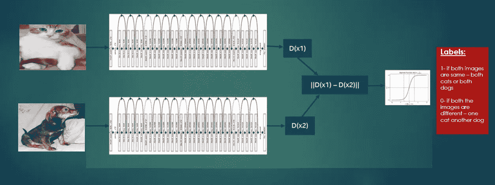
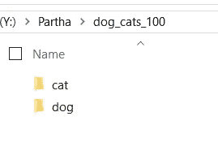
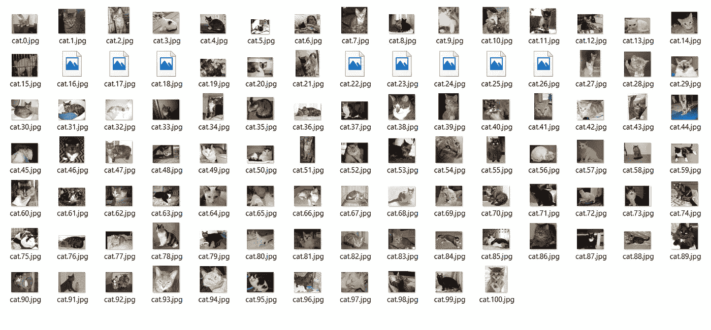
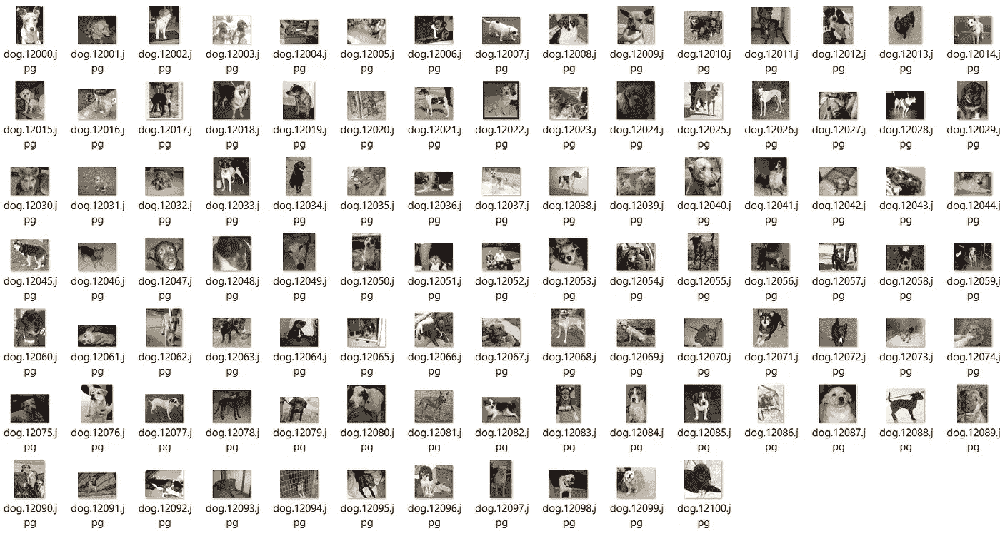

# 分类判别网络

> 原文：<https://towardsdatascience.com/discriminating-network-for-classification-fb18d87ba21b?source=collection_archive---------3----------------------->

## 我如何使用暹罗网络建立一个只有很少图像的分类器

# 一个有鉴别能力的网络——它是什么，我们为什么需要它，我们如何建立它？

我们经常遇到的问题是，我们没有足够的高质量图像和标签数据集来训练一个健壮的基于 CNN 的分类器——要么我们没有足够的图像，要么我们没有手动资源来标记它们。用很少的图像建立一个健壮的分类器通常是一个挑战，因为我们需要成千上万的标签图像来训练一个健壮的神经网络体系结构

在面部识别中经常使用有区别的连体结构。根据这篇研究论文，现代面部识别模型通常是使用暹罗网络(也称为一次性学习)建立的



以上是一张连体网。这是简单明了的两个网络——在本例中，两个 Resnet-50 架构的权重相同——一个左网络和一个右网络。每个网络为其对应的图像输出数字串的编码。暹罗网络广泛用于面部识别。在这种情况下，我已经用它对猫和狗进行了分类。这种建筑学习的方式是——一只猫和另一只猫比和一只狗更相似。不同的猫会有不同的特征，但是猫之间的不同会比猫和狗之间的不同小。这两种编码之间的差异是猫和狗的编码之间的欧几里德距离。如果编码属于两个狗或猫图像，我们将目标标记为阳性或 1，否则如果一个图像是狗，另一个图像是猫，反之亦然，我们将目标标记为阴性类别或 0

这方面另一篇有趣的研究论文:

编码片段:

正在加载所有必需的库

```
from keras.layers import Input, Conv2D, Lambda, merge, Dense, Flatten,MaxPooling2D,Activation, Dropout
from keras.models import Model, Sequential
from keras.regularizers import l2
from keras import backend as K
from keras.optimizers import Adam
from keras import optimizers
#from skimage.io import imshow
import matplotlib.pyplot as plt
import numpy as np
import pandas as pd
import randomfrom keras.backend.tensorflow_backend import set_session
from keras.applications import resnet50, vgg16, vgg19, xception, densenet, inception_v3, mobilenet, mobilenetv2, nasnet, inception_resnet_v2
import tensorflow as tf
from keras.callbacks import ModelCheckpoint, TensorBoard, CSVLogger, EarlyStopping
from keras.applications.resnet50 import preprocess_input
#from keras.applications.xception import preprocess_input
import os
import datetime
import json
from keras.preprocessing.image import ImageDataGenerator 
```

让我们使用 OpenCV 库抓取和处理图像。我用过 100 张猫的图片和 100 张狗的图片。猫和狗的形象属于不同的品种。



100 张猫咪图片:



100 张狗狗图片:



加载和预处理图像的代码片段:

```
import glob
import cv2
from random import shuffledog_path = 'Y:\\Partha\\dog_cats_100\\dog\\*.jpg'
cat_path = 'Y:\\Partha\\dog_cats_100\\cat\\*.jpg'addrsd = glob.glob(dog_path)
addrsc = glob.glob(cat_path)

labelsd = [1 for addr in addrsd]  # 1 = dog, 0 =  cat
labelsc = [0 for addr in addrsc]# loop over the input imagesdatad = []for imagePath in addrsd:
# load the image, pre-process it, and store it in the data list
    img = cv2.imread(imagePath)
    img = cv2.resize(img, (224, 224), interpolation=cv2.INTER_CUBIC)
    img = cv2.cvtColor(img, cv2.COLOR_BGR2RGB)
    datad.append(img)datac = []
for imagePath in addrsc:
# load the image, pre-process it, and store it in the data list
    img = cv2.imread(imagePath)
    img = cv2.resize(img, (224, 224), interpolation=cv2.INTER_CUBIC)
    img = cv2.cvtColor(img, cv2.COLOR_BGR2RGB)
    datac.append(img)# to shuffle data
shuffle_data = True
if shuffle_data:
    d = list(zip(datad, labelsd))
    c = list(zip(datac, labelsc))
    e = d + c
    shuffle(e)
    data, labels = zip(*e)del datad
del datac
del addrsd
del addrsc

Y_train = np.array(labels)
X_train = np.array(data, dtype="int8")#preprocess for Resnet- 50
X_train =  preprocess_input(X_train)
```

定义架构的代码片段:

```
# Two inputs one each - left and right image
left_input = Input((224,224,3))
right_input = Input((224,224,3))#Import Resnetarchitecture from keras application and initializing each layer with pretrained imagenet weights.'’'
Please note that it’s usually better to intialize the layers with imagenet initializations than random. While training I will be updating the weights for each layer in each epoch. we don’t want to confuse this activity with transfer learning as I am not freezing any layer but initilializing each layer with imagenet weights
'’'convnet = resnet50.ResNet50(weights='imagenet', include_top=False, input_shape=(224,224,3))# Add the final fully connected layersx = convnet.output
x = Flatten()(x)
x = Dense(1024, activation="relu")(x)
preds = Dense(18, activation='sigmoid')(x) # Apply sigmoid
convnet = Model(inputs=convnet.input, outputs=preds)#Applying above model for both the left and right images
encoded_l = convnet(left_input)
encoded_r = convnet(right_input)# Euclidian Distance between the two images or encodings through the Resnet-50 architectureEuc_layer = Lambda(lambda tensor:K.abs(tensor[0] - tensor[1]))# use and add the distance function
Euc_distance = Euc_layer([encoded_l, encoded_r])#identify the prediction
prediction = Dense(1,activation='sigmoid')(Euc_distance)#Define the network with the left and right inputs and the ouput prediction
siamese_net = Model(inputs=[left_input,right_input],outputs=prediction)#define the optimizer. Here I have used SGD with nesterov momentum optim = optimizers.SGD(lr=0.001, decay=.01, momentum=0.9, nesterov=True)#compile the network using binary cross entropy loss and the above optimizer siamese_net.compile(loss="binary_crossentropy",optimizer=optim,metrics=[’accuracy’])
```

现在，我已经创建了图像对。将有两个标签——1 和 0，或者我们可以说输出的正或负标签或类别。

创建测试训练数据集的代码段

```
image_list = X_train[:180]
label_list = Y_train[:180]left_input = []
right_input = []
targets = []#Number of pairs per image
pairs = 8#create the dataset to train on
for i in range(len(label_list)):
    for j in range(pairs):
# we need to make sure that we are not comparing with the same image
        compare_to = i
        while compare_to == i: 
            compare_to = random.randint(0,179)
        left_input.append(image_list[i])
        right_input.append(image_list[compare_to])
        if label_list[i] == label_list[compare_to]:
            # if the images are same then label - 1
            targets.append(1.)
        else:
            # if the images are different then label - 0
            targets.append(0.)

#remove single-dimensional entries from the shape of the arrays and making them ready to create the train & datasets 

#the train data - left right images arrays and target label
left_input = np.squeeze(np.array(left_input))
right_input = np.squeeze(np.array(right_input))
targets = np.squeeze(np.array(targets))# Creating test datasets - left, right images and target labeldog_image = X_train[4] #dog_image = 1, cat_image = 0test_left = []
test_right = []
test_targets = []for i in range(len(Y_train)-180):
    test_left.append(dog_image)
    test_right.append(X_train[i+180])
    test_targets.append(Y_train[i+180])test_left = np.squeeze(np.array(test_left))
test_right = np.squeeze(np.array(test_right))
test_targets = np.squeeze(np.array(test_targets))
```

在 GPU 中训练网络的代码

```
import tensorflow as tf
import os
config = tf.ConfigProto()
config.gpu_options.allow_growth = True
session = tf.Session(config=config)
#from keras_input_pipeline import *
os.environ['CUDA_VISIBLE_DEVICES'] = '1'siamese_net.summary()
with tf.device('/gpu:1'):
    siamese_net.fit([left_input,right_input], targets,
          batch_size=16,
          epochs=30,
          verbose=1,
          validation_data=([test_left,test_right],test_targets))
```

结果:

```
__________________________________________________________________________________________________
Layer (type)                    Output Shape         Param #     Connected to                     
==================================================================================================
input_10 (InputLayer)           (None, 224, 224, 3)  0                                            
__________________________________________________________________________________________________
input_11 (InputLayer)           (None, 224, 224, 3)  0                                            
__________________________________________________________________________________________________
model_7 (Model)                 (None, 18)           126367634   input_10[0][0]                   
                                                                 input_11[0][0]                   
__________________________________________________________________________________________________
lambda_4 (Lambda)               (None, 18)           0           model_7[1][0]                    
                                                                 model_7[2][0]                    
__________________________________________________________________________________________________
dense_12 (Dense)                (None, 1)            19          lambda_4[0][0]                   
==================================================================================================
Total params: 126,367,653
Trainable params: 126,314,533
Non-trainable params: 53,120
__________________________________________________________________________________________________
Train on 1440 samples, validate on 22 samples
Epoch 1/10
1440/1440 [==============================] - 91s 64ms/step - loss: 0.7086 - acc: 0.5354 - val_loss: 0.6737 - val_acc: 0.5455
Epoch 2/10
1440/1440 [==============================] - 76s 53ms/step - loss: 0.5813 - acc: 0.7049 - val_loss: 0.6257 - val_acc: 0.5909
Epoch 3/10
1440/1440 [==============================] - 76s 53ms/step - loss: 0.4974 - acc: 0.8257 - val_loss: 0.6166 - val_acc: 0.5909
Epoch 4/10
1440/1440 [==============================] - 76s 53ms/step - loss: 0.4494 - acc: 0.8799 - val_loss: 0.6190 - val_acc: 0.5909
Epoch 5/10
1440/1440 [==============================] - 76s 53ms/step - loss: 0.4190 - acc: 0.9042 - val_loss: 0.5966 - val_acc: 0.6364
Epoch 6/10
1440/1440 [==============================] - 76s 53ms/step - loss: 0.3968 - acc: 0.9243 - val_loss: 0.5821 - val_acc: 0.6818
Epoch 7/10
1440/1440 [==============================] - 76s 53ms/step - loss: 0.3806 - acc: 0.9368 - val_loss: 0.5778 - val_acc: 0.6818
Epoch 8/10
1440/1440 [==============================] - 76s 53ms/step - loss: 0.3641 - acc: 0.9535 - val_loss: 0.5508 - val_acc: 0.7273
Epoch 9/10
1440/1440 [==============================] - 76s 53ms/step - loss: 0.3483 - acc: 0.9715 - val_loss: 0.5406 - val_acc: 0.7273
Epoch 10/10
1440/1440 [==============================] - 76s 53ms/step - loss: 0.3390 - acc: 0.9778 - val_loss: 0.5341 - val_acc: 0.7273
```

我们可以看到，仅用 100 张猫和 100 张狗的图像，我们就在 8 个时期的验证数据集中实现了 72%的准确率，这些图像对是从 200 张图像中创建的。

# 结论:

我写这篇文章的动机是，我们通常没有成百上千的高质量标记图像来创建健壮的基于 CNN 的分类器。或者，我们可以用很少的图像来训练一个广泛用于面部识别的连体网络，以建立一个分类器。我已经在我的一个材料缺陷检测用例中使用了这种技术，在这个用例中，我们几乎没有缺陷材料的可用图像。为了保持作品的保密性，我在这个博客中用猫和狗的图像来演示这个讨论。如果你喜欢我的博客，请点击拍手按钮，并请继续关注我们未来的博客，因为我经常在机器学习和深度学习方面发表博客。