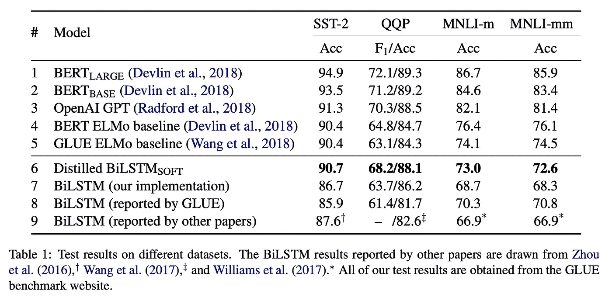

# 提取 BERT——如何使用逻辑回归实现 BERT 性能

> 原文：<https://towardsdatascience.com/distilling-bert-how-to-achieve-bert-performance-using-logistic-regression-69a7fc14249d?source=collection_archive---------12----------------------->


伯特很棒，无处不在。看起来任何 NLP 任务都可以从使用 BERT 中受益。作者[向](https://arxiv.org/abs/1810.04805)展示了事实的确如此，从我的经验来看，它像魔法一样有效。它易于使用，处理少量数据，并支持许多不同的语言。似乎没有任何理由不在任何地方使用它。但实际上，是有的。可惜，在实际操作中，并不是那么微不足道。BERT 是一个庞大的模型，超过 1 亿个参数。不仅我们需要一个 GPU 来微调，而且在推理时间上，一个 CPU(甚至很多)是不够的。这意味着，如果我们真的想在任何地方使用 BERT，我们需要在任何地方安装一个 GPU。这在大多数情况下是不切实际的。2015 年，[的这篇论文](https://arxiv.org/abs/1503.02531)(由 Hinton 等人完成)介绍了一种将一个非常大的神经网络的知识提取到一个小得多的神经网络中的方法，比如教师和学生。方法很简单。我们使用大的神经网络预测来训练小的。主要思想是使用**原始**预测，即最终激活函数(通常是 softmax 或 sigmoid)之前的预测。假设通过使用原始值，模型能够比使用“硬”预测更好地学习内部表示。Sotmax 将这些值归一化为 1，同时保持最大值较高，并将其他值减小到非常接近零的值。零中的信息很少，所以通过使用原始预测，我们也可以从非预测类中学习。作者在包括 MNIST 和语音识别的几个任务中显示了良好的结果。

不久前，这篇论文的作者将同样的方法应用于...伯特。他们表明，通过将来自 BERT 的信息提取到一个更小的 BiLSTM 神经网络中，我们可以在特定任务中获得相同的性能(甚至更好)。您可以在下表中看到他们的结果。使用 BiLSTM-Soft 实现了最佳性能，这意味着“软预测”，即训练原始逻辑而不是“硬”预测。数据集有: **SST-2** 是斯坦福情感树库 2， **QQP** 是 Quora 问题对， **MNLI** 是多体裁自然语言推理。



在这篇文章中，我想将 BERT 提炼为一个更简单的逻辑回归模型。假设您有一个相对较小的标注数据集和一个大得多的未标注数据集，构建模型的一般框架是:

1.  在带标签的数据集上创建一些基线
2.  通过在标记集上微调 BERT 来构建一个大模型
3.  如果你得到了好的结果(比你的基线更好)，使用大模型计算你的未标记集合的原始对数
4.  在现在伪标记的集合上训练小得多的模型(逻辑回归)
5.  如果你得到了好的结果，可以在任何地方部署小型模型！

如果你对微调 BERT 的基础教程感兴趣，请查看我之前的帖子:

[](/bert-to-the-rescue-17671379687f) [## 伯特来救援了。

### 使用 BERT 进行简单文本分类的分步教程

towardsdatascience.com](/bert-to-the-rescue-17671379687f) 

我想解决同样的任务(IMDB 审查情绪分类)，但与逻辑回归。你可以在[这本](https://github.com/shudima/notebooks/blob/master/Distilling_Bert.ipynb)笔记本里找到所有的代码。

和以前一样，我将使用`torchnlp`来加载数据，使用优秀的 [PyTorch-Pretrained-BERT](https://github.com/huggingface/pytorch-pretrained-BERT) 来构建模型。

训练集中有 25，000 条评论，我们将只使用 1000 条作为标记集，另外 5，000 条作为未标记集(为了加快速度，我也只从测试集中选择 1000 条评论):

```
train_data_full, test_data_full = imdb_dataset(train=True, test=True)
rn.shuffle(train_data_full)
rn.shuffle(test_data_full)
train_data = train_data_full[:1000]
test_data = test_data_full[:1000]
```

我们做的第一件事是使用逻辑回归创建基线:

我们得到的结果并不太好:

```
 precision    recall  f1-score   supportneg       0.80      0.80      0.80       522
pos       0.78      0.79      0.78       478accuracy                      0.79      1000
```

下一步，是微调 BERT，我将跳过这里的代码，你可以看到它的[笔记本](https://github.com/shudima/notebooks/blob/master/Distilling_Bert.ipynb)或更详细的教程在我以前的[职位](/bert-to-the-rescue-17671379687f)。结果是一个名为`BertBinaryClassifier`的训练模型，它使用 BERT 和一个线性层来提供正/负分类。这种模式的表现是:

```
 precision    recall  f1-score   supportneg       0.88      0.91      0.89       522
pos       0.89      0.86      0.88       478accuracy                      0.89      1000
```

好多好多！如我所说—神奇:)

现在到了有趣的部分，我们使用未标记的集合，并使用我们的微调 BERT 模型来“标记”它:

我们得到:

```
 precision    recall  f1-score   supportneg       0.87      0.89      0.88       522
pos       0.87      0.85      0.86       478accuracy                      0.87      1000
```

没有原来微调过的 BERT 好，但是比基线好多了！现在我们准备将这个小模型部署到生产环境中，享受良好的质量和推理速度。

这里有另外一个理由 [5 个理由“逻辑回归”应该是你成为数据科学家的第一件事](/5-reasons-logistic-regression-should-be-the-first-thing-you-learn-when-become-a-data-scientist-fcaae46605c4):)