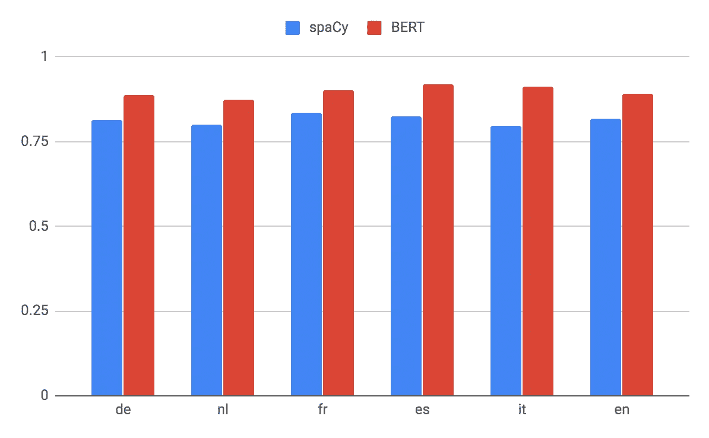
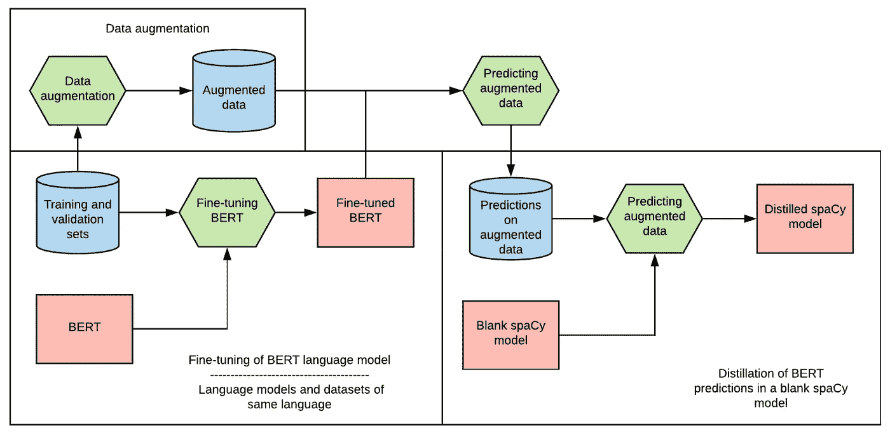

# 用空间提取 BERT 模型

> 原文：<https://towardsdatascience.com/distilling-bert-models-with-spacy-277c7edc426c?source=collection_archive---------6----------------------->

## 如何训练可与大型迁移学习模型相媲美的小型神经网络

迁移学习是近年来自然语言处理领域最具影响力的突破之一。发布不到一年，谷歌的 [**伯特**](https://ai.googleblog.com/2018/11/open-sourcing-bert-state-of-art-pre.html) **及其后代(** [**罗伯塔**](https://ai.facebook.com/blog/roberta-an-optimized-method-for-pretraining-self-supervised-nlp-systems/) **、**[**XLNet**](https://arxiv.org/abs/1906.08237)**等。)称霸大部分 NLP 排行榜。虽然将这些庞大的模型投入生产是一件令人头痛的事情，但有各种解决方案可以显著减小它们的尺寸。在**[**NLP Town**](http://www.nlp.town/)**我们成功地应用了模型提取来训练 spaCy 的文本分类器，使其在产品评论的情感分析上表现得几乎和 BERT 一样好。**

最近，自然语言处理的标准方法发生了巨大的变化。尽管直到一年前，几乎所有的 NLP 模型都是完全从零开始训练的(通常除了预训练的单词嵌入)，但今天最安全的成功之路是下载一个预训练的模型，如 BERT，并针对特定的 NLP 任务进行微调。因为这些迁移学习模型已经看到了大量未标记文本的集合，他们已经获得了许多关于语言的知识:他们意识到单词和句子的意义，[共指](https://nlp.stanford.edu/pubs/clark2019what.pdf)，[句法](http://u.cs.biu.ac.il/~yogo/bert-syntax.pdf)等等。尽管这场革命可能令人兴奋，但像 BERT 这样的模型有太多的参数，它们相当慢而且资源密集。至少对于某些 NLP 任务来说，微调 BERT 就像用大锤砸坚果。

# 大锤模型

大多数迁移学习模型都很庞大。伯特的`base`和`multilingual`型号是[变形金刚](https://arxiv.org/abs/1706.03762)，12 层，隐藏尺寸 768，12 个自关注头——总共不少于 1.1 亿个参数。`BERT-large`体育参数高达 340 米。尽管如此，与更近的模型相比，BERT 仍然相形见绌，例如[脸书的 XLM，参数为 665M】和 OpenAI 的](https://github.com/facebookresearch/XLM) [GPT-2，参数为 774M](https://openai.com/blog/gpt-2-6-month-follow-up/) 。看起来这种向更大模型发展的趋势肯定会持续一段时间。

General models like BERT can be finetuned for particular NLP tasks (from: [Devlin et al. 2018](https://arxiv.org/pdf/1810.04805.pdf))

当然，语言是一种复杂的现象。很明显，参数相对较少的更传统、更小的模型将无法处理您扔给它们的所有 NLP 任务。然而，对于单个文本分类或序列标记任务，是否真的需要 BERT 及其同类产品的所有表达能力是值得怀疑的。这就是为什么研究人员已经开始研究如何缩小这些模型的尺寸。[三种可能的方法](https://blog.rasa.com/compressing-bert-for-faster-prediction-2/)已经出现:*量化*通过用更少的比特编码来降低模型中权重的精度，*修剪*完全移除模型的某些部分(连接权重、神经元甚至全权重矩阵)，而在*蒸馏*中，目标是训练小模型来模仿大模型的行为。

# 用于情感分析的模型提取

在我们 NLP Town 的一个夏季项目中，我们和实习生 Simon Lepercq 一起着手调查模型提取对情感分析的有效性。就像的庞、李和韦思亚纳森在他们的开创性论文中所说的那样，我们的目标是建立一个能够区分正面和负面评论的自然语言处理模型。我们收集了六种语言的产品评论:英语、荷兰语、法语、德语、意大利语和西班牙语。我们给一两星的评论贴上标签`negative`，给四星或五星的评论贴上标签`positive`。我们用 1000 个例子进行训练，1000 个例子进行开发(早期停止)，1000 个例子进行测试。

第一步是确定我们任务的基线。在我们的每个数据集中，有相同数量的正面和负面例子，随机基线将获得平均 50%的准确性。作为一个简单的机器学习基线，我们训练了一个空间[文本分类模型](https://spacy.io/usage/training#textcat):一个词汇袋模型的[堆叠集成](https://spacy.io/api/textcategorizer#architectures)和一个相当简单的具有均值汇聚和注意力的卷积神经网络。为此，我们添加了一个节点的输出层，并让模型在输出得分高于 0.5 时预测`positive`，否则预测`negative`。这个基线在测试数据上达到了 79.5%(意大利语)和 83.4%(法语)之间的准确率——不算差，但也不是很好的结果。

BERT gives an average error reduction of 45% over our simpler spaCy models.

由于它的训练集很小，我们的挑战非常适合迁移学习。即使诸如*巨著*之类的测试短语没有出现在训练数据中，BERT 也已经知道它类似于*优秀小说*、*精彩阅读*，或者在训练集中很可能出现的另一个类似短语。因此，它应该能够比从零开始训练的简单模型更可靠地预测一个看不见的评论的评级。

为了微调 BERT，我们改编了 [PyTorch-Transformers](https://github.com/huggingface/pytorch-transformers) 库中的`BERTForSequenceClassification`类用于二进制分类。对于所有六种语言，我们都进行了微调`BERT-multilingual-cased`，这是谷歌目前推荐的多语言模式。结果证实了我们的预期:BERT 的准确率在 87.2%(荷兰语)和 91.9%(西班牙语)之间，比我们最初的 spaCy 模型平均高出 8.4%。这意味着 BERT 几乎将测试集上的错误数量减半。

# 模型蒸馏

不幸的是，伯特也不是没有缺点。我们的六个微调模型中的每一个都占用了将近 700MB 的磁盘空间，它们的推理时间比 spaCy 的要长得多。这使得它们很难部署在资源有限的设备上，或者对许多用户并行使用。为了应对这些挑战，我们求助于[模型提炼](https://arxiv.org/abs/1503.02531):我们让微调过的 BERT 模型充当老师，让 spaCy 更简单的卷积模型充当学习模仿老师行为的学生。我们遵循由[唐等人(2019)](https://arxiv.org/pdf/1903.12136.pdf) 描述的模型提取方法，该方法表明可以将 BERT 提取为简单的 BiLSTM，并获得类似于具有 100 倍以上参数的 ELMo 模型的结果。

Distillation is a process that extracts the essential aspects from a mixture.

然而，在我们开始训练小模型之前，我们需要更多的数据。为了学习和模仿 BERT 的行为，我们的学生需要看到比原始训练集更多的例子。因此，Tang 等人应用三种方法进行数据扩充(在原始训练数据的基础上创建合成训练数据):

*   **屏蔽**训练数据中的随机单词。比如*我喜欢这本书*现在变成了*我【屏蔽】这本书。*
*   **将训练数据中的**其他随机词替换为另一个词性相同的词。比如*我喜欢这本书*变成了*我喜欢这个画面*。
*   **从训练样本中随机抽取长度为 1 到 5 的 n-gram** 。

由于我们数据集中的产品评论可能相当长，我们在上面三种方法的基础上增加了第四种方法:

*   **从训练示例中随机抽取一个句子**。

The process of model distillation.

这些增强方法不仅帮助我们创建了一个比原来大很多倍的训练集；通过采样和替换训练数据的各个部分，他们还通知学生模型什么单词或短语对其老师的输出有影响。此外，为了给它尽可能多的信息，我们没有给学生看老师预测的标签，而是显示它的精确输出值。通过这种方式，小模型可以了解最佳类的确切概率，以及它与其他类相比的情况。[唐等(2019)](https://arxiv.org/pdf/1903.12136.pdf) 用老师的逻辑来训练小模型，但是我们的实验表明使用概率也能给出非常好的结果。

# 蒸馏结果

模型提取的一个很大的优点是它是模型不可知的:教师模型可以是一个黑盒，学生模型可以有任何我们喜欢的架构。为了使我们的实验简单，我们选择了与基线相同的 spaCy 文本分类器作为我们的学生。训练程序也保持不变:我们使用相同的批量大小、学习率、退出和损失函数，当开发数据的准确性停止上升时，停止训练。我们使用上面的增强方法为每种语言收集了大约 60，000 个例子的合成数据集。然后，我们收集了微调后的 BERT 模型对这些数据的预测。与原始训练数据一起，这成为我们较小空间模型的训练数据。

The distilled spaCy models perform almost as well as the original BERT models.

尽管设置很简单，但提取的空间模型明显优于我们的初始空间基线。平均而言，他们的准确度提高了 7.3%(仅比 BERT 模型低 1%)，误差减少了 39%。他们的表现表明，对于情感分析这样的特定任务，我们不需要 BERT 提供的所有表达能力。训练一个性能几乎和 BERT 一样好的模型是完全可能的，但是参数要少得多。

# 结论

随着大型迁移学习模型的日益流行，将 NLP 解决方案投入生产变得越来越具有挑战性。然而，像模型提取这样的方法表明，对于许多任务，你不需要数以亿计的参数来实现高精度。我们在六种语言中进行的情感分析实验表明，训练 spaCy 的卷积神经网络与更复杂的模型架构(如 BERT 的模型架构)相匹敌是可能的。将来，我们希望在 NLP 镇更详细地研究模型提取。例如，我们旨在找出什么样的数据扩充方法最有效，或者我们需要多少合成数据来训练一个更小的模型。