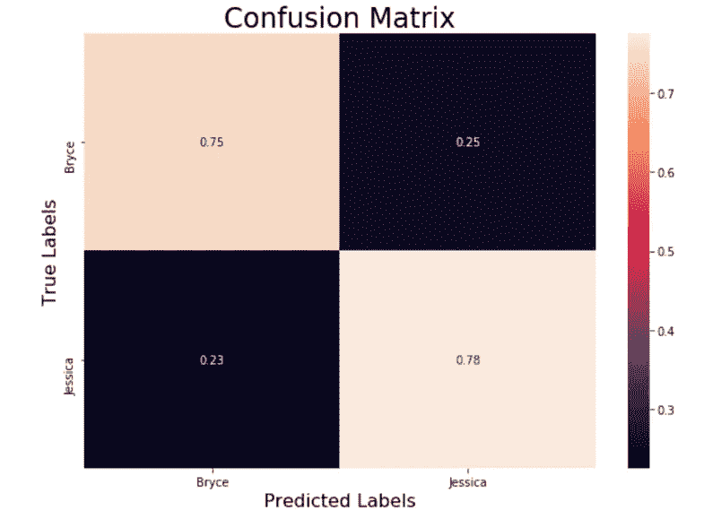

# 使用 Gabor CNN 辨别名人的长相

> 原文：<https://towardsdatascience.com/distinguishing-celebrity-look-alikes-using-gabor-cnn-ce848a4e3933?source=collection_archive---------26----------------------->

**摘要:**

在这篇论文中，我深入研究了两个名人长得很像的现象，在这种情况下，杰西卡·查斯坦和布莱丝·达拉斯·霍华德是一个用例，以开发一种足够复杂的算法来区分人的面部区域，甚至连人类都感到困惑。神经网络是目前可能的最复杂的鉴别器，考虑到同样的计算能力，更重要的是提供给 CNN 的数据质量。这里，女演员的每个图像被转换成它的 Gabor 滤波器表示，每个表示具有不同方向的 16 个 Gabor 滤波器。Gabor 滤波器似乎是生物图像的最复杂的特征提取方法，因为它们捕捉精细的纹理细节。训练有素的 CNN 能够在 80%的情况下预测名人的正确姓名。人们发现，CNN 更准确地报道了随着时间推移体重波动最小的女演员。可以得出结论，在人脸的 Gabor 表示上训练 CNN 是面部识别的有效混合技术，只要它被给予最新的面部表示。

**简介:**

面部识别是现代计算机视觉的一个有趣的领域，因为面部甚至不是一个人最显著的生物特征；最准确的鉴别器是虹膜图案或指纹。然而，这种精确的数据并不总是由感兴趣的对象自愿提供的，因此，重要的研究已经进入了从人脸提取足以区分个人的特征的方法。

从目前的参考文献来看，混合方法似乎能产生更好的结果。在[1]中，PCA +CNN 或 SOM+ CNN 方法都优于特征脸技术，即使给定较小的样本量。此外，小波分解方法，无论是哈尔变换还是双正交变换，似乎都是捕捉生物图像(如人脸)细微纹理的最佳特征提取方法[2]。在所有这些中，最健壮的似乎是 Gabor 滤波器。Gabor 滤波器组的组成[3]考虑了其他小波变换不能捕捉的生物纹理中的尺度和方向变化。

本文试图回答这个问题:如果我将最复杂的频率分解(Gabor 滤波器)与胜过任何其他方法的机器学习方法(卷积神经网络[6])相结合，我能否设计出一个足够好的系统来区分两张容易相互混淆的脸(参见图 1 中女演员的并排比较)？

**Fig.1** Jessica Chastain and Bryce Howard bare close resemblance to each other

**方法:**

在谷歌图片上为每个女演员收集了大约 200 张图片，用 Chome 插件下载:Fatkun 批处理下载器下载。我之所以决定这个粗略的数字，是因为我的教授告诉我，每节课至少需要 80 张图片。我用 Python Jupyter notebook 编写了这个系统。这些图像使用 OpenCV 的内置人脸检测算法进行迭代，该算法利用 Haar 级联实现多尺度检测[4]。该函数显然使用皮肤的独特色度值进行检测，例如 YCbCr [5]，因为有时手或胸部会被裁剪。然后手动迭代裁剪后的图像，以消除不需要的样本，从而获得高质量的训练集。

然后为每个裁剪的人脸生成 Gabor 滤波器组。该银行由 16 个不同方向的变化；其他参数的值保持不变，因为在裁剪的面部区域中缺少比例变化。标准偏差是通过计算训练集的平均标准偏差(3)得出的。核的大小被设置为标准差的 10 倍，即 30。16 个不同的方向是π内的 16 个分度。λ，正弦波长设置为 4，控制伽柏滤波器高度的γ，设置为 0.04；伽马值越小，伽柏值越高。ψ，相位偏移设置为π/4(参见图 2 中 Gabor 滤波器组的程序遍历和直观表示)。

**Fig 2.** Methodology work flow and description of Gabor filter bank parameters

一种热编码被用来标记图像，将[1，0]附加到属于 Bryce Dallas 的每个 Gabor 滤波器，将[0，1]附加到 Jessica 的滤波器。然后，每个 Gabor 表示被转换成它的灰色对应物，并被调整到 64x64。标记和调整大小后，图像被加在一起，然后混洗。在被输入 CNN 之前，这些图像被从标签中分离出来。在训练期间，CNN 被评估其将图像正确匹配到其正确标签的能力。

使用了相对经典的 CNN。它有 3 个卷积层，后面是 2 个密集层。Dropout 是随机断开多少节点以避免过拟合的概率，0.25 和 0.5 分别应用于最终的两个密集层。学习速率，即相对于损失梯度调整权重的速率，被设置为 0.001。Adam optimizer 用于其自适应优化功能(参见图 3)。

**Fig. 3** Summary of the neural network

该模型被训练了 50 个时期。它相对较快地收敛到高精度(见图 4)。

**Fig. 4** History of the training

**结果:**

我决定在训练集和测试集之间使用 80:20 的分割，所以我为每个女演员组成了一个包含 40 个图像的测试集。为了便于可视化表示，我没有打乱测试集。布莱斯达拉斯的模型预测是体面的(见图 5)。

**Fig. 5** Prediction results for Bryce Dallas Howard

Jessica 的结果稍好一些(见图 6)。

**Fig. 6** Prediction results for Jessica Chastain

总之，该模型大约 80%准确(参见图 7 的混淆矩阵)。

**Fig. 7** Confusion matrix for the model prediction.

**讨论:**

Gabor 滤波器组和 CNN 的结合能否产生一个能够区分两个长相相似的人的系统？根据这个实验，这绝对是一个有效的方法。复杂的算法肯定可以根据特征提取来识别个人面部。这个实验的限制是数据量有限。一场普通的 Kaggle 图像比赛会有比这更多的数据集。来自互联网的图像质量也不理想。一个有趣的发现是，布莱丝·达拉斯·霍华德的结果不太准确；经过进一步的研究，我发现她的体重增加了很多，其中一些照片进入了训练集。在未来，我想添加形状作为一个特征来训练 CNN，以进一步微调其准确性。

**结论:**

如果有足够的计算能力，正确的算法和高质量的数据，计算机肯定可以区分个人。尽管指纹和虹膜模式仍然是识别个人的最佳特征，但从人脸中提取正确的特征，然后使用神经网络提供了识别个人的替代方法。考虑到有限的数据和计算能力，提取正确的特征仍然非常重要。这里表明，使用 Gabor 滤波器提取 16 个方向的面部纹理产生了体面的结果。这表明，教授神经网络最重要的特征，无论是纹理还是形状，都比拥有庞大的数据量重要。

**参考文献:**

[1] Sujata G. Bhele 和 V.H.Mankar .关于人脸识别技术的综述论文。《国际计算机工程高级研究杂志》2012 年 10 月第 1 卷第 8 期

[2]帕拉维·瓦德卡尔，梅加·万哈德。基于离散小波变换的人脸识别。*国际先进工程技术杂志*，Vol.III/第一期，2012 年 1 月-3 月

[3]尚振鸾，，张，周思岳，，，韩.Gabor 卷积网络。在*arXiv:1705.01450 v3*2018 年 1 月 29 日。

[4]帕迪利亚、科斯塔·菲勒霍和科斯塔。用于人脸检测的 Haar 级联分类器的评估。*世界科学、工程与技术学会，《国际计算机与信息工程杂志》，*2012 年第 6 卷第 4 期

[5] Shruti D Patravali，J . M Wayakule，Apurva D Katre。使用 YCBCR 和 RGB 颜色模型的皮肤分割。*国际计算机科学与软件工程高级研究杂志*，第 4 卷，第 7 期，2014 年 7 月。

[6] B .戈皮卡、K .斯里拉克斯米、D .阿列赫亚、B .巴斯卡尔·拉奥、B .拉马·莫汉。基于 Gabor 特征提取和神经网络的人脸识别。电子与通信工程杂志，第 10 卷，第 2 期，版本。第二卷(2015 年 3 月至 4 月)，第 68–72 页。