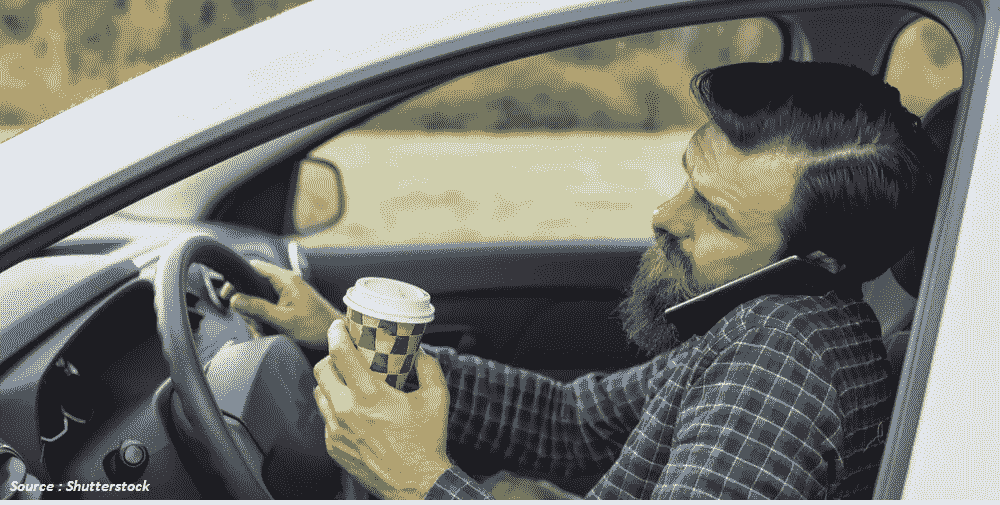
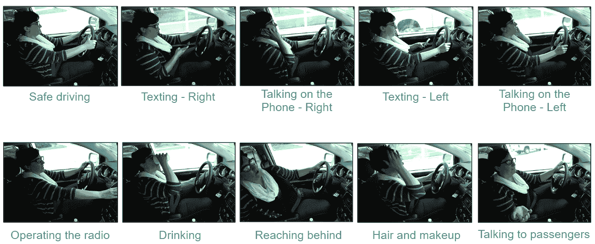
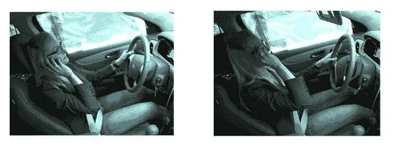
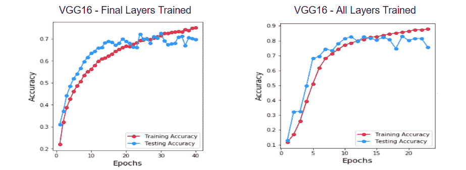
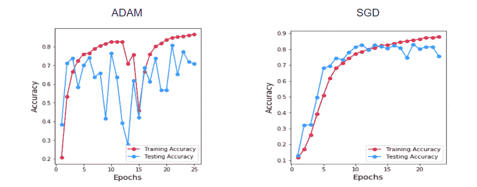
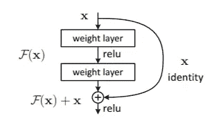
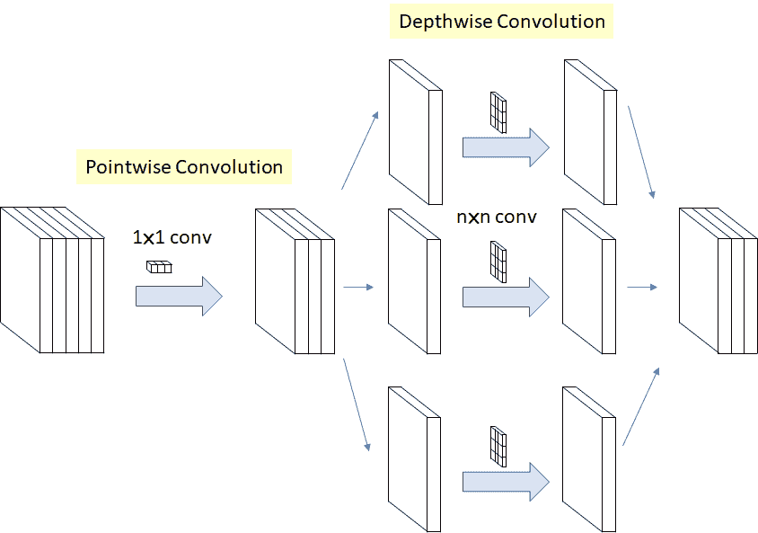
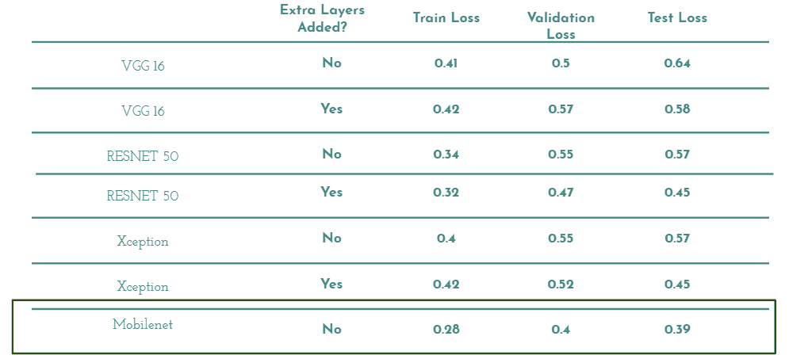
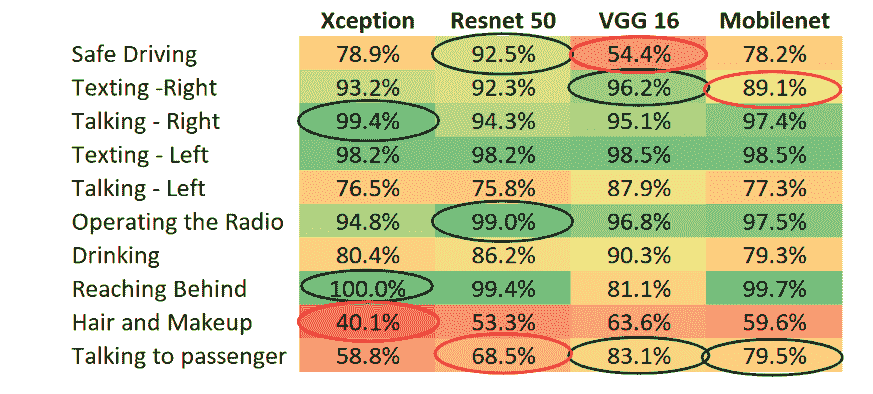

# 使用深度学习的分心驾驶员检测

> 原文：<https://towardsdatascience.com/distracted-driver-detection-using-deep-learning-e893715e02a4?source=collection_archive---------10----------------------->

> 这篇博客和这个项目是由[叶达鑫·阿萨利](https://medium.com/u/d13d157a6313?source=post_page-----e893715e02a4--------------------------------)、[阿波奥尔瓦·贾斯蒂](https://medium.com/u/6afccd049a75?source=post_page-----e893715e02a4--------------------------------)、[萨德哈娜·科尼](https://medium.com/u/8dc002ea8159?source=post_page-----e893715e02a4--------------------------------)、[萨提亚·那仁·帕奇戈拉](https://medium.com/u/337257fbfaba?source=post_page-----e893715e02a4--------------------------------)、&贾扬特·瑞辛尼在[乔迪普·高什](http://www.ece.utexas.edu/people/faculty/joydeep-ghosh)、
> 教授的指导下共同完成的。请按照这个 [GitHub](https://github.com/Apoorvajasti/Distracted-Driver-Detection) 资源库获取我们的实现代码

**简介**

驾驶汽车是一项复杂的任务，需要全神贯注。[分心驾驶](https://www.unece.org/fileadmin/DAM/trans/doc/2016/wp1/ECE-TRANS-WP1-2016-1e.pdf)是指任何分散驾驶员对道路注意力的活动。几项研究已经确定了三种主要的分心类型:视觉分心(司机的眼睛离开道路)、手动分心(司机的手离开方向盘)和认知分心(司机的思想离开驾驶任务)。

美国国家公路交通安全管理局(NHTSA)报告称，2018 年有 36750 人死于机动车撞车事故，其中 12%是由于分心驾驶。发短信是最令人担忧的干扰。发送或阅读短信会让你的视线离开路面 5 秒钟。以每小时 55 英里的速度行驶，这相当于闭着眼睛行驶了整个足球场的长度。

许多州现在都有法律禁止开车时发短信、打手机和其他分心的事情。我们相信，计算机视觉可以增强政府的努力，以防止分心驾驶造成的事故。我们的算法自动检测司机的分心活动，并向他们发出警报。我们设想将这种产品嵌入汽车，以防止因分心驾驶而发生事故。

**数据**

我们获取了 [StateFarm](https://www.kaggle.com/c/state-farm-distracted-driver-detection) 数据集，该数据集包含由安装在汽车上的摄像机捕获的视频快照。训练集有 **~22.4 K** 个在类间平均分布的已标记样本和 **79.7 K** 个未标记测试样本。共有 10 类图像:

Fig: Sample images from the training data

**评估指标**

在继续构建模型之前，选择正确的指标来衡量其性能是很重要的。准确性是我们首先想到的指标。但是，精度并不是分类问题的最佳度量。准确度仅考虑预测的正确性，即预测的标签是否与真实标签相同。但是，在评估模型的性能时，我们将驾驶员的行为分类为注意力分散的置信度非常重要。幸运的是，我们有一个度量标准来捕捉这一点— **日志丢失**。

[对数损失](http://wiki.fast.ai/index.php/Log_Loss)(与交叉熵相关)测量分类模型的性能，其中预测输入是 0 到 1 之间的概率值。我们的机器学习模型的目标是最小化这个值。完美的模型的对数损失为 0，并且随着预测概率偏离实际标签而增加。因此，当实际观察标记为 1 时，预测概率为 0.3 将导致高对数损失

Fig: Evaluation Metric

**数据泄露**

了解了需要实现的目标后，我们开始从头开始构建 CNN 模型。我们添加了常见的疑点——卷积批量标准化、最大池化和密集层。结果——在 3 个时期内，验证集的损失为 0.014，准确率为 99.6%。

Fig: Initial Model Results

嗯，我们考虑了一秒钟，意外地建造了世界上有史以来最好的 CNN 建筑。因此，我们使用这个模型预测了未标记测试集的类。

**关键时刻**

Fig: Class prediction by the model

哦，好吧。毕竟没有意外之喜。因此，我们更深入地研究了可能出现的问题，我们发现我们的训练数据中有同一个人在一个班级中的多幅图像，这些图像的角度和/或高度或宽度略有变化。这导致了数据泄漏问题，因为相似的图像也在验证中，即模型被训练了许多它试图预测的相同信息。

**数据泄露解决方案**

为了应对数据泄露的问题，我们根据个人 id 分割图像，而不是使用随机的 80-20 分割。

现在，当我们用修改后的训练集和验证集来拟合我们的模型时，我们看到了更真实的结果。我们实现了 1.76 的损耗和 38.5%的准确率。

Fig: Model fit after countering data leakage

为了进一步改善结果，我们探索使用经过试验和测试的深度神经网络架构。

**迁移学习**

迁移学习是一种方法，其中为相关任务开发的模型被重新用作第二个任务的模型的起点。我们可以重用为标准计算机视觉基准数据集(如 ImageNet 图像识别挑战)开发的预训练模型的模型权重。通常，激活 softmax 的最后一层会被替换，以适应数据集中的类数量。在大多数情况下，还会添加额外的层来针对特定任务定制解决方案。

考虑到开发用于图像分类的神经网络模型所需的大量计算和时间资源，这是深度学习中的一种流行方法。此外，这些模型通常在数百万张图像上进行训练，这在训练集很小的情况下尤其有用。这些模型架构中的大多数都是业经验证的赢家，我们利用的 VGG16、RESNET50、Xception 和 Mobilenet 模型在 ImageNet 挑战赛中取得了优异的成绩。

**图像增强**

Fig: Sample code for Image Augmentation

由于我们的训练图像集只有大约 22K 的图像，我们希望从训练集中综合获得更多的图像，以确保模型不会过度拟合，因为神经网络有数百万个参数。图像增强是一种通过执行诸如移动宽度和/或高度、旋转和缩放等动作来从原始图像创建更多图像的技术。参考这篇[文章](https://machinelearningmastery.com/how-to-configure-image-data-augmentation-when-training-deep-learning-neural-networks/)来了解更多关于图像增强的知识。

Fig: Types of image augmentation implemented in our dataset

对于我们的项目，图像增强有一些额外的优势。有时，来自两个不同类别的图像之间的差异可能非常微妙。在这种情况下，从不同的角度对同一幅图像进行多重观察会有所帮助。如果你看下面的图片，我们会发现它们几乎是相似的，但在第一张图片中，该课程是“讲电话——对”,第二张图片属于“发型和化妆”课程。

Fig: Sample of image class confusion (i) Taking on the phone (ii) Hair and Makeup

**额外图层**

为了最大化迁移学习的价值，我们添加了几个额外的层来帮助模型适应我们的用例。每层的目的:

*   **全局平均池**层仅保留每个补丁中值的平均值
*   **下降**层有助于控制过度拟合，因为它会降低一部分参数(额外提示:尝试不同的下降值是个好主意)
*   **批量标准化**层将输入标准化到下一层，这允许更快和更有弹性的训练
*   **密集**层是具有特定激活功能的规则全连通层

**训练哪几层？**

进行迁移学习时的第一个问题是，我们是应该只训练添加到现有架构中的额外层，还是应该训练所有层。自然地，我们从使用 ImageNet 权重开始，并且只训练新的层，因为要训练的参数数量会更少，并且模型会训练得更快。我们看到验证集的准确性在 25 个时期后稳定在 **70%** 。但是，通过训练所有层，我们能够获得 80%的准确率。因此，我们决定继续训练所有的层。

Fig: Comparison of model accuracy for final vs all trained layers

**使用哪种优化器？**

优化器通过在目标函数相对于参数的梯度的相反方向上更新参数来最小化由模型参数参数化的目标函数。想要了解更多关于不同优化器的工作原理，你可以参考[这篇博客](https://ruder.io/optimizing-gradient-descent/index.html#adam)。

深度学习领域最流行的算法是 Adam，它结合了 SGD 和 RMS Prop。对于大多数问题，它一直比其他优化器表现得更好。然而，在我们的案例中，亚当表现出不稳定的下降模式，而 SGD 则在逐渐学习。通过做一些文献调查，我们发现在少数情况下 SGD 优于 Adam，因为 SGD 泛化得更好([链接](https://arxiv.org/abs/1705.08292))。由于 SGD 给出了稳定的结果，我们将其用于所有的模型。

Fig: Accuracy across epochs using: (i)Adam (ii)SGD

**使用哪些架构？**

我们尝试了多种迁移学习模型，其中权重来自 ImageNet 数据集上的训练，即预训练权重。

*   **VGG16** VGG16 型号有 16 层。它主要使用卷积技术以及零填充、丢弃、最大池化和扁平化。

Fig: VGG-16 Architecture

*   **RESNET50** RESNET50 是 VGG16 模型的扩展，有 50 层。为了解决训练更深的网络困难的问题，已经引入了具有参考层输入的“快捷连接”的前馈神经网络。

Fig: Residual learning: a building block

*   [**例外**](https://arxiv.org/pdf/1610.02357.pdf)创建 RESNET 的目的是为了得到更深的**网络，而创建例外是为了通过引入 ***深度可分卷积*** 得到更宽的**网络。通过将标准卷积层分解为深度方向和点方向卷积，计算量显著减少。由于有多个过滤器查看同一级别，因此模型的性能也得到提高。****

******

***Fig: Modified Depthwise Separable Convolution used in Xception***

*   *****MobileNet** [MobileNet](https://arxiv.org/pdf/1704.04861.pdf)是 Google 为 ***基于移动的视觉应用*** 开发的模型。事实证明，计算成本至少降低了 9 倍。MobileNet 使用深度方向可分离卷积来构建轻量级深度神经网络。它有两个简单的全局超参数，可以有效地在延迟和准确性之间进行权衡。***

****迁移学习模型的性能****

****

**Fig: Comparison of Transfer Learning Models. MobileNet has the minimum loss on the test set**

****比较最佳车型****

**虽然上面的每个体系结构都给了我们很好的结果，但是每个模型对于各个类的性能有很大的差异。从下表中，我们注意到不同的模型对每一类都有最好的精确度。因此，我们决定建立这些模型的集合。**

****

**Fig: Accuracy of different algorithms per class**

**图:特定类别的每个模型的准确性。“绿色”和“红色”表示精确度从高到低**

****集合模型****

**现在我们有了 7 个后验概率方差很大的最佳模型，我们尝试了多种集成技术来进一步改善对数损失。**

*   ****均值集成:**这是最简单也是最广泛使用的集成方法，后验概率计算为组件模型预测概率的均值。**
*   ****修剪平均集合:**这是通过从每个图像的组件模型中排除最大和最小概率的平均集合。这有助于进一步平滑我们的预测，从而降低测井损失值。**
*   ****用于组合的 KNN:**由于这些图像都是在司机进行分散注意力的活动或驾驶时从视频片段中截取的，因此有大量来自同一类别的相似图像。基于这一前提，找到相似的图像并对这些图像的概率进行平均有助于我们平滑每一类的预测概率。
    为了找到 10 个最近的邻居，我们使用来自 VGG16 迁移学习模型的倒数第二层的输出作为验证集的特征。**

****

**Fig: Output of KNN — 10 Nearest Neighbours**

****

**Fig: Comparison of ensemble models with MobileNet model as the benchmark**

****学习****

**我们相信，从我们的经验中获得的这些知识将有利于任何像我们一样第一次从事深度学习项目的人:**

****1。使用 Pickle 文件:**你可以为你的项目使用的一个免费资源是**‘Google Colab’**。由于并行计算，您可以访问 GPU，这有助于处理大量数据。使用 Colab 时，您可以通过一次性读取所有图像并将其保存在 pickle 文件中来执行必要的预处理步骤。这样，您可以通过直接加载 pickle 文件来继续您离开的地方。然后，您可以开始训练您的模型**

****2。提前停止和回调:**一般深度学习模型都是用大量的历元来训练的。在此过程中，模型可能会在几个时期内提高精度，然后开始发散。训练结束时存储的最终重量将不是最佳值，即它们可能不会给出最小的对数损失。我们可以使用 Keras 中的 ***回调*** 功能，该功能仅在一个时期后看到改进时才保存模型的权重。您可以通过使用***提前停止*，**来减少训练时间，您可以设置模型停止看到任何改进后运行的时期数的阈值。**

****3。均值或修整均值优于总体的** [**模型堆叠**](https://machinelearningmastery.com/stacking-ensemble-for-deep-learning-neural-networks/)**:**堆叠模型的输入具有高相关性，这会导致输出具有高方差。因此，在这种情况下，更简单的方法是最好的方法。**

****4。永远不要忽略最终应用:**对 7 个模型进行集成，然后对输出进行 KNN，这给了我们一个很好的分数，但是如果我们必须选择一个模型，它可以用来以最少的资源获得良好但更快的预测，Mobilenet 将是显而易见的选择。Mobilenet 是根据计算限制专门开发的，最适合汽车中的应用，并且在 7 个独立模型中具有最低的对数损失**

**我们认为，在汽车上安装一个带有摄像头的设备，跟踪司机的动作并提醒他们，可以帮助防止事故发生。**

**为了说明这一点，我们制作了一个小视频，演示如何使用我们的模型:**

**Sample video depicting predictions**

****参考文献:****

1.  **斯坦福 CS231N 系列讲座为 CNN**:**[*https://www.youtube.com/watch?v=vT1JzLTH4G4&list = plzutmxvwsnxod 6 wndg 57 YC 3 zfx _ f-RYsq&index = 1*](https://www.youtube.com/watch?v=vT1JzLTH4G4&list=PLzUTmXVwsnXod6WNdg57Yc3zFx_f-RYsq&index=1)**
2.  **如何用 Keras 实现 CNN，tensor flow:*h*[*ttps://www . YouTube . com/watch？v = wq 8 bibbpya 2k&list = plqvvaa 0 qudfhtox 0 ajmq 6 tvtgmbzbexn*](https://www.youtube.com/watch?v=wQ8BIBpya2k&list=PLQVvvaa0QuDfhTox0AjmQ6tvTgMBZBEXN)**
3.  **CNN 架构:
    [*https://medium . com/analytics-vid hya/CNN-Architectures-lenet-Alex net-vgg-Google net-resnet-and-more-666091488 df5*](https://medium.com/analytics-vidhya/cnns-architectures-lenet-alexnet-vgg-googlenet-resnet-and-more-666091488df5)**
4.  **转移学习文章:**

*   **[*https://medium.com/r/?URL = https % 3A % 2F % 2f towards data science . com % 2f transfer-learning-using-mobilenet-and-keras-c 75 daf 7 ff 299*](/transfer-learning-using-mobilenet-and-keras-c75daf7ff299)**
*   **[*https://github.com/bdutta19/kaggle_statefarm*](https://github.com/bdutta19/kaggle_statefarm)**
*   **[http://cs 229 . Stanford . edu/proj 2016/report/SamCenLuo-classification of driver distraction-report . pdf](http://cs229.stanford.edu/proj2016/report/SamCenLuo-ClassificationOfDriverDistraction-report.pdf)**
*   **[*https://arxiv.org/abs/1704.04861*](https://arxiv.org/abs/1704.04861)**