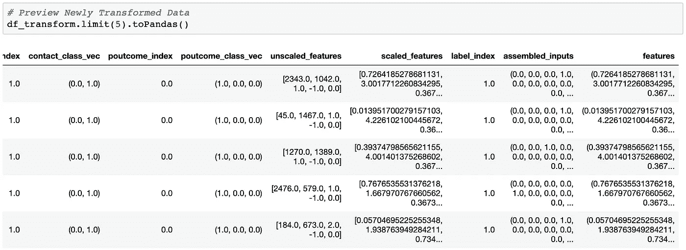

# 使用 PySpark 和 Keras 的分布式深度学习管道

> 原文：<https://towardsdatascience.com/distributed-deep-learning-pipelines-with-pyspark-and-keras-a3a1c22b9239?source=collection_archive---------0----------------------->

Photo Credit: [tian kuan](https://unsplash.com/@realaxer?utm_source=unsplash&utm_medium=referral&utm_content=creditCopyText)

## 使用 PySpark 实现数据管道化和使用 Keras 进行分布式深度学习的简单方法

# 介绍

在这本笔记本中，我使用 PySpark、Keras 和 Elephas python 库来构建一个运行在 Spark 上的端到端深度学习管道。Spark 是一个开源的分布式分析引擎，可以以极快的速度处理大量数据。PySpark 只是 Spark 的 python API，它允许您使用一种简单的编程语言，比如 python，并利用 Apache Spark 的强大功能。

*目标*

我把这个例子放在一起的兴趣是学习和原型。更具体地说，了解更多关于 PySpark 管道的信息，以及我如何将深度学习集成到 PySpark 管道中。我在本地机器上使用 Jupyter 运行了整个项目，为即将到来的项目构建了一个原型，该项目中的数据将是海量的。因为我在 IBM 工作，所以我将把整个分析项目(Jupyter 笔记本)转移到 IBM。这使我能够在一个统一的平台和一个更大的 Spark 集群上进行数据接收、管道化、培训和部署。显然，如果您有一个真实的、相当大的项目或者使用图像数据，您不会在本地机器上这样做。

总的来说，我发现把这个原型或工作示例放在一起并不太难，所以我希望其他人会发现它很有用。我会把这个项目分成 9 个步骤。很多步骤都是不言自明的，但对于其他步骤，我会尽量让它变得不那么痛苦。如果你只想看有解释和代码的笔记本，你可以直接去 [GitHub](https://github.com/aviolante/pyspark_dl_pipeline/blob/master/pyspark_dl_pipeline.ipynb) 。如果我能做到，你也能！

# **第一步**

*导入库*

Figure 1 — 3 Libraries Here: PySpark (Install Spark), Keras, and Elephas

# **第二步**

*开始火花会话*

您可以使用`setAppName()`为您的项目设置一个名称，也可以设置您想要多少工人。我只是在本地运行它，并将它设置为可能有 6 个工人。只是一个警告，如果你的数据不是很大，那么分配工作，特别是在进行机器学习时，实际上可能没什么帮助，并且提供更差的结果。当我做下面的训练时，我将它设置为 1 个工人，但是当我在以后的项目中使用这个原型时，我将更改这些设置。

Figure 2 — Spark Session

# **第三步**

*用 Pyspark 加载和预览数据*

在这里，我们将加载数据。我们将使用的数据来自一场 [Kaggle 竞赛](https://www.kaggle.com/janiobachmann/bank-marketing-dataset)。这是一个典型的银行数据集。我在这里使用了`inferSchema`参数，它有助于在加载数据时识别特征类型。根据 [PySpark 文档](https://spark.apache.org/docs/latest/api/python/pyspark.sql.html)，此*需要额外传递一次数据*。因为我正在加载的银行数据只有大约 11k 的观察值，所以根本不需要很长时间，但是如果您有一个非常大的数据集，这可能是值得注意的。

Figure 3 — Load Data

加载数据后，我们可以看到模式和各种功能类型。我们所有的功能不是`string`型就是`integer`。然后我们预览前 5 个观察结果。我非常熟悉 Pandas python 库，所以通过这个例子，你会看到我使用`toPandas()`将 spark 数据帧转换成 Pandas 数据帧，并进行一些操作。没有对错，只是对我来说更容易。

Figure 4 — View Schema and Preview Dataframe

最后，我们将删除 2 个日期列，因为我们不会在深度学习模型中使用它们。它们可能是重要的和有特色的，但是我决定把它们放在一起。

Figure 5 — Drop Columns

# **第四步**

*创建 Spark 数据管道*

现在我们使用 PySpark 创建管道。这实际上是获取您的数据，并根据您传递的特性列表进行转换和矢量化，以便为建模做好准备。对于这个管道和项目，我参考了很多 Apache Spark 文档 [*“提取、转换和选择特性”*](https://spark.apache.org/docs/latest/ml-features.html) 。

下面是一个辅助函数，用于根据数字特征的峰度或偏斜度来选择要标准化的数字特征。`upper_skew`和`lower_skew`的当前默认值只是一般指导原则(取决于您的阅读位置)，但是您可以根据需要修改上下偏斜。

Figure 6 — Select Features to Standardize Function

*创建管道*

现在我们将进入实际的数据管道。功能列表选择部分可以进一步增强，以更加动态地列出每个功能，但对于这个小数据集，我只保留了`cat_features`、`num_features`和`label`。通过类型选择特性可以类似于我在`select_features_to_scale`助手函数中所做的，使用类似这样的`list(spark_df.toPandas().select_dtypes(include=['object']).columns)`，它将返回 spark 数据帧中所有对象或字符串类型的列的列表。

我们要做的第一件事是创建一个名为`stages`的空列表。这将包含数据管道完成管道内所有转换所需的每个步骤。我打印出管道后阶段的每一步，这样你可以看到从我的代码到列表的连续步骤。

第二部分将是一个基本循环，遍历列表`cat_features`中的每个分类特征，然后使用一键编码对这些特征进行索引和编码。`StringIndexer`将您的分类特征编码到一个特征索引中，将最高频率标签(计数)作为特征索引`0`，依此类推。我将在管道(步骤 5)后预览转换后的数据框，您可以看到根据分类要素创建的每个要素索引。有关更多信息和 StringIndexer 的基本示例，请查看此处的。

在循环中，我们还使用`OneHotEncoderEstimator`进行了一些一键编码(OHE)。这个函数只接受一个标签索引，所以如果你有分类数据(对象或字符串),你必须使用`StringIndexer`,这样你就可以传递一个标签索引给 OHE 估计器。通过查看几十个例子，我发现一件好事是，你可以使用`string_indexer.getOutputCol()`将`StringIndexer`输出链接到 OHE 估计器中。如果你有很多要转换的特性，你需要考虑一下它们的名字，`OutputCol`，因为你不能仅仅重写特性的名字，所以要有创造性。我们将循环中的所有管道步骤添加到管道列表`stages`中。

接下来，我们在标签特征或因变量上再次使用`StringIndexer`。然后我们将继续使用上面的`select_features_to_scale`辅助函数缩放数值变量。一旦选择了列表，我们将使用`VectorAssembler`对这些特征进行矢量化，然后使用`StandardScaler`对该矢量中的特征进行标准化。然后我们将这些步骤添加到我们正在进行的管道列表`stages`。

最后一步是将我们所有的特征组合成一个向量。我们将通过使用我们的`unscaled_features`(所选要缩放的数字特征的名称)列表和原始数字特征列表`num_features`之间的差异，从列表`num_features`中找到未缩放的数字特征。然后，我们集合或矢量化所有分类 OHE 特征和数字特征，并将该步骤添加到我们的管道`stages`。最后，我们将`scaled_features`添加到`assembled_inputs`中，为我们的建模获得最终的单一特征向量。

Figure 7 — Spark Data Pipeline

通过查看我们按顺序添加的`stages`列表，我们可以看到管道中的所有步骤。

Figure 8 — Data Pipeline list ‘stages’

# **第五步**

*通过 Spark 管道运行数据*

既然*“硬”*部分已经结束，我们可以简单地流水线化阶段，并通过使用`fit()`使我们的数据适合流水线。然后我们实际上通过使用`transform`来转换数据。

Figure 9 — Pipeline, Fit, and Transform the Data

我们现在可以预览新转换的 PySpark 数据框架，其中包含所有原始和转换后的特征。这可以在 GitHub 的笔记本上更好地查看，但是图 10 显示了一些索引、集合向量和我们的标签索引。

Figure 10 — Preview of Newly Transformed Dataframe

# **第六步**

*深度学习模型前的最终数据准备*

在建模之前，我们需要做几件最后的事情。首先是创建一个 PySpark 数据帧，该数据帧仅包含来自最近转换的数据帧的 2 个向量。我们建模只需要:`features` ( *X* )和`label_index` ( *y* )特征。用简单的`select`语句就可以很容易地处理 PySpark。然后，只是因为，我们预览数据帧。

Figure 11 — Select Final Features and Label

最后，我们希望重组数据帧，然后将数据分成训练集和测试集。您总是希望在建模之前打乱数据，以避免对数据排序或组织方式的任何偏见，特别是在拆分数据之前打乱数据。

Figure 12 — Order by Random (Shuffle) and Split Data

# **第七步**

*用 Keras 建立深度学习模型*

我们现在将使用 Keras 建立一个基本的深度学习模型。Keras 被描述为:*“一种高级神经网络 API，用 Python 编写，能够在 TensorFlow、CNTK 或 Theano 之上运行。” [Keras 文档](https://keras.io/)中的*。我发现 Keras 是 python 最简单的深度学习 API 之一。此外，我发现了一个 Keras 的扩展，它允许我在 Spark 上进行简单的分布式深度学习，可以与我的 PySpark 管道集成，所以这似乎是一个很好的选择。

首先，我们需要从数据中确定类的数量以及输入的数量，以便我们可以将这些值插入到我们的 Keras 深度学习模型中。

Figure 13 — Number of Classes and Inputs for Model

接下来我们创建一个基本的深度学习模型。使用 Keras 的`model = Sequential()`功能，可以很容易地添加层，并使用所有所需的设置(单位数、辍学率%、正则化-L2、激活函数等)构建深度学习模型。)由于我们的结果标签是二进制的，所以我选择了普通的 Adam 优化器和具有二进制交叉熵的 sigmoid 激活来补偿我们的损失。

Figure 14 — Keras DL Model

一旦模型建立，我们可以查看架构。请注意，我们从 30 个输入/参数增加到 74，242 个。深度学习的妙处，有时也是懒惰:)，是自动特征工程。

Figure 15 — Model Summary / Architecture

# 第八步

*用 Elephas 进行分布式深度学习*

现在我们已经建立了一个模型，使用 Keras 作为我们的深度学习框架，我们希望在 Spark 上运行该模型，以利用其分布式分析引擎。我们通过使用一个 python 库和一个名为 [Elephas](https://github.com/maxpumperla/elephas) 的 Keras 扩展来做到这一点。Elephas 使得在 Apache spark 上运行 Keras 模型变得非常容易，只需几行配置。我发现 Elephas 比我阅读和尝试的其他几个库更容易使用，也更稳定。

我们对 Elephas 做的第一件事是创建一个类似于上面 PySpark 管道项目的估计器。我们可以从 Keras optimizer 函数中设置优化器设置，然后将其传递给我们的 Elephas 估计器。我只显式地使用具有设定学习率的 Adam optimizer，但是您可以使用任何具有各自参数的[Keras optimizer](https://keras.io/optimizers/)(clip norm，beta_1，beta_2 等。).

然后，在 Elephas estimator 中，您可以指定各种项目:特征列、标签列、时期数、训练的批量大小、训练数据的验证分割、损失函数、度量等。我只是使用了来自 [Elephas 示例](https://github.com/maxpumperla/elephas/blob/master/examples/ml_pipeline_otto.py)的设置，并稍微修改了代码。因为我的数据很少，所以我只用了一个工人。此外，当我尝试运行 6 个工人(步骤 2)的结果很差。教训是:你可以分发并不意味着你应该:)

Figure 16 — Elephas Estimator for Distributed Deep Learning

注意，在我们运行估计器之后，输出`ElephasEstimator_31afcd77fffd`，看起来类似于我们的一个管道`stages`列表项。这可以直接传递到我们的 PySpark 管道中，以适应和转换我们的数据，这将在下一步中完成！

# 第九步

*分布式深度学习管道和结果*

既然深度学习模型将在 Spark 上运行，使用 Elephas，我们可以完全按照上面使用`Pipeline()`的方式来流水线化它。您可以将它添加到我们的`stages`列表中，并使用一个新数据集一次性完成所有这些工作，因为它已经全部构建完成，这将非常酷！

Figure 17 — Easy DL Pipeline with PySpark

我在下面创建了另一个名为`dl_pipeline_fit_score_results`的帮助函数，它采用深度学习管道`dl_pipeline`，然后对训练和测试数据集进行所有的拟合、转换和预测。它还输出数据集及其混淆矩阵的准确性。

Figure 18 — Deep Learning Pipeline Helper Function

让我们在两个数据集上使用我们新的深度学习管道和助手函数，并测试我们的结果！从下面你可以看到，我们可以在训练和测试数据上有大约 80%的准确性，所以这个模型似乎是足够概括的。我承认我正在使用一个大锤模型，一个小得多的“工具”比如一个基本的决策树可能会做得更好。然而，我们现在有一个工作流和原型来引入表格数据，通过转换管道传递数据，并应用深度学习。

Figure 19 — Run DL Pipeline Helper Function, View Results

# 结论

我希望这个例子有所帮助。我知道这是为了让我了解更多关于 PySpark 管道的知识，并使用 Keras 等简单的深度学习框架在 Spark 上进行深度学习。正如我提到的，我在本地运行所有这些，几乎没有问题，但我的主要目标是为一个即将到来的项目构建原型，该项目将包含一个大规模的数据集。我希望你(和我自己)可以把它作为一个模板，同时对 spark 会话、数据、特性选择以及添加或删除一些管道阶段做一些修改。一如既往，感谢您的阅读，祝您的下一个项目好运！