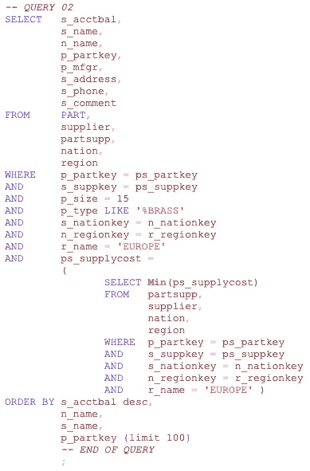
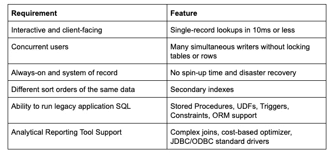
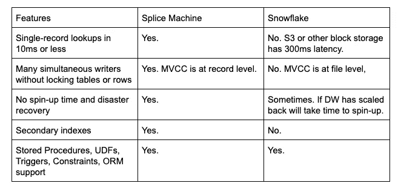
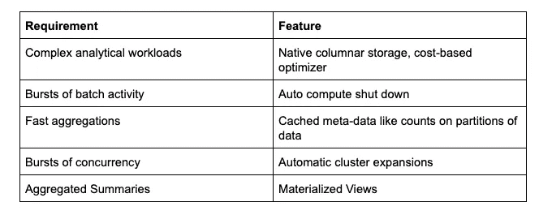
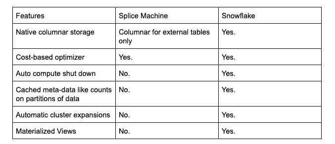

# 分布式 SQL 系统综述:雪花 vs 拼接机

> 原文：<https://towardsdatascience.com/distributed-sql-system-review-snowflake-vs-splice-machine-1ac995730b9?source=collection_archive---------14----------------------->

# SQL 回来了

在经历了多年的大数据、NoSQL 和基于读取的模式的弯路之后，SQL 作为数据操作的通用语言已经有了明显的回归。开发人员需要 SQL 提供的全面表达能力。一个没有 SQL 的世界忽略了 40 多年的数据库研究，并导致应用程序中硬编码的意大利面条式代码来处理 SQL 极其高效地处理的功能，如连接、分组、聚合和(最重要的)更新出错时的回滚。

SQL is a powerful language enabling developers to state what they need without coding how to compute it

幸运的是，现在有了一种称为分布式 SQL 的现代 SQL 体系结构，它不再受到传统 SQL 系统的挑战(成本、可伸缩性、性能、弹性和模式灵活性)。分布式 SQL 的关键属性是数据存储在许多分布式存储位置上，计算在一个网络服务器集群上进行。这带来了前所未有的性能和可伸缩性，因为它在集群中的每个工作节点上并行分配工作。

虽然分布式 SQL 系统有许多共同的特征，但它们也有很大的不同，有些更适合某些工作负载。在这里，我们尝试将 Snowflake 和 Splice Machine 作为分布式 SQL 系统的两个例子进行比较，这两个例子在很多方面都有所不同。

不幸的是，数据系统之间的比较界限已经模糊。例如，一个系统声称拥有数据库的 ACID 属性(即原子性、一致性、隔离性和持久性)这一事实，并不一定意味着它是一个真正能够支持应用程序的事务性 OLTP 系统(关于这个主题的更多细节，请参见 Medium [文章](https://medium.com/splice-machine/comparing-the-acid-properties-of-databricks-delta-lake-and-splice-machine-1169c60f575f?source=friends_link&sk=5c01cdd41984f3ca19d2017c923ebdf9))。另一个例子是灵活性—随着工作负载的扩展，您可以添加更多的工作人员来获得更多的并行性，或者随着工作负载的缩减而减少工作人员并降低成本。许多系统是灵活的，但是只有一些能够自动扩展集群以获得更多(或更少)的并发性或吞吐量。这是拼接机和雪花互不相同的两个示例特征。

在这里，我们将试图提供这些系统的一个平衡的观点，即使我们代表其中的一个。我们将从用例的角度来展示这些系统的不同之处，而不是逐个特性地展示。

下面我们将展示两个完全不同的用例。一个将完全适合拼接机，一个将完全适合雪花。

# 用例

Application versus Analytics

让我们考虑两个用例，都是在保险行业。用例一是管理客户、政策、索赔和支付的可操作的遗留应用程序。它是一个用 Java 编写的 SQL 应用程序，具有用 React/Node.js 开发的 Javascript 前端，具有以下特征:

*   保险公司的每个实体都有自己的本地化的应用程序实例，运行特定的区域内法规、费率和政策
*   应用程序必须 24/7 可用，并且在工作时间有峰值并发负载
*   该应用程序还运行一组运营报告，管理人员使用这些报告来获得关于业务的日常见解
*   经理们还把它作为一个专门的商业智能查询工具，询问企业“一次性”的问题
*   该系统的用户包括许多支持者，包括代理、经理和通过自助服务门户的消费者

用例二是一个对账过程，它将来自数百万单个交易(在几个业务系统中)的财务业务信息转换为 SAP 等财务系统的分类帐更新。该应用程序具有以下属性:

*   ETL 工具(如 Informatica 或 Talend)中设计的一组复杂的批量转换会产生聚合数据
*   每天运行以创建运行汇总，每月运行以关闭帐簿。
*   汇总的数据作为文件输出，由财务对账系统接收
*   财务分析师审查由报告工具(如 Tableau 或 MicroStrategy)构建的批处理报告和仪表板
*   分析师执行临时查询来验证结果

# 选择解决方案

Use Snowflake or Splice Machine?

对于任何熟悉 Splice Machine 和 Snowflake 的人来说，您可以看到这些用例是为了指出每个引擎的优势而选择的。Splice Machine 的最佳点倾向于运营工作负载，而 Snowflake 的最佳点是大批量数据仓库工作负载。如果你的问题是用例 1，拼接机是最好的选择，原因如下。如果你的问题类似于用例 2，那么雪花是一个更好的选择。下面是每个用例的细分:

# 传统应用程序工作负载

遗留应用程序有以下要求，这些要求需要相关的系统功能。

Legacy Application Requirements

那么这些系统是如何堆叠起来的呢？

Feature Comparison

Net-Net:要运行一个有并发用户且始终在线的遗留应用程序，一个倾向于操作性工作负载但也有分析能力的系统将会表现得更好。

现在我们来看看雪花闪耀在哪里。

# 财务对账工作量

这个用例有着完全不同的需求，因此需要不同的特性。

Financial Reconciliation Workload Requirements

那么这些系统是如何堆叠起来的呢？

Feature Comparison

在这个用例中，雪花被设计用来优化大批量分析查询。存储针对这一点以及计算进行了优化。通过将计算与存储分离，雪花系统可以在不使用时完全关闭所有计算节点，从而创建一个经济高效的数据仓库。[更新 2/27/20:拼接机现在可以暂停和重启]。它还支持利用元数据统计数据进行优化，以最大限度地发挥每个员工的潜能。

# 摘要

Hybrid Transactional and Analytical versus Data Warehouse

Snowflake 和 Splice Machine 分布式 SQL 引擎都很强大，它们在服务工作负载的能力上肯定是重叠的。因此，您的选择标准将取决于您的特定用例。如果您的用例要求决策支持系统支持预先计算的值，可以关闭，并且可以弹性伸缩，那么雪花就是您的选择。另一方面，大多数分布式 SQL 系统无法支持应用程序。如果您希望为具有大量并发用户的任务关键型应用提供支持，并且该应用必须全天候运行，那么 Splice Machine 无疑是您的最佳选择。

实际上，这些系统部署在各种不同的工作负载上。例如，除了运营应用之外，Splice 还通过其基于 Apache Spark 的基础架构处理许多数据仓库、分析和机器学习工作负载。除了数据仓库之外，雪花有时还能驱动应用程序。但是我们在这里所做的是尝试描述用例连续体上的几个极端例子，以帮助您为您的工作负载选择最佳的分布式 SQL 引擎。

有关如何使用拼接机实现应用现代化的更多信息，请参见本[白皮书](https://info.splicemachine.com/digital-transformation-2.html)。