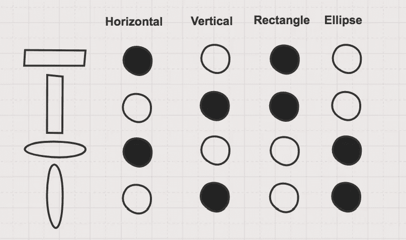
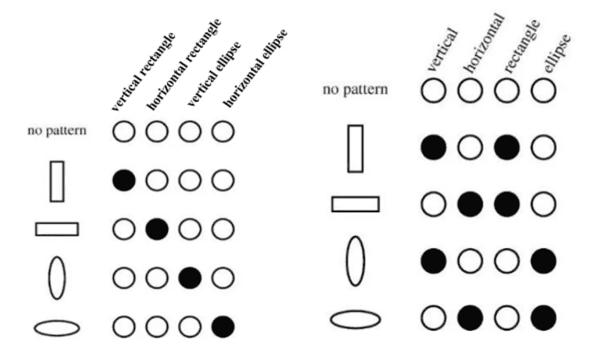
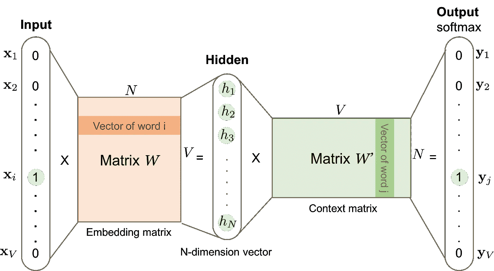

# 分布式矢量表示:简化

> 原文：<https://towardsdatascience.com/distributed-vector-representation-simplified-55bd2965333e?source=collection_archive---------15----------------------->

可以说是机器学习中最基本的特征表示方法

让我们来玩一个简单的游戏。我们有三个“人”——迈克尔、露西和加布。我们想知道哪个人的播放列表与露西最匹配，是迈克尔还是加布？？让我给你一些提示。露西喜欢古典摇滚，加布也是，但迈克尔不喜欢。露西更喜欢器乐版本，迈克尔也是一样，但加布不喜欢他们。露西不喜欢流行音乐，迈克尔彻底讨厌它，但加布绝对是一个流行音乐迷！！

*这种信息的表达有帮助吗？你能确定谁的播放列表更符合露西吗？Lucy 和 Micheal 对两种不同的歌曲类型有共同的兴趣，而 Lucy 和 Gab 只有一种共同的歌曲类型。但是你能确定露西和加布分享的一种类型不会超过其他两种吗？(我是说 comeon..是经典摇滚！！！)*

*如果我告诉你，我有一个神奇的公式，可以把他们的音乐兴趣作为一个单一的值来表达，你会怎么想？Lucy 可以表示为-0.1，Gab 可以表示为-0.3，Micheal 可以表示为 0.7。这当然使工作更容易，因为如果你相信这个公式，我认为很明显露西的播放列表将与 Gab 最匹配。但是我是怎么想出这个公式的呢？让我们从头开始…*

## 什么是分布式表示？

分布式表示指的是特征创建，其中特征可能与原始输入有任何明显的关系，也可能没有，但它们具有比较价值，即类似的输入具有类似的特征。将输入转换为数字表示(或特征)是每个领域中任何机器学习算法的第一步。

## 为什么非分布式表示还不够？

非分布式表示(也称为**单热点**向量表示)为每个新的输入可能性添加一个新的向量维度。显然，唯一可能输入的数量越多，特征向量就越长。这种表示有两个主要缺陷，

1.  任何两个特征向量之间的距离或“相似性”是相同的。换句话说，这种表示没有关于输入如何相互关联的信息，即没有比较值。
2.  由于向量的每个维度代表一个唯一的输入，这种表示不能处理看不见的或未知的输入。

One-hot representation (left) vs distributed representation (right)

例如，如果我们在上面的表示中遇到一个新的输入，circle，会怎么样呢？如果我们使用非分布表示法(左)，我们没有表示圆的方法，但如果我们使用分布表示法(右)，我们可以将圆表示为垂直、水平和椭圆。这种表示也有助于我们的模型理解圆形更像椭圆而不是矩形。

## 我如何创建分布式矢量表示？

没有一种创建分布式矢量表示的方法。您可以创建与属性域有逻辑关系的要素，并相应地表示您的输入，就像上面的矩形/椭圆示例中所做的那样(尽管此过程需要专业领域知识)。或者你可以使用更成功的方法，即使用深度学习来创建无法直接解释的特征表示，但保留所需的比较值(就像我在帖子开头的播放列表示例中所做的那样)。

为了创建基于深度学习的分布式向量表示，需要首先创建逻辑特征表示(在大多数情况下实际上是非分布式表示)，然后将其传递通过“转换矩阵”(有时也称为嵌入矩阵)，以获得分布式向量表示。模型的这一部分通常附加在完整管道的开始，以学习表示。

Converting V unique inputs into an N-dimension vector representation

有许多帮助 ML 管道的向量表示的例子，如 Word2Vec、Gene2Vec、Prot2Vec、Node2Vec、Doc2Vec、Tweet2Vec、Emoji2Vec 等。这个清单非常庞大，尽管其中很大一部分出现在本次[回购](https://github.com/MaxwellRebo/awesome-2vec)中。

## 为什么向量长度很重要？

现在一切似乎都很容易。为什么要浪费这么多空间，让我们学着用一个数值来表示所有的东西，对吗？*不！！*让我来给你讲解一下。

如果我们需要表示 3 个同样相似的输入(像三角形)会怎样？我们能用一维向量来表示它们吗？**不！！**为什么？因为三角形是二维的，咄！！现在，如果我需要表示 4 个同样相似的输入(像一个金字塔)该怎么办？你知道规矩..

每当我们增加特征维数时，我们的特征表示的稀疏性以指数方式增加。使用深度学习的分布式向量表示植根于这样一个事实，即我们提供具有比较值的近似(不一定精确)分布式表示。因此，需要明智地选择特征维度的大小，以便它可以提供足够准确的输入表示，而不会导致特征空间的极度稀疏。

## 下一步是什么？

分布式矢量表示作为一种核心思想非常流行，并广泛应用于各个领域。在各种各样的问题陈述中，已经提出了多种数字特征表示方法。我相信这种表示的核心思想对于任何机器学习问题都是必不可少的(即使确切的方法发生了显著的变化)。

*这个博客是努力创建机器学习领域简化介绍的一部分。点击此处的完整系列*

 [## 机器学习:简化

### 在你一头扎进去之前就知道了

towardsdatascience.com](/machine-learning-simplified-1fe22fec0fac) 

*或者只是阅读系列的下一篇博客*

 [## 深度学习时间序列分析:简化

### 参加在时间序列分析中使用深度学习的“为什么”和“什么时候”的速成班。

towardsdatascience.com](/time-series-analysis-with-deep-learning-simplified-5c444315d773) 

## 参考

*[1] Knapp，Steven K .“用一键法加速 FPGA 宏”电子设计 38.17(1990):71–78。
[2] Mikolov，Tomas 等，“单词和短语的分布式表示及其组合性”神经信息处理系统进展。2013.
[3]勒、阔克和托马斯·米科洛夫。"句子和文档的分布式表示."机器学习国际会议。2014.
[4] Dhingra，Bhuwan 等，“Tweet2vec:基于角色的社交媒体分布式表示”arXiv 预印本 arXiv:1605.03481 (2016)。*