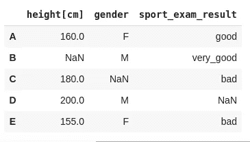
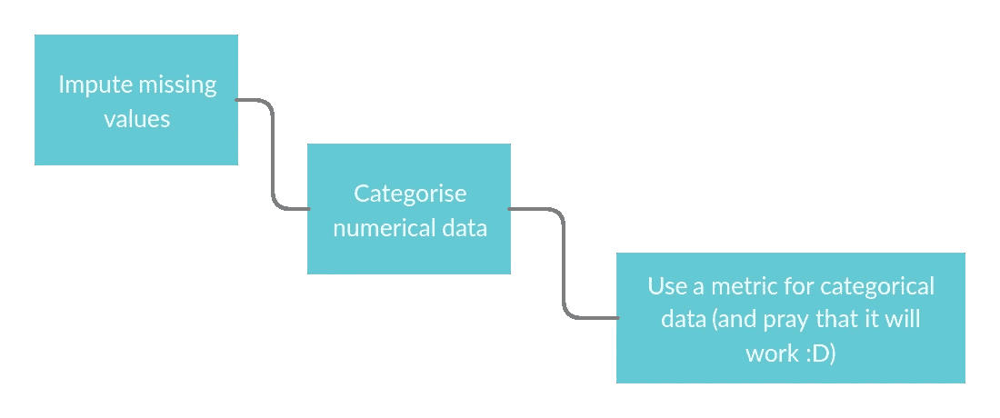
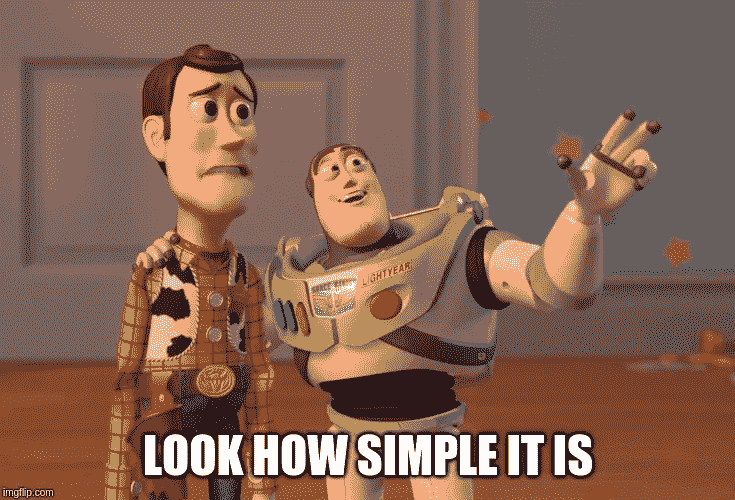

# 介绍 Distython。新的 Python 包实现了新的距离度量

> 原文：<https://towardsdatascience.com/distython-5de10f342c93?source=collection_archive---------13----------------------->

您在为混合型数据集选择正确的距离度量时遇到过问题吗？在大多数情况下，您可以尝试执行要素预处理，然后使用一些流行的距离度量，如欧几里德距离或曼哈顿距离。事实上，这种方法可能是不准确的，并导致 ML 模型的性能下降。看看 [Distython](https://github.com/KacperKubara/distython) — Python 包，它实现了研究论文中新颖的混合型距离度量！

Photo by [Charles 🇵🇭](https://unsplash.com/@charlesdeluvio?utm_source=medium&utm_medium=referral) on [Unsplash](https://unsplash.com?utm_source=medium&utm_medium=referral)

最近实习的时候遇到过这个问题。我不得不在混合类型的数据集中使用 K-NN 来度量实例之间的相似性，该数据集中也有缺失值！虽然我可能会尝试做一些“花哨”的特征预处理，使其与流行的距离度量一起工作，但我不认为这是获得可靠结果的好方法。这让我开始寻找既能处理混合型数据又能处理缺失值的距离度量。读了几篇论文后，我发现了几个有趣的指标，这促使我在这里[发表了另一篇关于它们的文章](/the-proper-way-of-handling-mixed-type-data-state-of-the-art-distance-metrics-505eda236400)。与此同时，我也开始研究它们的实现，这让我创建了一个名为 Distython 的小型实用 Python 包！在接下来的文章中，我将解释它如何对您的 ML 模型有用，如何与 Scikit-Learn 集成，并简要解释代码的设计。

我喜欢数据科学的原因是，它吸引了许多对人工智能和数据科学充满热情的志同道合的人。这就是为什么我想在 [Linkedin](http://www.linkedin.com/in/kacperkubara?source=post_page---------------------------) 上与你联系！您也可以通过我的[个人网站](http://www.kacperkubara.com/?source=post_page---------------------------)留下任何反馈和问题😎

## Distython 概述

(链接到 GitHub repo [这里](https://github.com/KacperKubara/distython))

Distython 是一个小型的、高效的实用程序包，它实现了混合型距离度量。最初，我把它作为个人使用，但是我想如果我把它公开的话可能会更有用。它实现了 3 种算法:异质欧几里德重叠度量(HEOM)，价值差异度量(VDM)和异质价值差异度量(HVDM)。所有这些都在我之前的[文章](/the-proper-way-of-handling-mixed-type-data-state-of-the-art-distance-metrics-505eda236400)中解释过，也可以在[这篇研究论文](https://arxiv.org/pdf/cs/9701101.pdf)中找到。它们可以直接与一些 Scikit-Learn 算法一起使用(那些允许指定用户定义的度量的算法，例如最近邻或 Dbscan)。你也可以将它们与特定的插补算法一起使用，比如 MICE、K-NN 或 MissForest(我也写了一篇关于它们的文章

[Distython](https://github.com/KacperKubara/distython) 完全基于 Numpy。这使得它更快，并减少了所需的包依赖的数量。这里唯一的缺点是它降低了代码的可读性，但是当你试图创建高效的代码时，这通常是一个问题😀

## 为什么它有用

它解决了一个以前没有解决的问题，即创建一个公开可用的异构距离度量集合。老实说，当我发现 Scikit-Learn 没有任何异构度量时，我感到非常惊讶。假设数据集要么是连续的，要么是分类的，这似乎是非常错误的，是吧？

## 非异构方法与分布式

让我们来看一个非常简单的数据集，它包含分类和连续的特征以及一些缺失值。我们需要测量两个实例 **A** 和 **B** 之间的距离。

Simple dataset for the purpose of the example

**非异构方法:**例如，如果您要使用 Scikit-Learn，则没有异构度量可供选择。克服这个问题的一个方法是一个变通的解决方案，它可能会给你不正确的结果:

为了计算 **A** 和**B**之间的距离，你需要对数字数据进行分类，这会导致信息的丢失。这里的另一个大问题是，在对特性进行编码之后，你将会得到很多列(维数灾难在这里适用)！

你准备好了吗？这里只有一件事要做…将您选择的距离度量应用于这些实例。很简单，是吧？要将度量附加到 Sklearn 的 K-NN 实现中，您只需要一行代码！

## Distython with Scikit-Learn

这些指标被设计为可以直接应用于 Scikit-Learn 中的最近邻或 Dbscan 类。您可以将它与 Scikit-Learn 类一起用于您的个人项目，只要它们提供一个调用定制度量函数的接口。请注意，如果我们将指标附加到 Scikit-Learn 类，它会生成函数的开销调用，算法会变慢。

Importing necessary libraries

在上面的代码中，我们导入了必要的库和 HEOM 度量。我们还将使用波士顿房价数据集，因为它同时具有分类和数字特征。

Define the indices for categorical variables and NaN equivalent

这里，我们导入数据并将其定义为 boston_data。这里重要的部分是我们必须告诉 HEOM 度量什么列是分类的。 *nan_eqv* 在这里用来告诉 HEOM*NaN*是怎么表示的。需要注意的重要一点是:最近的邻居不能直接处理 *np.nan* ，所以我们*需要*来声明某些 nan 等价。

Introducing missingness to the dataset

在上面的代码部分中，我们将缺失引入数据(出于示例的目的)并将其指定为 *nan_eqv。*

Defining heom_metric and neighbor

然后，我们定义我们的 *heom_metric* 并提供必要的参数。它必须在 *NearestNeighbors* 之前定义，因为我们必须提供一个从 *heom_metric* 到 *neighbor* 实例*的可调用度量函数。*这就是将 HEOM 与 Scikit-Learn 一起使用的全部内容。这很简单，不是吗？有关使用 Scikit-Learn 的自定义距离度量的更多信息，请点击[此处](https://scikit-learn.org/stable/modules/generated/sklearn.neighbors.DistanceMetric.html)。

Fitting the data and printing the results

在最后一步中，我们拟合模型，并使用 HEOM 作为距离度量函数返回 5 个最近邻。

## 最后几句话要说

该软件包仍处于早期阶段，所以它可能包含一些错误。请看看 Github 库，并建议一些代码的改进或扩展。我将很高兴地欢迎任何建设性的反馈，并随时为 Distython 做贡献！😉

## 参考

来自**Distython with Scikit-Learn**段落的大部分材料摘自我之前的文章[这里的](/the-proper-way-of-handling-mixed-type-data-state-of-the-art-distance-metrics-505eda236400)。