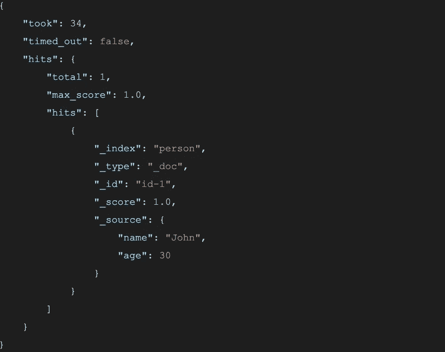

# 深入弹性搜索

> 原文：<https://towardsdatascience.com/dive-into-elasticsearch-fbf848e8cf08?source=collection_archive---------9----------------------->

这篇文章将帮助你对 ElasticSearch 有一个高层次的了解。我们将回顾能够覆盖一个典型项目至少 95%需求的主要功能。如果你是 ElasticSearch 的新手，在这篇文章中你会找到几乎所有问题的答案，这些问题是你在使用新数据库之前应该问的。


# 什么是 ElasticSearch？

Elasticsearch 是一个全文搜索引擎，存储无模式的 JSON 文档。Elasticsearch 是基于 [Apache Lucene](https://lucene.apache.org/) 的开源软件，在 Apache 2.0 许可下发布。ElasticSearch 可以处理任何类型的数据，包括文本、数字、地理空间、结构化和非结构化数据。

# 如何部署

你可以通过 Elasticsearch 服务(可在亚马逊网络服务(AWS)、谷歌云平台(GCP)和阿里云上使用)部署 Elasticsearch，也可以下载并安装在你的硬件上或云中。

[文档](https://www.elastic.co/guide/en/elasticsearch/reference/current/install-elasticsearch.html#install-elasticsearch)有关于如何手动下载和安装数据库的说明。

此外，您可以使用 Docker 轻松安装 Elasticsearch:

## 1.提取图像:

```
docker pull docker.elastic.co/elasticsearch/elasticsearch:7.4.0
```

在编写本示例时，版本 7.4.0 是最新的。在官方网站上查看当前版本。

## 2.在开发模式下运行映像:

```
docker run -p 9200:9200 -p 9300:9300 -e “discovery.type=single-node” docker.elastic.co/elasticsearch/elasticsearch:7.4.0
```

看看[官方文档](https://www.elastic.co/guide/en/elasticsearch/reference/current/docker.html)中的更多选项。

# 弹性搜索是如何工作的

Elasticsearch 将文档存储在索引中。就关系数据库而言:索引是一个表，文档是表中的一行。索引是无模式的，所以您可以放置具有不同结构的文档，但是对于键有映射和限制，我们稍后将概述这些限制。

关于 ElasticSearch 的工作原理:

1.  当您插入某个文档时，ElasticSearch 将文档字段的值拆分为记号(例如，句子中的每个单词可以是不同的记号)，并将这些记号添加到倒排索引中。
2.  当用户搜索某个短语时，ElasticSearch 会将该短语拆分成标记，并将这些标记与倒排索引进行匹配。

如果你不知道什么是倒排索引，它是如何工作的，你可以在这里阅读[倒排索引的简要说明](https://medium.com/@igorkopanev/a-brief-explanation-of-the-inverted-index-f082993f8605)或者查阅[官方文档](https://www.elastic.co/guide/en/elasticsearch/reference/current/documents-indices.html)。

# 缩放比例

Elasticsearch 是分布式软件，这意味着您可以以集群模式运行 Elasticsearch，其中每个计算节点将托管一个或多个碎片，并作为协调者将操作委托给正确的碎片。Elasticsearch 支持两种最流行的扩展方法，比如分区和复制。

## 分割

ElasticSearch 索引将被存储到两个或多个分片上。您索引的数据将存储在集群中的一个碎片上。

## 分身术

ElasticSearch 有一个主碎片和至少一个副本碎片。您索引的数据被写入主碎片和副本碎片。复制副本是主副本的精确拷贝。如果包含主碎片的节点出现故障，副本将接管。


# 索引

索引是无模式存储，但是您也可以为索引建立严格的文档模式。

## 创建新索引

```
curl -X PUT [http://localhost:9200/person](http://localhost:9200/person)
```

该命令将创建一个名为“ *person* ”的新的无模式索引，或者如果该索引已经存在，将返回一个错误。

## 查看索引信息

```
curl -X GET [http://localhost:9200/person](http://localhost:9200/person)
```

作为响应，您将看到索引的设置、映射和别名。如果索引不存在，则显示错误消息。

# 模式或映射

映射是对文档及其包含的字段如何在索引中存储和索引的描述。例如，在映射中，您可以定义以下内容:

*   文档的结构(字段和这些字段的数据类型)
*   如何在索引前转换值
*   哪些字段用于全文搜索

## 使用自定义映射创建索引

```
curl -X PUT [http://localhost:9200/person](http://localhost:9200/person) \
-H ‘Content-Type: application/json’ \
-d ‘{
      **“mappings”: {
        “dynamic”: “strict”,
        “properties”: {
          “name”: {“type”: “text”},
          “email”: {“type”: “text”},
          “location”: {“type”: “geo_shape”},
          “extra_data”: {“type”: “object”, “dynamic”: true}
        }
      }**
}’
```

在这个例子中，您将为具有静态根结构的文档创建映射。一个字段将是一个动态对象，它可以包含任意数量的任意字段(键的数量受索引设置的限制)。

## 查看现有索引的映射

```
curl -X GET [http://localhost:9200/person](http://localhost:9200/person)
```

API 将返回上一个示例中的现有映射。

## 数据类型

ElasticSearch 支持许多不同的数据类型，以便对这些类型执行特定的搜索。让我们列出最常用的类型:

*   核心数据类型:字符串(文本和关键字)、数字(整数、浮点等)、日期、布尔、二进制等
*   复杂，像对象(hashmap(dictionary))和嵌套(链表(array))
*   特定数据类型，例如，地理形状、IP 等。

每种数据类型都有自己的目标和设置。因此，请查看[文档](https://www.elastic.co/guide/en/elasticsearch/reference/current/mapping-types.html)，了解每种类型的更多信息。

注意了。字符串数据类型有两种:[文本](https://www.elastic.co/guide/en/elasticsearch/reference/current/text.html)和[关键词](https://www.elastic.co/guide/en/elasticsearch/reference/current/keyword.html)。“*文本*”用于全文搜索(通常在文本中搜索，具有模糊性和其他特征)，“*关键字*”用于聚合、排序和直接匹配(类似于编程语言中的运算符“==”)。

# 将数据插入索引

## 插入单个文档

```
curl -X POST [http://localhost:9200/person/_doc](http://localhost:9200/person/_doc) \
-H ‘Content-Type: application/json’ \
-d ‘{**“name”: “John”, “age”: 30}**’
```

如果成功，该请求将返回生成的 id 和其他信息。但是您总是可以自己指定 id:

```
curl -X POST [http://localhost:9200/person/_doc/id-1](http://localhost:9200/person/_doc/id-1) \
-H ‘Content-Type: application/json’ \
-d ‘**{“name”: “Katrin”, “age”: 25}**’
```

## 批量插入到一个索引中

```
curl -X POST [http://localhost:9200/person/_doc/_bulk](http://localhost:9200/person/_doc/_bulk) \
-H ‘Content-Type: application/json’ \
-d ‘**{ “index”:{} }
 { “name”:”Alex”,”age”:25 } 
 { “index”:{} }
 { “key1”:”Amely”,”age”:27 }**
 ‘
```

注意:批量添加应该以换行符结束。

## 批量插入到不同的索引中

```
curl -X POST [http://localhost:9200/_bulk](http://localhost:9200/_bulk) \
-H ‘Content-Type: application/json’ \
-d ‘**{ “index”:{“_index”: “person”} }
{ “name”:”Jack”,”age”: 34 }
{ “index”:{“_index”: “person”} }
{ “name”:”Oscar”,”age”:22 }
{ “index”:{“_index”: “person”} }
{ “name”:”John”,”age”:27 }**
‘
```

## 文档的类型

在插入的 URI 中，可以看到“ */_doc/* ”部分。这是文档的类型，但这是从 ElasticSearch 第 6 版开始弃用的东西[。](https://www.elastic.co/guide/en/elasticsearch/reference/current/removal-of-types.html)

# 更新文档

```
curl -X POST [http://localhost:9200/person/_update/id-1](http://localhost:9200/person/_update/id-1) \
-H ‘Content-Type: application/json’ \
-d ‘**{“age”: 24}**’
```

这是更新一个文档中一个字段的简单例子。Elasticsearch 支持针对复杂案例的更复杂的查询，因此[查看文档](https://www.elastic.co/guide/en/elasticsearch/reference/current/docs-update.html)以了解更多信息。


# 搜索查询

你知道，为了搜索。您可以在那里找出所有支持查询的列表和这些查询的描述[。在本文中，我们将回顾最流行的查询，它可以覆盖一个典型项目中 95%的用例。](https://www.elastic.co/guide/en/elasticsearch/reference/current/query-dsl.html)

## 将所有字段与文本匹配

```
curl -X GET [http://localhost:9200/person/**_search?q=john**](http://localhost:9200/person/_search?q=john)
```

该查询将在任何字段中查找令牌。

## 全部匹配

```
curl -X GET [http://localhost:9200/person/_search](http://localhost:9200/person/_search) \
-H ‘Content-Type: application/json’ \
-d ‘{
    **“query”: {“match_all”: {}}** }’
```

只返回所有按 id 排序的文档。

## 匹配一个

```
curl -X GET [http://localhost:9200/person/_search](http://localhost:9200/person/_search) \
-H ‘Content-Type: application/json’ \
-d ‘{
  **“query”: {
    “match”: {
      “name”: “John Snow”
    }
   }** }’
```

“匹配”是在特定的字段中寻找特定的令牌。在这个例子中，我写了两个标记，这意味着我们要查找在字段“name”中包含标记“John”和/或标记“Snow”的文档。
本例仅适用于一个字段，要通过多个字段进行搜索，您需要另一个查询。

## 匹配短语

```
curl -X GET [http://localhost:9200/person/_search](http://localhost:9200/person/_search) \
-H ‘Content-Type: application/json’ \
-d ‘{
  **“query”: {
    “match_phrase”: {
       “name”: “John Snow”
    }
  }** }’
```

本示例与上一个示例的不同之处在于，本示例将在字段中查找完整的短语(在本示例中，将是两个标记" *john* "和" *snow* "，它们是一个接一个的)，并且仅当找到该短语时才返回结果。

如果您向简单的“*匹配*”发送两个或更多令牌，即使只找到一个令牌，您也会收到结果，但在“*匹配 _ 短语*”的情况下，您将不会收到结果。

## 多重匹配

```
curl -X GET [http://localhost:9200/person/_search](http://localhost:9200/person/_search) \
-H ‘Content-Type: application/json’ \
-d ‘{
    **“query”: {
      “multi_match”: {
        “query”: “John”,
        “fields”: [“name”, “age”],
        “fuzzines”: 3,
       }
     }** }’
```

在这种情况下，我们在所有指定的字段中寻找一个令牌。多匹配查询支持参数“模糊性”，这允许在标记中使用输入错误进行搜索。阅读更多[那里](https://www.elastic.co/guide/en/elasticsearch/reference/current/query-dsl-multi-match-query.html)。

## 学期

```
curl -X GET [http://localhost:9200/person/_search](http://localhost:9200/person/_search) \
-H ‘Content-Type: application/json’ \
-d ‘{
 **“query”: {
   “term”: {
     “name”: {
       “value”: “John”
     }
   }
 }** }’
```

返回字段中包含精确值的文档。意思是，单据中的字段“*名称*应该正好是“*约翰*”才能返回该单据。

## 模糊的

```
curl -X GET [http://localhost:9200/person/_search](http://localhost:9200/person/_search) \
-H ‘Content-Type: application/json’ \
-d ‘{
 **“query”: {
    “fuzzy”: {
      “name”: {
        “value”: “Jahn”
      }
    }
 }** }’
```

返回包含与搜索值相似的文档。这意味着，可搜索的值可以有一个错别字，就像在这个例子中。

# 查看搜索查询的典型响应

如果您懒得复制粘贴查询，您可以在这里查看典型响应的正文:



Body of the typical response from ElasticSearch

在响应中，您会收到一个对象，它是字段" *hits* ，由内部键" *hits* "中所有匹配的文档组成，在这个键下，您还可以找到" *total* "和" *max_score* "，它们由返回的文档中匹配记录的总数和最大分数的信息组成。每个文档记录包括“ *_source* ”以及文档数据和系统字段，如索引、类型、id 和评分。

# 结果排名

## 给结果打分

文档的评分是基于指定查询的字段匹配和应用于搜索的任何附加配置来确定的。在那篇文章中，你可以找到关于 ElasticSearch 评分工作方式的很好的描述。此外，ElasticSearch 允许您指定自定义排名功能。[阅读更多那里](https://www.elastic.co/guide/en/elasticsearch/reference/current/query-dsl-function-score-query.html)。

## 提高分数

如果您通过多个字段进行搜索，并且您认为某些字段比其他字段更重要，您可以提高更重要字段的分数。

提高分数意味着，如果某些字段给你的分数是 3，而你将这个字段的分数提高到 x2，那么这个字段的总分数就是 6 (3*2)。

您可以直接在查询中设置 boost。例如，对于 *multi_match* 搜索，要将 boosting x2 设置为字段“key 1 ”, X5 设置为字段“key2 ”,应按照以下格式指定字段:

```
“fields”: [“name^2”, “age^5”]
```

对于其他查询，您可以在搜索查询对象中添加一个关键字“boost”。例如:

```
“fuzzy”: {“name”: {“value”: “John”, “boost”: 2}}
```

## 按某个字段对结果进行排序

当然，您可以按任何字段对结果进行排序，而不是按分数。看看下面的例子:

```
curl -X GET [http://localhost:9200/person/_search](http://localhost:9200/person/_search) \
-H ‘Content-Type: application/json’ \
-d ‘{
  **“sort”: [
    {“age”: {“order”: “asc”}},
    {“name”: {“order”: “desc”}},
  ],
  “query”: {“match_all”: {}}** }’
```

在按字段排序的情况下，所有结果将为零分。

# AND-OR-NOT 或布尔查询

通常一个条件不足以得到相关的结果。因此，我们需要一些功能来聚合一个查询下的不同条件，进行连接和析取或排除一些结果。就弹性搜索而言，这些类型的查询称为[布尔查询](https://www.elastic.co/guide/en/elasticsearch/reference/current/query-dsl-bool-query.html):

## 必须(和)

*必须*的作用类似于和。这意味着操作符中的每个查询都必须出现在文档中。

## 过滤器(不影响评分)

“Filter”的作用类似于“must”，但不会增加结果分数的权重。

## 应该(或)

工作方式类似于或。如果我们在“ *should* ”下有两个条件，我们将接收所有有第一个或第二个条件的文件。此字段影响评分，这意味着匹配所有条件的文档将比仅匹配一个条件的文档得分更高。

## Must_not(不)

工作起来不像。与“must_not”下的条件匹配的文档不得出现在结果中。


# 极限和偏移

在现实世界中，我们经常需要存储结果的一些限制和偏移。例如，要跳过前 5 个文档以显示接下来的 10 个文档，您需要以下查询:

```
curl -X GET [http://localhost:9200/person/_search](http://localhost:9200/person/_search) \
-H ‘Content-Type: application/json’ \
-d ‘{
   **“from” : 5,
   “size” : 10,**
   “query”: {
     “match_all”: {} 
   }
}’
```

# 分析器

在将文档插入索引之前，ElasticSearch 会运行分析来准备数据。分析是将文本转换为标记的过程，这些标记将被添加到倒排索引中进行搜索。分析由分析仪执行，分析仪可以是内置的或定制的。默认情况下，ElasticSearch 为每个索引设置了[标准分析器](https://www.elastic.co/guide/en/elasticsearch/reference/current/analysis-standard-analyzer.html)。你可以使用分析器将表情符号替换为文本，删除特殊字符，删除停用词等等。

# 聚集

ElasticSearch 支持很多聚合框架，帮助你基于搜索查询聚合数据。聚合可用于构建索引的分析信息，或返回唯一值，或检查某个字段中的最小/平均/最大值，或其他内容。查看[文档，查看所有 Elasticsearch 的内置聚合](https://www.elastic.co/guide/en/elasticsearch/reference/current/search-aggregations.html)。可以将许多聚合合并到一个查询中。让我们概述一下构建聚合查询有多容易:

```
curl -X GET [http://localhost:9200/person/_search](http://localhost:9200/person/_search) \
-H ‘Content-Type: application/json’ \
-d ‘{
  **“aggs” : {
    “avg_age_key” : { “avg” : { “field” : “age” } },
    “max_age_key” : { “max” : { “field” : “age” } },
    “min_age_key” : { “min” : { “field” : “age” } },
    “uniq_age_key” : { “terms” : { “field” : “age” } }
  }**
}’
```

在这个例子中，我将 4 个聚合命令放入一个查询中。很容易理解这些聚合各自的作用。在响应中，您将在响应对象底部的关键字“ *aggregations* ”下找到您的聚合结果。

# MapReduce

聚合允许您对索引进行良好的分析。但是，如果你需要对大型 Elasticsearch 集群上的大量数据进行复杂的分析，换句话说，你有大数据，Elasticsearch 为你提供了一个在索引上运行 MapReduce 作业的机会。看看[官方文档](https://www.elastic.co/guide/en/elasticsearch/hadoop/current/mapreduce.html)了解更多。

# 处理

ElasticSearch 不支持交易。

# 摘要

所有列出的优点和功能允许在许多不同的情况下使用 Elasticsearch:

*   应用程序和网站搜索
*   企业搜索
*   日志记录和日志分析
*   监控许多指标
*   地理空间数据分析和可视化
*   安全或业务分析

而很多基于 ElasticSearch 的现成产品(如 Kibana、Elastic Stack 等)让你花更少的钱和更少的时间来开发你的解决方案。