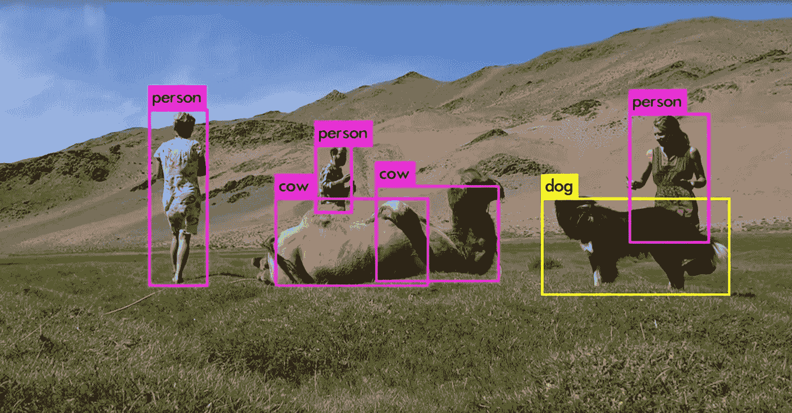
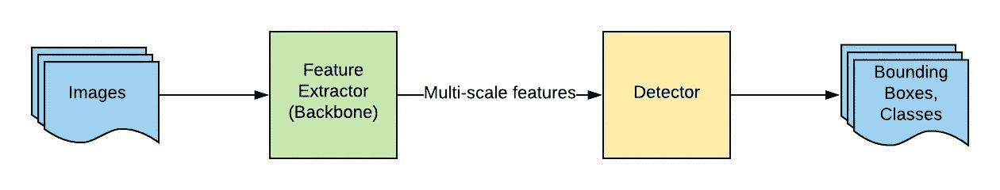
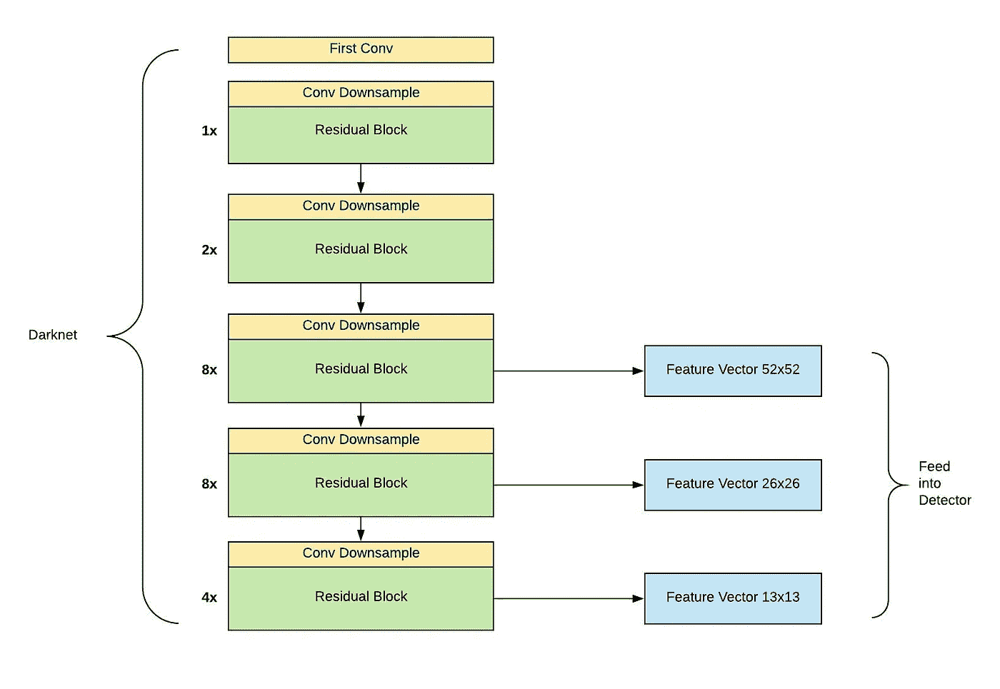
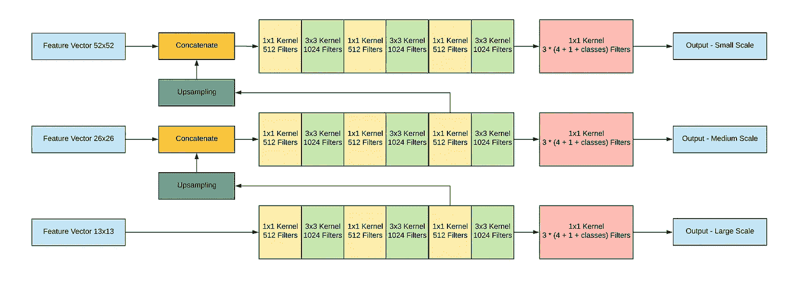
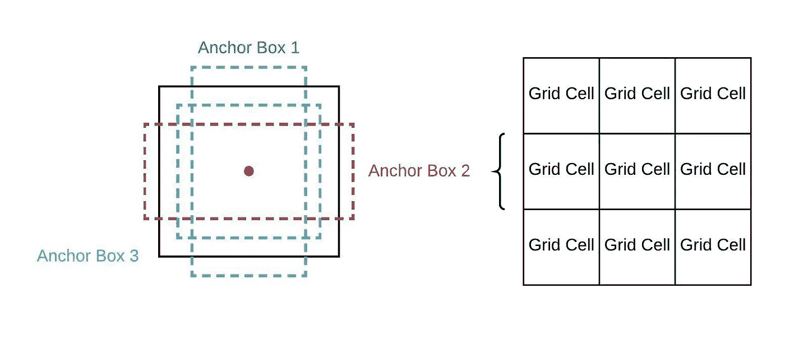
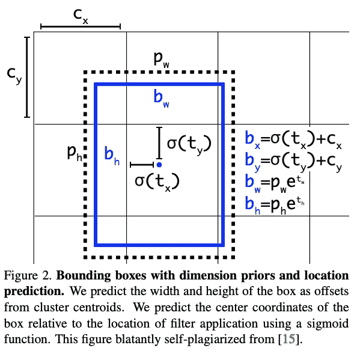

# 深入了解 YOLO v3:初学者指南

> 原文：<https://towardsdatascience.com/dive-really-deep-into-yolo-v3-a-beginners-guide-9e3d2666280e?source=collection_archive---------1----------------------->



Screenshot from a video made by [Joseph Redmon](https://www.youtube.com/channel/UClVWrKrmoeNM7A9nkEMeYzA) on [Youtube](https://www.youtube.com/watch?v=MPU2HistivI)

*原载于 2019 年 12 月 30 日*[*https://www . yanjia . Li*](https://yanjia.li/dive-really-deep-into-yolo-v3-a-beginners-guide/)*。*

> *完整源代码请前往*[*https://github . com/ethanyangali/deep-vision/tree/master/YOLO/tensor flow*](https://github.com/ethanyanjiali/deep-vision/tree/master/YOLO/tensorflow)*。我真的很感谢你的明星支持我的努力。*

# 序

当自动驾驶汽车在道路上行驶时，它是如何知道摄像头图像中其他车辆的位置的？当人工智能放射科医生阅读 x 光片时，它如何知道病变(异常组织)在哪里？今天，我将通过这个迷人的算法，它可以识别给定图像的类别，还可以定位感兴趣的区域。近年来，有许多算法被引入到深度学习方法中来解决对象检测问题，如 R-CNN，Faster-RCNN 和 Single Shot Detector。其中，我最感兴趣的是一个叫 YOLO 的模特——你只会看一眼。这款车型如此吸引我，不仅是因为它有趣的名字，还有一些对我来说真正有意义的实用设计。2018 年，该型号的最新 V3 已经发布，它实现了许多新的最先进的性能。因为我以前编写过一些 GANs 和图像分类网络，而且 Joseph Redmon 在论文中以一种非常简单的方式描述了它，所以我认为这个检测器只是 CNN 和 FC 层的另一个堆栈，只是神奇地工作得很好。

但我错了。

也许是因为我比一般的工程师更笨，我发现对我来说把这个模型从纸上翻译成实际代码真的很难。即使我在几周内成功做到了这一点(有一次我放弃了，把它放了几个星期)，我发现让它工作起来对我来说更加困难。有很多关于 YOLO V3 的博客，GitHub repos，但大多数只是给出了架构的一个非常高层次的概述，不知何故他们就成功了。更糟糕的是，论文本身太冷了，它没有提供实现的许多关键细节，我不得不阅读作者最初的 C 实现(我最后一次编写 C 是什么时候？也许在大学？)来证实我的一些猜测。当有一个 bug 时，我通常不知道它为什么会出现。然后，我最终一步一步地手动调试它，并用我的小计算器计算那些公式。

还好这次我没有放弃，终于成功了。但与此同时，我也强烈地感觉到，互联网上应该有一个更全面的指南来帮助像我这样的哑巴理解这个系统的每个细节。毕竟，如果一个细节出错，整个系统将很快崩溃。我敢肯定，如果我不写下来，我也会在几周内忘记所有这些。所以，我在这里，给你呈现这个“深入 YOLO V3:初学者指南”。我希望你会喜欢它。

# 先决条件

在进入网络本身之前，我需要先澄清一些先决条件。作为读者，你应该:

1.了解卷积神经网络和深度学习的基础知识
2。了解物体探测任务
3 的思路。对算法内部如何工作有好奇心

如果你在前两项上需要帮助，有很多优秀的资源，如 [Udacity 计算机视觉纳米学位](https://www.udacity.com/course/computer-vision-nanodegree--nd891)、 [Cousera 深度学习专业化](https://www.coursera.org/specializations/deep-learning)和 [Stanford CS231n](http://cs231n.stanford.edu/)
如果你只是想构建一些东西来用你的自定义数据集快速检测一些对象，请查看这个 [Tensorflow 对象检测 API](https://github.com/tensorflow/models/tree/master/research/object_detection)

# YOLO V3

YOLO V3 是对以前的 YOLO 检测网络的改进。与以前的版本相比，它具有多尺度检测，更强的特征提取网络，以及损失函数的一些变化。因此，这个网络现在可以探测到更多的目标，从大到小。当然，就像其他单次检测器一样，YOLO V3 运行速度也很快，并使实时推断在 GPU 设备上成为可能。嗯，作为一个物体检测的初学者，你可能没有一个清晰的图像，他们在这里意味着什么。但是你会在我后面的文章中逐渐理解它们。目前，只要记住 YOLO V3 是截至 2019 年实时对象检测方面最好的模型之一。

## **网络架构**



Diagram by myself

首先，让我们来谈谈这个网络在高层次图中看起来是什么样子(尽管，网络架构是实现中最不耗时的部分)。整个系统可以分为两大部分:特征提取器和检测器；两者都是多尺度。当一幅新图像进来时，它首先通过特征提取器，这样我们可以在三个(或更多)不同的尺度上获得特征嵌入。然后，这些特征被馈入检测器的三个(或更多)分支，以获得包围盒和类别信息。

**暗网-53**

YOLO V3 使用的特征提取器被称为 Darknet-53。你可能对 YOLO·V1 之前的暗网版本很熟悉，那里只有 19 层。但那是几年前的事了，图像分类网络已经从仅仅是深层次的堆叠发展了很多。ResNet 带来了跳过连接的想法，以帮助激活通过更深的层传播，而不会减少梯度。Darknet-53 借用了这一思想，成功地将网络从 19 层扩展到 53 层，从下图可以看出。


Diagram from `[YOLOv3: An Incremental Improvement](https://arxiv.org/abs/1804.02767)`

这个很好理解。将每个矩形中的层视为残余块。整个网络是一个由多个模块组成的链，在模块之间有两个 Conv 层以减少维度。在块内部，只有一个瓶颈结构(1x1 后跟 3x3)加上一个跳过连接。如果目标是像 ImageNet 一样进行多类分类，将添加一个平均池和 1000 路完全连接层以及 softmax 激活。

但是，在对象检测的情况下，我们不会包括这个分类头。相反，我们将为这个特征提取器添加一个“检测”头。由于 YOLO V3 被设计为多尺度检测机，我们也需要多尺度的特征。因此，来自最后三个残差块的特征都被用于后面的检测。在下图中，我假设输入是 416x416，因此三个比例向量将是 52x52、26x26 和 13x13。请注意，如果输入尺寸不同，输出尺寸也会不同。



Diagram by myself

**多尺度探测器**

一旦我们有了三个特征向量，我们现在可以将它们输入到检测器中。但是我们应该如何构造这个探测器呢？不幸的是，作者在这篇论文中没有解释这一部分。但是我们仍然可以看看他在 Github 上发布的源代码。通过这个[配置文件](https://github.com/pjreddie/darknet/blob/master/cfg/yolov3.cfg#L549)，在最终的 1x1 Conv 层之前使用多个 1x1 和 3x3 Conv 层来形成最终输出。对于中比例尺和小比例尺，它还会连接先前比例尺的要素。通过这样做，小规模检测也可以受益于大规模检测的结果。



Diagram by myself

假设输入图像为(416，416，3)，检测器的最终输出将为 *[(52，52，3，(4 + 1 +数量类))，(26，26，3，(4 + 1 +数量类))，(13，13，3，(4 + 1 +数量类))]。*列表中的三个项目代表三种秤的检测。但是这个*52 x 52 x 3 x(4+1+num _ classes)*矩阵中的单元格是什么意思呢？好问题。这就把我们带到了 2019 年前物体检测算法中最重要的概念:锚盒(prior box)。

**锚箱**

物体检测的目标是得到一个包围盒和它的类。包围盒通常以一种标准化的 xmin，ymin，xmax，ymax 格式表示。例如，0.5 xmin 和 0.5 ymin 表示框的左上角在图像的中间。直观上，如果我们想得到一个像 0.5 这样的数值，就面临着一个回归问题。我们还不如让网络预测值，并使用均方差来与实际情况进行比较。然而，由于盒子的比例和长宽比的差异很大，研究人员发现，如果我们只是使用这种“暴力”的方式来获得一个包围盒，网络真的很难收敛。因此，在 fast-RCNN 论文中，提出了锚盒的概念。

锚定框是先前的框，其可以具有不同的预定义纵横比。这些纵横比在训练之前通过在整个数据集上运行 K-means 来确定。但是盒子固定在哪里呢？我们需要引入一个叫做网格的新概念。在“古老”的 2013 年，算法通过使用一个窗口滑过整个图像并在每个窗口上运行图像分类来检测对象。然而，这是如此低效，以至于研究人员提议使用 Conv 网一次性计算整个图像(从技术上讲，只有当你并行运行卷积核时。)由于卷积输出特征值的正方形矩阵(如 YOLO 的 13×13、26×26 和 52×52)，我们将该矩阵定义为“网格”，并为网格的每个单元分配锚框。换句话说，定位框定位到网格单元，它们共享同一个质心。一旦我们定义了这些锚，我们就可以确定基础事实框与锚框有多少重叠，并选择具有最佳 IOU 的一个并将它们耦合在一起。我猜你也可以声称地面真相箱锚定到这个锚定箱。在我们后面的训练中，我们现在可以预测这些边界框的偏移，而不是预测来自西部的坐标。这是因为我们的地面真相框应该看起来像我们选择的锚框，只需要细微的调整，这给了我们一个很好的训练开端。



Diagram by myself

在 YOLO v3 中，每个网格单元有三个锚盒。我们有三个等级的网格。因此，我们将为每个秤配备 52x52x3、26x26x3 和 13x13x3 锚盒。对于每个锚盒，我们需要预测 3 件事:

1.相对于锚箱的位置偏移: *tx，ty，tw，th* 。这有 4 个值。
2。指示此框是否包含对象的对象性分数。这有 1 个值。
3。类别概率告诉我们这个盒子属于哪个类别。这有 num_classes 个值。

总的来说，我们为一个锚盒预测了 *4 + 1 + num_classes* 个值，这就是为什么我们的网络输出一个形状为*52x 52 x3x(4+1+num _ classes)*的矩阵，正如我之前提到的。 *tx，ty，tw，th* 不是边界框的真实坐标。这只是相对于特定锚盒的相对偏移量。我会在后面的损失函数部分解释这三个预测。

Anchor box 不仅使检测器的实现变得更加困难和容易出错，而且如果你想得到最好的结果，它还在训练之前引入了一个额外的步骤。所以，就我个人而言，我非常讨厌它，觉得这个锚箱的想法更像是一个黑客，而不是一个真正的解决方案。2018 年和 2019 年，研究人员开始质疑锚盒的必要性。像 CornerNet、Object as Points 和 FCOS 这样的论文都讨论了在没有锚盒帮助的情况下从头训练对象检测器的可能性。

## 损失函数

有了最终的检测输出，我们现在可以计算相对于地面真实标签的损失。损失函数包括四个部分(或者五个，如果你分开 noobj 和 obj):质心(xy)损失、宽度和高度(wh)损失、对象(obj 和 noobj)损失和分类损失。放在一起时，公式是这样的:

```
Loss = Lambda_Coord * Sum(Mean_Square_Error((tx, ty), (tx’, ty’) * obj_mask)
 + Lambda_Coord * Sum(Mean_Square_Error((tw, th), (tw’, th’) * obj_mask)
 + Sum(Binary_Cross_Entropy(obj, obj’) * obj_mask) + Lambda_Noobj * Sum(Binary_Cross_Entropy(obj, obj’) * (1 -obj_mask) * ignore_mask)
 + Sum(Binary_Cross_Entropy(class, class’))
```

这看起来很吓人，但是让我把它们一一分解并解释。

```
xy_loss = Lambda_Coord * Sum(Mean_Square_Error((tx, ty), (tx’, ty’)) * obj_mask)
```

第一部分是包围盒形心的损失。 *tx* 和 *ty* 是相对于地面的质心位置。 *tx'* 和 *ty'* 是直接来自检测器的质心预测。这种损失越小，预测和地面实况的质心就越接近。由于这是一个回归问题，我们在这里使用均方差。此外，如果对于某些细胞没有来自地面真理的对象，我们不需要将该细胞的损失包括在最终损失中。因此我们在这里也乘以 *obj_mask* 。 *obj_mask* 为 1 或 0，表示是否有物体。事实上，我们可以使用 *obj* 作为 *obj_mask* ， *obj* 是我将在后面介绍的客观性分数。需要注意的一点是，我们需要对地面实况进行一些计算，以得到这个 *tx* 和 *ty* 。所以，我们先来看看如何得到这个值。正如作者在论文中所说:

```
bx = sigmoid(tx) + Cx
by = sigmoid(ty) + Cy
```

这里的 *bx* 和 *by* 是我们通常用来作为质心位置的绝对值。例如， *bx = 0.5，by = 0.5* 表示这个盒子的质心就是整个图像的中心。然而，由于我们要计算锚点的质心，我们的网络实际上是预测相对于网格单元左上角的质心。为什么是网格单元？因为每个锚定框都绑定到一个网格单元，所以它们共享同一个质心。所以对网格单元的差异可以代表对锚盒的差异。在上面的公式中， *sigmoid(tx)* 和 *sigmoid(ty)* 是相对于网格单元的质心位置。例如， *sigmoid(tx) = 0.5，sigmoid(ty) = 0.5* 表示质心是当前网格单元的中心(但不是整个图像)。 *Cx* 和 *Cy* 代表当前网格单元左上角的绝对位置。因此，如果网格单元是网格 13x13 的第二行第二列中的单元，那么 *Cx = 1，Cy = 1* 。而如果我们将这个网格单元位置加上相对质心位置，我们将得到绝对质心位置 *bx = 0.5 + 1* 和 *by = 0.5 + 1* 。当然，作者不会告诉你，你也需要通过除以网格大小来归一化，所以真正的 *bx* 将是 *1.5/13 = 0.115* 。好了，现在我们理解了上面的公式，我们只需要把它反过来，这样我们就可以从 *bx* 得到 *tx* ，以便把我们原来的地面真相翻译成目标标签。最后， *Lambda_Coord* 是 Joe 在 YOLO v1 论文中引入的权重。这是更强调本地化而不是分类。他建议的值是 5。



Diagram from `[YOLOv3: An Incremental Improvement](https://arxiv.org/abs/1804.02767)`

```
wh_loss = Lambda_Coord * Sum(Mean_Square_Error((tw, th), (tw’, th’)) * obj_mask)
```

下一个是宽度和高度的损失。再次，作者说:

```
bw = exp(tw) * pw
bh = exp(th) * ph
```

这里 *bw* 和 *bh* 仍然是整个图像的绝对宽度和高度。 *pw* 和 *ph* 是前一个盒子的宽度和高度(又名。锚箱，为什么有这么多名字)。我们在这里取 *e^(tw)* 是因为 *tw* 可能是负数，但是在现实世界中宽度不会是负数。所以这个 *exp()* 会让它为正。并且我们乘以先前的框宽度 *pw* 和 *ph* ，因为预测 *exp(tw)* 是基于锚框的。所以这个乘法给了我们真正的宽度。身高也一样。同样，我们可以在计算损耗时，将上面的公式反过来将 *bw* 和 *bh* 转化为 *tx* 和 *th* 。

```
obj_loss = Sum(Binary_Cross_Entropy(obj, obj’) * obj_mask)noobj_loss = Lambda_Noobj * Sum(Binary_Cross_Entropy(obj, obj’) * (1 — obj_mask) * ignore_mask)
```

第三项和第四项是客体性和非客体性得分损失。对象性表示当前单元格中有对象的可能性。与 YOLO v2 不同，这里我们将使用二进制交叉熵而不是均方误差。事实上，对于包含对象的单元格，objectness 始终为 1，对于不包含任何对象的单元格，object ness 始终为 0。通过测量这个 *obj_loss* ，我们可以逐渐教会网络检测感兴趣的区域。在此期间，我们不希望网络通过到处提出对象来欺骗我们。因此，我们需要 *noobj_loss* 来惩罚那些假阳性提议。我们通过用 *1-obj_mask* 屏蔽预测得到假阳性。` *ignore_mask* `用于确保我们只在当前框与地面真相框没有太多重叠时进行惩罚。如果有，我们倾向于更柔和，因为它实际上非常接近答案。正如我们从论文中看到的，“如果边界框先验不是最好的，但确实与地面真实对象重叠超过某个阈值，我们忽略预测。”由于在我们的基本事实中有比 obj 多得多的 noobj，我们也需要这个 Lambda_Noobj = 0.5 来确保网络不会被没有对象的单元所控制。

```
class_loss = Sum(Binary_Cross_Entropy(class, class’) * obj_mask)
```

最后一个损失是分类损失。如果总共有 80 个类，则*类*和*类'*将是具有 80 个值的独热编码向量。在 YOLO v3 中，它被更改为多标签分类，而不是多类分类。为什么？因为一些数据集可能包含分层或相关的标签，例如*女人*和*人*。因此，每个输出像元可能有不止一个类为真。相应地，我们也对每一类逐一应用二元交叉熵并求和，因为它们并不互斥。就像我们对其他损失所做的那样，我们也乘以这个 *obj_mask* ，以便我们只计算那些具有基础真值对象的单元格。

为了充分理解这种损失是如何发生的，我建议您用一个真实的网络预测和地面实况来手动浏览它们。用计算器(或 *tf.math* )计算损失真的能帮你抓住所有的本质细节。我自己做的，这帮助我找到了很多错误。毕竟，细节决定成败。

# 履行

如果我在这里停止写作，我的帖子将会像网络上的另一篇“YOLO v3 评论”。一旦您从上一节中理解了 YOLO v3 的一般概念，我们现在就可以开始探索我们 YOLO v3 之旅剩下的 90%了:实现。

## 结构

9 月底，谷歌终于发布了 TensorFlow 2.0.0。这对 TF 来说是一个迷人的里程碑。然而，新的设计并不一定意味着开发者的痛苦会减少。从 2019 年初开始，我就一直在玩 TF 2，因为我一直想以我为 PyTorch 所做的方式编写 TensorFlow 代码。如果不是因为 TensorFlow 强大的制作套件像 TF Serving，TF lite，还有 TF Board 等等。，我估计很多开发者不会为新项目选择 TF。因此，如果您对生产部署没有强烈的需求，我建议您在 PyTorch 甚至 MXNet 中实现 YOLO v3。然而，如果你下定决心坚持使用 TensorFlow，请继续阅读。

TensorFlow 2 正式让渴望模式成为一级公民。简而言之，您现在可以利用原生 Python 代码以动态模式运行图表，而不是使用 TensorFlow 特定的 API 在图表中进行计算。没有更多的图形编译和更容易的调试和控制流程。在性能更重要的情况下，还提供了一个方便的 *tf.function* decorator 来帮助将代码编译成静态图。但是，现实是，渴望模式和 *tf.function* 仍然有问题，或者有时没有很好地记录，这使得你在像 YOLO v3 这样复杂的系统中的生活更加艰难。此外，Keras 模型不是很灵活，而定制的训练循环仍然是相当实验性的。所以你用 TF 2 写 YOLO v3 最好的策略就是先从一个最小的工作模板开始，逐渐给这个外壳增加更多的逻辑。通过这样做，我们可以在错误隐藏在一个巨大的嵌套图中之前尽早失败并修复它。

## 资料组

除了要选择的框架，成功训练最重要的是数据集。在论文中，作者使用 MSCOCO 数据集来验证他的想法。事实上，这是一个很好的数据集，我们应该在这个基准数据集上为我们的模型争取一个好的精度。然而，像这样的大型数据集也可能隐藏代码中的一些错误。例如，如果损失没有下降，你如何知道它只是需要更多的时间来收敛，或者你的损失函数是错误的？即使使用 GPU，训练的速度仍然不够快，无法让你快速迭代和修复东西。因此，我建议您构建一个包含数十个图像的开发集，以确保您的代码首先看起来“工作”。另一种选择是使用 VOC 2007 数据集，它只有 2500 个训练图像。要使用 MSCOCO 或 VOC2007 数据集并创建 TF 记录，可以参考我这里的助手脚本: [MSCOCO](https://github.com/ethanyanjiali/deep-vision/tree/master/Datasets/MSCOCO/) ， [VOC2007](https://github.com/ethanyanjiali/deep-vision/tree/master/Datasets/VOC2007/)

## 预处理

预处理是指将原始数据转换成合适的网络输入格式的操作。对于图像分类任务，我们通常只需要调整图像的大小，并对标签进行一次性编码。但是对于 YOLO v3 来说，事情有点复杂。还记得我说过网络的输出就像*52 x 52 x3x(4+1+num _ classes)*有三种不同的尺度吗？由于我们需要计算基础事实和预测之间的差值，我们还需要首先将基础事实格式化成这样的矩阵。

对于每个真实边界框，我们需要选择最佳的比例和锚。例如，天空中的一个小风筝应该是小比例的(52x52)。如果风筝在图像中更像一个正方形，我们也应该选择那个比例中最正方形的锚。在 YOLO v3 中，作者为 3 个音阶提供了 9 个锚点。我们所需要做的就是选择一个最符合我们地面真相框的。当我实现这个时，我想我也需要锚盒的坐标来计算 IOU。事实上，你不需要。因为我们只是想知道哪个锚点最适合我们的基础真相框，所以我们可以假设所有锚点和基础真相框共享同一个质心。在这种假设下，匹配度就是重叠面积，可以通过*最小宽度*最小高度*来计算。

在转换过程中，还可以添加一些数据扩充，以增加虚拟训练集的多样性。例如，典型的增强包括随机翻转、随机裁剪和随机转换。然而，这些增强不会阻止您训练一个工作的检测器，所以我不会过多地讨论这个高级主题。

## 培养

经过这些讨论，你终于有机会运行“*python train . py”*开始你的模型训练了。这也是你遇到大多数 bug 的时候。当你被封锁时，你可以参考我的训练脚本[这里](https://github.com/ethanyanjiali/deep-vision/tree/master/YOLO/tensorflow/train.py)。同时，我想提供一些对我自己的训练有帮助的提示。

**楠的损失**

1.  检查你的学习率，确保它不会太高，以至于爆发你的梯度。
2.  检查二进制交叉熵中的 0，因为 ln(0)不是数字。您可以从(epsilon，1-epsilon)中截取值。
3.  找个例子，一步一步走过你的失落。找出你损失的哪一部分归南。例如，如果宽度/高度损失到 NaN，这可能是因为您从 *tw* 到 *bw* 的计算方法是错误的。

**亏损居高不下**

1.  试着提高自己的学习率，看看能不能降得更快。我的从 0.01 开始。但我也见过 1e-4 和 1e-5 的作品。
2.  想象你预处理过的基础事实，看看它是否有意义。我之前遇到的一个问题是，我的输出网格是在[y][x]而不是[x][y]，但是我的地面真相是反的。
3.  再一次，用一个真实的例子来说明你的损失。我在计算对象和类别概率之间的交叉熵时犯了一个错误。
4.  我的损失也保持在 50 个 MSCOCO 时代后的 40 左右。然而，结果并没有那么糟糕。
5.  仔细检查代码中的坐标格式。YOLO 需要 *xywh* (质心 x，质心 y，宽度和高度)，但大部分数据集都是以 *x1y1x2y2* (xmin，ymin，xmax，ymax)的形式出现。
6.  仔细检查你的网络架构。不要被一个名为“近距离观察 yolov 3-CyberAILab”的帖子中的图表误导。
7.  *TF . keras . loss . binary _ cross entropy*不是你需要的二进制交叉熵之和。

**损失较低，但预测失败**

1.  根据您的观察将 *lambda_coord* 或 *lambda_noobj* 调整到损耗。
2.  如果你在自己的数据集上训练，并且数据集相对较小，那么损失函数中的 obj_mask 就不会错误地去掉必要的元素。
3.  一次又一次，你的损失函数。计算损耗时，它使用单元格中的相对 xywh(也称为 *tx，ty，tw，th* )。不过，在计算忽略遮罩和 IOU 时，它会在整个图像中使用绝对 xywh。不要把它们混淆了。
4.  **损失很低，但是没有预测**
5.  如果您正在使用自定义数据集，请首先检查您的基础事实框的分布。盒子的数量和质量真的会影响网络学习(或欺骗)做什么。

在您的训练集上进行预测，看看您的模型是否至少可以在训练集上过度拟合。

1.  **多 GPU 训练**
2.  由于对象检测网络有如此多的参数要训练，因此拥有更多的计算能力总是更好的。然而，TensorFlow 2.0 到目前为止还没有对多 GPU 训练提供很大的支持。要在 TF 中做到这一点，你需要选择一个训练策略，比如 MirroredStrategy，就像我在这里做的。然后将数据集加载器也打包成分布式版本。对于分布式训练的一个警告是，每个批次产生的损失应该除以全局批次大小，因为我们将对所有 GPU 结果进行“减少总和”。例如，如果本地批量大小为 8，并且有 8 个 GPU，那么您的批量损失应该除以全局批量大小 64。一旦你把所有复制品的损耗加起来，最后的结果将是单个例子的平均损耗。

**后处理**

该检测系统的最后一个组件是后处理器。通常，后处理只是一些琐碎的事情，比如用人类可读的类文本替换机器可读的类 id。不过，在对象检测中，我们还有一个更关键的步骤要做，以获得最终的人类可读结果。这被称为非最大抑制。

## 让我们回忆一下我们的客观损失。当虚假提议与地面真相有很大重叠时，我们不会用 *noobj_loss* 来惩罚它。这鼓励网络预测接近的结果，以便我们可以更容易地训练它。此外，虽然在 YOLO 没有使用，但当使用滑动窗口方法时，多个窗口可以预测同一物体。为了消除这些重复的结果，聪明的研究人员设计了一种叫做非最大抑制(NMS)的算法。

NMS 的想法很简单。首先找出具有最佳置信度的检测框，将其添加到最终结果中，然后用该最佳框消除 IOU 超过特定阈值的所有其他框。接下来，你在剩下的盒子中选择另一个最有信心的盒子，重复做同样的事情，直到什么都没有了。在代码中，由于 TensorFlow 在大多数时候需要显式的形状，我们通常会定义一个最大的检测数，如果达到这个数就提前停止。在 YOLO v3 中，我们的分类不再相互排斥，一个检测可以有多个真实的类。然而，一些现有的 NMS 规范没有考虑到这一点，所以在使用时要小心。

结论


Photo by [Python Lessons](https://medium.com/@pythonlessons0) from [Analytics Vidhya](https://medium.com/analytics-vidhya/yolo-v3-theory-explained-33100f6d193)

YOLO v3 是人工智能崛起时代的杰作，也是 2010 年代卷积神经网络技术和技巧的优秀总结。虽然有许多像 Detectron 这样的交钥匙解决方案来简化制作探测器的过程，但对机器学习工程师来说，编写如此复杂的探测器的实践经验确实是一个很好的学习机会，因为仅仅阅读论文是远远不够的。就像雷伊·达里奥谈到他的哲学时说的那样:

# 痛苦加反思等于进步。

我希望我的文章可以成为您在实施 YOLO v3 的痛苦旅程中的一座灯塔，也许您也可以在以后与我们分享这一令人愉快的进展。如果你喜欢我的文章或者我的 YOLO v3 源代码，请⭐star⭐我的 [repo](https://github.com/ethanyanjiali/deep-vision/) ，那将是对我最大的支持。

> 参考

张子豪， [YoloV3 在 TensorFlow 2.0](https://github.com/zzh8829/yolov3-tf2) ，Github 中实现

# 杨云， [TensorFlow2.x-YOLOv3](https://github.com/YunYang1994/TensorFlow2.0-Examples/tree/master/4-Object_Detection/YOLOV3) ，Github

*   逍遥王可爱, [史上最详细的 Yolov3 边框预测分析](https://zhuanlan.zhihu.com/p/49995236), 知乎专栏
*   Joseph Redmon， [YOLOv3:增量改进](https://pjreddie.com/media/files/papers/YOLOv3.pdf)
*   约瑟夫·雷德蒙，阿里·法尔哈迪，YOLO9000:更好，更快，更强
*   约瑟夫·雷德蒙，桑托什·迪夫瓦拉，罗斯·吉斯克，阿里·法尔哈迪，[你只看一次:统一的实时物体检测](https://arxiv.org/abs/1506.02640)，2016 年 IEEE 计算机视觉与模式识别会议
*   Ayoosh Kathuria，[YOLO v3 有什么新内容？](/yolo-v3-object-detection-53fb7d3bfe6b)，走向数据科学
*   Python 课程， [YOLO v3 理论讲解](https://medium.com/analytics-vidhya/yolo-v3-theory-explained-33100f6d193)，分析 Vidhya
*   Ayoosh Kathuria, [What’s new in YOLO v3?](/yolo-v3-object-detection-53fb7d3bfe6b), Towards Data Science
*   Python Lessons, [YOLO v3 theory explained](https://medium.com/analytics-vidhya/yolo-v3-theory-explained-33100f6d193), Analytics Vidhya