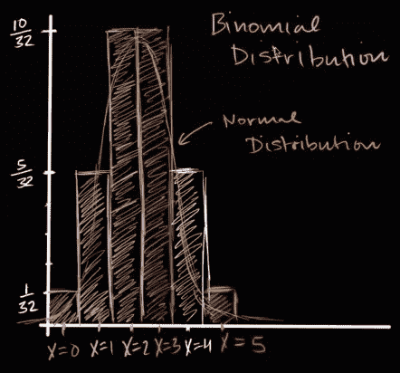

# 二项式随机变量的散度

> 原文：<https://towardsdatascience.com/divergence-in-binomial-random-variable-f56ba7242f7?source=collection_archive---------22----------------------->

Photo by [Eddie Zhang](https://unsplash.com/@eddie2023?utm_source=medium&utm_medium=referral) on [Unsplash](https://unsplash.com?utm_source=medium&utm_medium=referral)

在这篇文章中，我们将了解**因变量** **试验** **或样本**的数量如何影响二项变量。在进入这个主题之前，需要理解什么是二项随机变量。如果你不熟悉这个——请访问这个[帖子](https://medium.com/@dharmanathpatil/binomial-variable-9a924a1570a9)。在这篇文章中，我们将尝试回答两个问题

1.  "审判应该是相互独立的."对于二项随机变量，这个条件真的有必要吗？
2.  我们知道二项随机变量服从离散分布，有没有可能它也可以是连续分布？

在开始回答这些问题之前，让我们回忆一下二项式变量的**条件:**

1.  *试验应相互独立。*
2.  *每次试验都可以分为成功或失败。*
3.  *试验次数固定。*
4.  *每次试验的成功概率应保持不变。*

现在让我们看看个别问题:

## 1.审判应该是相互独立的

我们试着用一个例子来理解。考虑一个场景:假设我们想在一家食品超市进行一项调查，我们需要从三个不同的人那里获得关于他们是否购买了一种产品的反馈。*表示我们从一家食品超市的所有顾客中随机选择 3 个人，并询问他们是否购买了某种产品。假设商场中有 50%的人购买了该产品，商场中总共有 200 人，你会如何发现被选中的 3 个人购买该产品的概率是多少？*

在这种情况下，让我们定义 X =在由 200 名顾客中的 3 名反馈组成的**调查中购买该产品的人数。我们需要找到 p(X=3 ),即 200 人中随机选择的 3 个人购买该产品的概率。**

在这里，审判是“选人”。实验由固定数量的试验(称为反馈)组成，等于 3 次。如果有人购买了该产品，则可以认为试用成功。因此满足条件 2，3，4。条件 1 呢。让我们来研究一下:

比方说，我们决定收集走出商店的前 3 个人的反馈。据我们所知，商场里 50%的人都购买过这种产品。那么第一个人购买了该产品的概率是多少？它是 50%，即 100/200。现在让我们假设第一个人走出来，我们发现他已经买了这个产品。现在下一个人购买该产品的概率是多少？因为里面有 199 个人，所以是 99/199。**现在二审并不独立于一审。因此，它似乎不是二项分布**。为了使它独立，我们必须把第一个人送回超市，这不是一个好主意，因为我们不能仅仅因为我们希望我们的试验是独立的，就要求顾客回到店里。

**解决方案**:根据实验假设

> **如果样本量小于或等于总人口的 10%,则**试验**可视为独立的**

在上面的例子中，3 小于或等于 200 的 10%。因此，这些试验可以被视为独立的。不管第一个走出商店的人是谁，我们仍然可以认为这是一个独立的事件。

因此:p(X = 3)=(100/200)*(100/200)*(100/200)

## 2.有没有可能也可以是连续分布？

随着一个实验中的试验次数越来越多，这个分布看起来就像正态分布，它只不过是一个连续的变量分布。

在上述图示中，试验次数限制为 5 次。当试验趋于无穷大时，二项分布趋于正态分布。

## **结论**

在这篇文章中，我们了解到，如果试验数量小于或等于总人口的 10%,即使是相依试验也可能导致二项分布。我们还观察到随着试验次数的增加，二项分布如何接近正态分布。

寻找下一个后[几何随机变量](https://medium.com/@dharmanathpatil/geometric-random-variables-16028be5d9b1)