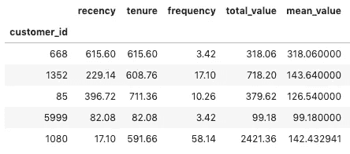
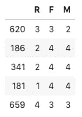
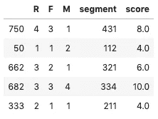
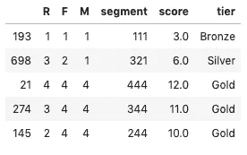

# 分而治之:使用 RFM 分析对你的客户进行细分

> 原文：<https://towardsdatascience.com/divide-and-conquer-segment-your-customers-using-rfm-analysis-68aee749adf6?source=collection_archive---------13----------------------->

## 使用 PYTHON 进行客户细分

## 了解如何使用 Python 和 RFM 对客户群进行细分，从而做出更好的商业决策


Photo by [Linh Pham](https://unsplash.com/@linharex?utm_source=medium&utm_medium=referral) on [Unsplash](https://unsplash.com?utm_source=medium&utm_medium=referral)

大多数经营在线业务的人必须知道从他们平台产生的用户数据中收集洞察力的重要性。了解一些可用性问题、客户偏好、一般购买行为等等。因此，如果你正在建立一个电子商务，存储你的订单、客户及其交易的数据是至关重要的。存储这些数据的主要目的之一是分析客户的行为，并据此设计更有利可图的策略。

在我们公司也没什么不同！我们有一个非常以数据为中心的文化，并一直在寻找新的方法，根据我们可以从中提取的信息来改进我们的产品。我们的核心产品之一是一款饮料配送应用程序，于 2019 年第二季度开始运营。有问题的应用程序是商店和当地生产商销售啤酒、葡萄酒、饮料和类似产品(如零食等)的市场。

由于我们是一家初创公司，而且该产品在市场上还比较新，因此它带来了一些独特的挑战，开发它是一个不断发展的过程。我们目前正在实施各种新功能和缺陷修复。然而，自我们发布以来生成的数据仍然是了解我们的客户以及平台本身的重要来源。

除此之外，将商业智能集成到系统中的追求也推动了这项工作。在这一系列文章中，我们将研究两种不同的方法，根据客户的相似性将他们分成不同的组:经典的 RFM 分析(在第一篇文章中探讨)和 K-Means 聚类(在后续文章中探讨)。

在本系列中，我们将尝试回答其中的一些问题:

*   现有的用户角色(组)是什么？
*   这些用户群有什么特征(平均票、频率、新近度、位置等。)?

当然，由于数据是专有的，并且包含一些敏感信息，我们无法提供原始数据集供您跟踪。除此之外，呈现的一些数据将被预先修改或标准化。

但是不要害怕！你可以在 [Kaggle](https://www.kaggle.com/) 上找到一些类似的数据集，比如 [*零售数据分析*](https://www.kaggle.com/manjeetsingh/retaildataset)**[*网上零售数据集*](https://www.kaggle.com/vijayuv/onlineretail) 和 [*零售交易数据*](https://www.kaggle.com/regivm/retailtransactiondata) 数据集。除此之外，这些文章的目的更多的是教你一些理论和编码，而不是数据和结果本身。**

**所以，让我们开始吧！**

# **一些先决条件**

**为了执行这个分析，我们使用了 Python 编程语言和一些基本的数据科学库。虽然并不严格要求您理解代码的所有部分，但是建议您至少对编程有一点了解。**

**考虑到这一点，下面是我们将在整个系列中使用的一些概念:**

*   **Python 以及对 Numpy、Pandas 和 Scikit 的一些基本了解——学习 APIs**
*   **一些统计(没什么太花哨的)；**
*   **基本了解一些机器学习概念和术语，如聚类**

**说完这些，让我们开始讨论吧**

# **首先，什么是分段，为什么需要分段**

**客户细分是发展成功业务的重要组成部分。客户有不同类型的需求，随着客户和交易基础的增长，了解他们每个人的需求变得越来越困难。在这一点上，你应该能够识别这些差异并采取行动。然而，有许多方法来执行这种分段。我们今天要谈论的是 RFM。**

**RFM 是选择重要客户最广泛使用的技术之一。这是一种非常流行的客户细分技术，它使用客户过去的购买行为，根据相似性将他们分成不同的组。**

**RFM 这个名字代表新近性、频率和货币价值。Recency (R)表示自客户最后一次购买以来的天数；频率(F)代表客户在被分析的时间范围内购买的次数；最后，货币(M)表示客户在同一时期花费的总金额。**

**在计算了每个客户的近期、频率和货币价值后，我们需要将他们分成 3 个或更多不同的类别。这样，我们可以根据这些类别对不同类型的客户进行排名。**

**让我们在一个更实际的场景中来看看，好吗？**

# **数据**

**我们将从一个数据集开始，该数据集包含在我们的平台上执行的单个订单的信息。数据以交易级别表示，即数据集的每一行包含与单个交易相关的特征，例如日期、时间、支付方式、进行购买的用户的客户端 id 等。**

**数据集的一些重要特征突出显示如下:**

*   ****order_id:** 订单的唯一标识符；**
*   ****store_id:** 订单所在店铺的 id；**
*   ****customer_id:** 执行订单的客户的 id；**
*   ****支付选项 id:** 所使用的支付选项的标识符；**
*   ****状态:**一个表示订单当前状态的整数；**
*   ****创建:**订单创建的日期和时间；**
*   ****修改日期:**订单状态上次修改的日期和时间**
*   ****shipping_price:** 自明**
*   ****total_price:** 订单总价，含运费**
*   ****纬度&经度**:订单送达的地点**

# **建造 RFM 餐桌**

**加载订单数据集后，我们需要对其进行分组和汇总，以获得每个客户的客户级数据，如订单数量、总支出、频率、最近等。有了这些信息，我们可以继续进行 RFM 分析。下面突出显示了用于加载数据集和执行分组的代码:**

```
**# load the order dataset
orders = pd.read_csv('data/orders-27-11-2019.csv')# convert 'created' and 'modified' columns to datetime 
orders['created'] = pd.to_datetime(orders['created'])
orders['modified'] = pd.to_datetime(orders['modified'])# create a snapshot date with today's date
snapshot_date = max(orders.created) + datetime.timedelta(days=1)# create functions to get recency and tenure
def get_recency(x):
    last_purchase = x.max()
    return (snapshot_date - last_purchase).days
def get_tenure(x):
    first_purchase = x.min()
    return (snapshot_date - first_purchase).days# aggregate data by the customers
customers = orders.groupby('customer_id').agg(
    recency=('created', get_recency),
    tenure=('created', get_tenure),
    frequency=('order_id', 'count'),
    total_value=('total_price', 'sum'),
    mean_value=('total_price', 'mean'),
)# show 5 samples of the grouped dataframe
customers.sample(5)**
```

****

****Figure 1:** customer level dataset**

**请记住，我们掩盖了真正的价值，所以这就是为什么他们中的一些人可能看起来很奇怪。还要注意的是，我们添加了两个之前没有讨论过的新列:表示客户第一次购买以来的时间的**保有权**和**平均值**，这是不言自明的。这两列将用于改进下一篇文章中介绍的集群。**

**我们需要做的下一件事是将**最近度**、**频率、**和**总值**分成我们之前讨论过的类别。对于我们的用例，我们决定将每个特性分成 4 个四分位数，大致将样本分成 4 个等比例的部分。我们分别把这些分数叫做 **R** 、 **F** 、 **M** 。用于执行此操作的代码如下所示:**

```
**# use only the necessary columns
rfm = customers[['customer_id', 'recency', 'frequency', 'total_value']]# recency quartile segmentation
r_labels = range(4, 0, -1)
recency = rfm['recency']
r_quartiles, bins = pd.qcut(recency, 4, labels=r_labels, retbins=True)
rfm = rfm.assign(R=r_quartiles.values)# frequency quartile segmentation
f_labels = range(1, 5)
frequency = rfm['frequency'].rank(method='first') # rank to deal with duplicate values
f_quartiles, bins = pd.qcut(frequency, 4, labels=f_labels, retbins=True)
rfm = rfm.assign(F = f_quartiles.values)# monetary value quartile segmentation
m_labels = range(1, 5)
monetary = rfm['total_value']
m_quartiles, bins = pd.qcut(monetary, 4, labels=m_labels, retbins=True)
rfm = rfm.assign(M = m_quartiles.values)# show 5 samples of the newly created scores
rfm[['R', 'F', 'M']].sample(5)**
```

****

****Figure 2:** Initial RFM scores**

**为了简化分析，我们将 3 个不同的分数( **R** 、 **F** 和 **M** )结合起来创建一个单一的指标是很重要的。**

**有几种方法可用。第一个是创建一个 **RFM 段**，将个人得分的 3 个数字连接起来，形成一个从 111(所有三个指标的最低分)到 444(所有三个指标的最高分)的 3 个字符串。这种方法的缺点是创建了许多不同的细分市场(4x4x4 = 64 个细分市场),不容易区分和区分优先级(432 和 234 客户谁更有价值？).**

**另一种可能性是将 3 个单独的分数相加，得出 **RFM 分数**，一个从 3(所有指标中可能的最低分)到 12(所有指标中可能的最高分)的数字。这里的缺点是，具有不同购买习惯的客户(例如，来自不同的 **RFM 细分市场**)可能会落在相同的分数箱上。例如，细分市场 431 和 134 中的两个客户都将得到 8 分。另一方面，我们最终得到了不太明显的分数来进行比较(4+4+4 = 12 个分数)，每个分数都具有相同的相关性。**

```
**# Build RFM Segment and RFM Score
def join_rfm(x): 
    return str(x['R']) + str(x['F']) + str(x['M'])rfm['segment'] = rfm.apply(join_rfm, axis=1)
rfm['score'] = rfm[['R','F','M']].sum(axis=1)# show 5 samples
rfm[['R', 'F', 'M', 'segment', 'score']].sample(5)**
```

****

****Figure 3:** RFM segments and scores**

**我们可以根据宁滨的得分范围进一步将客户分为 **RFM 等级**。例如，我们可以说，分数从 3 到 5 的客户是青铜级，从 5 到 9 的客户是白银级，从 9 到 12 的客户是黄金级。**

```
**# group into different tiers
def get_tier(df):
    if df['score'] >= 9:
        return 'Gold'
    elif (df['score'] >= 5) and (df['score'] < 9):
        return 'Silver'
    else:
        return 'Bronze'rfm['tier'] = rfm.apply(get_tier, axis=1)rfm[['R', 'F', 'M', 'segment', 'score', 'tier']].sample(5)**
```

****

****Figure 4:** RFM scores binned into 3 tiers**

# **好吧，但是那告诉你什么？**

**按照这些简单的步骤，你已经成功地细分了你的客户群！从这里你能去哪里？**

**您可以通过构建一些汇总来查看每个不同**分数**、**段、**和**层级**的变量的**均值**和**标准差****

```
**# Summary metrics per RFM Score
score_summary = rfm.groupby('score').agg(
    mean_recency=('recency', 'mean'),
    std_recency=('recency', 'std'),
    mean_frequency=('frequency', 'mean'),
    std_frequency=('frequency', 'std'),
    mean_monetary=('total_value', 'mean'),
    std_monetary=('total_value', 'std'),   
    samples=('customer_id', lambda x: len(x)*100/len(rfm.score))
).round(2)# Get the 10 segments with most customers
popular_segments = rfm.segment.value_counts()[:10].index.tolist()# Summary metrics for the 10 most popular RFM Segments
segment_summary = rfm[rfm.segment.isin(popular_segments)].groupby('segment').agg(
    mean_recency=('recency', 'mean'),
    std_recency=('recency', 'std'),
    mean_frequency=('frequency', 'mean'),
    std_frequency=('frequency', 'std'),
    mean_monetary=('total_value', 'mean'),
    std_monetary=('total_value', 'std'),   
    samples=('customer_id', lambda x: len(x)*100/len(rfm.score))
).round(2)# Summary metrics per RFM Tier
tier_summary = rfm.groupby('tier').agg(
    mean_recency=('recency', 'mean'),
    std_recency=('recency', 'std'),
    mean_frequency=('frequency', 'mean'),
    std_frequency=('frequency', 'std'),
    mean_monetary=('total_value', 'mean'),
    std_monetary=('total_value', 'std'),   
    samples_percentage=('customer_id', lambda x: len(x)*100/len(rfm.score))
).round(2)**
```

**最近发生率最低、频率最高和金额最高的客户可以被归类为我们的最佳客户。**

**另一方面，新近性高的顾客是那些由于某种原因不再光顾商店的顾客。企业应该专注于寻找和理解这些原因，以及一些方法来重新激活那些沉睡的客户。**

**最后，低频顾客是那些不经常购买的顾客。如果他们的新近度较低，他们可能是新客户，企业应该专注于留住他们以备将来购买。另一方面，如果他们具有较高的新近性，他们也可以被归类为需要重新激活的客户。**

# **结论**

**至此，我们结束了对 RFM 分割的讨论。但是你不应该停止探索！**

**除了对客户进行细分，企业还可以使用 RFM 标准来评估客户的购买模式，并通过分析这些客户的反应来评估不同营销策略的有效性。**

**在系列的下一部分[中，我们将深入研究另一种形式的客户细分:使用 **K 均值进行聚类。**](/digital-tribes-customer-clustering-with-k-means-6db8580a7a60)**

# ****TL；博士****

**RFM 分析的步骤可以总结如下:**

*   **创建 RFM 表；**
*   **计算每个客户的近期、频率和货币价值；**
*   **将不同的值分成不同的类别(在我们的例子中是从 1 到 4)，创建 R、F 和 M 分数；**
*   **根据上一步计算的 3 个基本分数，创建组合指标，如 **RFM 段、** **RFM 分数**、 **RFM 等级**；**
*   **创建摘要以可视化这些组；**