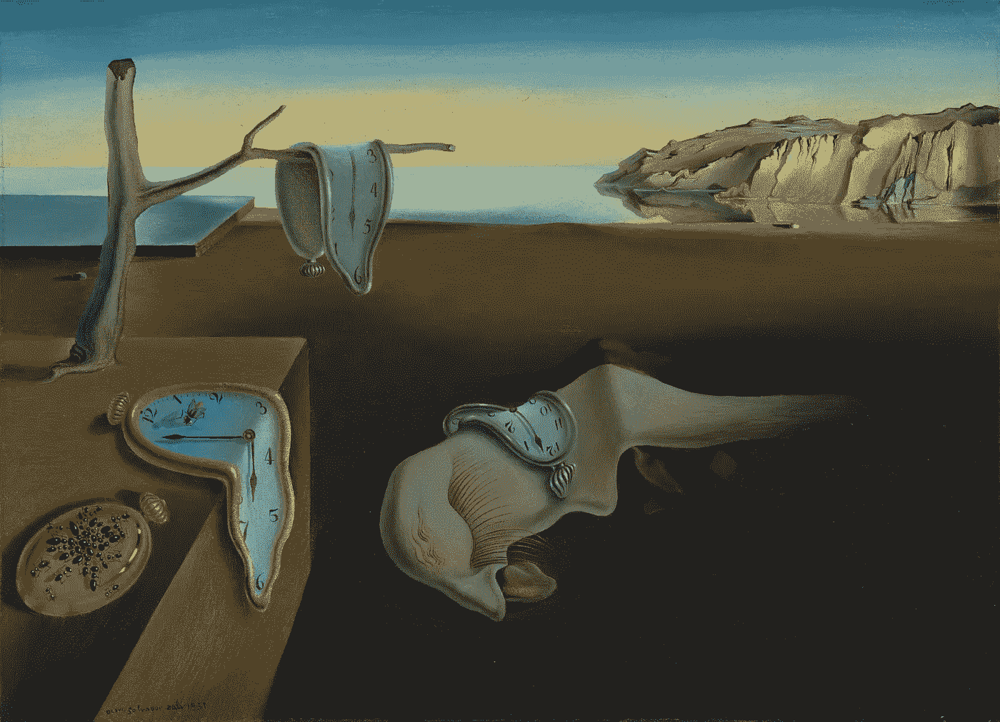

# 潜入大理:如何使用 NVIDIA 的 GPU 优化图像增强库

> 原文：<https://towardsdatascience.com/diving-into-dali-1c30c28731c0?source=collection_archive---------9----------------------->



*Salvador Dalí. The Persistence of Memory. Credit:* [*The Museum of Modern Art*](https://www.moma.org/collection/works/79018)

深度学习图像增强管道通常提供速度或灵活性，但永远不会同时提供两者。计算效率高、生产就绪的计算机视觉管道往往用 C++编写，并要求开发人员指定图像变换算法的所有细节，以至于这些管道最终不太适合进一步的即时调整。另一方面，像 [Pillow](https://pillow.readthedocs.io/en/stable/) 这样的流行 Python 库提供了高级 API，允许从业者从看似无限的调整组合中进行选择，这些调整可以应用于庞大的图像变换算法库。不幸的是，这种自由带来了性能急剧下降的代价*。*

[大理图书馆](https://docs.nvidia.com/deeplearning/sdk/dali-developer-guide/docs/examples/getting%20started.html)试图让从业者两全其美。它的图像转换算法本身是用 C++代码编写的，可以充分发挥 NVIDIA GPU 芯片的性能，从而可以在每个批处理的基础上并行执行图像转换，无论用户可以访问多少个 GPU。C++源代码被绑定到一个用户友好的 Python API，通过它，从业者可以定义图像转换管道，该管道可以很好地与 PyTorch 和 TensorFlow 框架一起使用。

为了确定 DALI 是否确实提供了它所宣传的速度和灵活性，我花了一周的大部分时间对这个库进行了一系列自己的实验。剧透:虽然 DALI 绝对带来了速度，但灵活性仍有所欠缺。

# 达利的承诺

尽管如此，花时间去了解大理是绝对值得的。在 GPU 上进行图像增强的好处是不言而喻的，我的 DALI 图像管道比我写过的任何其他类似的图像增强管道运行得都快。

此外，我刚刚完成了 fast.ai 深度学习[课程](https://course.fast.ai/)第二部分的最新课程，并试图建立一个与 fastai 库的新改进版本兼容的 DALI 管道，我们从头开始建立了 fastai 库，作为[课程作业](https://github.com/jamesdellinger/fastai_deep_learning_course_part2_v3)的一部分。这被证明是一个有意义的练习，因为根据 fastai 核心开发者 [Sylvain Gugger](https://www.fast.ai/about/#sylvain) 的说法，fastai 官方库[即将发布的第二版将包含](https://forums.fast.ai/t/fastai-v2-roadmap/46661)许多在我们班上引入的范例，例如一个具有更加灵活的回调集成的训练循环。

在接下来的几段中，我将介绍构建 DALI 管道的基础知识，并指出如何将它们连接到 fastai 的 v2.0 训练循环。你将会看到 DALI 运行的有多快(这真的令人印象深刻)，以及我想出的一个非常奇怪的解决办法，试图绕过 DALI 图书馆的一个显著缺点。

# 搭建舞台

我的 DALI 增强管道包括随机裁剪和调整大小、翻转、透视扭曲和旋转变换，这些是我在 2019 fast.ai 第二部分课程中从零开始学习的[实现的](http://nbviewer.jupyter.org/github/jamesdellinger/fastai_deep_learning_course_part2_v3/blob/master/10_augmentation_my_reimplementation.ipynb?flush_cache=true)。为了设置基线并衡量每个 DALI 变换是否有助于改善结果，我创建了一个简单的四层 CNN 模型，其任务是使用 [Imagenette](https://github.com/fastai/imagenette) 数据集执行图像分类。Imagenette 是由[杰瑞米·霍华德](https://www.fast.ai/about/#jeremy)创建的，是 ImageNet 的一个更精简的版本，它允许从业者感受如果在 ImageNet 上训练他们的模型将会如何执行，而*实际上*不必从头开始训练 ImageNet 的所有部分。我喜欢在原型的早期迭代中使用 Imagenette 进行快速的健全性检查，它已经成为我实验中不可或缺的一部分。

# 如何建设大理管道

所有 DALI 管道的主干是一个叫做[管道](https://docs.nvidia.com/deeplearning/sdk/dali-developer-guide/docs/examples/getting%20started.html#Pipeline)的 Python 类。我决定为我的训练和验证数据创建专门的管道类，每个类都继承自这个类。为了创建每个类，我必须定义两个方法。第一个方法`__init__()`，是指定每个图像变换操作的超参数的地方。除了像图像旋转和翻转这样的增强，这些操作还可以包括初始图像加载、调整大小、归一化、张量整形和数据类型转换。

第二个方法是`define_graph()`，在这里您定义了您希望管道的图像转换执行的*顺序*。这个方法也是您希望调用 DALI 随机数生成器的地方，这样您就可以将它们作为参数传递给支持随机生成扩充的图像变换操作。`define_graph()`将返回一个包含变换图像及其相应标签的元组。

# 示例:包括旋转变换

下面是我如何使用 DALI 的`[ops.Rotate](https://docs.nvidia.com/deeplearning/sdk/dali-developer-guide/docs/supported_ops.html#rotate)` [函数](https://docs.nvidia.com/deeplearning/sdk/dali-developer-guide/docs/supported_ops.html#rotate)将随机生成的图像旋转添加到我的训练管道中:

## 第一步

在我的管道类'`__init__()`方法中，我为旋转操作创建了变量，`ops.Rotate`，也为两个随机数生成器创建了变量。第一个随机数生成器`[ops.Uniform](https://docs.nvidia.com/deeplearning/sdk/dali-developer-guide/docs/supported_ops.html#uniform)`，将产生一个和我的批量一样长的列表。该列表将包含指定角度(以度为单位)的浮动，通过该角度`ops.Rotate`将旋转批次图像。每个角度都是从范围为[-7，7]的均匀分布中随机选取的。第二个随机数生成器，`[ops.CoinFlip](https://docs.nvidia.com/deeplearning/sdk/dali-developer-guide/docs/supported_ops.html#nvidia.dali.ops.CoinFlip)`，将创建一个包含 1 和 0 的列表，其长度也与批量大小相同。这些出现在随机指数中，总频率为 7.5%。将该列表传递给旋转变换将确保一批中的任何图像都有 7.5%的机会被旋转:

```
self.rotate = ops.Rotate(device=’gpu’, interp_type=types.INTERP_NN) self.rotate_range = ops.Uniform(range = (-7, 7))
self.rotate_coin = ops.CoinFlip(probability=0.075)
```

## 第二步

在`define_graph()`方法中，我实际调用了`ops.Uniform`和`ops.CoinFlip`随机数生成器来为每批创建新的随机数集合:

```
angle_range = self.rotate_range()
prob_rotate = self.rotate_coin()
```

仍然在`define_graph()`中，我在准备执行图像旋转的管道点调用`ops.Rotate`，将上面两个随机数列表分别传递给它的`angle`和`mask`属性:

```
images = self.rotate(images, angle=angle_range, mask=prob_rotate)
```

DALI 现在将每个训练批次中大约 7.5%的图像旋转-7 到 7 度之间的角度。所有图像旋转同时并行发生！

以下是我的培训和认证管道课程的完整内容:

DALI Imagenette Train & Val Pipelines

# 构建 DALI 数据加载器

一旦编写了训练和验证管道类，剩下要做的就是创建它们各自的数据加载器(DALI 称之为“迭代器”)。构建一个与 PyTorch 一起工作的数据加载器只需要三行代码:

```
pipe = ImagenetteTrainPipeline()
pipe.build()
train_dl = DALIClassificationIterator(pipe, pipe.epoch_size('r'), stop_at_epoch=True)
```

# 大理速度测试

DALI 管道对象有一个`run()`函数，它抓取一批图像，通过管道发送，并返回转换后的图像及其标签。计时这个功能是衡量 DALI 速度最简单的方法。


As far as speed goes, DALI can fly.

我在一个 AWS [p2.xlarge](https://aws.amazon.com/ec2/instance-types/p2/) 计算实例上运行了我的速度测试，使用了一个 GPU，小批量 64 张图像。我发现我的 Imagenette 训练管道(包含 12 个图像操作)的运行时间只有 40 毫秒多一点！对于流水线中的所有 12 个操作，这相当于每个图像 625 秒。相比之下，在 fast.ai 课程的图像增强[课程](https://nbviewer.jupyter.org/github/jamesdellinger/fastai_deep_learning_course_part2_v3/blob/master/10_augmentation_my_reimplementation.ipynb?flush_cache=true#Time-Budget)中，我们看到使用 Pillow 进行图像转换的主要瓶颈是 Pillow 加载单个图像需要 5 ms。

我们还使用 PyTorch JIT [来实现](https://nbviewer.jupyter.org/github/jamesdellinger/fastai_deep_learning_course_part2_v3/blob/master/10_augmentation_my_reimplementation.ipynb?flush_cache=true#JIT-version-of-rotate_batch())一种图像旋转算法，类似于 DALI，在 GPU 上转换批处理。每批大约运行 4.3 毫秒。假设任何转换的 JIT 实现都需要相同的持续时间(可能是一段时间)，快速的粗略计算表明 JIT 性能可能类似于 DALI (4.3 x 12 = 51.6 ms)。DALI 的美妙之处在于，虽然它花了*12 行代码*来定义执行 JIT 旋转转换的脚本，但是 DALI 只通过一个函数调用就给了我们相同的功能和速度！

# DALI + fastai v2.0

对于参加 2019 fast.ai 深度学习第二部分[课程](https://course.fast.ai/index.html)的人来说，这里有三个技巧可以让 DALI 的数据加载器与新改进的`[Learner()](https://nbviewer.jupyter.org/github/jamesdellinger/fastai_deep_learning_course_part2_v3/blob/master/09_optimizers_my_reimplementation.ipynb?flush_cache=true#Getting-rid-of-the-Runner-class)`对象无缝对接。

## 招数 1

修改`Learner`类，使其正确地索引到 DALI 数据加载器返回的张量中。图像和标签分别包含在`'data'`和`'labels'`键下:

```
xb = to_float_tensor(batch[0]['data'])
yb = batch[0]['label'].squeeze().cuda().long()
```

此外，确保在每个时期后重置 DALI 训练和 val 数据加载器:

```
self.data.train_dl.reset()
self.data.valid_dl.reset()
```

## 招数 2

更改`[AvgStats](https://nbviewer.jupyter.org/github/jamesdellinger/fastai_deep_learning_course_part2_v3/blob/master/04_callbacks_my_reimplementation.ipynb?flush_cache=true#AvgStats())`类，使`all_stats()`方法返回`self.tot_loss`而不是`self.tot_loss.item()`。

## 招数 3

设定变量`[combine_scheds()](https://nbviewer.jupyter.org/github/jamesdellinger/fastai_deep_learning_course_part2_v3/blob/master/05_anneal_my_reimplementation.ipynb?flush_cache=true#combine_scheds())`的最大值，超参数调度生成器在跟踪当前迭代相对于训练周期长度的位置时使用该变量:`pos = min(1 — 1e-7, pos)`。

最初的意图是，在训练期间，该值将始终低于 1.0。然而，当使用 DALI 时，其在最终迭代的*开始*处的值有时会是 1.0 或稍大。这会导致 IndexError，因为调度程序被迫索引到一个实际上并不存在的调度阶段！

请随意查阅我的[笔记本](https://nbviewer.jupyter.org/github/jamesdellinger/fastai_deep_learning_course_part2_v3/blob/master/Diving_into_DALI.ipynb?flush_cache=true#1.-Make-the-Learner-class-compatible-with-Dali-data-loaders)来查看包含这三个修改的训练循环的工作版本。

# 大理最明显的不足

我将用一些时间来总结 DALI 库，我认为这是它最显著的缺点:它的一些图像转换操作*不能*产生随机输出。我发现这尤其具有讽刺意味，因为 DALI 网站用了一整节[来宣扬图像增强的好处，即*能够随机干扰输入图像，声明:*](https://docs.nvidia.com/deeplearning/sdk/dali-master-branch-user-guide/docs/examples/getting%20started.html#Tensors-as-arguments-and-Random-Number-Generation)

> “将每张图像旋转 10 度并不那么有趣。为了进行有意义的增强，我们希望操作员在给定范围内以随机角度旋转我们的图像。”

如果是这样的话，我想达利的[扭曲仿射](https://docs.nvidia.com/deeplearning/sdk/dali-developer-guide/docs/supported_ops.html#nvidia.dali.ops.WarpAffine)图像变换应该被视为“没什么意思”，因为它实际上无法生成随机的图像扭曲。更令人沮丧的是，尽管我为[编写了自己的](https://nbviewer.jupyter.org/github/jamesdellinger/fastai_deep_learning_course_part2_v3/blob/master/Diving_into_DALI.ipynb?flush_cache=true#get_affine_tfm())逻辑，它根据 DALI 的 warp affine 操作的`matrix`参数所期望的约定生成随机仿射变换，但我绝对*不可能*让我的 DALI 管道在运行时为小批量的图像执行这个逻辑。

不出所料，有人[请求](https://github.com/NVIDIA/DALI/issues/552)支持随机化 warp affine，但 DALI 团队成员[解释说](https://github.com/NVIDIA/DALI/issues/552#issuecomment-465568041)warp affine 目前不是优先考虑的，因为团队专注于*“提供最常见网络中使用的操作符。”现在，作为一个前世是软件产品经理的人，我当然赞同优先考虑功能的想法。然而，看着 DALI 团队毫不犹豫地大声宣扬随机图像旋转的好处，我很难理解随机的 warp affinites*为什么不能*优先。*

尽管如此，一个可取之处是 DALI 团队成员确实鼓励开源贡献来弥补这个特性的不足。这是一件好事，也许很快有一天我会尝试移植我的随机仿射变换逻辑并提交一个 pull 请求。

# “合成随机”扭曲仿射变换

我最终不满足于从我的增强管道中省略透视扭曲，也不同意对任何批次的任何图像应用相同的单一、单独的扭曲仿射变换。在尝试执行将由 DALI 的`[ops.WarpAffine](https://docs.nvidia.com/deeplearning/sdk/dali-developer-guide/docs/supported_ops.html#nvidia.dali.ops.WarpAffine)`操作执行的仿射变换随机化的逻辑失败后，我决定尝试一种突然出现在我脑海中的公认的非常规变通方法。我把这称为“合成随机”扭曲仿射变换。它是这样工作的:

1.  编写一个[函数](https://nbviewer.jupyter.org/github/jamesdellinger/fastai_deep_learning_course_part2_v3/blob/master/Diving_into_DALI.ipynb?flush_cache=true#get_affine_tfm())，它可以生成随机仿射变换并传递给`ops.WarpAffine`。我的算法确保随机生成的仿射变换将倾斜图像的视角，但不会不自然地挤压或拉伸图像的内容。
2.  在我的管道中添加两到二十个 DALI `ops.WarpAffine`操作。(我做了一些实验来确定合适的量，发现七种效果最好。)
3.  为我包含在管道中的每个`ops.WarpAffine`操作生成一个唯一的仿射变换。
4.  以介于 0.3 和 0.025 之间的概率将管道的每个扭曲仿射变换应用于特定图像。(我发现 0.025 效果最好。)

我的直觉是，通过适当选择扭曲仿射操作的数量，平衡每个操作将被应用的适当概率，我可以同时:

*   最大化应用于小批量图像的透视扭曲变换的*种类*。
*   充分减少单个图像在每个小批量中应用两个或更多扭曲变换的机会。

通过在我的笔记本中记录的[一系列实验，我发现包括七个连续的翘曲仿射变换，每个都有 0.025 的概率应用于一批中的任何图像，在十次运行中导致平均验证准确性的最大增加。该机制的性能超过了不包含任何扭曲仿射变换的基线。我的“合成随机”扭曲仿射也胜过了只包含一个扭曲变换的管道，它以完全相同的方式倾斜每批中的任何图像，这似乎是 DALI 目前期望从业者如何使用这种操作。](http://nbviewer.jupyter.org/github/jamesdellinger/fastai_deep_learning_course_part2_v3/blob/master/Diving_into_DALI.ipynb?flush_cache=true#%22Lab-Notebook%22-for-my-DALI-Transform-Explorations:)

所有这一切中的一个亮点是 DALI 的速度:在我的流水线中额外添加两个或二十个 warp affine 操作并没有明显延长处理每个小批量的时间。

请注意，我写我的“合成随机”扭曲变形并不是为了让其他从业者尝试类似的方法。相反，我希望表达的是，无论我的解决方法在多大程度上看起来是非常规的，DALI 的扭曲变换不支持随机化的事实也是非常规的。

# 三个较小的诡辩

1.  潜在的 DALI 用户已经习惯了 PyTorch 的动态特性，应该期待一个绝对*静态*tensor flow 1.0 版般的体验。当 DALI 团队将管道类命名为“核心方法*定义图*时，他们并没有开玩笑，所以不要期望能够在其中运行任何自定义算法，正如我在尝试给`ops.WarpAffine`添加随机性时所尝试的那样。目前推荐的[方法](https://docs.nvidia.com/deeplearning/sdk/dali-developer-guide/docs/examples/extend/create_a_custom_operator.html)是创建并编译一个定制的 C++操作符。这并没有让我觉得非常“灵活”，希望 DALI 将扩展其增强选项的广度，这将消除从业者创建定制操作的需要。
2.  说到这里，DALI 缺乏对反射填充的支持。我的假设是，这是在我将旋转角度的范围从[-30，30]度缩减到[-7，7]度之前，在我的管道中添加旋转变换并没有提高模型性能的一个重要原因。虽然 DALI 确实允许从业者指定用于填充旋转后图像角落中发现的空像素的单一颜色，但我怀疑使用全绿或全白填充而不是全黑默认填充是否会对我的模型的性能产生有意义的改善。
3.  我本打算居中裁剪，然后调整验证集图像的大小。虽然 DALI 的`[ops.Crop](https://docs.nvidia.com/deeplearning/sdk/dali-developer-guide/docs/supported_ops.html#nvidia.dali.ops.Crop)`操作允许我们相对于输入图像的宽度和高度设置裁剪窗口左上角的坐标，但是似乎没有任何方法可以使裁剪窗口的宽度和高度*也相对于每个输入图像的宽度和高度*缩放。

# 最后

DALI 提供了一个简洁的 Python API，可以很好地与 PyTorch、TensorFlow 一起使用，并且只需三次调整，也可以顺利地与我们将在 fastai 库的 2.0 版本中看到的训练循环一起工作。通过使用 GPU 优化的代码并行运行图像增强，DALI 不仅实现了它的速度承诺，还消除了编写几行 [JIT 脚本](https://nbviewer.jupyter.org/github/jamesdellinger/fastai_deep_learning_course_part2_v3/blob/master/10_augmentation_my_reimplementation.ipynb?flush_cache=true#JIT-version-of-rotate_batch())的需要，这是我知道的如何在 GPU 上批量运行图像增强的唯一方法。不幸的是，并不是所有的 DALI 图像变换都支持随机化，具有讽刺意味的是，即使 DALI 团队[也承认](https://docs.nvidia.com/deeplearning/sdk/dali-master-branch-user-guide/docs/examples/getting%20started.html#Tensors-as-arguments-and-Random-Number-Generation)是一个必须具备的特性。虽然 DALI [声称](https://docs.nvidia.com/deeplearning/sdk/dali-developer-guide/docs/examples/getting%20started.html)是灵活的，但我试图在 DALI 的 warp affine 操作中建立随机性，结果表明这种灵活性只扩展到那些愿意并能够子类化和编译 C++类的人。在 2019 年，我不确定任何需要使用 C++的东西是否仍然可以被称为“灵活的”。

即便如此，虽然 DALI 的功能集较窄，可能会使我的模型的最终版本更难到达 SOTA 或登上 Kaggle 排行榜，但我仍然计划在我的模型原型制作过程的早期阶段使用 DALI 库。它的 Python API 很容易使用，DALI 运行速度非常快。毕竟我们说的是在 GPU 上批量扩充图像，这里！我希望图书馆能继续填补空白，不断进步。

# 参考

1.  请随意查看笔记本,我在那里试验了本文中讨论的管道。
2.  DALI 的 GitHub 页面上的 PyTorch ImageNet 培训[示例](https://github.com/NVIDIA/DALI/blob/666ce55ec27783f36f2b7a39076793d955d4ad0f/docs/examples/pytorch/resnet50/main.py)由 [Janusz Lisiecki](https://github.com/JanuszL) 、 [Joaquin Anton](https://github.com/jantonguirao) 和 [Cliff Woolley](https://github.com/cliffwoolley) 创建，它是帮助我了解如何从头开始编写自己的培训和验证管道类的不可或缺的模板。