# 投身谷歌里程碑式的识别卡格尔竞赛

> 原文：<https://towardsdatascience.com/diving-into-googles-landmark-recognition-kaggle-competition-6975dbe11072?source=collection_archive---------16----------------------->

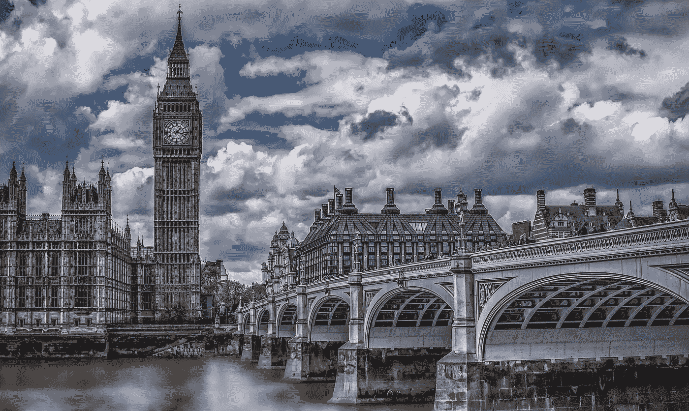

最近的谷歌地标识别比赛严重影响了我与互联网服务提供商、我的 GPU 的关系，也让我失去了一点耐心。

以下是 Kaggle 比赛说明:

> 今天，地标识别研究的一个巨大障碍是缺乏大型标注数据集。在这次比赛中，我们展示了迄今为止最大的全球数据集，以促进这一问题的进展。这项比赛要求 Kagglers 建立模型，在具有挑战性的测试图像数据集中识别正确的地标(如果有的话)。

不管怎样，我很兴奋我得到了我的第一枚卡格尔奖章！

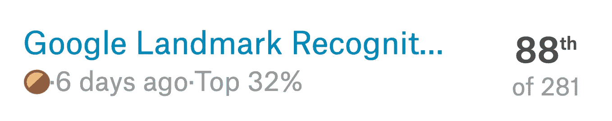

# 庞大的数据集

当我第一次报名参加比赛时，我没有意识到这个数据集有多么庞大。对于 400 多万张图像，仅训练集就有大约 500 多千兆字节！

您的 ISP 有数据上限限制吗？我的的确如此。我意识到这一点，因为我收到了一系列电子邮件，说我离 1,024 的上限只有 10g 了。突然，楼下的电视“坏了”，不能播放我 3 岁孩子最喜欢的节目，我在家的工作变成了在咖啡店的工作。我不想支付超龄费。

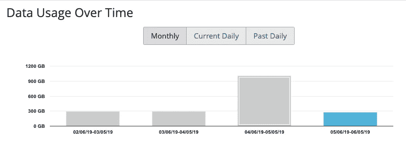

在下载这个数据集时，我使用了我家人正常月数据使用量的三倍。太不可思议了。我还觉得庞大的数据集阻碍了其他人获得解决这个挑战的好机会。

## 使用 Magik 压缩图像和数据集

所以让我们来解决尺寸问题。数据集中的大多数图片都很大(因此有 500 多张)，我们不需要它们来参加比赛。因此，我们使用了 ImageMagick 的一个小 mogrify 来快速地将图像调整到 256x256。

```
find /home/user/data/google2019/ -name ‘*.jpg’ -execdir mogrify -resize 256x256! {} \;
```

这一步有效地将 500+千兆字节的训练集减少到大约 50 千兆字节。更有用。更重要的是，我已经知道，当训练这么大的数据集时，时间将是一个问题。通过预先调整硬盘上的映像大小，我们无需在训练期间多次重新计算。

以防万一，我保留了原始文件，如果我以后需要不同的大小。

## 检查文件是否为空

另一个不幸的发现是几个缺少数据的文件被破坏。不完整的记录可能会导致模型在整个训练过程中失败(这可能需要长达 9 个小时)。最好先检查一下。

```
import os
filenames=os.listdir("/home/user/data/google/")# Are there any empty files?
for filex in tqdm(filenames):
    try:
        filex=directory+"/"+filex
        if (os.stat(filex).st_size == 0): #0 means bad file
            print(filex)
    except:
        print (filex)
```

任何失败的文件我都用相同类型的地标图片替换。

## 最常见的地标

有了这么多的文件，另一个大问题就是地标类的数量。最常见的“id 138982”有超过 10，000 个实例，而一些地标只有 1 个。

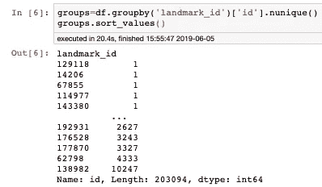

我们这里有 203，094 个不同的班级，我们真的应该考虑减少这个数字。

# 维度很难

如果你看看其他 CNN 数据集，你有一些简单的像 Mnist (10 个类)和更复杂的像 ImageNet(1000 个类)。所以一个有 20 万个类别的数据集是很疯狂的。

所以让我们把它变得简单一些，只让它像 ImageNet 一样难。我们选取了 1000 个最常见的类，仅使用了数据集的 11.1%。

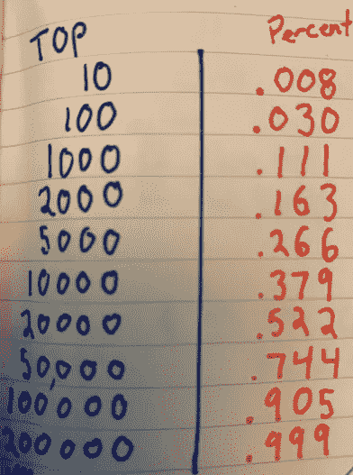

不出所料，它训练得很快，ResNet34 的准确率高达 50%左右。通过大量的实验，我得到了类似这样的东西。(我喜欢老派的钢笔和墨水)

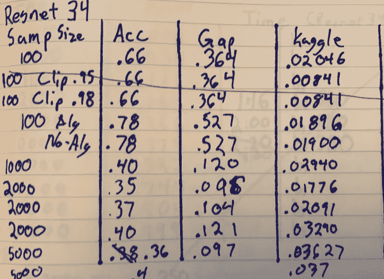

Resnet34 experiments for test 1

我当然有差距分数的问题，但我认为大多数人并没有被它超越。实现我的[差距分数](https://forums.fast.ai/t/custom-callback-metric-gap-score/45368)迭代与公共 Kaggle 分数不完全匹配。然而，这确实表明我走在正确的道路上。较大样本量的班级(前 100 名、前 1000 名、前 2000 名等。)，更高的准确性和更高的验证差距分数导致更高的 Kaggle 分数。

然而，随着数据集的增长，我们也遇到了训练时间和预测准确性较低的问题。

# 失望转向第二阶段测试

我在比赛中表现非常好，第一阶段的公开分数让我进入了前 30 名。我对此非常兴奋，因为我觉得我的训练越来越好了。我的分类和准确性迅速提高。

然而，我的训练很快就遇到了 20，000 个类别的问题。我只有大约 30%的 7000 个不同的类别(我甚至无法预测所有的新类别)。

虽然我在那一点上尝试了几种不同的解决方案，但我被姐妹竞争([谷歌地标检索 2019](https://www.kaggle.com/c/landmark-retrieval-2019) )分散了太多注意力，无法回去修复错误。

# 有待改进的领域

## 数据清理和地标与非地标

当查看所有训练数据时，我注意到 landmark 138982 是最常见的一个，并决定进行调查。当我们浏览这堂课的 200 张图片时，没有任何标志。例如，见下文。

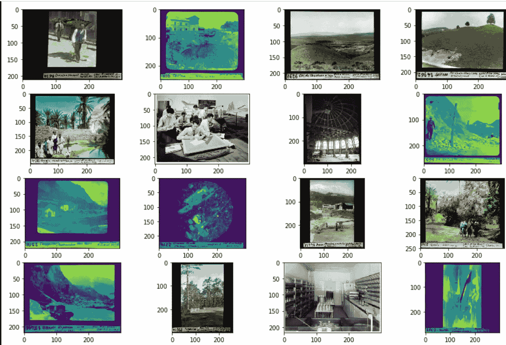

我们有实验室内部，教室，风景，树前的人，没有任何看起来像地标的东西。有些是彩色的，有些是黑白的(这些图像看起来有一点绿色，只是为了这个功能)，还有不少在底部有一个小标签。原来它们来自苏黎世联邦理工学院的[图书馆，我仍然不知道为什么它们被认为是地标。](https://www.kaggle.com/c/landmark-recognition-2019/discussion/89903#519261)

毕竟，国会图书馆里的照片会是国会图书馆吗？

这说不通。

我被傲慢所征服，忽略了包括一个非地标或者关于地标是否存在的数据清理。事后看来，这是一个巨大的错误，检测地标和非地标有许多解决方案。

竞争者讨论地标 vs 非地标:
[第 2 名](https://www.kaggle.com/c/landmark-recognition-2019/discussion/94294#latest-542447) —不讨论，只放外部数据
[第 8 名](https://www.kaggle.com/c/landmark-recognition-2019/discussion/94512#latest-544409)
[第 27 名](https://www.kaggle.com/c/landmark-recognition-2019/discussion/94486#latest-543792)

## 寻找最近的邻居

看到最接近测试图像的图像也是非常重要的。我使用 nmslib 来帮助解决这个问题。

根据我的 Resnet50 训练，nmslib 将比较 1 个测试的 softmax 预测与在我的验证集上做出的预测。那么它将找到 K 个最接近该测试图像的验证图像。请看我下面的解释。

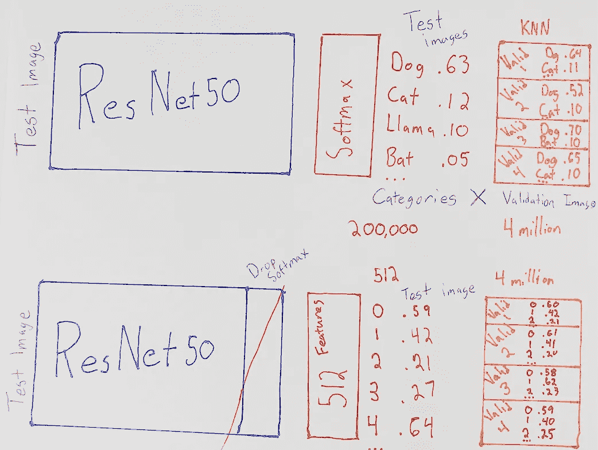

如果是 ImageNet，那么狗的图像对狗的预测会更高就说得通了。如果验证集中的 K 个最近邻居是狗，则测试图像很可能是狗。

同样，如果它是一个图像类别 12345，它应该在其 12345 ish 中排名非常高。如果五个最接近的验证图像是 12345，它可能是。

现在，我在这里的错误是使用 softmax，并试图使用成千上万的变量，而不是使用最后的 512 个功能。试图拥有 20 万个类别会消耗大量内存。我崩溃的时候高达 62G。

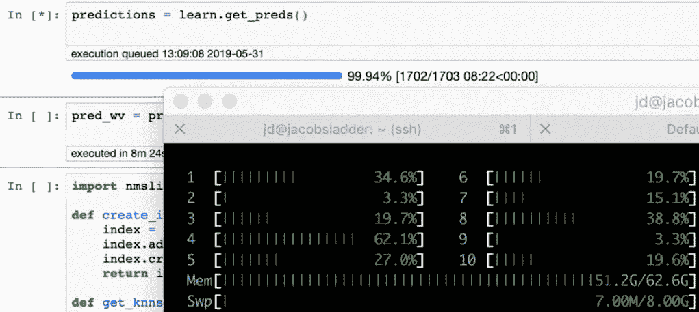

通过一些疯狂的天文计算，我在最后的提交中放弃了它，去参加另一场比赛。

## 还有几个问题

此外，因为有一些分散注意力的图像。KNN 会对整个主题进行错误分类。例如，这张图片:

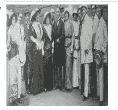

正如你可以看到上面的图片突出的特点，人们正在为摄影师摆好姿势，它匹配最接近下面的照片。

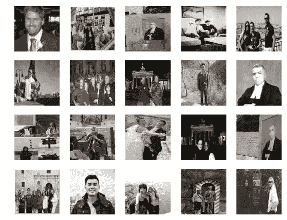

这些比较关注的是人，而不是地标。即便如此，它也无法分辨它们是现代照片还是老照片。我认为如果有更好的架构和更多的类别，我就不会有这个问题了。

KNN 的最佳用途在以下方案中:
[第 1 名](https://www.kaggle.com/c/landmark-recognition-2019/discussion/94523#latest-544779)
[第 8 名](https://www.kaggle.com/c/landmark-recognition-2019/discussion/94512#latest-544409) [第 15 名](https://www.kaggle.com/c/landmark-recognition-2019/discussion/94308#latest-544734)
[第 20 名](https://www.kaggle.com/c/landmark-recognition-2019/discussion/94645#latest-544767) [第 27 名](https://www.kaggle.com/c/landmark-recognition-2019/discussion/94486#latest-543792)

**更好的架构** 为什么是 Resnet50？我在用 ResNeXt 架构保存时遇到了问题，开始 DenseNet 太晚了，而 [EfficientNet 功能](https://forums.fast.ai/t/efficientnet/46978)正在构建中。下一次，我将从 ResNet34 转到 ResNeXt 或新的 [EfficientNet](https://ai.googleblog.com/2019/05/efficientnet-improving-accuracy-and.html) 。

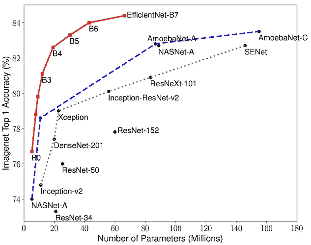

我也尝试慢慢增加训练类别的数量。先做 1000，再做 2000，再做 3000，以此类推。这种想法是，学习更少的类别会更快，然后在更广的范围内学习会更准确。比如在学习另一种语言时添加额外的抽认卡。

然而，我在训练和准确性方面没有明显的帮助，我放弃了它。也许台阶太大了，我应该有小一点的。

# 结论

*   大型数据集很难。有趣但很难。
*   KNN 是极其宝贵的，但不会打破你的电脑
*   爱多 GPU 处理
*   快速转移到更大的数据集

再次感谢 [Fast.ai](https://www.fast.ai/) ，它教会了我如何走到这一步！

## 参考资料:

[我的 Github 代码](https://github.com/jamesdietle/Kaggle2019/tree/master/GoogleLandmarkRecognition)
[GAP for py torch/fast . ai](https://forums.fast.ai/t/custom-callback-metric-gap-score/45368)
[Kaggle 竞赛](https://www.kaggle.com/c/landmark-recognition-2019)
[NMS lib](https://github.com/nmslib/nmslib) [efficient net](https://ai.googleblog.com/2019/05/efficientnet-improving-accuracy-and.html)