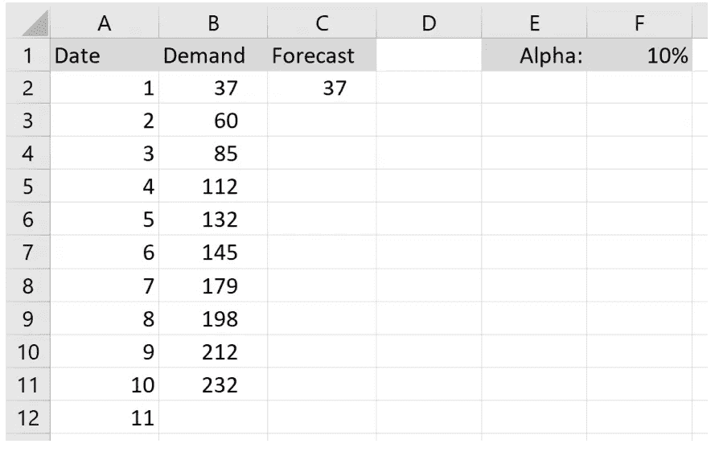
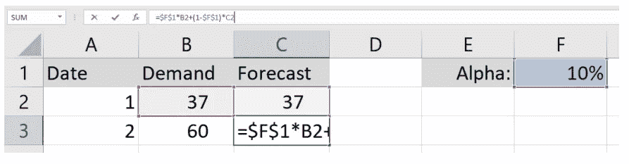
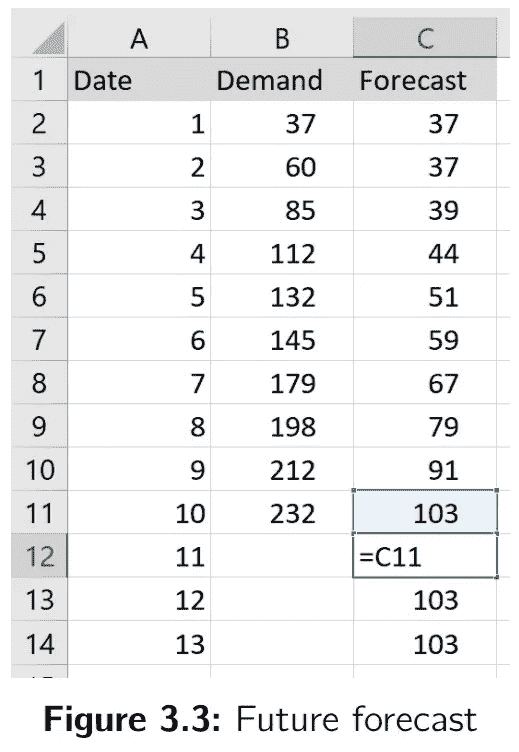

# 从头开始在 Excel 中进行简单的指数平滑

> 原文：<https://towardsdatascience.com/diy-simple-exponential-smoothing-with-excel-df4b8728e19e?source=collection_archive---------31----------------------->

*下面这篇文章摘自我的《供应链预测的数据科学》一书，这里有***。你可以在这里* *找到我的其他出版物* [*。我也活跃在*](https://medium.com/@nicolas.vandeput)[*LinkedIn*](https://www.linkedin.com/in/vandeputnicolas/)*。**

*这篇文章是另一篇关于简单指数平滑理论介绍的文章的后续。你可以在这里找到**。你可以在这里* *找到关于如何用 python* [*制作相同模型的类似文章。*](https://medium.com/@nicolas.vandeput/diy-simple-exponential-smoothing-with-python-dbb570d30fb5)**

# **自己动手——用 Excel 进行简单的指数平滑**

**在本文中，您将在 excel 中实现一个简单的指数平滑预测模型。**

**1.我们从创建三列开始数据表:**

*   ****栏 A** 上的日期**
*   **对**栏 B** 的需求**
*   **对**栏 C** 的预测**

**2.接下来，让我们添加一个带有 alpha 的单元格(在我们的例子中是 **F1** )。别忘了明确指出这个单元格是 alpha。**

**3.完成后，您可以将第一个预测(单元格 **C2** )初始化为第一个需求(单元格 **B2** )。我们在这里使用了虚拟值。**

****

**4.我们现在可以填充我们的预测；截至单元格 **C3** ，我们可以使用这个公式:**

****

**5.要继续我们的预测，直到历史时期结束，我们可以简单地拖动这个公式，直到表的末尾。**

**6.所有未来预测(即，历史期间之外的预测)将简单地等同于基于历史需求的最后一次预测(如下所示)。**

****

**已经这样了。你可以在我的博客[这里](https://supchains.com/blog/)或者我的书[这里](https://www.amazon.com/Data-Science-Supply-Chain-Forecast/dp/1730969437)找到更高级的型号。**

**也可以在 python 中实现简单的指数平滑( [**此处**](https://medium.com/@nicolas.vandeput/diy-simple-exponential-smoothing-with-python-dbb570d30fb5) )。**

# **关于作者**

** [## Nicolas vande put——顾问，创始人——供应链| LinkedIn

### 查看 Nicolas Vandeput 在世界上最大的职业社区 LinkedIn 上的个人资料。尼古拉斯有 7 份工作列在…

www.linkedin.com](https://www.linkedin.com/in/vandeputnicolas/) 

icolas Vandeput 是一名供应链数据科学家，擅长需求预测和库存优化。他在 2016 年创立了自己的咨询公司 [SupChains](http://www.supchains.com/) ，并在 2018 年共同创立了 [SKU 科学](https://bit.ly/3ozydFN)——一个快速、简单、实惠的需求预测平台。尼古拉斯对教育充满热情，他既是一个狂热的学习者，也喜欢在大学教学:自 2014 年以来，他一直在比利时布鲁塞尔为硕士学生教授预测和库存优化。自 2020 年以来，他还在法国巴黎的 CentraleSupelec 教授这两个科目。他于 2018 年出版了 [*供应链预测的数据科学*](https://www.amazon.com/Data-Science-Supply-Chain-Forecasting/dp/3110671107)(2021 年第 2 版)和 2020 年出版了 [*库存优化:模型与模拟*](https://www.amazon.com/Inventory-Optimization-Simulations-Nicolas-Vandeput/dp/3110673916) 。

**