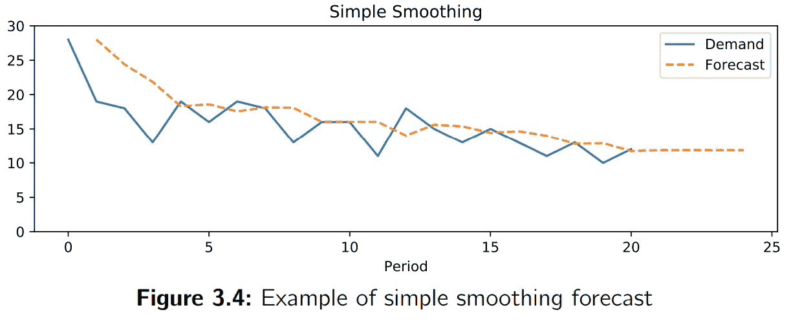

# Python 中的简单指数平滑从头开始

> 原文：<https://towardsdatascience.com/diy-simple-exponential-smoothing-with-python-dbb570d30fb5?source=collection_archive---------20----------------------->

*下面这篇文章摘自我的《供应链预测的数据科学》一书，这里有*[](https://www.amazon.com/Data-Science-Supply-Chain-Forecasting/dp/3110671107)**。你可以在这里* *找到我的其他出版物* [*。我也活跃在*](https://medium.com/@nicolas.vandeput)[*LinkedIn*](https://www.linkedin.com/in/vandeputnicolas/)*。**

*这篇文章是另一篇关于简单指数平滑理论介绍的文章的后续。你可以在这里找到[](https://medium.com/@nicolas.vandeput/simple-exponential-smoothing-749fc5631bed)**。你可以在这里* *找到关于如何用 Python* [*制作相同模型的类似文章。*](https://www.linkedin.com/pulse/diy-simple-exponential-smoothing-python-nicolas-vandeput/)**

# **自己动手——用 Python 实现简单的指数平滑**

## **简单平滑函数**

**我们将定义一个函数 **simple_exp_smooth** ，它将一个时间序列 **d** 作为输入，并返回一个 **pandas DataFrame df** ，其中包含历史需求、预测和误差。该函数还将 **extra_periods** 作为输入，即需要预测未来的周期数。最后一个输入是 **alpha** 参数。**

```
**def simple_exp_smooth(d,extra_periods=1,alpha=0.4):  
  d = np.array(d)  # Transform the input into a numpy array    cols = len(d)  # Historical period length    d = np.append(d,[np.nan]*extra_periods)  # Append np.nan into the demand array to cover future periods    f = np.full(cols+extra_periods,np.nan)  # Forecast array    f[1] = d[0]  # initialization of first forecast    # Create all the t+1 forecasts until end of historical period    for t in range(2,cols+1):      f[t] = alpha*d[t-1]+(1-alpha)*f[t-1]  
  f[cols+1:] = f[t]  # Forecast for all extra periods  
  df = pd.DataFrame.from_dict({"Demand":d,"Forecast":f,"Error":d-f})**
```

# **玩弄我们的功能**

**然后，我们可以简单地调用我们的函数(这里有一个虚拟需求时间序列):**

```
**import numpy as np 
import pandas as pdd=[28,19,18,13,19,16,19,18,13,16,16,11,18,15,13,15,13,11,13,10,12]df = simple_exp_smooth(d,extra_periods=4)**
```

**您还可以使用简单的命令快速获得预测准确性，如下所示。看我之前的[文章](https://www.linkedin.com/pulse/forecast-kpi-rmse-mae-mape-bias-nicolas-vandeput/)关于 **KPI** 看看哪个最适合你的情况。**

```
**MAE = df["Error"].abs().mean() print("MAE:",round(MAE,2)) RMSE = np.sqrt((df["Error"]**2).mean())print("RMSE:",round(RMSE,2))**
```

**您应该会得到以下结果:**

```
**MAE: 2.74RMSE: 3.89**
```

**另一个令人兴奋的步骤是绘制结果来分析模型的行为。**

```
**df.index.name = "Periods"df[["Demand","Forecast"]].plot(figsize=(8,3),title="Simple Smoothing",ylim=(0,30),style=["-","--"])**
```

**你应该得到一个类似下图的数字。**

****

# **关于作者**

**[](https://www.linkedin.com/in/vandeputnicolas/) [## Nicolas vande put——顾问，创始人——供应链| LinkedIn

### 查看 Nicolas Vandeput 在世界上最大的职业社区 LinkedIn 上的个人资料。尼古拉斯有 7 份工作列在…

www.linkedin.com](https://www.linkedin.com/in/vandeputnicolas/) 

icolas Vandeput 是一名供应链数据科学家，擅长需求预测和库存优化。他在 2016 年创立了自己的咨询公司 [SupChains](http://www.supchains.com/) ，并在 2018 年共同创立了 [SKU 科学](https://bit.ly/3ozydFN)——一个快速、简单、实惠的需求预测平台。尼古拉斯对教育充满热情，他既是一个狂热的学习者，也喜欢在大学教学:自 2014 年以来，他一直在比利时布鲁塞尔为硕士学生教授预测和库存优化。自 2020 年以来，他还在法国巴黎的 CentraleSupelec 教授这两个科目。他于 2018 年出版了 [*供应链预测的数据科学*](https://www.amazon.com/Data-Science-Supply-Chain-Forecasting/dp/3110671107)(2021 年第 2 版)和 2020 年出版了 [*库存优化:模型与模拟*](https://www.amazon.com/Inventory-Optimization-Simulations-Nicolas-Vandeput/dp/3110673916) 。

**