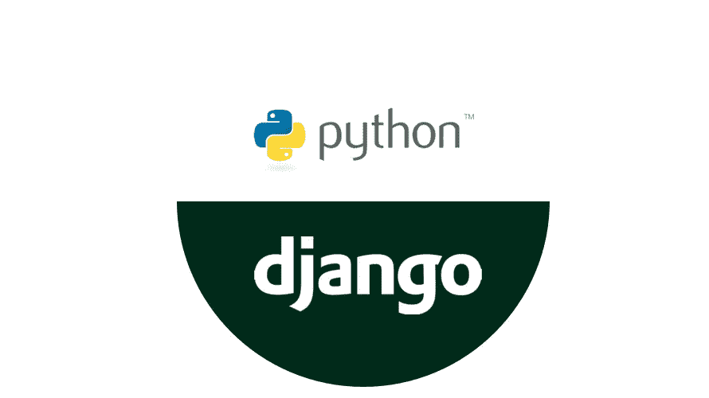

# 姜戈还是弗拉斯克？根据我的经验推荐。

> 原文：<https://towardsdatascience.com/django-or-flask-recommendation-from-my-experience-60257b6b7ca6?source=collection_archive---------11----------------------->

以我的经验来看，用 Python 驱动数据应用的一个常见问题是不知道用什么工具做什么工作。我认为不用说，在工作中使用正确的工具是我们所做工作的很大一部分。当你可以从任何地方开始时，很难知道从哪里开始。但是，我一遍又一遍的看到这个问题:“我应该学**烧瓶**还是 **Django？**“简短的回答是

> 两者

但为什么我会建议两者都了解呢？Flask 和 Django 只是 Python 的 web APIs，对吧？Flask 有什么优势，用 Django 代替有什么优势？事实是，在很多方面，它们经常被用于非常不同的目的。虽然他们肯定会时不时地越线。

# 姜戈

我们都听说过地球上一些最大的网站使用 Django 的疯狂故事。这是有充分理由的，因为 Django 不仅受人尊敬，而且使用起来也非常方便。Django 的优势在于它要实现的目标。Django 非常适合用 Python 构建完整的 web 应用程序。虽然你当然可以用 Django 做一些底层的事情，但我认为对很多人来说，Django 的闪光点在于快速开发和 Django 的授权/许可系统，它被嵌入到包中。

Django 不仅使项目管理变得容易，还意味着启动变得更加容易。您的应用程序将需要的许多东西都被嵌入到您的 Django start-project 命令中。

# 瓶

Flask 绝对是数据迷和数据科学家的热门选择。烧瓶是两者中较轻的一个。Flask 经常对网站的大部分内容采取“从头构建”的方式。虽然这使得全面的网络应用程序开发起来有点困难，但它也带来了 Flask 的强大功能，以及两者之间的一个非常大的区别。

烧瓶很轻。这使得 Flask 成为端点定位、查询和流水线的最佳选择。许多数据科学专注于构建复杂的算法和 ROC/AUC，但数据科学最受欢迎和最被忽视的一面是 ***数据流*** 。

对于数据科学家来说，能够读取、操作和查询数据是非常有价值的。Flask 使 http 请求的转储变得非常容易，有效地构建了供您整个时间使用的端点。

在我看来，虽然 Flask 肯定可以做 Django 能做的几乎所有事情，但 Flask 在这个特定的用途上仍然更好，Django 比另一个更好。

# 那么…为什么两者都有？

在我们的数据科学之旅中，终端和数据基础设施可能比您想象的更有价值。尽管 ML 中确实有令人兴奋的新进展，但首先需要基础设施来获得这样的模型。

就我个人而言，我喜欢在需要的时候使用所有我能使用的工具。我喜欢在 Flask 开发，就像我喜欢在 Django 开发一样。如果我需要响应一个 http 查询，我会直接进入基于 Flask 的应用程序。如果我要建立下一个脸书，或者一个论坛网站，我肯定会使用 Django。

## 如果你必须选择一个:

如果你完全不反对使用两者，或者如果你想知道从哪里开始，答案肯定是 Flask。虽然 Django 是构建一些非常酷的应用程序的一个很棒的包，但我发现我经常使用 Flask。

对于典型的 DS 相关工作，我认为 Flask 做得非常出色。Flask 很有用，因为它更容易启动和运行，没有 Django 会向您左右扔来的所有令人困惑的“扩展”。并不是说这些都是负面的，但是编辑 Django 保存的文件路径来稍微改变你的项目对于初学者来说肯定是令人畏惧的。Flask 使你的函数路由和创建结果变得容易，没有麻烦。

尽管你肯定可以选择 Flask 或 Django 中的任何一个，并在创造中获得成功——嗯，很多事情，但他们肯定都有自己的优点和缺点。两者都是绝对强大的，让它们互相对抗是没有意义的。Flask 和 Django 拥有无与伦比的力量，可以将我们的数学和算法带到任何地方。