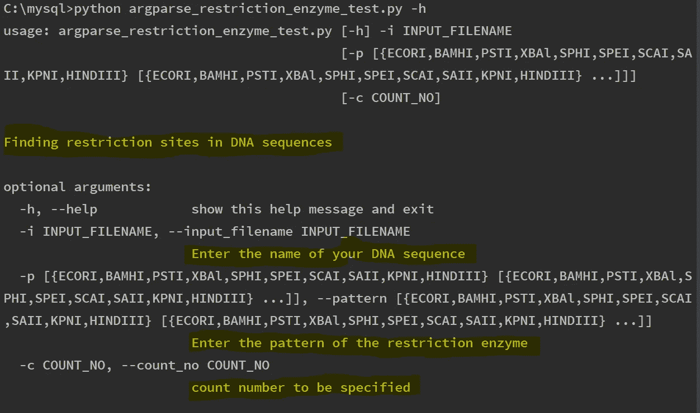

# DNA 搜索-与 argparse 的命令行接口

> 原文：<https://towardsdatascience.com/dna-search-command-line-interfaces-with-argparse-8b11c0862495?source=collection_archive---------21----------------------->

## **寻找小 DNA 片段**

[National Cancer Institute](https://unsplash.com/@nci) via Unsplash

# **命令行与 argparse 接口**

在生物信息学中，经常需要在命令行上运行我们的程序。幸运的是，Python 的 argparse 模块——标准库的一部分——使这变得很容易。

Python 有一系列有用的库，使得构建用户界面变得容易。通常，当我们想到用户界面时，脑海中浮现的是图形点击界面。然而，用户界面是允许用户与程序交互的任何东西，包括命令行界面——这是本文的重点。

为了介绍 argparse，我将构建一个小程序来搜索用户输入的特定小段 DNA。程序将搜索的这些小段 DNA 被称为限制酶位点，即长度在 4-6 个字符之间的小 Python 字符串。这个程序将搜索细菌的基因组，看看它们出现的频率！

# **入门**

该计划有两个明确的目的:

1.  向用户提供信息，例如当程序崩溃时提供有用的信息。
2.  要灵活。该程序应该能够通过改变命令行参数来搜索用户选择的任何 DNA。

首先，导入 argparse 模块并创建 ArgumentParser 对象:

这不是必须的，但是我发现使用**描述关键字参数**提供一个描述性的字符串很有帮助。当程序稍后在命令行中调用帮助时，将提供 python 程序的描述性概述。如果有多个用户，并且程序运行之间有时间间隔，这可能是有用的。

接下来，我们通过调用 **add_argument()方法**来告诉参数解析器对象预期的参数。一旦添加了所有的参数，我们可以告诉它通过调用 **parse_args()方法**来解析命令行参数。

**add_argument()方法**添加了三个参数。此外，还增加了其他各种可选参数，如 **help=，type=，choice=，default= ect** 。

这就是 argparse 模块真正发挥作用的地方。

短参数和长参数分别用单连字符(-)或双连字符(—)指定。这意味着，在终端的命令行上，当程序运行时，参数可以用简写方式表示，输入文件名用-i 表示，或者用简写方式表示，输入文件名用 input _ filename 表示。长短参数的另一个好处是它们可以在命令行中以任何顺序表达！

混合匹配排列中的短参数和长参数如下所示。

我们可以通过使用 help 关键字参数调用 add_argument()来使帮助文本变得更好。当程序在没有命令行参数的情况下运行时，会出现三个参数的有用帮助文本(以黄色突出显示):

**自定义验证**

parser.add_argument 方法中的 type=参数接受 Python 函数的名称

类型参数引用一个函数，例如—输入文件名由名为 file_check 的函数检查。下面显示的这个函数检查文件是否确实存在。

最后，choice 和 nargs 参数意味着用户可以选择选择列表中的任何元素。因为用户可以选择多个参数，所以 nargs 参数是必需的，并且指定了一个星号。

最后，现在已经添加了所有参数和用于输入验证的函数，可以编写一个小脚本了。我先写一个小字典，里面的限制酶名称是键，限制酶识别的对应序列是它们的值。

为了完整起见，我在 restriciton _ enzyme _ dict 字典中包含了这个程序所需的模块。

用户指定的参数以 args 为前缀，后跟其输入名称。

首先打开 DNA 文件，并使用。read()方法。接下来，迭代用户指定的模式。模式代表一个限制酶，是上面字典中显示的关键字，例如 EcoRI 是字典中的关键字；restriction_enzyme_dict，它的值是‘GAATTC’，即它在任何 DNA 样本中识别的序列。

对于每种限制性内切酶，我用。get()方法。它的价值在于它在基因组中识别的序列。正则表达式 re.findall 查找 DNA 中所有出现的序列，并将这些序列附加到结果列表中。

使用集合将结果列表转换为特殊的字典。Counter 方法()，用于计算找到一个唯一序列的次数。

最后，这本由 collections 创建的新词典。可以迭代名为 restriction_sites_dict 的计数器，如果序列超过用户指定的计数，则打印一条消息，告诉用户它被找到了多少次及其序列。

要查看程序的运行情况，让我们运行几个测试示例！

输出示例如下所示:

在这里，我使用 p 标志(p 标志对应于用户指定的模式)搜索了三种限制性内切酶，-p HindIII、EcoRI 和 KpnI。在第一次运行时，我没有指定计数。之前，在 count_no 的 add_argument 中，我将一个有用的默认值设置为 0。

当我再次运行程序时，计数阈值为 500，程序通知我 HindIII 站点低于我指定的 500 阈值。

这个程序运行良好。结果很快返回，并且已经搜索了大肠杆菌的整个基因组内的限制酶位点！非常酷(这个 Fasta 文件是从 NCBI 获得的)，但是在我们的命令行中，我们可以通过指定它们各自的文件名，轻松地选择搜索其他细菌基因组。

最后，阐述一下先前的意图将是有益的。具体来说，该计划被设计得非常灵活。如果用户添加了不正确的限制性内切酶，比如 FakeEnzyme，会发生什么？

*让我们运行程序来找出答案。*

我突出显示了有用的错误消息，如果用户输入了错误的选项，它会提示用户从提供的选择列表中进行选择。

# 摘要

这个简短的教程展示了如何将命令行界面添加到程序中。幸运的是，Python 提供了构建接口的有用库，argparse 就是其中之一。