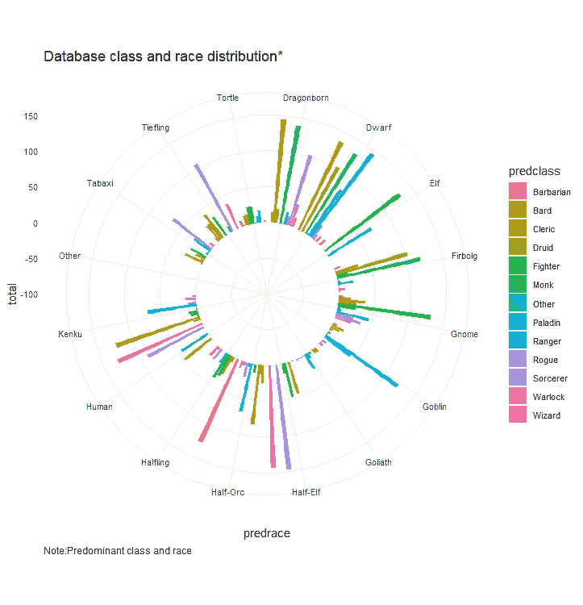

# 使用 R 的 DnD 探索性分析

> 原文：<https://towardsdatascience.com/dnd-exploratory-analysis-using-r-d13757b09768?source=collection_archive---------29----------------------->

## 使用 ggplot、tidyr、scatterplot3d 和 rgl 和 DnD，使用 R 进行数据探索和可视化的综合代码指南。


**fig1:** dnd classes gif using scatterplot3d

在今天的文章中，我们将一步步地了解使用 r 进行探索性数据分析的指南。我们将涵盖从 2D 到 3D 可视化，我们将通过使用来自 github 库的 DnD 数据来完成。为了便于数据可视化和操作，我对最初的数据集进行了一些数据缩减，从 768 个类和 182 个种族缩减为 13 个主要类和 16 个主要种族。

在进入分析的细节之前，这里有一个快速的介绍。

D&D 是一种掷骰子游戏，通常基于一套 7 个骰子(d4、d6、d8、d10、d12、d20 和另一个 d10)。骰子在游戏中起着重要的作用，它们都有不同的用途。例如，d20 通常用于攻击，而 d4，d6，d8，d10 或 d12 用于武器伤害，这取决于武器，性格和一些其他变量。但是当设置角色的分数时，也使用骰子。

根据定义，这使得我们将要分析的数据是随机和离散的，因为它是通过基于掷骰子的计算获得的，因此即使在这个数据样本中可能显示一些模式，这也不意味着这些模式会在其他样本中重复(部分原因是前面提到的随机性概念)。这是 DnD 最好和最有趣的特征之一。

每个 DnD 角色都有自己独特的方式，有不同的职业和种族供你选择，基本上玩家就是能最大限度或最少利用角色技能的人。玩家可以决定在预定义的角色之间进行选择，或者创建自己的角色。当创建一个新的角色时，选择职业和种族，掷骰子来定义不同的能力，并在需要时增加奖励或减少惩罚(视情况而定)。类似地，其他特征，如生命值(HP)、护甲等级(AC)和其他都是通过掷骰子和玩家手册中提到的奖励来定义的。

这里有一个文章不同部分的超链接，你可以直接跳到你感兴趣的部分。

**目录**

[1。分布数值变量](https://medium.com/@lina.berbesi/dnd-exploratory-analysis-using-r-d13757b09768#fcc9)

[1.1 数值变量直方图](https://medium.com/@lina.berbesi/dnd-exploratory-analysis-using-r-d13757b09768#7795)

[1.2 相关图](https://medium.com/@lina.berbesi/dnd-exploratory-analysis-using-r-d13757b09768#834e)

[1.3 装配](https://medium.com/@lina.berbesi/dnd-exploratory-analysis-using-r-d13757b09768#799c)

[2.1 循环剧情类 vs 种族](https://medium.com/@lina.berbesi/dnd-exploratory-analysis-using-r-d13757b09768#c8b4)

[2.2 箱线图类](https://medium.com/@lina.berbesi/dnd-exploratory-analysis-using-r-d13757b09768#5b74)

[3。三维散点图](https://medium.com/@lina.berbesi/dnd-exploratory-analysis-using-r-d13757b09768#ba5a)

# 1.分布数字变量

## 1.1 数值变量直方图

使用 [dplyr](https://cran.r-project.org/web/packages/dplyr/dplyr.pdf) 、 [tidyr](https://cran.r-project.org/web/packages/tidyr/tidyr.pdf) 和 [ggplot2](https://cran.r-project.org/web/packages/ggplot2/ggplot2.pdf) ，我为数据集的所有数值变量创建了一个直方图。

这是一个非常好的组合，因为虽然 [ggplot2](https://cran.r-project.org/web/packages/ggplot2/ggplot2.pdf) 提供了一种强大的图形语言，但是 [tidyverse](https://cran.r-project.org/web/packages/tidyr/tidyr.pdf) 允许我们处理数据，而 [dplyr](https://cran.r-project.org/web/packages/dplyr/dplyr.pdf) 允许我们使用管道操作符% > %从左到右连接数据操作，而不是创建中间对象。

```
dnd %>%
  gather(attributes, value,2:9) %>%
  ggplot(aes(x = value)) +
  geom_histogram(aes(fill=attributes)) +
  facet_wrap(~attributes, scales = 'free_x') +
  labs(x="Values", y="Frequency", title="Distribution numeric variables")
```


**fig2:** histogram using using [dplyr](https://cran.r-project.org/web/packages/dplyr/dplyr.pdf), [tidyr](https://cran.r-project.org/web/packages/tidyr/tidyr.pdf) and [ggplot2](https://cran.r-project.org/web/packages/ggplot2/ggplot2.pdf)

## 1.2 相关矩阵

在 wise 之后，我做了一个相关矩阵来衡量变量之间是否有任何程度的相关。这表明所有变量之间存在正相关关系，但这种关系的强度为 0.4，不能归类为显著。低于 0.6 意味着这种关系甚至不是中度积极的。

这是有意义的，因为 DnD 分数是通过掷骰子获得的，而掷骰子是独立的事件。如果两个随机变量 X 和 Y 是独立的，那么它们也是不相关的。然而，对于其他情况，重要的是要考虑到，如果 X 和 Y 是不相关的，它们仍然是相关的。

```
corrplot(abs(cor(dnd[,2:9])), method="color", col=colorRampPalette(c("red","white","blue")) (200), 
         type="upper", order="hclust", 
         addCoef.col = "black",
         tl.col="black", tl.srt=45, sig.level = 0.01, insig = "blank", diag=FALSE 
)
```


**fig3:** correlogram using [corrplot](https://cran.r-project.org/web/packages/corrplot/corrplot.pdf)

## 1.3 安装

即使在这种情况下，我们只是处理离散变量，对我来说，展示如何以一种快速而简单的方式识别数据集的分布似乎是一个好主意。

为此，选择了[fitdistplus](https://cran.r-project.org/web/packages/fitdistrplus/fitdistrplus.pdf)软件包。这个软件包中的 fitdistr 函数允许我们通过最大化似然函数来估计分布参数。

由于我们的统计数据是从掷骰子中获得的，因此它们符合中心极限定理，趋向于正态分布是有道理的。

```
fp <- fitdist(dnd$AC, "pois",discrete=TRUE)
fnb <- fitdist(dnd$AC, "nbinom",discrete=TRUE)
fg <- fitdist(dnd$AC, "geom",discrete=TRUE)
fn <- fitdist(dnd$AC, "norm",discrete=TRUE)

denscomp(list(fp,fnb,fg,fn),legendtext = c("Poisson", "negative binomial","geometric","normal"), fitlty = 1)
cdfcomp(list(fp,fnb,fg,fn),legendtext = c("Poisson", "negative binomial","geometric","normal"), fitlty = 1)
```


**fig4:** distributions fitting using [fitdistrplus](https://cran.r-project.org/web/packages/fitdistrplus/fitdistrplus.pdf)

# 2.阶级和种族

## 2.1 圆形地块类别与竞赛

对于这一次，我们将像以前一样继续使用 ggplot2 以及 tidyverse 和 dplyr，但我们将包括这个时间极坐标，以便我们可以将它制作成一个圆形条形图。对我来说，这是显示职业和种族之间信息的好方法。

```
dnd_bar <- dnd %>%
  select(name,predrace,predclass) %>%
  add_count(name) %>%
  group_by(predrace,predclass) %>%
  summarise(total = sum(n)) ggplot(dnd_bar, aes(x=predrace, y=total,fill=predclass)) + 
  geom_bar(stat="identity",position="dodge") +
  ggtitle("Database class and race distribution*")+
  labs(caption="Note:Predominant class and race")+
  ylim(-100,150) +
  theme_minimal() +
  theme(
    axis.text=element_text(size=8),
    legend.text=element_text(size=8),
    plot.caption = element_text(hjust = 0)
  ) +
  coord_polar(start = 0)
```



**fig5:** circular plot using using [dplyr](https://cran.r-project.org/web/packages/dplyr/dplyr.pdf), [tidyr](https://cran.r-project.org/web/packages/tidyr/tidyr.pdf) and [ggplot2](https://cran.r-project.org/web/packages/ggplot2/ggplot2.pdf)

## 2.2 箱线图类别

箱线图很好地描述了分布的中心和扩散(可变性。)

通过使用相同的库，我们可以按单个变量绘制箱线图。

```
dnd %>%
  gather(attributes, value,2:9) %>%
  ggplot(aes(x=attributes, y=value)) + 
  geom_boxplot(aes(fill=attributes))+ facet_wrap( ~ attributes, scales="free")
```


**fig5:** Boxplot by variable[dplyr](https://cran.r-project.org/web/packages/dplyr/dplyr.pdf), [tidyr](https://cran.r-project.org/web/packages/tidyr/tidyr.pdf) and [ggplot2](https://cran.r-project.org/web/packages/ggplot2/ggplot2.pdf)

然后，我们可以按组或主要类别复制主要变量的练习:AC、HP 和 Con。

```
ggplot(dnd, aes(y =HP, x = predclass, color = predclass)) + xlab("Predominant class") + ylab("HP") + ggtitle("Comparison HP Among Classes*") + geom_boxplot() + labs(caption="Note:Predominant class") + theme(axis.text.x = element_text(angle = 90),plot.caption = element_text(hjust = 0))ggplot(dnd, aes(y =AC, x = predclass, color = predclass)) + xlab("Predominant class") + ylab("AC") + ggtitle("Comparison AC Among Classes*") + geom_boxplot() + labs(caption="Note:Predominant class") + theme(axis.text.x = element_text(angle = 90),plot.caption = element_text(hjust = 0))ggplot(dnd, aes(y =Con, x = predclass, color = predclass)) + xlab("Predominant class") + ylab("Con") + ggtitle("Comparison Co
```


**fig6:** Boxplot by classes(groups) [dplyr](https://cran.r-project.org/web/packages/dplyr/dplyr.pdf), [tidyr](https://cran.r-project.org/web/packages/tidyr/tidyr.pdf) and [ggplot2](https://cran.r-project.org/web/packages/ggplot2/ggplot2.pdf)

最后，我认为引出 ggplot 的 facet wrap 功能是很好的，当您想通过一个或多个变量(在我们的例子中是组或类)分割您的数据并一起绘制数据子集时，该功能非常有用。

```
ggplot(dnd, aes(y = AC, x = HP,color=predclass)) + xlab("HP") + ylab("AC") + ggtitle(paste0("Comparison Among Classes*")) + geom_boxplot() + labs(caption="Note:Predominant class") + theme(axis.text.x = element_text(angle = 90),plot.caption = element_text(hjust = 0))+ facet_wrap(~predclass)
```


**fig 7:** Boxplot using facet_wrap with [dplyr](https://cran.r-project.org/web/packages/dplyr/dplyr.pdf), [tidyr](https://cran.r-project.org/web/packages/tidyr/tidyr.pdf) and [ggplot2](https://cran.r-project.org/web/packages/ggplot2/ggplot2.pdf)

## 3.三维散点图

最后，即使当我们有实际的 3D 对象或数据映射到其上时，3D 绘图也是可取的。我认为对于这个特殊的例子，我们有多个离散变量，在 2D 有重叠的点，用 3D 绘图来增加透视是有意义的。

为了说明这一点，我将使用 ggplot 绘制 Con 与 AC 的 2D 散点图，然后使用 scatterplot3d 绘制 AC、Con 和 HP 的 3d 散点图，这样我们就可以绘制三维(3D)点云。

```
twod<-ggplot(dnd, aes(x = AC, y = Con, color = predclass)) + geom_point(alpha = 0.2) + labs( title = "Plot Armour Class vs Hit Points by Predominat Class", caption="Note: Predominant class was obtained from the class variable")+ theme(plot.caption = element_text(hjust = 0))
twodlibrary(scatterplot3d)
threed<-scatterplot3d(x =dnd$AC, y = dnd$Con, z = dnd$HP, color = as.numeric(dnd$predclass),pch=16,angle=30)
threed
legend(threed$xyz.convert(41, 3, 310),legend = levels(dnd$predclass), col = as.numeric(dnd$predclass), pch = 16)
```


**fig 8:** 2D plot with [ggplot2](https://cran.r-project.org/web/packages/ggplot2/ggplot2.pdf) and 3D plot with [scatterplot3d](https://cran.r-project.org/web/packages/scatterplot3d/scatterplot3d.pdf)

为了创建 3d 散点图动画，我们将使用 rgl 和 magick 包。

rgl 通过调用不同的函数来工作。下面是他们每个人做的事情。Movie3d 以重复的方式调用函数，将每一帧记录到电影中，而 Play3d 仅用于将可视化显示到 R 中。在这种情况下，要传递给 R 的函数是 spin3d。

关于图例，当你有几个类时，rgl 就有点麻烦了，它是 2D，默认情况下在图的后面，所以根据你的类的数量，它可能很难适应。

```
require(rgl)
with(dnd,plot3d(AC,Con,HP,col=as.integer(predclass),xlab="AC",ylab="Con",zlab="HP",box=TRUE,type="p"))movie3d(spin3d(axis = c(0, 0, 1),rpm=5), duration = 10,type="gif",dir=".",movie="Scatterplot3d")if (!rgl.useNULL())
  play3d(spin3d(axis = c(0, 0, 1), rpm = 5), duration = 10)
```


**fig 9:** 3D plot gif using [rgl](https://cran.r-project.org/web/packages/rgl/rgl.pdf)

作为 magick 的最后一步，我使用散点图 3d 函数在一个循环中创建了一个 png，并通过 points3d 函数添加了一些叠加点，然后我使用 magick 的 image_join 函数将它们连接成一个 gif。这就把我们带到了最初的 gif 和文章的结尾。

```
library(magick)

labels<-as.character(unique(dnd$predclass))
frames <- length(labels)

for (i in 1:frames) {
  name<- paste('00',i,'plot.png', sep='')
  png(name)
  plot.new()
  sp3d<-scatterplot3d(x =dnd$AC, y = dnd$Con, z = dnd$HP, color="darkgrey", type="h",pch=16,angle=30)
  sp3d
  sp3d$points3d(dnd[dnd$predclass==labels[i],c("AC")],dnd[dnd$predclass==labels[i],c("Con")],dnd[dnd$predclass==labels[i],c("HP")],col="red", type="h", pch=16)
  legend(sp3d$xyz.convert(41, 3, 310),legend =c(labels[i],paste0("Non-",labels[i])), col =c("darkgrey","red"), pch = 16)
  dev.off()
}

list.files(path=".", pattern = '*.png', full.names = TRUE) %>% 
  image_read() %>% 
  image_join() %>% 
  image_animate(fps=4) %>% 
  image_write("dnd_classes.gif")
```


**fig10:** dnd classes png used to build the scatterplot3d gif

这都是一个桌游爱好者说的。我希望这个分析读起来很有趣，写起来也很有趣。做关于非传统话题的数据分析，比如桌面游戏，总是很有趣。