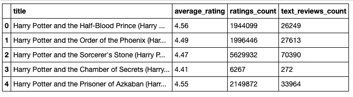
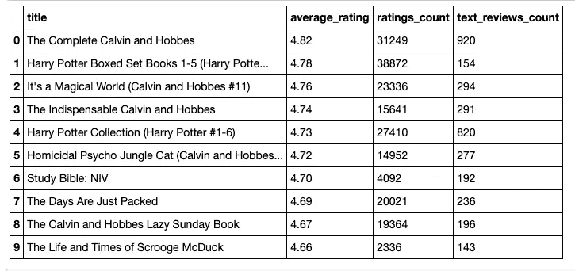
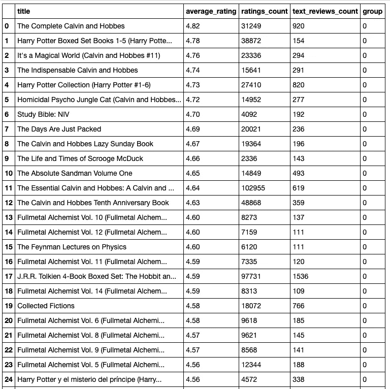
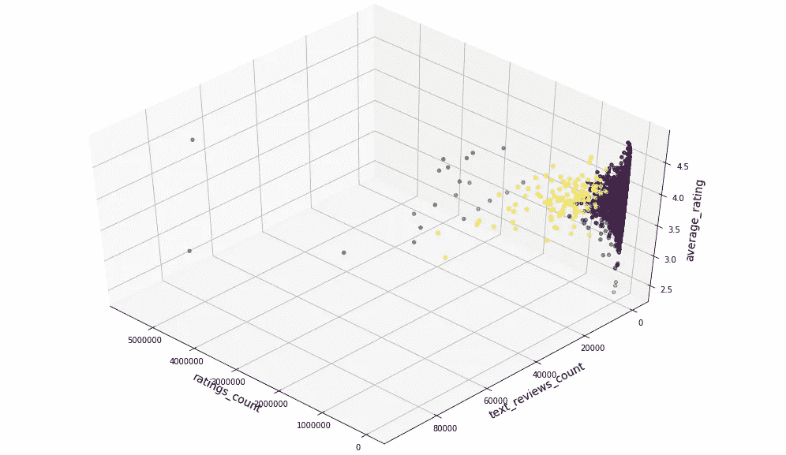
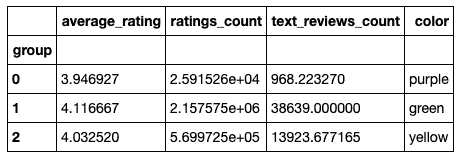
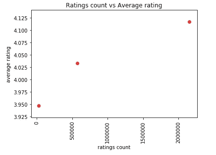
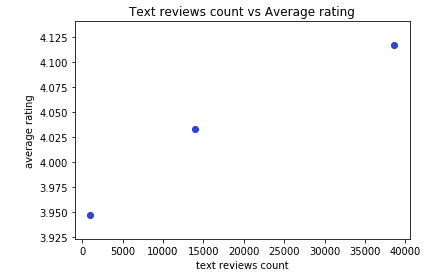

# 评论越多的书评分越好吗？

> 原文：<https://towardsdatascience.com/do-books-with-more-reviews-get-better-ratings-f2f68b13fad8?source=collection_archive---------26----------------------->


## 评分数和评论数等因素如何影响图书评分。

读书是许多人喜欢的活动。这是一种将一个人的思想置于不同的环境中，同时提供一种感同身受的感觉。我自己喜欢看书。我最喜欢的类型是混合了惊悚片的神秘片。我记得读过丹·布朗的《达芬奇密码》。

这是一本很棒的书，它让我对神秘类型的书产生了兴趣。这本书的一切从情节曲折到故事讲述都是史诗般的。读这本书时，我对谁是真正的对手感到困惑。此外，我惊讶于这本书对大教堂等建筑的描述是如此详细，以及罗伯特·兰登在解决谋杀案时的矫揉造作。

在我读完这本书后，我去网上寻找更多关于这本书的信息。我发现这幅美丽的作品得到了书籍收藏网站 Goodreads 3.8/5 的评分。

这个发现让我震惊，我决定去看看 Goodreads 上评价最高的书。随着我在列表中的位置越来越高，我注意到一个趋势，高评级的书籍通常会得到更多的评论。

因此，证实我的这个假设就成了我的一项任务:**评论越多的书收视率越好吗？**

# 获取数据

通过这个[链接](https://www.kaggle.com/jealousleopard/goodreadsbooks)，从 Kaggle 获得了包含书籍及其在 Goodreads 上的评级的所有信息的数据集。

该数据集具有多种特征，如图书 id、标题、isbn、页数、评级计数、作者、平均评级、语言和文本评论计数。数据集被缩减到包括重要的特征，如标题、评分数和文本评论数。

它被进一步删减，只包括那些超过 1000 人评价和超过 100 人评论的书籍。用于执行此任务的代码如下所示:

```
## The dataset was truncated to include relevant information
df_books = df_books[df_books['ratings_count'] > 1000]  
df_books = df_books[df_books['text_reviews_count'] > 100]
```

新形成的数据集被进一步分析然后聚类。



A table of the first five rows of the new dataset.

# 分析数据集

对数据集进行分析，以降序排列书籍的评级，检查排名前十的书籍。然后，进行了一项推断，看看书籍的评级是否随着文本评论数和评级数的增加而增加。



The top ten books based on average ratings.

事实证明，书籍的评级并不一定意味着比低于或高于它们的书籍的评级数或文本评论数更高。但是，数据集有 4815 行。因此，基于十行进行教育猜测是不够的。如果我们通过对行进行分组来检查整个数据集，效果会更好。

# 数据集聚类

该数据集被聚类，以找出获得大量评级和评论的群体与没有获得大量评级和评论的群体之间是否存在显著差异。使用一种称为 k-means 聚类的方法对数据集进行聚类。

K-means 聚类是一种无监督的机器学习算法，其中数据集学习根据数据点与其他数据点的相似性将数据点分类成组。

数据集可以被聚类到定义数量的组中。图书数据集被分为三组。将数据集分组后，每一行都被赋予一个数字 0、1 或 2。



The first 25 rows of the dataset after it was grouped into three groups.

一个新的列被添加到名为 group 的表中，以表示每本书属于哪个组。

# 结果呢

在进一步检查后，创建了一个 3d 图像来完美地显示书籍的平均评级、文本评论数和评级数之间的关系。以下是聚类数据集的图示:



A 3-d representation of the dataset.

这三组的数据点被染成紫色、黄色和绿色。标记为 0 的组为紫色，而标记为 1 和 2 的组分别为绿色和黄色。

紫色组的大多数数据点分布在平均评分轴上，但评分数和文字评论数最少。一般来说，就评分而言，黄色组的范围比紫色组小，但它的评分数和文字评论数比紫色组高。

绿色组的评分范围与黄色组相似，但总体而言，绿色组的评分数和文字评论数高于黄色组。

创建了一个表格来显示每个组的平均差异。



A table showing the average of each group’s average rating, ratings count, text reviews count and graphical color.

根据表格，结果是紫色组在各方面都远远落后于黄色和绿色组。紫色组的平均评分为 3.94，评分数为 25，900，文本评论数为 968。黄色组的平均评分为 4.03，评分数为 570，000，文本评论数为 13，923。绿色组的平均评分为 4.12，评分数为 2，157，575，文本评论数为 38639。

下面是显示各组之间关系的散点图:



A scatter plot of the average rating versus ratings count for the groups.



A scatter plot of the average ratings vs text reviews count for the groups.

基于这两个散点图，我的假设已经被完全证实了。一般来说，一本书得到的评论越多，它的评级就越高。

书是由粉丝和评论家来评分的。评论家比书迷更有可能以非常仔细的方式评论书籍。但是，相比粉丝，评论书籍的评论家少之又少。因此，一本书越受欢迎，越多的书迷可能会认为它是完美的，这意味着受欢迎程度可能是一个混杂变量。

**用来构建这个聚类模型的完整版本代码可以在这里**[](https://github.com/MUbarak123-56/DataBEL/blob/master/Books%20Clustering%20project.ipynb)****看到。****