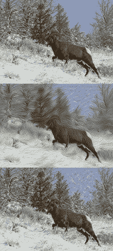
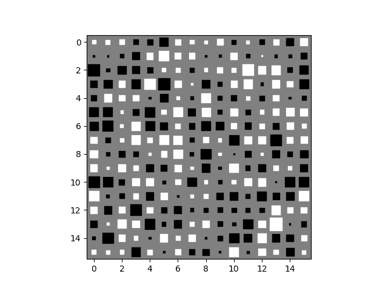
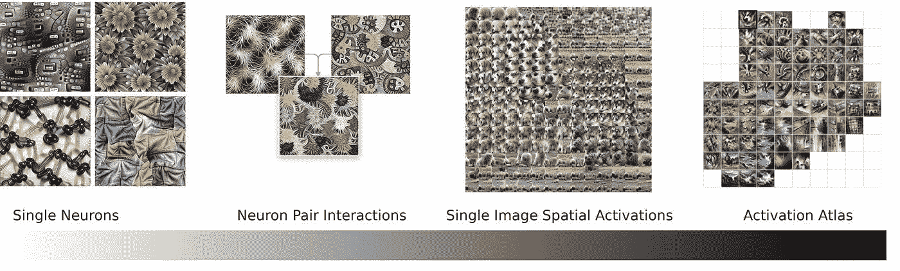
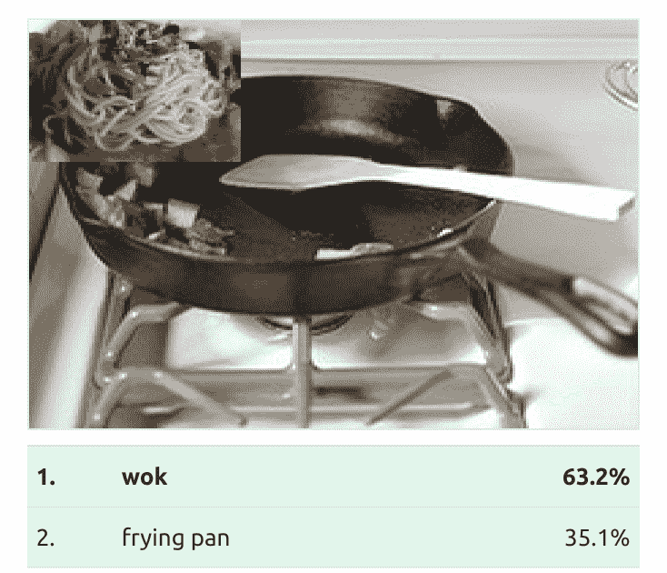

# Conv 网会梦到迷幻的绵羊吗？

> 原文：<https://towardsdatascience.com/do-conv-nets-dream-of-psychedelic-sheep-40f4d35fa146?source=collection_archive---------33----------------------->

在连续的抽象层次上深度做梦。从上到下:输入图像，con v2–3x 3 _ reduce，inception_4c-1×1。使用 [*制作的 deepdreamgenerator*](https://deepdreamgenerator.com/) *和公共领域图片来自* [*黄石国家公园 NPS*](https://www.flickr.com/photos/yellowstonenps/11296378705/in/album-72157647227252459/)

# 深度学习的普遍存在

深度学习的现代成功部分归功于乔治·西本科、库尔特·霍尼克和其他人开发的[通用逼近定理](https://en.wikipedia.org/wiki/Universal_approximation_theorem)。该定理本质上陈述了具有至少一个隐藏层和非线性激活函数的神经网络通常可以逼近任意连续函数。在过去的十年里，为训练深度网络而重新使用[强大的 GPU](https://www.exxactcorp.com/NVIDIA-Tesla-GPU-Solutions)释放了通用逼近定理的潜力，催生了许多新的商业和研究领域。在深度学习模型中，许多隐藏的层可以像通天塔一样一层一层堆叠起来，内部表示可以用来表示复杂的抽象和功能层次。这些表征可以是模型的一部分，从看似无关紧要的事物中预测任何事物，如[无意义的天体物理学首字母缩写词](https://aiweirdness.com/post/184136874667/physics-acronyms-there-was-an-attempt)、流式视频偏好和约会匹配；潜在的严重后果:信用风险评级、医疗诊断和约会匹配。

鉴于它们的普遍性，理解深度神经网络模型如何形成输入数据的内部表示并做出决策比以往任何时候都更重要。在实践中，通过随机梯度下降的变体的反向传播确实可以很好地适应训练数据，但是不能保证全局收敛，并且输入数据和学习过程经常以令人惊讶的方式相互作用。

[https://www.youtube.com/watch?v=tlOIHko8ySg](https://www.youtube.com/watch?v=tlOIHko8ySg)

# 深层网络的不稳定性

深度网络令人惊讶的学习方式导致许多人将训练和使用神经网络的整个过程称为“黑箱”，特别是在流行媒体中。当模特[表现不好](https://www.technologyreview.com/s/612876/this-is-how-ai-bias-really-happensand-why-its-so-hard-to-fix/)时，这些描述会导致糟糕的表现和公众的挫折感。

如果你从事深度学习，尝试理解你的模型在想什么是值得的。理解模型并清楚地预测它们的行为不仅有助于提高模型的性能，而且社会[对隐私](https://blog.exxactcorp.com/a-tutorial-introduction-to-privacy-centric-deep-learning/)的关注以及欧洲 [GDPR](https://en.wikipedia.org/wiki/General_Data_Protection_Regulation) 等法规也恰当地[鼓励了面向公众的机器学习中增强的解释能力](https://www.kdnuggets.com/2018/03/gdpr-machine-learning-illegal.html)。

# 简单的模型，简单的可视化

曾几何时，神经网络的参数从数百到数千，直接检查神经元激活是可行的，并可能富有成效。神经网络活动的一个经典的直接可视化是辛顿图(还有谁？)，它通过正方形网格的大小和阴影直接显示积极和消极激活。

在某些情况下，可视化单个神经元的活动(使用一些其他技巧)仍然是有见地的，例如 OpenAI 的[无监督情绪神经元](https://openai.com/blog/unsupervised-sentiment-neuron/)工作或 Andrej Karpathy 等人的[可视化递归神经网络](https://arxiv.org/abs/1506.02078)(与[相关的博客文章](https://karpathy.github.io/2015/05/21/rnn-effectiveness/)，大约占页面的 3/4)。然而，即使在这种情况下，找到一个有意义的可解释的神经元也是一次钓鱼探险，大多数神经元仍然是相当难以理解的。

# 在大型模型中构思见解

你可能已经看到了谷歌的迷幻概念/深梦技术的一些迭代。深度做梦是减少神经网络黑盒神秘性的早期尝试。通过使用网络来不断增强与给定神经元的激活相关的特征，可以生成图像来获得关于在神经网络结构中如何形成表示和决策的一些想法。这可以被拟人化为网络看着一张图片，问“图片内容让我想起了什么，我怎样才能让它看起来更像这样？”运用深度梦境技术是这篇文章的标题图像的来源。在不同的层应用这种技术会产生不同层次的抽象。在标题图像中，一只大角羊在 con v2–3x 3 _ reduce 层中做梦，这在网络中很早就出现了，产生了像笔触一样的纹理。这些是你在不同方向的边缘、点和曲线检测器，倾向于被深度 conv 网络的前几层中的卷积核学习。在 inception_4c-1×1 层中稍微深入一点，我们看到与用于训练 inception 模型的类的类型相关联的特征集合怪异地覆盖在图像上。

深度做梦当然获得了足够的关注，并被用作制作美丽图像的创造性工具，但深度做梦本身并没有提供多少可操作的见解。这可能是从手臂必须从哑铃中长出来的启示中得来的。

*谷歌的 4.0 版让 CC 长出了粗壮的手臂。*

神经网络计算机视觉中应用的其他可视化技术包括 Jason Yosinski 等人的特征可视化工具箱([演示视频](https://www.youtube.com/watch?v=AgkfIQ4IGaM))，如果你准备用 [Caffe](https://www.exxactcorp.com/Caffe) 建立一个 Python 环境，你可以[亲自尝试一下](https://github.com/yosinski/deep-visualization-toolbox)。作者展示了几个主要属于“有趣”类别的观察结果，如对面孔、文本和褶皱织物做出反应的神经元。从“有趣的”实现到可操作的见解的点连接是可解释性开始回报时间和工具投资的地方。事实上，它本身已经成为机器学习的一个子领域，满足了对拥有可解释机器学习技能的研究人员和工程师的需求。这对你的个人或组织工具箱是一个有价值的补充。

# 从可视化到可操作的效用

也许对深度学习可解释性最有凝聚力的研究来自克里斯·奥拉、谷歌大脑和 OpenAI 的汇合。追溯到几年前，主要发表在蒸馏上，这项工作建立在深度梦和特征可视化的概念上，以开发基于[优化的可视化](https://distill.pub/2017/feature-visualization/)，进一步开发以理解具有[空间激活](https://distill.pub/2018/building-blocks/)的属性，并且随着[激活图集](https://distill.pub/2019/activation-atlas/)的最近出版，作者展示了对对抗示例和奇怪特征相关性的漏洞的见解。

*激活图谱是一系列研究中的最新进展，从简单的:单个神经元激活的特征可视化，到复杂的:从代表网络可能遇到的所有可能图像的流形中进行子采样的激活图谱。图片修改下一张* [*CC 由 4.0*](https://creativecommons.org/licenses/by/4.0/) *授权来自* [*山卡特、克里斯奥拉等人 2019*](https://distill.pub/2019/activation-atlas/)

激活地图集与相关的[空间激活](https://distill.pub/2018/building-blocks/)部分相似，但有一个关键区别。虽然空间激活表示单个图像的模型特征提取，但是激活图谱形成所有可能图像的特征提取图。例如，不是在小狗的图像上排列松软的耳朵、可爱的噪音和毛绒绒的爪子的特征可视化，而是激活地图集将各种各样的动物鼻子排列在一起，这些鼻子最终将融入其他相关特征，如皮毛、耳朵和尾巴。

这种神经网络特征可视化的整体视图允许以有趣的方式调查和预测模型行为。通过观察区分“水肺潜水员”和“浮潜”的特征与看起来像属于机车引擎的特征的接近程度，作者猜测他们可以从火车图像中引入一个补丁，以欺骗网络将浮潜者识别为水肺潜水员。该团队调查的其他对抗性例子包括通过添加面条将煎锅伪装成炒锅，以及通过添加棒球将灰鲸伪装成鲨鱼。

*做煎锅和炒锅只需要几根面条。图片使用下一张* [*CC 通过 4.0*](https://creativecommons.org/licenses/by/4.0/) *许可来自* [*山卡特、克里斯奥拉等人 2019*](https://distill.pub/2019/activation-atlas/)

# 向前发展的可解释价值

总之，自《深度梦》以来，可解释性领域已经发展了很多，并开始提供可操作的见解。用激活地图集生成的对抗性例子的类型依赖于全网络特征可视化和人类直觉的巧妙结合。随着深度学习网络继续部署到新的领域，并在现有领域中获得更大的采用，它们将被认为更负责任，更可预测地可靠。在这种情况下，对可解释性工具和从业者产生的需求和价值只会增加。

*原载于 2019 年 5 月 14 日*[*https://blog.exxactcorp.com*](https://blog.exxactcorp.com/conv-nets-visualization-interpretation)*。*