# 选举会影响股市吗？

> 原文：<https://towardsdatascience.com/do-elections-affect-the-stock-market-c28562646c71?source=collection_archive---------8----------------------->

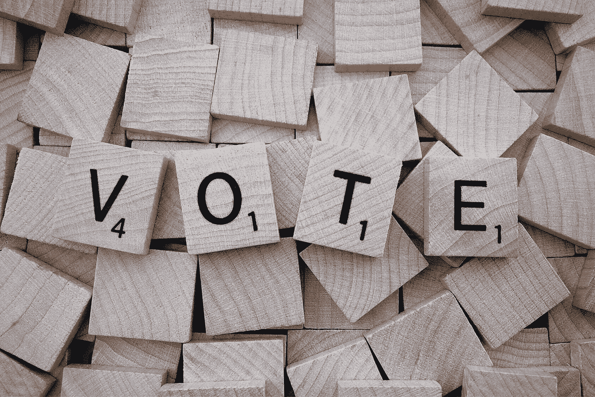

**印度大选今天开始——4 月 11 日**，我想以请求所有在印度并且达到投票年龄的人开始这篇文章——**请投票！**投票做出你想看到的改变。

特别是所有国家的大选，使得各行业通常对新政府可能带来的新政策或政策变化处于投机模式，这些政策可能会对公司的运作产生不利或有利的影响。这反过来影响他们在股票市场上的价格，并使投资者对市场持不同看法。关于在选举期间应该如何投资，一直存在争议。我将通过我的分析来回答这些疑问，重点将是回答以下问题:

*   我应该在选举之前还是之后投资？
*   我应该等到选举的影响消退吗？
*   在这一时期有什么特别的行业在增长吗？
*   有我应该远离的部门吗？

## 数据收集

为了分析，我们需要选举日期前后的指数历史数据，我们从— [**BSE 官方网站**](https://www.bseindia.com/indices/IndexArchiveData.html) 获取。我们将下载 BSE Sensex 指数、BSE 100 指数、BSE 200 指数& BSE 500 指数以及各种行业指数数据。让我们从 [**维基百科**](https://en.wikipedia.org/wiki/2014_Indian_general_election) 获取选举日期。我们将回顾过去 4 年的选举— **2014 年，2009 年，2004 年，1999 年**。让我们来看 6 个数据点 **(Return %)** 进行分析——选举前 6 个月——这将是与选举前 3 个月的数据进行比较的基础。其他数据点是选举前 1 个月、选举月、选举后 1 个月、选举后 3 个月和选举后 6 个月。

## 2014 年选举

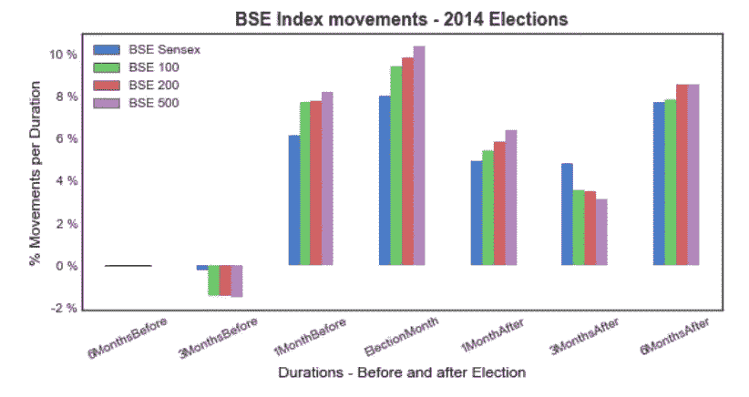

让我们先来看看最新的数据——2014 年大选，我们看到 **3 个月前**市场下跌约 **1.5 %** ，之后在**大选月市场处于牛市，BSE 指数**上涨**10**。现在让我们来看看行业指数****

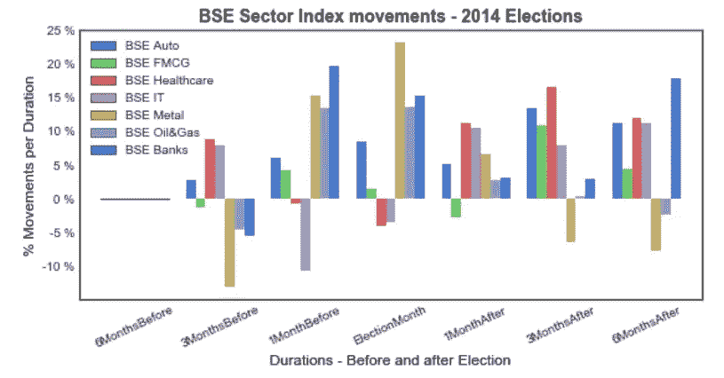

扇区数据与 BSE sensex 数据密切相关。**疯牛病汽车、疯牛病医疗和疯牛病银行指数上升**，并且在整个选举过程中保持**一致**。而 BSE 金属是最不稳定的。

## 2009 年选举

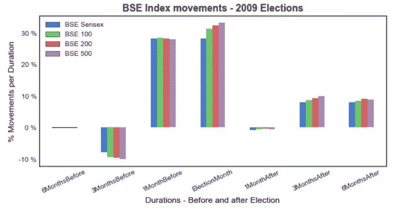

从技术角度来看，2009 年**选举的模式与 2014 年**相似，但是我们看到**在选举后市场增长(大约。~9%)** 不像**之前和期间(大约。30%)** 选举月。

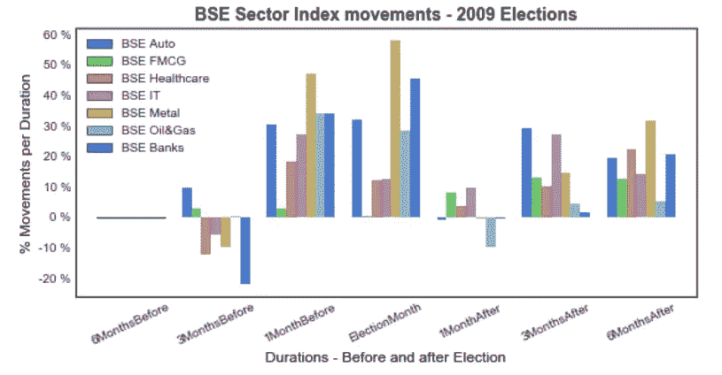

大多数行业在选举前后都上涨了。 **BSE Auto，BSE IT** 分别上升和**一致**。 **BSE Metal** 在选举月期间经历了**持续的高增长期(接近 60%)**—这可能是由于帮助金属公司的政策变化。 **BSE FMCG 在选举期间**没有任何**重大动作**。

## 2004 年选举

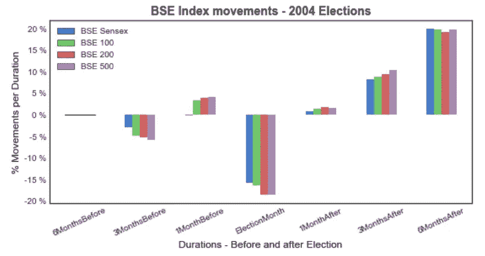

2004 年选举见证了非常**低迷的市场**，直到**选举结束**。市场受选举结果的影响，在选举月下跌了大约 20%,一个月后才回升。然而，我们可以看到选举后的持续增长，并达到接近。6 个月后约为 20%。

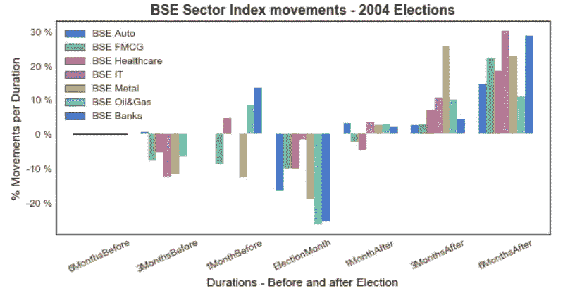

这些板块紧随 BSE Sensex 指数。**在选举月期间，所有行业都下跌了近 20%**而在选举后都上涨了， **BSE 金属、BSE IT 和 BSE 银行的涨幅最大。**

## **1999 年选举**

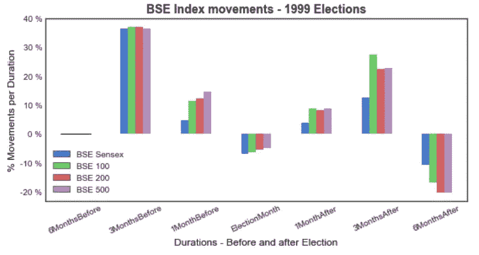

选举前市场繁荣**达到接近 40%的**。然而，在选举期间和之后，市场经历了短暂的增长，然后在 6 个月的时间里，T42 下跌了近 20%。

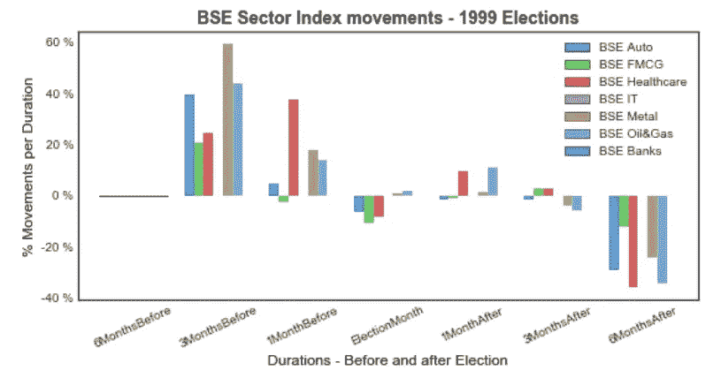

**扇区**再次**非常紧密地跟随**和 **BSE Sensex。市场对新政府的预期上升，BSE **金属上涨近 60%** 但是所有**行业在大选**后下跌近 40%。政府是否没有信守承诺？(可能吧！)**

## 推理

正如我们通过这些年的各种图表所看到的，我们看到，通常选举后市场会上涨，让我们看看交叉对比数据并进一步分析。

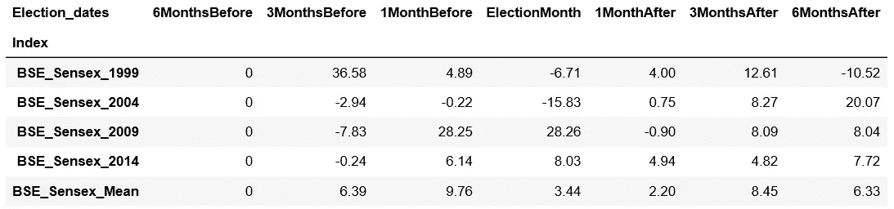

BSE Sensex cross comparison data over last 4 election years.

我们看到 BSE Sensex 意味着数据表明**市场通常在选举前上涨，在选举月期间和之后增长非常缓慢，然后回升**。理想的策略是**在选举前 3 个月开始建立你的投资组合，并在选举后 3 或 6 个月继续保持。让我们看看我们可以投资或远离的行业。**

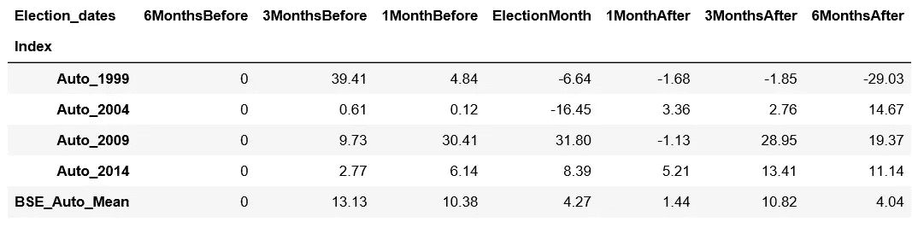

BSE Auto Index cross comparison data over last 4 election years.

**汽车似乎是所有指标中最一致的**指标。增长没有其他指数那么快，下跌也没有那么快。**的策略将是尽早投资优质汽车股，并在选举后大约 3 到 6 个月卖出。**

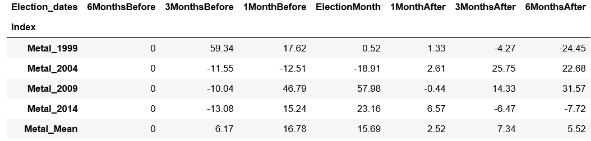

BSE Metals Index cross comparison data over last 4 election years.

**金属指数似乎是所有指数中波动最大的，**它们有大起大落。策略是关注有利于金属公司的政策，如果不远离金属行业，就投资。

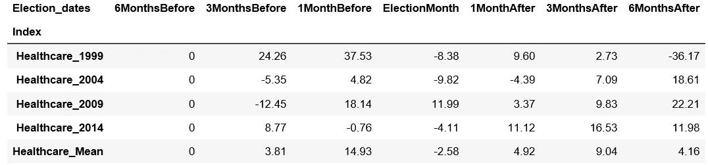

BSE Healthcare Index cross comparison data over last 4 election years.

**像汽车这样的医疗保健指数似乎与其增长非常一致**。**回报与 sensex 或 Auto 回报**不匹配，但是，如果我们可以投资**顶级医疗保健股票，在选举临近时投资并在选举后大约一个月或三个月出售它们将是理想的。**

伙计们，这就是我现在要说的！对于对代码感兴趣的人——可以参考我的 [Github 链接](https://github.com/Mojocolors/ElectionAffectStockMarket)。我希望你喜欢读这篇文章，如果我错过了什么或者有什么反馈，请在评论中分享。