# 女员工赚钱少吗？

> 原文：<https://towardsdatascience.com/do-females-employees-make-less-money-56275d00da4c?source=collection_archive---------13----------------------->

## 在 Python 中浏览测量数据

使用 pandas、Seaborn、Matplotlib 和 Scipy 进行调查数据分析。


这是我在 Medium 上的第一篇文章，正因为如此，我决定用调查数据来练习一些统计学。为了做到这一点，我将使用布伦特·奥扎薪酬调查，据我所知，该调查自 2017 年以来每年发布一次。这里的主要思想是回答以下问题:**女性雇员比男性雇员挣得少吗？**。许多人会说“是的！他们肯定有！”，其他人可能会说“当然，女性挣钱少！”。在我看来，当我们做出这种声明时，我们必须关注一种叫做确认偏差的东西。换句话说，如果你认为女性的工资比男性低，那么你就有可能在没有深入分析你正在处理的数据质量的情况下就做出这种判断。

我们将使用 pandas、Matplotlib、seaborn 和 Scipy 来理解我们的数据。此外，我们还将使用 2019 年数据专业人员薪酬调查结果，你可以在 [Bent Ozar 的网页](http://Possessive last names)上找到它。

把这篇文章作为一种方法，可以帮助你分析一些调查和任何其他数据，你想统计检查。

**数据探索**

让我们首先导入一些我们将需要的库，然后浏览数据。

```
#**Import libraries**
import pandas as pd
import numpy as np
import matplotlib.pyplot as plt
import seaborn as sns
%matplotlib inline
sns.set_style(‘ticks’)
#**Ignore woarnings**
import warnings
warnings.filterwarnings(‘ignore’)# **Import data**
raw_data = pd.read_excel(‘2019_Data_Professional_Salary_Survey_Responses.xlsx’,header = 2)
raw_data.head()
```

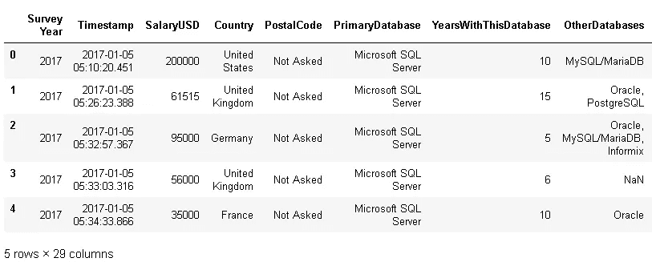

让我们看一下数据类型，并检查数据集中是否有 nan 变量。

```
raw_data.info()
```

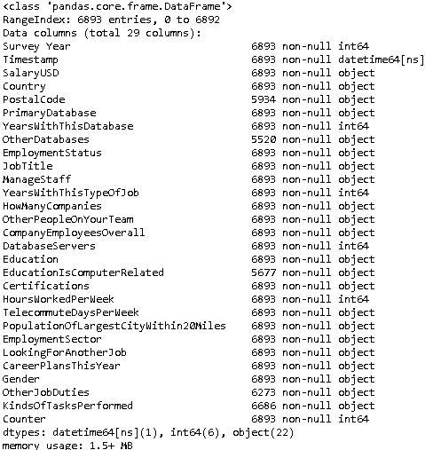

首先引起我注意的是 SalaryUSD 专栏。这个特性必须是数字的，为了用这个数据做一些数学运算，我们必须把它们转换成浮点数。另外，经过一些观察，我注意到在薪水栏中有一些字符应该被删除。此外，由于一些行被标识为 integer，另一些被标识为 float，我创建了一个函数来处理所有这些数据，将它们转换为 string，然后将整个列转换为 float。最后，DataFrame 的列标签上的所有空格(“”)都已替换为下划线(“_”)。

```
#**Convert all of the salary rows into string**
def str_salary(salary):
    sep = '.'
    if type(salary) == int:
        salary = str(salary)
    elif type(salary) == str:
        # Replace characteres and take the cents out of our data
        salary = salary.replace(" ","").replace("$","").replace(",","").split(sep)[0]
    elif type(salary) == float:
        salary = str(salary)

    return salary# **Replace spaces(“ “) in columns name with underscore (“_”)**
raw_data.columns = raw_data.columns.str.replace(“ “,”_”)# **Apply str_salary function**
raw_data['SalaryUSD'] = raw_data.SalaryUSD.apply(str_salary)
raw_data['SalaryUSD'].head()
```

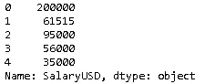

为了只分析 2019 年的数据，我们将按年份和与我们的分析相关的列过滤数据框架。

```
df = raw_data.loc[raw_data.Survey_Year == 2019, ['Survey_Year','Country','SalaryUSD','JobTitle','YearsWithThisTypeOfJob','Education','Certifications','PopulationOfLargestCityWithin20Miles', 'Gender' ]]
df.head()
```

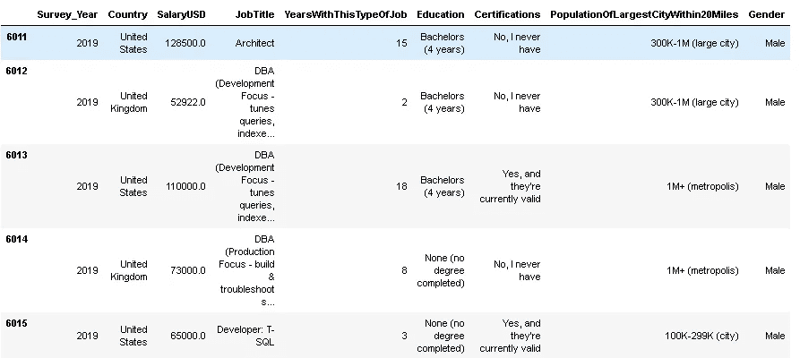

既然我们已经定义了我们的数据框架，我们现在能够获得一些信息。首先，让我们统计各个国家的雇员人数，并研究我们拥有更多数据的国家。其次，我们将按职位统计员工人数，最后统计男女员工总数。

```
# **Answers by Country**
df.Country.value_counts()
```

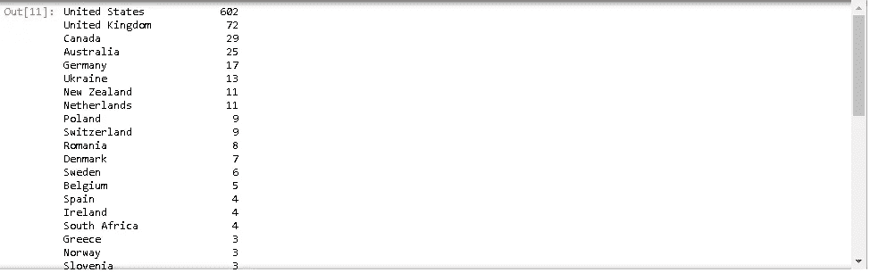

正如我们所看到的，在本次调查中，我们有更多来自美国的员工，因此，我们将过滤我们的数据框架，以便只处理美国的数据。

```
#**Filter dataframe by country**
US_2019 = df.loc[df.Country == ‘United States’,:]
US_2019.head(3)
```

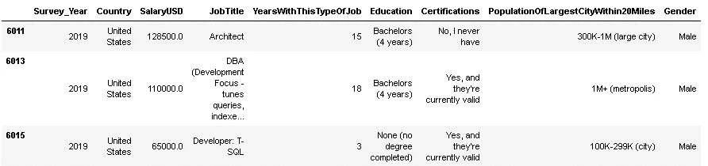

所以，让我们来看看按性别划分的员工数量，看看我们能否从中获取一些信息。女性和男性雇员的数量是否相等，或者至少接近相等？我们来看看这个！

```
US_2019.Gender.value_counts()
```

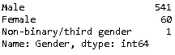

似乎我们在这里有一个问题。不幸的是，男性的总数远远大于女性。此外，由于 2019 年只有一名非二元人回答了调查，我们无法从非二元性别中获得任何统计信息。所以，让我们去掉这一行，只关注两种性别。

```
# **Delet the row - Non-binary/third gender**
US_2019 = US_2019[US_2019.Gender != 'Non-binary/third gender']
US_2019.Gender.value_counts()
```

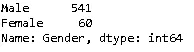

好的，我们已经知道(不幸的是)女性的数量远低于男性。现在让我们来回答以下问题:就职称而言，性别是如何分布的？我们先统计一下每个岗位的员工人数。#职位名称
US_2019。JobTitle.value_counts()

```
# **Job Titles** 
US_2019.JobTitle.value_counts()
```

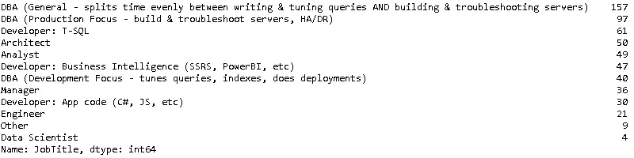

让我惊讶的是，我们只有 4 个数据科学家，21 个工程师……好吧，这个就不考虑了！所以，现在我们有了这个调查中的职位概述。职位性别分布如何？我们来看看这个！

```
# **number of each gender by job title**
Gender_df = US_2019.loc[ : , [‘JobTitle’, ‘Gender’, ‘SalaryUSD’ ]]
Count_gender = Gender_df.pivot_table(Gender_df, index = [‘JobTitle’, ‘Gender’], aggfunc= ‘count’)
Count_gender
```

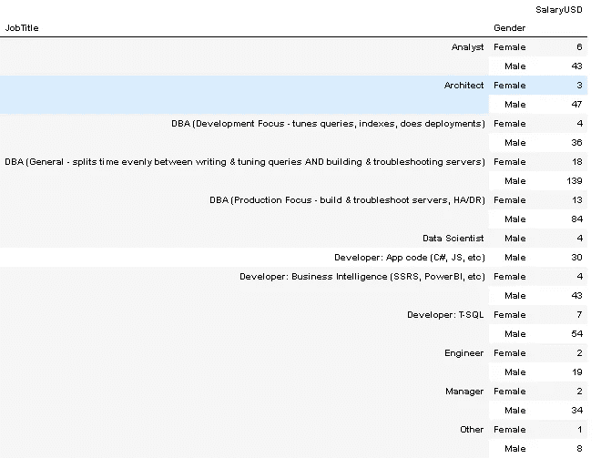

我不知道你们是怎么想的，但是我是视觉型的学习者，这就是为什么我真的喜欢制作图表的原因。我们可以使用 seaborn 库用我们刚刚检查过的信息构建一个条形图。

```
import seaborn as sns
# **use Seaborn styles**
sns.set()
pd.pivot_table(Gender_df, index= 'JobTitle', columns= 'Gender', aggfunc= 'count').plot(kind= 'barh', figsize= (9,9))
plt.xlabel("Salary USD")
```

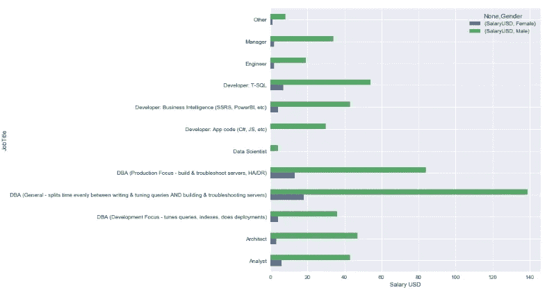

上图清楚地显示了性别之间的差距，不仅是总体上回答调查的员工，还包括职位。你在你的公司注意到这一点了吗？

太好了。现在我们知道在我们的调查中有 541 名男性和 60 名女性，我们还知道在所有的职位中男性员工的数量要多得多。需要注意的是，我们不能保证这些事实是绝对真实的，因为我们不知道调查是如何进行的。此外，我们必须意识到我们的在线样本的代表性，这样我们才能相信从我们的互联网调查数据得出的结论的有效性。换句话说，数据可能有偏差。

例如，在进行调查时，我们倾向于对某些类型的人(在本例中是员工)进行过度采样，而对其他人进行欠采样。并不是所有人都知道 Brent Ozar 的网站——负责这项调查的网站，如果其他人对这种主题不感兴趣，他们就更不可能参与这项调查。

我们可以尝试使用加权等统计技术来处理这个问题，以补偿这种类型的“采样偏差”。这不是我们分析的情况，我们将只是从我们的数据中得出一些直观的见解，并实践一些基本的统计数据，因为我们并不真正担心这个话题。

# **工资**

是时候看看工资数据了，这样我们可以检查一下里面是否有缺口。重要的是要记住，我们不会考虑一些特征，如工作经验、教育程度和公司规模，因为我们只想回答一个简单的问题:女性和男性的工资有差距吗？例如，我会用这些特征来回答为什么男女之间存在或不存在差距。也就是说，让我们从薪水栏开始分析。

直方图通过将数据分组到箱中来显示指标变量值的间隔频率。让我们来看看工资的分布情况。你觉得会怎么样？嗯，我认为它看起来像一个正偏的高斯分布，很少有员工的收入超过特定的阈值(可能是 15 万美元)。

```
#**Import sub-package stats from scipy library**
from scipy import stats
sns.distplot(US_2019.SalaryUSD, fit = stats.norm)
```

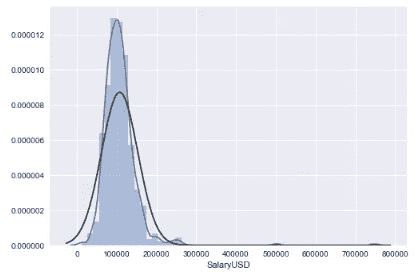

猜得好！上面的直方图与我预期的相似(不完全相同)。数据看起来接近正态分布，或者至少看起来是钟形的。正常吗？让我们检查一下。

# **常态测试**

我们将通过一个定性分析(Q-Q 图)和两个定量检验(夏皮罗-维尔克和达戈西诺的 k2 检验)来检验数据的正态性。

## *定性正态性检验*

Q-Q 图是检查数据分布的常用图。分位数-分位数图或 Q-Q 图生成我们与之比较的分布样本(在这种情况下为正态分布)。生成的样本被分成多个分位数，样本中的每个数据点都与分布中的一个相似成员相结合，我们将在相同的累积分布中与该成员进行比较。因此，我们有一个散点图，x 轴是理论值，y 轴是数据样本分位数。

```
#Import qqplot
from statsmodels.graphics.gofplots import qqplot
qqplot(US_2019.SalaryUSD, line = ‘s’)
```

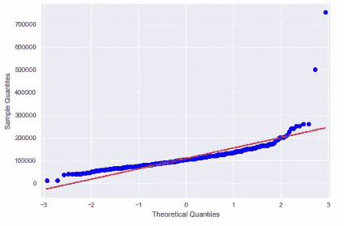

那么，我们该如何解读这个情节呢？嗯，蓝点与红线的偏差显示了与我们正在比较的分布(高斯)的偏差。基于此，我们可以说，我们的特征似乎不是正态分布的良好匹配。如果数据呈正态分布，大部分蓝点会在红线上，事实并非如此。即使线上有很多蓝点，但不在线的还有很多。这表明数据将呈现不同的分布，正如我们在直方图中观察到的那样。

## ***定量常态检验***

除了前面的分析，我们将使用两个定量测试来检查我们的数据的正态性。让我们从夏皮罗-维尔克检验开始，它评估一个特定的样本，并量化数据遵循正态分布的可能性。据我所知，夏皮罗-维尔克检验不仅是一个可靠的检验，而且是一个广泛使用的检验，我们可以使用 SciPy 库中的 Shapiro()函数来应用它。此函数返回由测试计算的 W 统计数据和 p 值。

我们要用的第二个测试是达戈西诺的 k 测试。该正态性检验计算数据的峰度和偏斜度，以确定它们是否遵循高斯分布。基本上，该测试所做的是将样本的偏斜度和峰度结合起来，以产生正态性的综合测试。对于那些不熟悉这些术语的人来说，峰度是分布有多少在尾部的量化，而偏斜是分布有多少被向右或向左推动的量化(它衡量分布的不对称性)。为了计算 de 统计和 p 值，我们将使用 SciPy 库中的 normaltest()函数。

***夏皮罗-维尔克试验***

```
from scipy.stats import shapiro
statistic,p = shapiro(US_2019.SalaryUSD)
print(f'P-value: {p :<.3f}')#**For a threshold of 5% (alpha)**
if p > 0.05:
    print(f'Sample looks Gaussian (fail to regect H0)')
else:
    print(f'Sample does not look gaussian ( regect H0)')
```

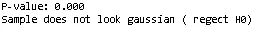

**达戈西诺的 k2 测试 **

```
from scipy.stats import normaltest
statistic,p = normaltest(US_2019.SalaryUSD)print(f'P-value:{p:<.3f}')#**For a threshould of 5% (alpha)**
if p > 0.05:
    print(f'Sample looks Gaussian (fail to regect H0)')
else:
    print(f'Sample does not look gaussian (regect H0)')
```

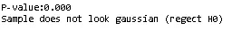

因为我们已经定性和定量地分析了我们的测试，我们可以对数据做一个假设。到目前为止，我们使用的所有测试和可视化技术都不表示正态分布。

# **离群值**

为了确保我们的数据能够恰当地代表我们的问题，我们必须意识到数据集中存在异常值的可能性。异常值是超出预期范围的条目，与其他观察值不同。它们会影响我们数据分布的偏斜度，从而影响一些统计术语，如标准差和均值。特别是，由于计算的方式，这些度量对异常值非常敏感。

让我们按性别划分我们的数据，并绘制一个箱线图，这样我们就能够通过它们的四分位数来说明我们的数据。这也可以帮助我们识别一些潜在的异常值，例如位于图中触须之外的那些数据。

```
fig = plt.figure(figsize = (10,8))
sns.boxplot(x = ‘Gender’, y = ‘SalaryUSD’, data = US_2019)
```

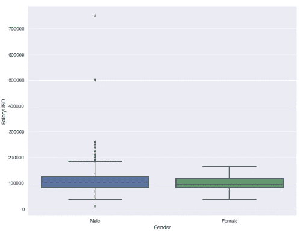

# 统计数字

让我们计算一些项，以便对数据有所了解。

```
def statistics(salary):
 #**Import variation**
 from scipy.stats import variation
 #Calculate terms
 mean = salary.mean()
 median = salary.median()
 mode = salary.mode()
 kurtosis = salary.kurtosis()
 skew = salary.skew()
 CV = variation(salary)
 #**dict**
 stats = [(‘Country’, [‘United States’]),
 (‘Mean’,[round(mean,2)]),
 (‘Median’,[round(median,2)]),
 (‘Mode’, [int(mode)]),
 (‘Kurtosis’,[round(kurtosis,2)]),
 (‘Skew’,[round(skew,2)]),
 (‘Coefficient of variation’,[round(CV,2)]) 
 ]
 #**dataframe**
 stats_df = pd.DataFrame.from_items(stats) 
 return stats_df
```

应用统计功能

```
Salary_statistics = statistics(US_2019['SalaryUSD'])
Salary_statistics
```

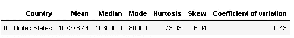

因此，一旦我们计算了这些统计数据，我们就能够识别数据的一些特征。第一，中位数和均值大于众数。这意味着分布的右尾更长，或者换句话说，数据是正偏的。第二，我们的数据的偏斜度大于 1，证实了它的高偏斜度。第三，我们的数据集中的高峰值表明它的分布有重尾或异常值——我们必须调查它。最后，变异系数(CV)是数据集中数据点围绕其平均值的离差的统计度量，表明我们的样本相对于其平均值有 43%的显著变异。

到目前为止，我们所做的所有分析都为我们提供了证据，证明我们的* *数据**不符合正态分布**。此外，高峰值可能是离群值的指标。我们来调查一下。

# 四分位间距

我们需要一个合理的标准偏差来进行分析。我这么说是什么意思？嗯，标准差代表了数据相对于平均值的分散程度，正如我之前说过的，这种方法受异常值的影响很大。此外，我们将在后面看到，标准误差对总体的标准偏差是敏感的，正因为如此，我们希望过滤掉异常值。

没错。我们知道我们必须过滤掉离群值。但是我们怎么做呢？答案很简单:我们将使用四分位数范围。

四分位数间距基本上是第三个四分位数和第一个四分位数之间的距离。在我们的例子中，下表显示 Q3 = 123.600，00 美元，Q1 = 83.000，00。让我们计算它们之间的差异，并确定我们的四分位间距(IQR)。

```
#**Statistics**
round(US_2019.SalaryUSD.describe().to_frame(),3)
```

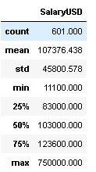

```
#**Calculate the percentiles — 25 and 75 %**
q75, q25 = np.percentile(US_2019.SalaryUSD , [75 ,25])
print(f’Q3:{q75}’)
print(f’Q1:{q25}’)
# **Calculate the percentile Range**
iqr = q75 — q25
print(f’Interquartile Range: {iqr}’)
```

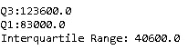

既然我们有了 IQR，我们就能够过滤掉数据集中的异常值。我们这样做是考虑到任何超出中位数正(+)和负(-) 1.5 * IQR 的数据都是异常值。

```
# **IQR +/- 40600**
min_salary = US_2019.SalaryUSD.median()- 1.5*iqr
max_salary = US_2019.SalaryUSD.median() + 1.5*iqr
print(f'Minimun salary (threshould) : {min_salary}')
print(f'Maximun salary (threshould) : {max_salary}')
```

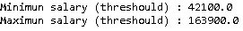

```
#**data set within the range**
US_2019_No_Outliers = US_2019[(US_2019.SalaryUSD>=min_salary) & (US_2019.SalaryUSD <= max_salary)]
US_2019_No_Outliers.head()
```

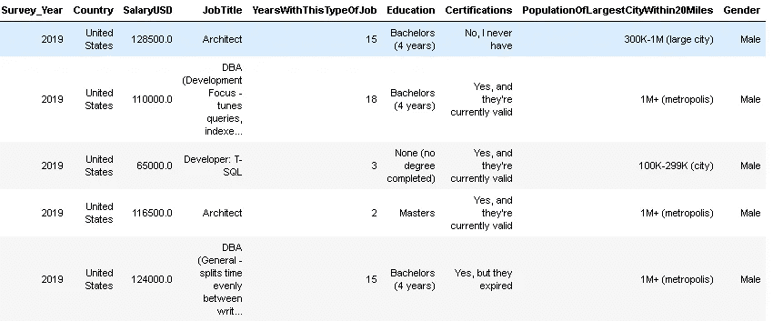

在剔除异常值后，我们可以看到我们的数据集是如何变化的。首先，箱线图显示两性都没有异常值。第二，数据分布大致代表一个高斯。此外，平均值现在更接近中位数，变异系数仅为 25%，这意味着我们的数据在我们定义的范围内均匀分布。

```
# **Boxplot with data within the range**
fig = plt.figure(figsize = (10,8))
sns.boxplot(x = ‘Gender’, y = ‘SalaryUSD’, data = US_2019_No_Outliers)
```

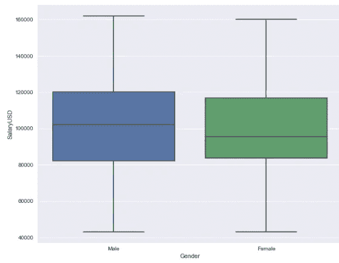

```
sns.distplot(US_2019_No_Outliers.SalaryUSD, fit = stats.norm)
```

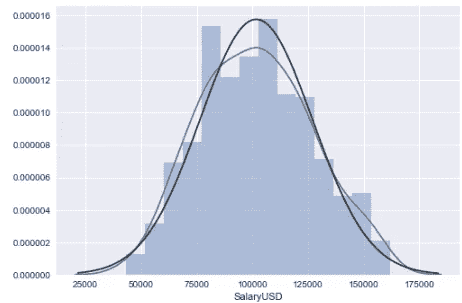

```
# **statistical terms for data within the range**
Salary_statistics_No_Outliers = statistics(US_2019_No_Outliers[‘SalaryUSD’])
Salary_statistics_No_Outliers
```

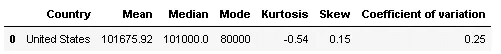

# 统计摘要

```
#**Statistical terms before and after the removal of outliers**
Salary_statistics.append(Salary_statistics_No_Outliers)
```

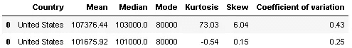

请注意，我们已经删除了 34 个高于最大阈值的条目和 8 个低于最小阈值的条目。这表明 7%的观察值导致了我们数据集的显著变化。

```
below_threshould = US_2019[US_2019.SalaryUSD <= min_salary]
above_threshould = US_2019[US_2019.SalaryUSD >= max_salary]
print(f'Total of salaries above the max threshould: {above_threshould.SalaryUSD.count()}')
print(f'Total of salaries below the min threshould:{below_threshould.SalaryUSD.count()}')
```

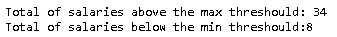

```
print(f'Entries outside the range: { round((below_threshould.SalaryUSD.count() + above_threshould.SalaryUSD.count()) / US_2019.SalaryUSD.count()*100)} %' )
```

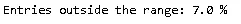

离群值的另一个重要方面是，其中 33 个是男性，只有一个是女性。这表明 97%挣更多钱的员工是男性。这不是很有趣吗？！

```
above_threshould.Gender.value_counts()
```

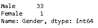

# 标准误差分析

现在我们有了一个相当平衡的数据集，我们可以进行标准的误差分析了。我为什么要这么做？标准误差向我们展示了我们的数据有多好。换句话说，它衡量的是我们的样本代表总体的准确性。下面的公式显示了这个统计术语是如何计算的。

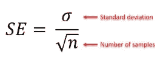

需要注意两件重要的事情。首先，样本越大，样本均值就越接近总体均值。此外，我们可以通过公式看出，如果我们有更多的样本，标准误差将会减少。第二，总体的标准差越小，标准差越小。正如我们所知，标准差是一种传播的度量，它受异常值的影响很大。这意味着在我们的数据集中存在异常值的情况下，样本的标准偏差会大得多。

```
def mean_std_count(salary, data):
 mean = salary.mean()
 std = salary.std()
 count = salary.count()

 std_error = [(‘Gender’,[data]),
 (‘Salary Mean’,[round(mean,2)]),
 (‘Salary std’,[round(std,2)]),
 (‘Sample’,[count]) ]

 std_erro_df = pd.DataFrame.from_items(std_error)
 return std_erro_dfFemale_stats = mean_std_count(US_2019_No_Outliers[US_2019_No_Outliers.Gender == ‘Female’].SalaryUSD, ‘Female’)
Male_stats = mean_std_count(US_2019_No_Outliers[US_2019_No_Outliers.Gender == ‘Male’].SalaryUSD, ‘Male’)
Salary_stats = mean_std_count(US_2019_No_Outliers.SalaryUSD, ‘Total’)
Female_stats.append(Male_stats).append(Salary_stats)
```

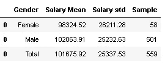

上表显示，我们的平均工资差距约为 3700 美元。你不认为这很重要吗？在我看来，这似乎是相当值得注意的。

尽管我们的数据不符合正态分布，但在剔除异常值后，我们在均值和标准差方面得到了一些更简洁的东西。此外，我们的数据集是否遵循特定的分布对我们的分析来说不应该有太大的影响，因为我们不需要标准误差的高斯分布。

也就是说，如果我们考虑样本的正态分布，我们可以说 95%的工资应该在 51.000 美元到 152.350 美元之间，我不认为这有任何问题。实际上，我觉得这很对。

```
def standard_error(salary, data):
    #**calculate terms**
    mean = salary.mean()
    std = salary.std()
    count = salary.count()
    std_error = std/((count)**(1/2))
    min68 = mean- std_error
    max68 = mean+ std_error
    min95 = mean- 2*std_error
    max95 = mean+ 2*std_error

    #**create df**
    std_error = [('Gender',[data]),
                 ('Standard Error',[round(std_error,2)]),
                 ('Min  [68% range] ',[round(min68,2)]),
                 ('Max [ 68% range] ',[round(max68,2)]),
                 ('Min [95% range]',[round(min95,2)]),
                 ('Max [95% range]',[round(max95,2)]),
                  ]

    std_error_df = pd.DataFrame.from_items(std_error)
    return std_error_df
```

女性和男性工资数据框架——没有异常值。

```
Female_std_error = standard_error(US_2019_No_Outliers[US_2019_No_Outliers.Gender == ‘Female’].SalaryUSD, ‘Female’)
Male_std_error = standard_error(US_2019_No_Outliers[US_2019_No_Outliers.Gender == ‘Male’].SalaryUSD, ‘Male’)
#**Append male and female df**
a = Female_std_error.append(Male_std_error)
a
```

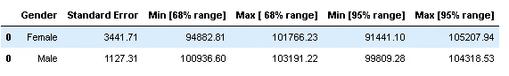

为了解释数据并试图得出结论，我们必须分析标准误差，查看条形的重叠性质。在我们的例子中，误差线重叠，重叠区域不包含较低样本的平均值。由于这一事实，我们可以假设，没有强有力的证据表明，人口是相似的或不同的。68%和 95%范围内的不确定性都太高。我们可以在下面的条形图中清楚地看到这一点。

```
def mean_error_plot(salary1, salary2, gender1, gender2):
    #**Calculate terms**
    mean1 = salary1.mean()
    mean2 = salary2.mean()
    std1 = salary1.std()
    std2 = salary2.std()
    count1 = salary1.count()
    count2 = salary2.count()
    std_error1 = std1/((count1)**(1/2))
    std_error2 = std2/((count2)**(1/2))

    #**Create lists for plot**
    Genders = [gender1,gender2,gender1,gender2]
    x_pos = np.arange(len(Genders))
    Gd = [mean1,mean2,mean1,mean2]
    error = [std_error1,std_error2,2*std_error1,2*std_error2]

    #**Create the plot**

    fig, ax = plt.subplots(figsize = (10,10))
    ax.bar(x_pos, Gd, yerr=error, align='center', alpha=0.5, ecolor='black', capsize=10,color=['red', 'red', 'black', 'black'])
    ax.set_ylabel('Salary [$]')
    ax.set_xticks(x_pos)
    ax.set_xticklabels(Genders)
    ax.set_title('Genders - Range')
    ax.yaxis.grid(True) 

    #**Create horizontal lines**
    ax.axhline(y = 100936.60, color = 'r', linewidth = 1,xmin=0.143, xmax=0.38 , linestyle='dashed', alpha=0.5  )
    ax.axhline(y = 101766.23, color = 'r', linewidth = 1,xmin=0.143, xmax=0.38, linestyle='dashed', alpha=0.5 )

    ax.axhline(y = 99809.28, color = 'r', linewidth = 1,xmin=0.62, xmax=0.85 , linestyle='dashed', alpha=0.5  )
    ax.axhline(y = 104318.53, color = 'r', linewidth = 1,xmin=0.62, xmax=0.85, linestyle='dashed', alpha=0.5 )

    #**Create legend**
    import matplotlib.patches as mpatches
    red_patch = mpatches.Patch(color='red', label='68% range') 
    black_patch = mpatches.Patch(color='black', label='95% range')
    plt.legend(handles=[black_patch,red_patch], loc = 'upper left')
```

女性和男性数据框架——无异常值

```
Female_no_out = US_2019_No_Outliers[US_2019_No_Outliers.Gender == ‘Female’].SalaryUSD
Male_no_out = US_2019_No_Outliers[US_2019_No_Outliers.Gender == ‘Male’].SalaryUSD
#apply mean_error_plo function
mean_error_plot(Female_no_out,Male_no_out,’Female’,’Male’)
```

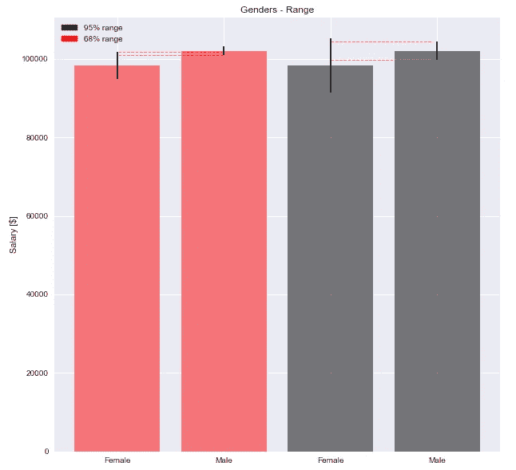

那么，我们现在能做什么？用另一种方法来分析它怎么样？这正是我们要做的！让我们通过假设检验来比较这两种方法。

# t-学生测验

我们使用假设检验的原因是，在给定样本数据的情况下，确定零假设是否可能为真。如果几乎没有反对的证据，我们接受零假设，如果零假设不太可能，我们可能会拒绝零假设而支持另一个假设。

也就是说，一旦我们确定了无效假设和替代假设，我们就能够选择显著性水平。这个统计项是决定我们何时拒绝零假设的概率阈值。此外，在执行测试后，p 值有助于我们解释结果。该值是代表给定事件发生概率的测试中的边际显著性水平。

回到我们的案例研究，让我们从设定第一个假设开始，假设两种工资手段(男性和女性)相等。因此，我们将假设另一个假设是两个均值不相等。为了做到这一点，我们将使用 stats.ttest_ind()函数执行双样本 T 检验。

假设:我们假设两个样本都是正态分布，并且方差相同。

让我们对有异常值和无异常值的数据进行双样本 t 检验，这样我们就可以有所了解，从而得出结论。

```
# **Import t-test function**
from scipy.stats import ttest_ind# **T-test - data without outliers**
ttest_no_outliers = stats.ttest_ind(a = Female_no_out, b = Male_no_out, equal_var= False)
ttest_no_outliers
```

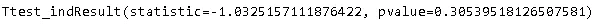

```
pvalue_no_outliers = round(ttest_no_outliers[1],2)
print(f’P-value of data without outliers: {pvalue_no_outliers}’)
```

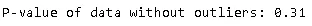

测试给出的 p 值为 0.31，大于显著性值(0.05)。在这种情况下，我们不能拒绝零假设。因此，我们期望在 31%的样本中找到相同性别的样本均值。

现在让我们对包含异常值的工资数据进行测试。

```
# **Filter salary by gender considering outliers**
Female_salary_with_outliers = US_2019[US_2019.Gender == 'Female'].SalaryUSD
Male_salary_with_outilers = US_2019[US_2019.Gender == 'Male'].SalaryUSD#**T-test on data with outliers**
ttest_outliers = stats.ttest_ind(a = Female_salary_with_outliers, b = Male_salary_with_outilers, equal_var= False)
ttest_outliers
```

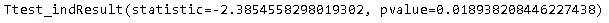

```
pvalue_outliers = round(ttest_outliers[1],2)
print(f’P-value of data without outliers: {pvalue_outliers}’)
```

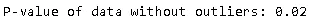

如上所述，如果我们保留异常值，我们可以说，由于 p 值为 0.02，低于显著性水平(0.05)，男女薪酬不平等。因此，这表明，当我们将异常值纳入数据集中时，男女工资确实存在差异。

# 结论

在我们做了分析和假设之后，我想说的是，在正常的工作中，两性似乎得到了同等的报酬。然而，当我们在测试中包括收入高得多的人数时，我们可以看到离群值的差距——其中 97%是男性

我知道这是一个宽泛的分析。如果我们深入研究所有的特征，我们可能会找到得出这个结论的原因。万一你想更好的分析，可以随便找 Brent 原来博客上的数据，应用你所有的知识。请让我知道你的结论！

**注意** : *我还使用不同的标准进行了分析，以确定异常值。在我的* [*GitHub*](https://github.com/jmcabreira/Do-Females-employees-make-less-money-/blob/master/Survey_Salary_dif_range_for_outliers.ipynb) *页面上查看一下。*

来源:

*   [https://data.library.virginia.edu/understanding-q-q-plots/](https://data.library.virginia.edu/understanding-q-q-plots/)
*   [http://www . stats models . org/dev/generated/stats models . graphics . gofplots . QQ plot . html](http://www.statsmodels.org/dev/generated/statsmodels.graphics.gofplots.qqplot.html)
*   [https://web . archive . org/web/20120325140006/http://www . CEE . MTU . edu/~](https://web.archive.org/web/20120325140006/http://www.cee.mtu.edu/~vgriffis/CE%205620%20materials/CE5620%20Reading/DAgostino%20et%20al%20-%20normaility%20tests.pdf)
*   [https://machine learning mastery . com/a-gentle-introduction-to-normality-tests-in-python/](https://machinelearningmastery.com/a-gentle-introduction-to-normality-tests-in-python/)
*   [http://www . SQL gene . com/2017/12/29/practicing-statistics-female-DBAs-and-salary/](http://www.sqlgene.com/2017/12/29/practicing-statistics-female-dbas-and-salary/)

