# 热门歌曲有什么共同点吗？

> 原文：<https://towardsdatascience.com/do-hit-songs-have-anything-in-common-37599940590?source=collection_archive---------19----------------------->

## 使用 Python 分析 Spotify 的数据


Source: [unsplash](https://unsplash.com/)

当你登录 [Spotify.me](http://www.spotify.me) 时，你会得到一个个性化的摘要，说明 Spotify 是如何通过你在 Spotify 上听的音乐来理解你的。这是非常酷的！

作为一个经常听音乐、喜欢摆弄数据的人，这启发了我，让我看看是否可以分析自己的音乐。

我也很好奇，想知道化妆是否有某些成分会影响歌曲。是什么让他们变得酷？为什么我们会喜欢热门歌曲，热门歌曲是否有一定的「DNA」？

# 目标

这让我试图用这篇文章中 Spotify 的数据来回答两个问题:

1.  我的音乐播放列表是什么样的？
2.  热门歌曲中有什么共同的音频属性吗？

# 工具

幸运的是，有非常简单的工具可以帮助我们连接到 Spotify，检索数据，然后将其可视化。

我们将使用 [Python 3](https://www.python.org/) 作为编程语言， [Spotipy](https://spotipy.readthedocs.io/en/latest/) ，Python 库允许你连接到 [Spotify Web API](https://developer.spotify.com/documentation/web-api/) ，我们将使用 [plot.ly](https://plot.ly/#/) 和 [Seaborn](https://seaborn.pydata.org/) 进行数据可视化。

# 资料组

每年年底，Spotify 都会编辑一个当年最常播放的歌曲列表，这个列表有 100 首歌曲。我使用的数据集已经在 Kaggle 上可用:[2018 年 Spotify 热门曲目](https://www.kaggle.com/nadintamer/top-spotify-tracks-of-2018)。Spotify 的前 100 首歌曲似乎是一个合理的数据集，可以考虑作为我们的热门歌曲，你不觉得吗？

# 我们开始吧！

首先，你需要在[developer.spotify.com](https://developer.spotify.com/)创建一个账户。之后，您可以直接访问 [Spotify Web API 控制台](https://developer.spotify.com/console/)，开始探索不同的 API 端点。

> **注意**:我在整个项目中使用的代码的链接在博文的末尾。

在连接到 Spotify Web API 之后，我们将使用 Spotipy Python 库创建一个 Spotify 对象，然后我们将使用它来查询我们的 Spotify 端点(我知道有点满嘴😃).

```
*import spotipy
from spotipy.oauth2 import SpotifyClientCredentials**from spotipy import util**cid =”Your-client-ID” 
secret = “Your-Secret”**client_credentials_manager = SpotifyClientCredentials(client_id=cid, client_secret=secret) 
sp = spotipy.Spotify(client_credentials_manager=client_credentials_manager)*
```

# 我的播放列表的探索性数据分析


这是数据科学中最重要的步骤之一。我们的目标是了解我的播放列表中的音乐类型，检索任何有趣的观察结果，并将其与 2018 年 100 首最佳歌曲的音频特征进行比较。

## 绘图艺术家频率

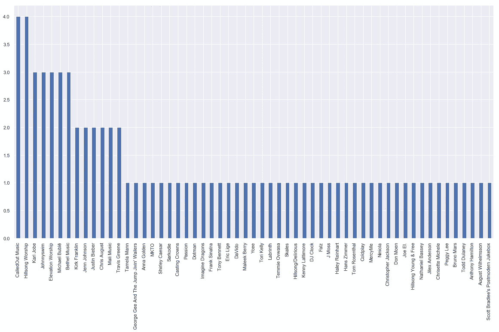

Artists in my playlist by frequency

通过观察这个直方图，我们可以看到艺术家在我选择的播放列表中出现的频率。

## 音频功能

现在我们来看看这个播放列表中歌曲的音频特征。Spotify 已经整理了 Spotify 上每首歌曲的 [**音频功能**](https://developer.spotify.com/documentation/web-api/reference/tracks/get-audio-features/) 列表！下面是我们将使用的功能的摘要:

**乐器性**:预测一个音轨是否不包含人声。“Ooh”和“aah”在这种情况下被视为乐器。Rap 或口语词轨道明显是“有声的”。乐器度值越接近 1.0，轨道不包含人声内容的可能性就越大。

**能量**:这是一个从 0.0 到 1.0 的度量，代表强度和活动的感知度量。通常，高能轨道感觉起来很快，很响，很嘈杂。例如，死亡金属具有高能量，而巴赫前奏曲在音阶上得分较低

**acoustic ness**:0.0 到 1.0 之间的音轨是否声学的置信度度量。1.0 表示音轨是声学的高置信度。

**活跃度**:检测录像中是否有观众。较高的活跃度值表示音轨被现场执行的概率增加。高于 0.8 的值表示该轨迹很有可能是实时的。

**语速**:“语速检测音轨中是否存在口语单词”。如果一首歌曲的语音度高于 0.66，它可能是由口语词组成的，0.33 到 0.66 之间的分数是一首可能同时包含音乐和词的歌曲，而低于 0.33 的分数意味着这首歌曲没有任何语音。

**可跳舞性**:“可跳舞性描述了一首曲目在音乐元素组合的基础上适合跳舞的程度，包括速度、节奏稳定性、节拍强度和整体规律性。值 0.0 最不适合跳舞，1.0 最适合跳舞”。

**效价**:从 0.0 到 1.0 的一个量度，描述一首曲目所传达的音乐积极性。具有高价的音轨听起来更积极(例如，快乐、愉快、欣快)，而具有低价的音轨听起来更消极(例如，悲伤、沮丧、愤怒)

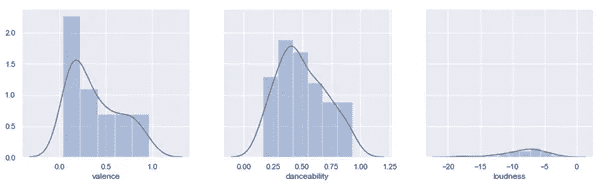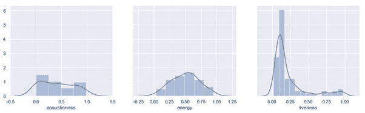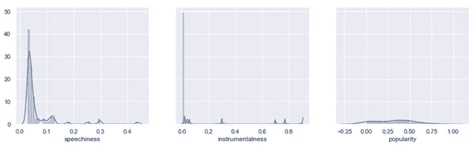

Distribution of music styles in my playlist

从观察结果来看:

*   我的播放列表中的大多数歌曲都有广泛的可跳性分布，并没有太多的“快乐”歌曲，正如 0.5 以下的歌曲在*价*中的高频率所示。所以你可以说我喜欢适合跳舞的歌(这是真的！)
*   对于演讲、工具性和一点点 T2 的活力来说，这是一个向下的陡坡。这向我们表明，我的播放列表中的音乐通常不那么有声有色，没有乐器，也很少有现场观众的歌曲。
*   *声音度*在 0 和 1 之间近似均匀分布，这表明在我的音乐选择中没有对该属性的偏好。(我通常喜欢原声歌曲，但我不会出去寻找一首歌的每一个原声封面)。
*   最后，*能量*呈现正态分布，两端的尾部表示被添加到我的播放列表的可能性较小。所以基本上我喜欢能量一般的歌。
*   我的歌一般没那么*受欢迎-__-*

# 2018 年前 100 首歌曲的探索性数据分析

将数据集从 Kaggle 下载并导入到我们的应用程序后，我开始根据数据集中最受欢迎的艺术家出现在列表中的次数来分析他们。

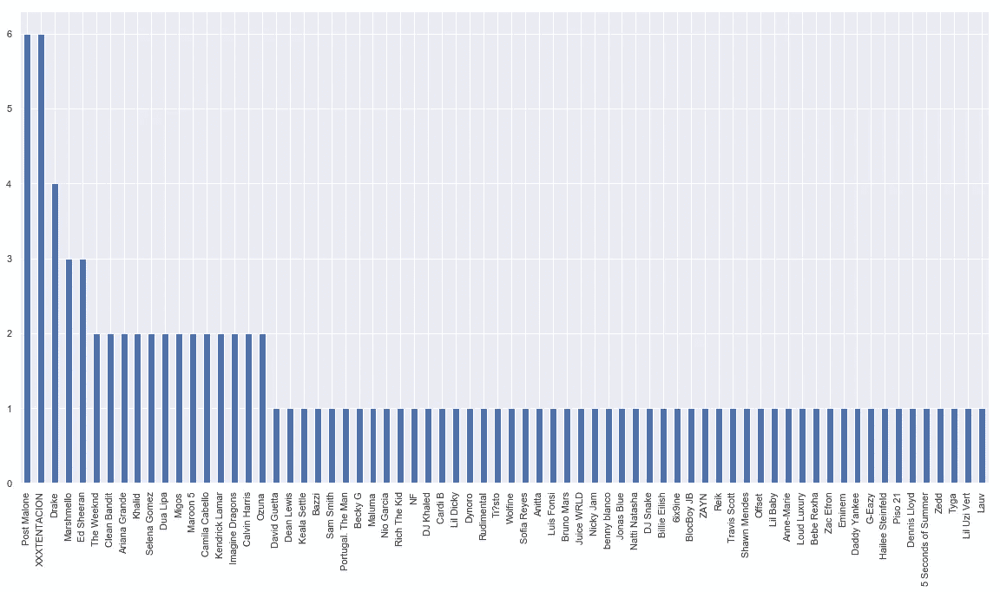

Artist in Top 100 Songs of 2018 by frequency

**2018 年 100 首歌曲中出镜率最高的艺人**

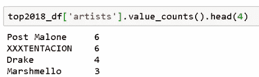

Code snippet

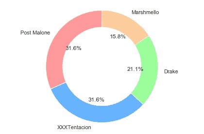

Post Malone (src:latimes.com) and XXXTENTACION (src:thesource.com)

现在让我们探索一下我们数据集中前 100 首歌曲的音频特征，看看它们是什么样子的！我们将绘制与播放列表相同的直方图，以便稍后进行比较。

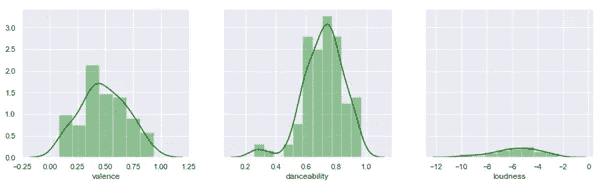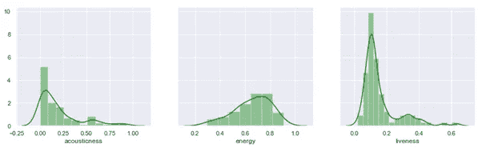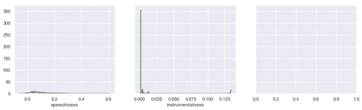

Distribution of music styles in the top 100 songs of 2018

通过观察直方图，我们可以看到前 100 个图表中的曲目是:

*   在*可舞性*和能量方面非常高，但在*活跃度*、*语速*和*声音*方面很低(我们已经可以看到一些迹象，表明我的播放列表不如前 100 名那么酷😞).

例如，来自我们数据集的德雷克的“在我的感觉中”，是高度可跳舞的，并且也具有相对高的能量值。

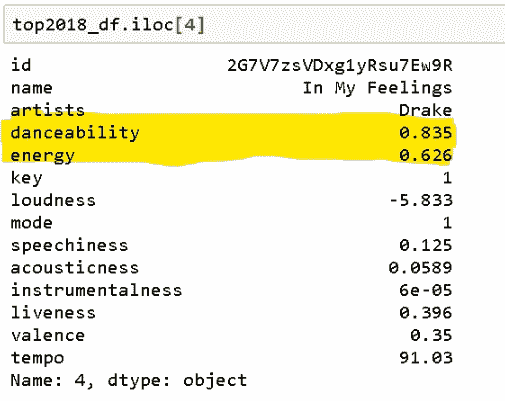

最后，我决定绘制一个前 100 首歌曲的雷达图，并叠加我的播放列表的音频特征，以便于比较。

Spotify 的前 100 首歌曲是蓝色的，而我的热门歌曲是橙色的。

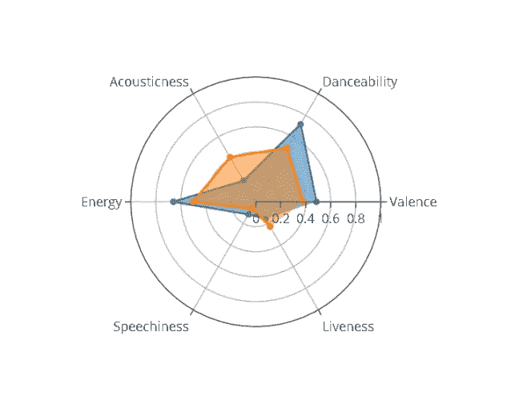

## 结论

所以我想我在这篇文章的开头已经找到了我的两个问题的答案。我想看看我的音乐是什么样的，似乎有流行歌曲的基因。我的播放列表中的音频功能有点类似于前 100 首歌曲，但我有更多的原声歌曲和一些现场歌曲。

> 想做一首热门歌曲？确保它适合跳舞，有很多能量和一点价值(积极和感觉良好的氛围)。

我对结果很满意，但我想在另一篇文章中继续这个话题。

以下是我推荐的**下一步**:

*   了解如何使用您的播放列表来确定您的个性，并推荐您可能喜欢的广告。
*   使用机器学习聚类算法，K-Means，看看哪些歌曲与你的相似，你可以使用它来最终发现你可能喜欢的新歌。
*   使用机器学习根据歌曲的音频特征预测歌曲的“流行度”

> 你可以[成为中等会员](https://medium.com/@tobisam/membership)享受更多这样的故事。

你可以在 [**GitHub**](https://github.com/togobingi/spotifyMusicAnalysis) 上获得整个项目的代码。

**感谢** [**艾尔文·钟**](https://medium.com/@alvinchungg)**[**阿什里斯**](https://towardsdatascience.com/@_ashrith) **和**[**John Koh**](https://medium.com/@john_koh)**就此主题发表的有益文章。**[**Spotify**](https://medium.com/@Spotify)**和 Spotipy，感谢给力的 API 和库！****