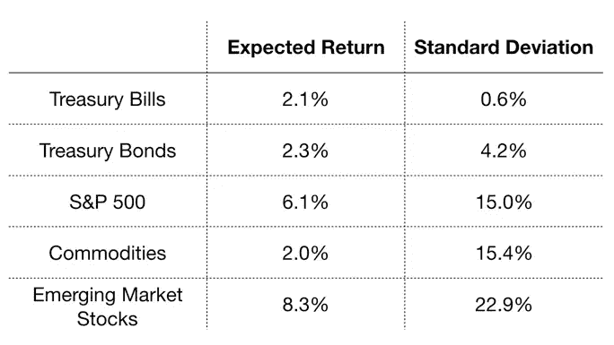
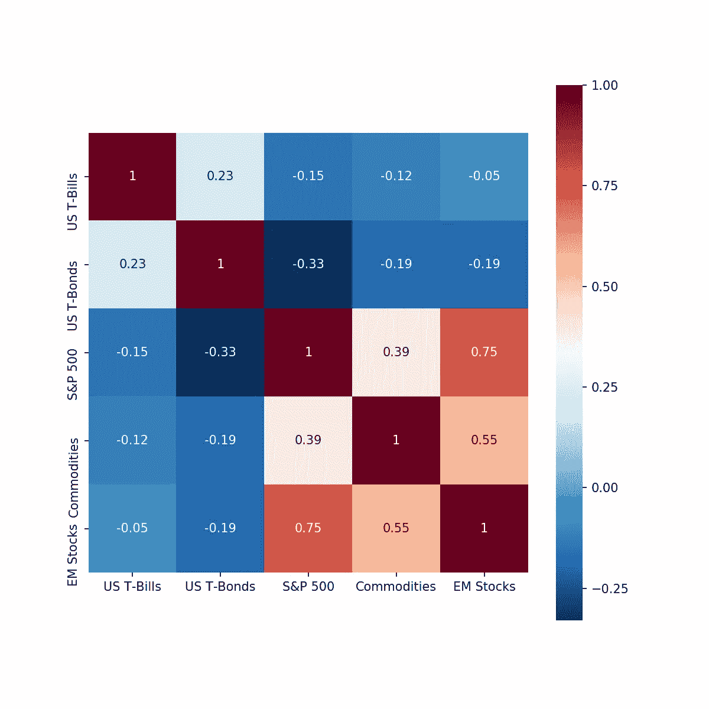
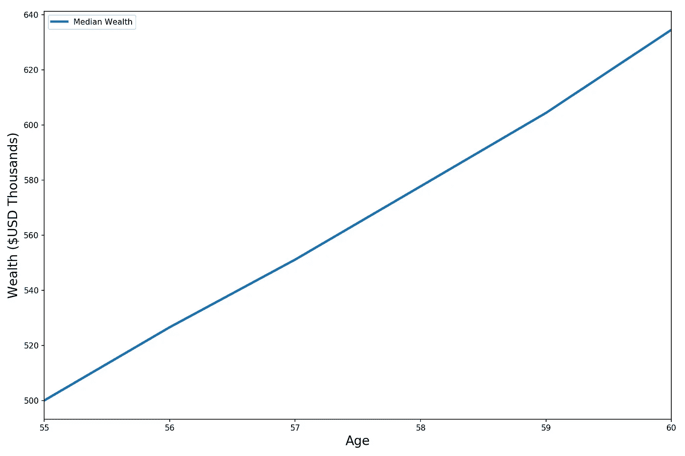
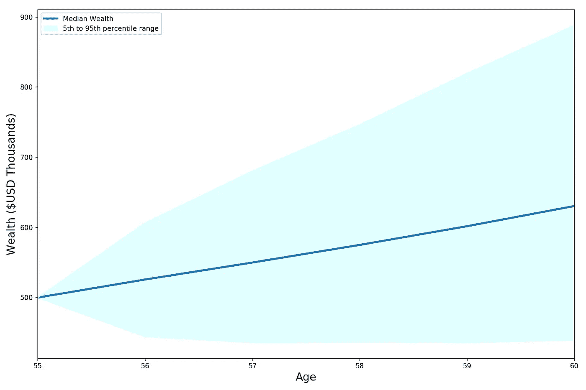
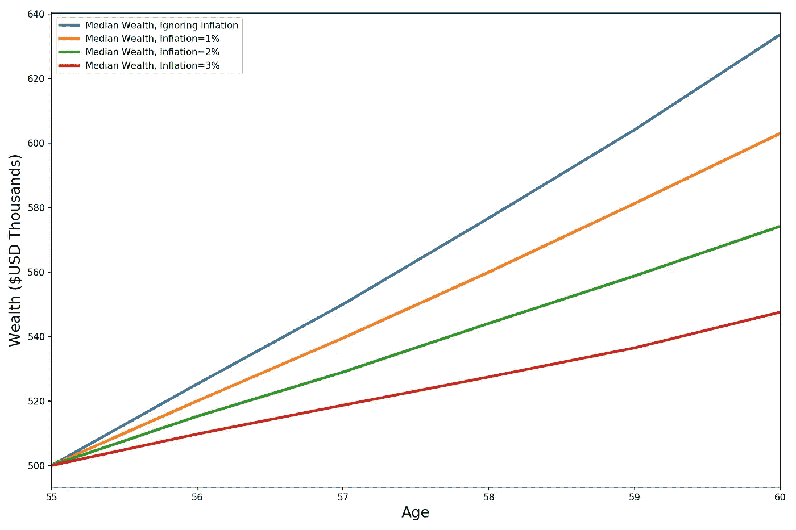
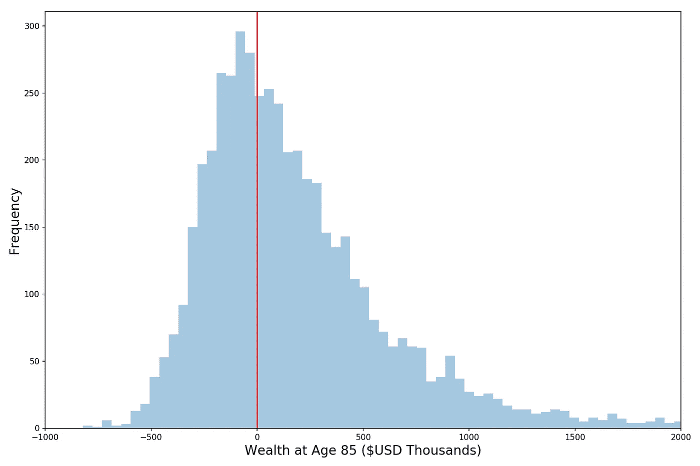
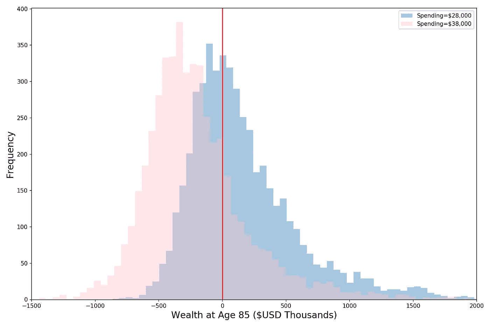
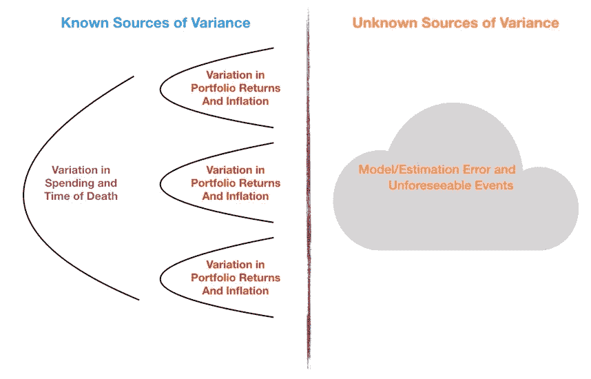

# 我有足够的钱退休吗？

> 原文：<https://towardsdatascience.com/do-i-have-enough-money-to-retire-af7914a07b34?source=collection_archive---------16----------------------->

## 蒙特卡罗模拟如何用于模拟退休不确定性的定量探索

如果你想自己运行代码，你可以在我的 Github 这里找到它。

*这个例子只是为了说明的目的。* ***它不应以任何方式、形态或形式被视为财务建议*** *。*

> “我以 20%的信心估计，有 75%的可能性你的钱足够支付你的退休金。”

等等，什么？太令人困惑了。

没有财务顾问会对你这么说——但我希望他们会这么说。客户需要他们雇佣的人的信心和确定性，金融专业人士从第一天起就接受培训，自信地传递他们的信息(毕竟，他们试图出售一项服务)。

但事实是，定量模拟某人的退休极其困难，充满了不确定性和未知性。

这种差异的主要驱动因素是以下方面的不确定性:

1.  **投资回报**
2.  **通胀**
3.  **退休后你每年会花多少钱**
4.  你会活多久(以及你会有多健康)
5.  [黑天鹅](https://en.wikipedia.org/wiki/Black_swan_theory)——难以预测的事件，如金融危机、战争、白鬼等。
6.  模型误差(错误估计和假设产生的误差)
7.  社会保障、所得税税率、资本收益税率等的变化。

**下面我们就用** [**蒙特卡洛模拟**](https://en.wikipedia.org/wiki/Monte_Carlo_method) **来详细定量探究一下 1 号到 4 号**的车手。其他的也很重要，但是我不认为你想读一篇 45 分钟的博文；)所以我们将把它们留到下一次。

在这篇文章的结尾，我们将会更好地理解为什么尽管分析和计算能力有了显著的进步，却回答了“我到底需要多少钱”这个古老的问题依然充满挑战。

# 我们示例的假设

Our client, Randy

假设我们为一家名为 Lazy Advisors，LLC 的金融公司工作。我们的一个相对更懂财务的客户，兰迪，来做他的退休评估。以下是他的统计数据:

> 性别和年龄:男，55 岁
> 
> 婚姻状况:单身(准备交往)
> 
> 目标退休年龄:60 岁
> 
> 投资组合价值:500，000 美元(他将不再存钱)

我们为 Randy 管理的投资组合相当保守——60%投资于股票(美国大盘股和新兴市场)，40%投资于美国国债。

由于我们公司很懒(因此得名)，我们只投资 5 种资产:国库券(基本上是现金)、国债、标准普尔 500、大宗商品和新兴市场股票(中国、巴西、俄国等)。).

我们使用[均值方差投资组合优化](https://en.wikipedia.org/wiki/Modern_portfolio_theory)来估计最优投资组合的投资权重([最高性价比](/roc-curves-and-the-efficient-frontier-7bfa1daf1d9c))，有以下约束条件:

*   权重总和必须为 1
*   权重必须介于 0 和 1 之间(无[卖空](https://en.wikipedia.org/wiki/Short_(finance)))
*   对标准普尔 500、大宗商品和新兴市场股票的配置总和必须为 0.6

我们的优化器生成一个投资组合，其配置如下: **40%** 美国国债， **35%** 标准普尔 500 指数， **25%** 新兴市场股票。**预期年名义收益率为 5.1%** ，**预期年标准差为 10%** 。

我今天不会详细讨论这个问题，但请记住，最佳投资组合权重对我们对每种资产类别的预期回报、波动性以及与其他资产的相关性的估计极其敏感。

出于好奇，这里是我们对预期收益和波动性(标准差)的估计。这些估计来自 BNY 梅隆大学的这份报告。

Return and Risk Assumptions

最后，以下是我们对资产类别相关性的估计:

Correlation Matrix Assumptions

# 投资回报的不确定性

兰迪坐下后问我们的第一件事是，“我不打算在退休前存更多的钱。以我现在所拥有的，你认为我五年后退休时会有多少钱？”

由于我们知道 Randy 的投资组合的预期回报率为 5.1%，而我们又比较懒，我们就给他看下图，告诉他退休时(五年后)他的投资组合的中值将是 63 万美元。

Looks pretty good!

但是兰迪需要更多的信息。他知道中位数只是许多潜在结果中的一个，并想知道他可以预期多少变化。渴望去打高尔夫球，我们叫来了我们的实习生，让他处理数据。在一些巧妙的 Python 编码之后，他向我们展示了这个情节:

Wow, that is a wide range of outcomes!

什么！？我们的实习生会让我们错过开球时间的！我们问我们的实习生他是如何生成这个图表的，他告诉我们:

> **他使用** [**蒙特卡洛模拟**](https://en.wikipedia.org/wiki/Monte_Carlo_method) **对兰迪的投资组合进行了 5000 次模拟，然后绘制了一段时间内的财富中值(蓝线)以及一段时间内的第 5 和第 95 百分位财富**(蓝色阴影区域的底部是第 5 百分位财富，顶部是第 95 百分位财富)。

他还提到，他假设兰迪投资组合中的投资回报遵循正态分布(这是一个潜在的危险假设，我们将在未来的帖子中探讨)，并根据我们之前分享的关联热图相互关联(Smartypants intern 先生使用 [Cholesky 分解](https://en.wikipedia.org/wiki/Cholesky_decomposition)使他的随机正态冲击相互关联，详情见代码)。

## 关于[蒙特卡洛模拟](https://en.wikipedia.org/wiki/Monte_Carlo_method)的简要说明

在蒙特卡罗模拟中，我们一遍又一遍地运行实验，每次都收集结果(在这种情况下，Randy 60 岁时的投资组合价值)。关键是我们通过一些输入注入了随机性。这里，我们使用相关随机正态冲击来模拟投资回报的波动性。

你可以把蒙特卡洛模拟想象成掷骰子，每个输入的值我们不确定，用一个骰子来表示。我称它们为魔术骰子，因为根据你的需要，它们可能呈现不均匀的分布，或者一些骰子滚动可能是相关的(神奇地！)与其他骰子的滚动。因此，每个单独的模拟只是我们所有神奇骰子滚动的结果。蒙特卡洛模拟只是将我们神奇的骰子滚动许多次的过程(一旦我们完成，我们可以使用蒙特卡洛模拟结果来近似我们试图建模的事物的概率分布，例如 Randy 的投资组合)。

## 回到兰迪

以前，我们的实习生完全被他的解释搞糊涂了，所以我们瞪着他，要求，“请用简单的英语解释！”

我们勤奋(脾气好)的实习生回答道:

> “在我进行的 90%的模拟中，兰迪的投资组合最终价值在 435，000 美元到 884，000 美元之间。”

现在兰迪很担心，“如果其中一个糟糕的场景实现了，那么由此产生的财富够我生活下去吗？”

正当我们要告诉他不要杞人忧天时，我们的实习生大声说道，“兰迪先生，你还需要记住考虑通货膨胀。你现在花的钱可能并不代表你将来需要花多少。”

多。我们的实习生是如此的好…

# 通货膨胀的不确定性

快速回顾一下— **通货膨胀是指物品(从拿铁咖啡的价格到你付给房东的租金)价格随着时间推移而上涨的趋势**。

在退休模拟中，通货膨胀通常被建模为对投资组合回报的拖累。例如，如果兰迪的投资组合名义收益率为 6%(名义=通胀前)，而当年通胀率为 3%，那么他的**通胀调整回报率将为 6%-3%=3%** 。通胀只是偷走了一半的回报！

暂时离开我们和 Randy 的谈话，让我们了解一下通货膨胀是如何驱动退休不确定性的。下面的图表显示，仅仅改变我们的通货膨胀假设(而完全不改变投资回报)，我们得到的结果就会有显著的变化。虽然 2%似乎是对未来通胀的合理估计，但其他值也在可能范围内(例如，日本经历了几十年的通缩，美国在整个 20 世纪 70 年代经历了两位数的通胀，大萧条期间经历了严重的通缩)。

Inflation can cause significant variation in wealth outcomes

跑题了，让我们回到我们的客户，兰迪。不幸的是，他现在希望我们模拟他的通胀调整后的退休后财富变化。这样的监工…他也给我们一些更多的信息。Randy 希望每年从社会保障中获得一些钱，所以他估计他每年只需要从他的投资组合中支出 28，000 美元来维持他目前的生活方式。这 28，000 美元是通货膨胀调整后的价值——这意味着如果今年的通货膨胀率为 1%,那么明年 Randy 在名义上需要 28，280 美元。

> 年度投资组合提款(经通货膨胀调整):28 000 美元
> 
> 预期死亡年龄:85 岁

所以我们跳上笔记本电脑，开始编码。我们决定将通货膨胀建模为一个正态分布的变量，期望值为 2%，标准差为 1%。此外，为了简化分析，我们忽略了通货膨胀和投资回报之间的相关性。经过一些数字运算，我们得出了下面的图表:

Inflation is quite the drag

我们的实习生向兰迪解释道，“兰迪先生，我们对你 85 岁时财富的中值估计是 81，000 美元……当我们预计你嗯……去世时。所以在我们的中间方案中，你确实有足够的钱。我们还包括了无通胀案例(红线)，向你展示我们对通胀的估计是如何对你的财富产生负面影响的。”

> “然而，在我们运行的 40%的模拟中(我们运行了 5,000 btw ),您用完了钱！如果你的投资组合枯竭了，你将只有社会保障来度过余生……”

他继续说道:“我还为你做了这个柱状图，以便更好地展示你的财富成果。”*(我们的实习生就是这么爱显摆)*

That’s a lot of observations to the left of the red line (which denotes $0)

# 生活费和死亡年龄的不确定性

现在兰迪想知道，如果他想在退休后一直保持盈利，有哪些事情是他绝对必须避免的。

我们的实习生再次大声说道(叹气…)，并说:“没有人能保证你在整个退休期间能够保持 28，000 美元的通胀调整支出水平。你可能会遭遇不可预见的医疗费用、更高的税收等。因此，如果你最终增加支出，我们应该看看我们的预测会有什么变化。”

> “兰迪先生，我们模拟了如果你退休时花了 38000 美元(而不是 28000 美元)会发生什么。就像之前我们做了 5000 次模拟一样。现在，在我们进行的 76%的模拟中，你最终**没钱了**(除了社保)**！以前你只用了 40%。**

If Randy overspends, he is in big trouble

> “如果你最终比预期多活了 5 年(而是在 90 岁去世)，在我们为你进行的 56%的模拟中，你最终会**耗尽金钱****，大大高于之前的 40%(当时我们假设你会在 85 岁去世)。**

Living 5 years longer than expected depletes poor Randy’s portfolio

# 结论

最后兰迪满意了。很担心但是很满足。

他看着我们说。

> “我今天学到了一些东西。你可以为我运行数千次模拟(由于投资回报和通货膨胀，这些模拟已经有了自己的方差)，但稍微调整一下假设，一切都会再次改变！这就像方差叠加在更多的方差之上！如此多的不确定性…

我们不知道他在说什么，但是我们的实习生给 Randy 看了下面的图表。

High level breakdown of the sources of variance (a.k.a. uncertainty)

“兰迪先生，**我们可以把方差分成两部分:已知和未知**。我们之前详细探讨过的已知变异来源，来自投资回报、通货膨胀、死亡年龄、支出等的波动。这些变异来源中的每一个都相互叠加，相互复合。**但也有‘未知的未知’**——造成隐藏变化的东西，我们无法建模，因为我们只是不知道它，或者我们知道它是错的。”

Randy 说他需要几天时间来消化所有的发现，但是他会在一周内和我们的实习生安排一次会面来讨论下一步的工作。似乎我们的实习生偷走了我们的客户。我们决心在未来雇佣更多实习生之前更加努力地思考(我们最初雇佣他只是因为他的拿铁艺术令人难以置信)。

*来源:10 年资本市场回报假设，BNY 梅隆*