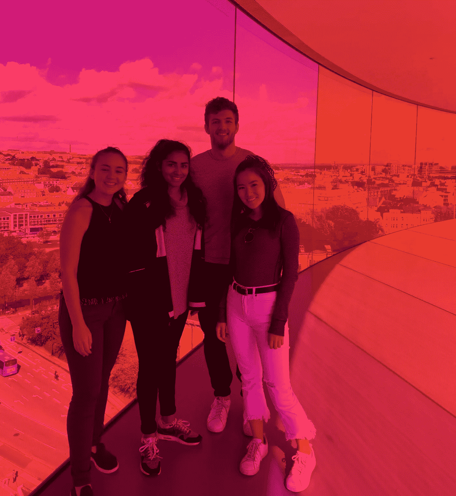
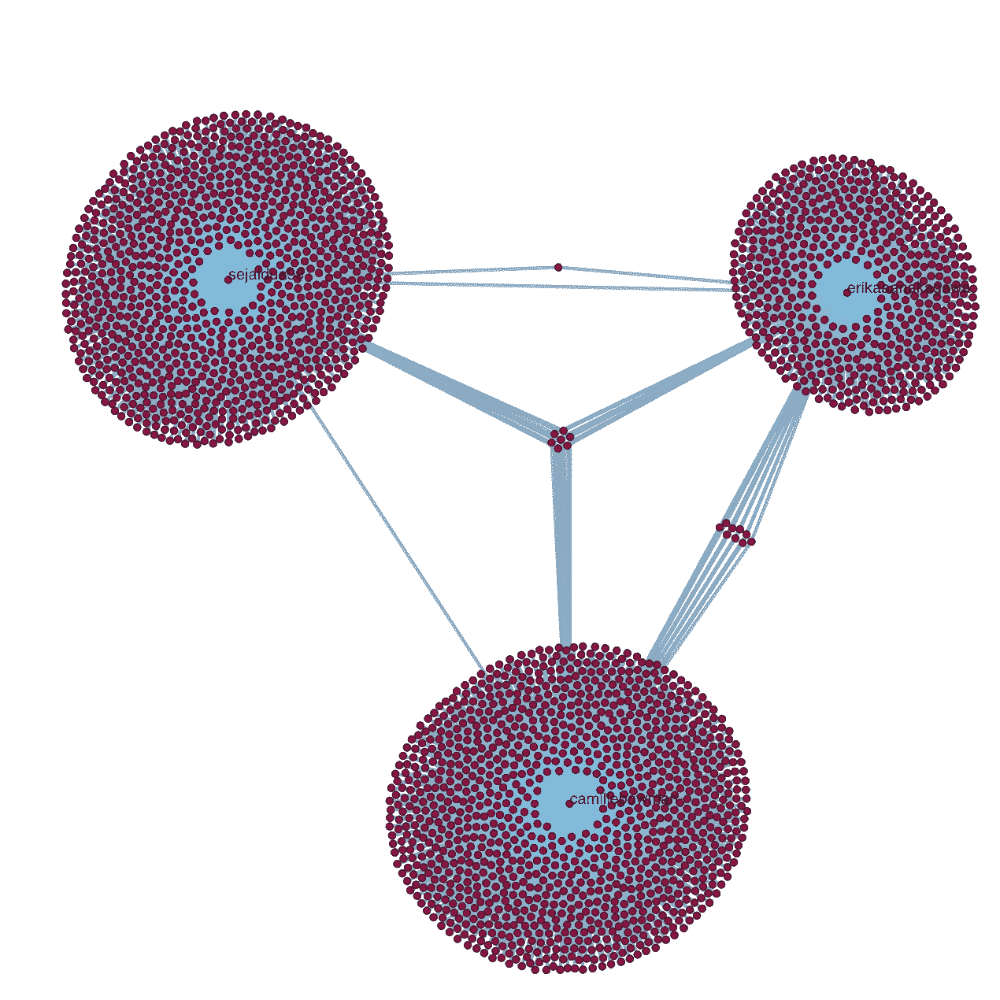
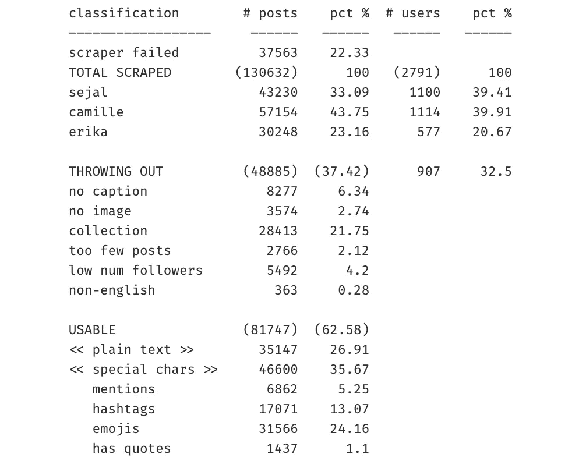
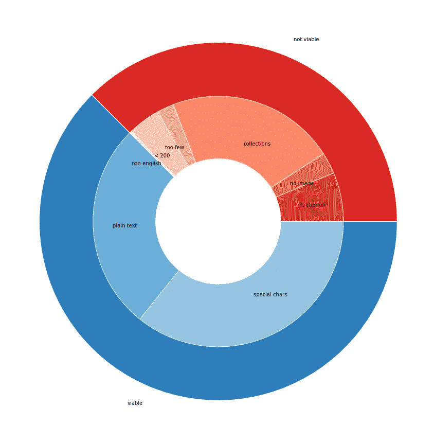
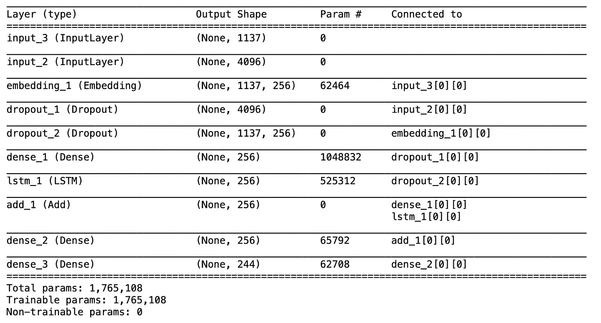

# 为“gram: Instagram 风格的字幕生成器”而做

> 原文：<https://towardsdatascience.com/do-it-for-the-gram-instagram-style-caption-generator-4e7044766e34?source=collection_archive---------18----------------------->

## 使用 Keras CNN-RNN 框架为 Instagram 照片生成标题

*卡米尔·鲍曼、塞加尔·杜瓦和埃里卡·中川*

# **1。简介**

图像字幕是指使用自然语言处理(NLP)和计算机视觉(CV)生成图像的文本描述的深度学习应用。这项任务需要一种算法，不仅要理解图像的内容，还要生成与其解释相关的语言。我们希望通过专门为 Instagram 图片生成标题来进一步挑战这一挑战。

你会如何描述下面的图片？

一个简单的字幕生成器可以将图像描述为类似于“四个朋友在一个粉红色的房间里”的东西。微软的[字幕机器人](https://www.captionbot.ai)回答说“我认为这是一群人对着相机摆姿势”。你不也是这么描述的吗？但是如果你想在 Instagram 上发布这张图片，那会是它的标题吗？

Instagram 标题往往比简单的描述符更高级，由双关语、内部笑话、歌词、参考文献、情感和讽刺组成。在某些情况下，字幕可能与呈现的图像完全不相关。在这种情况下，用户@sejaldua99 发布了上面的图片，标题为“奥胡斯走的路 2 crazzyyy”。

我们的工作旨在用特定的词汇和表达方式生成符合特定风格的字幕。为了实现这一点，我们的模型由卷积神经网络(CNN)和长短期记忆(LSTM)递归神经网络(RNN)组成。

# **2。先决条件**

这篇博客文章假设熟悉基本的深度学习概念，如卷积神经网络(CNN)、递归神经网络(RNNs)、梯度下降、反向传播、过拟合、概率、Python 语法和数据结构、Keras 库、TensorFlow 等。

# **3。数据收集**

我们使用从 GitHub 用户@timgrossmann 那里获得的 Selenium 驱动的[档案爬虫](https://github.com/timgrossmann/instagram-profilecrawl)抓取 Instagram。scraper 为每个 Instagram 用户构建了 JSON 对象，包括帖子信息、位置信息、每个帖子的评论、每个用户交互的时间戳和数字赞等。我们编写了一个简单的脚本来解析我们收集的个人资料目录中的每个 JSON，并从那里提取 Instagram 照片和标题。

我们的数据集由关注我们账户的 Instagram 用户的帖子组成:@camillebowman、@sejaldua99 和@erikaaanakagawa。由于 scraper 需要通过 Headless Chrome 登录 Instagram，我们只能从我们关注的用户和公共档案中获取信息。

network visualization of the data source: 3 core nodes and one degree of follower connections

the code to produce the network visualization above

上面的网络是由 [networkx](https://github.com/networkx/networkx) 和 [netwulf](https://github.com/benmaier/netwulf) 库组成的，描绘了我们数据的范围。值得注意的是，因为我们从三个主要的独特人群中收集数据，所以我们引入了一些轻微的偏差。例如，如果我们的神经网络生成了与“约翰·霍普金斯”、“米德尔伯里”或“塔夫茨”相关的标题，这不会太令人惊讶，因为我们每个人都关注了许多来自自己大学社区的用户，而这些用户碰巧发布了关于他们各自校园发生的事件。

我们在两周的时间里收集了数据，整日整夜地搜集用户资料(我的电脑感觉睡眠严重不足)。我们设法从不到 3000 个用户那里获得了 100 个帖子，但是并不是所有来自这些用户的数据都进入了我们的 CSV 文件。事实证明，由于 Chrome 驱动程序的变化、滚动速率错误以及自脚本编写以来的 Instagram 更新，我们的 scraper 相当吃力——准确地说，23%的时间都是如此。

考虑到所有因素，我们使用的 profile crawler 在帮助我们获得一个巨大的数据集来训练我们的神经网络方面仍然非常有用。

# 4.数据清理

CLEANING

与任何数据科学项目一样，80%的工作是获取数据、存储数据、解析数据和清理数据。JSON 的清理包括文件系统遍历和一些非常复杂的条件逻辑。

summary report: composition of the dataset

我们做了一些深思熟虑的选择来构建一个数据集，我们认为这将最小化偏差，并尽可能提供最多样化的图像-标题对集合。设计选择如下:

*   **没有图片，没有说明，收藏:**我们删除了所有没有说明的帖子，丢弃了收藏和视频。不幸的是，这消除了大约 30%的未清理数据集，但相对于我们的大量帖子——总共约 130，000 篇——这并不太昂贵。
*   帖子太少:我们排除了发帖量少于 10 篇的用户，因为一个发帖量少于 3 篇的用户与一个发帖量少于 100 篇的用户相比，其影响力似乎相差了一个数量级，我们希望纠正任何可能引入的偏差。在剔除帖子太少的用户后，每个用户的帖子数量中位数从 21 个飙升到 46 个，这非常接近理论中位数。
*   低粉丝数(low num followers):insta gram 是一个平台，人们喜欢在这个平台上讲述有趣的故事，分享有价值的生活更新。年轻一代的 Instagram 用户通常有两个 Instagram 账户，一个用于以更公开的方式分享照片，另一个用于向更亲密的朋友分享照片和故事。我们想排除这些更小、更私人的帐户，因为这些类型的帐户的标题内容几乎从不与相应的图像匹配。出于这个原因，我们丢弃了所有关注者少于 200 人的用户的帖子数据。
*   **非英语**:虽然神经网络有令人难以置信的智能潜力，但我们想避免的一件事是用不同语言的字幕混淆我们的模型。想象一下，一个人要花多少时间和精力才能流利地掌握 5 种以上的语言。我们发现不同语言的字幕会成倍增加我们的训练时间，所以我们安装了一个名为 pyenchant 的库，它主要检查一个给定的单词是否在英语词典中。我们规定，如果标题的文本部分(不包括标签和提及)超过 5 个单词，并且超过 80%的单词不在英文目录中，我们会将标题指定为“非英文”并丢弃图像-标题对。只有 300 多个帖子属于这种情况，我们认为我们能够保留类似“更新:我要搬到法国去了。这就是生活。”点击[链接](https://github.com/sejaldua/caption-gener8r/blob/master/non-english_captions.txt)查看所有被丢弃的非英语字幕。

pie chart representation of the dataset (blue represents viable data, red represents discarded data)

在丢弃了大约 38%的数据集之后，我们决定简要地研究一下我们的可行数据的组成。我们觉得 Instagram 的标题是独一无二的，因为它们的结构高度流动。也就是说，标题可以由字母文本、特殊字符、标签、提及、表情符号或以上所有内容的组合组成。我们希望量化我们正在处理的内容，因此我们解析了每个标题中的字符，如“#”和“@”，并使用 Python 表情库来筛选表示表情的正确 unicode 符号。按照流行程度从高到低的顺序，标题包含表情符号，然后是标签，然后是提及，然后是引用。不到一半的可用 Instagram 标题不包含任何有意义的特殊字符。

# **5。网络架构**

我们的网络受到了 Jason Brownlee 的 [*如何从零开始开发深度学习照片字幕生成器*](https://machinelearningmastery.com/develop-a-deep-learning-caption-generation-model-in-python/) 文章的启发。

我们将用于图像分类的卷积神经网络与用于序列建模的递归神经网络相结合，创建了一个为图像生成 Instagram 标题的单一神经网络。

换句话说，我们使用了一个在 ImageNet 数据集上预先训练的 16 层牛津视觉几何小组(VGG)模型来解释照片的内容。我们移除了 CNN 的最后一层，以收集从模型中预测的提取特征，用作生成字幕的 RNN 解码器的输入。

我们还使用了一个标记器来创建一个包含标题中所有字符的“字母表”。与 Jason Brownlee 的文章不同，我们决定在字符级别而不是单词级别进行标记，并包括标点和大写。我们认为这将更好地反映我们试图生成的标题，因为它允许我们保留标题的关键方面(如表情符号和标签)，并让我们的网络更好地生成表情符号。然后，我们将每个标题转换成一个数字数组进行编码，每个索引代表一个字符。最后，为了便于训练，我们在每个编码后的字幕前加入了开始序列和结束序列。

preprocessing images and obtaining features vectors from CNN

tokenizing captions on a character level

我们为每个标题创建了输入-输出向量，其中输入是图像的特征向量和标题的前 n 个字符，输出是标题中的 n+1 个字符。我们为字幕向量中的每个字符做了一个输入输出配对。第一个配对是图像和开始序列作为输入，标题中的第一个字符作为输出，最后一个配对是图像和整个标题作为输入，结束序列作为输出。由于我们只能使用 10，000 幅图像进行训练，为了防止我们的输入输出配对数量激增，并限制任何单个字幕的偏差，我们只使用字幕不超过 60 个字符的字幕-图像配对。

然后，我们训练一个长短期记忆(LSTM)解码器作为语言模型，它以特征向量和编码字符数组作为输入，并产生一个编码字符作为输出。

building the layers of the neural network

summary report: structure of our model

# **6。结果&结论**

我们用不同的参数进行了多次迭代。在每一次迭代中，我们的网络最终陷入局部极小值，无论输入什么图像，都会生成相同的标题。以下是我们的一些训练迭代生成的单个字幕的一些示例:

*   *我和小夏迫不及待地要当二年级(小夏？？我太爱你了，你现在是*
*   *夏天就是夏天:/D*
*   *世界最佳周末#thetan。*
*   *祝我最喜欢的地方州生日快乐！💜😘*

尽管预测的结果缺乏多样性，但它们表明我们的网络能够学习和掌握 Instagram 粉丝的语言。它使用了标签、表情符号、标点符号和表情符号。这些标题大多由合法的英语单词组成。我们相信我们在模型质量方面的最大限制是训练的时间。有 1000 个任意长度的标题，这个模型花了两天时间来训练。将标题长度限制在 60 个字符或更少允许我们使用 10，000 张图像，并将训练时间减少到 10 小时。但是需要让模型通宵或全天训练限制了我们测试多次迭代和解决我们遇到的错误的能力。它还阻止了我们用更多的历元和更大的数据子集进行训练，这是我们在课堂上用来提高性能的两种策略。理想情况下，我们将能够使用数据集中 80，000 个图像-标题对中的很大一部分，并且拥有一台超级计算机也很好！

当然，总有办法修改我们的模型来提高精确度:

*   使用更大的数据集
*   改变模型架构
*   超参数调整(学习率、批量大小、层数等。)

然而，如上所述，由于我们的时间和计算能力有限，许多修改都是力所不及的。

尽管我们还有改进的空间，但我们为我们的神经网络感到自豪。它确实了解了一些关于 Instagram 标题的事情，甚至试图创建一个表情符号！显然，它还有一段路要走，但我们希望能激励一些人在未来继续并改进我们的工作。感谢阅读:)

我们所有的代码都可以在下面链接的 GitHub repo 中找到！

 [## sejaldua/caption-gener8r

### 训练一个神经网络，使用一组较大的收集的 Instagram 数据为照片生成 Instagram 标题…

github.com](https://github.com/sejaldua/caption-gener8r) 

# 承认

我们要感谢 Ulf Aslak Jensen 博士在他的丹麦留学学院(DIS)课程“人工神经网络和深度学习”中向我们讲授了各种神经网络模型的基础知识，并为我们提供了一些有价值的工具来应对这一挑战。祝贺你最近的博士学位和婚礼！我们还要感谢我们在创建这个项目时参考的许多 GitHub 资源库和在线文章。向开源社区大喊。一如既往，最感谢 StackOverflow 帮助我们这样的白痴每天解决我们的问题。

# **参考文献**

布朗利，杰森。(2019).[如何从零开始开发深度学习照片字幕生成器。](https://machinelearningmastery.com/develop-a-deep-learning-caption-generation-model-in-python/)

格罗斯曼蒂姆。(2019).[insta gram-profile crawl GitHub 知识库。](https://github.com/timgrossmann/instagram-profilecrawl)

朴，塞斯克&金，秉昌&金，君熙。(2017).关注你:使用上下文序列记忆网络的个性化图像字幕。