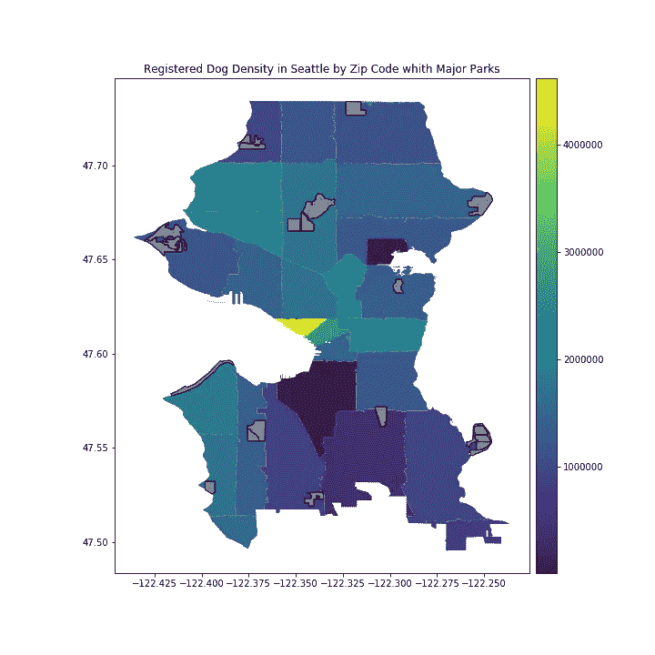
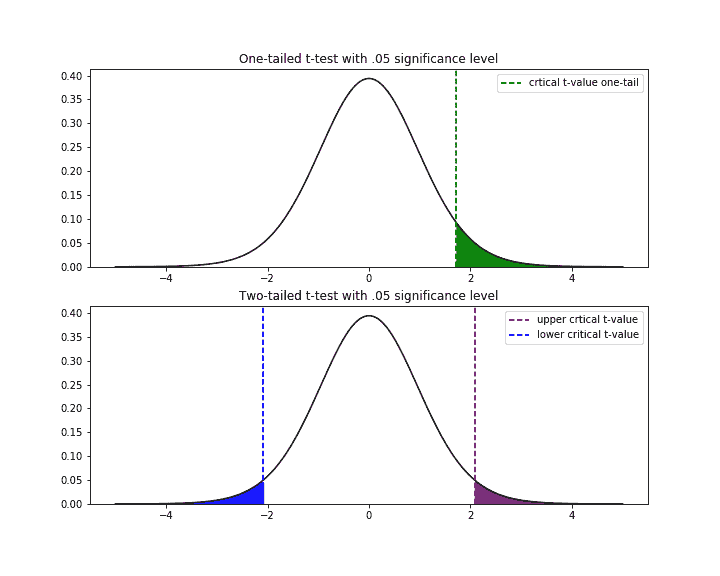
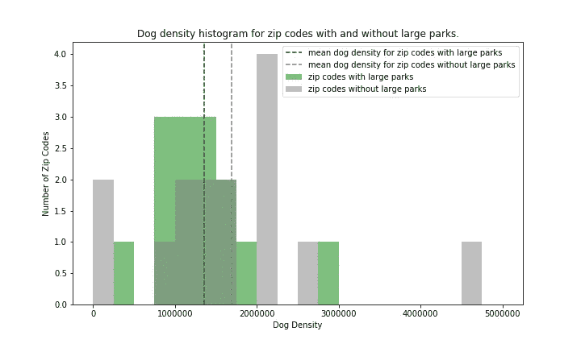
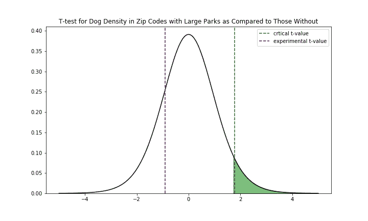
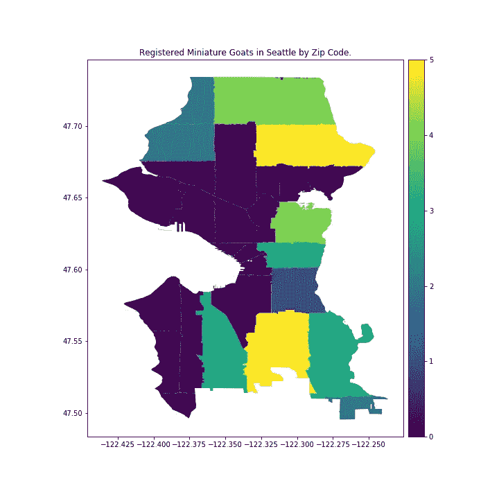

# 有大公园的西雅图邮政编码比没有大公园的有更高的狗密度吗？

> 原文：<https://towardsdatascience.com/do-seattle-zip-codes-with-large-parks-have-higher-dog-density-than-those-without-dae3f5089ae0?source=collection_archive---------28----------------------->

## 用 Python 的 SciPy 进行假设检验。统计包加上哪里可以找到微型山羊

前几天，当我在寻找宠物密度最高的西雅图邮政编码时，我发现自己在想，“在有大型公园的邮政编码中，狗的密度会更高吗？”和“这些山羊在哪里？”



深入到第一个问题，假设检验将帮助我们确定两组在统计上是否有显著差异。

对于假设检验，我们使用以下步骤:

1.  定义无效假设和替代假设
2.  识别测试统计和概率分布
3.  指定重要性级别
4.  计划、收集数据和计算
5.  拒绝或未能拒绝零假设

## 定义无效假设和替代假设

无效假设——作为一名持怀疑态度的科学家，我们希望我们两个群体之间没有差异。这是无效假设。

H0:与没有大型公园的西雅图相比，在有大型公园的西雅图邮政编码区，狗的密度没有增加。

替代假设——我们两个群体之间存在差异。我们无效假设的替代方案。

H1:与没有大型公园的西雅图相比，在有大型公园的西雅图邮政编码区，狗的密度增加了。

## 识别测试统计和概率分布

测试统计有几个选项，包括:

*   *Z 检验* —正态分布。适用于:具有大样本量或已知总体方差的正态分布数据
*   *T 检验* —尾部比正态分布重的学生 T 分布。适用于:未知方差，少于 30 个样本
*   *卡方检验* —决定分类变量是否独立
*   *F 检验* —使用 ANOVA，检验基于方差的分组是否有意义

更多详情[此处](https://en.wikipedia.org/wiki/Test_statistic)。

由于我们在每个人口中只有 14 或 15 个邮政编码，T 检验更适合于这种分析，因为它最适用于样本量小于 30 的情况。

除了检验统计量，如果您使用 z 检验或 t 检验，您需要确定您是在做单尾检验还是双尾检验。双尾检验是检验人群中的差异——或者大于或者小于(例如，男孩的身高与女孩的身高是否不同？).单尾测试用于确定一个单一方向的差异(例如，男孩比女孩高吗？).

在我们的例子中，我们的零假设表明有大公园的邮政编码并不比没有公园的邮政编码有更高的狗密度。因此，我们将使用单尾 t 检验，因为我们的假设只是询问在比较不同大小公园的社区时是否存在单向变化。

注意:与双尾 t 检验具有相同显著性水平的单尾 t 检验将拒绝比单尾 t 检验更少的零假设，因为它“分割”了“高于”和“低于”可能性之间的不确定性，您可以在下面的图表中看到这一点。请注意，单尾 t 检验的临界 t 值小于双尾检验的上限临界 t 值。



## 指定重要性级别

显著性水平是基于所提供样本的群体之间没有差异的概率。5%或 1%的显著性水平(alpha)对应于备选假设的 95%或 99%的置信区间。请记住，在显著性水平为 5%的情况下，预计 20 个重复实验中有 1 个会得到错误的结果。

在这种情况下，我决定 5%的显著性水平/95%的置信区间适合我的目的。特定的显著性水平通常是你的行业、公司等的标准，所以一定要使用它，不要随便选一个。注意:调整您的显著性水平和置信区间以适应您的结果不是一个好的做法(例如，我们发现这种差异在 87%的置信区间下是显著的)。

## 计划、收集数据和计算

一旦有了假设、测试统计数据和显著性水平，就可以准备制定数据收集计划了。基于您期望的两个总体之间的差异大小和您的显著性水平，您可以确定您需要多大的样本来拒绝零假设，如果它是假的。更多信息见[这里](https://en.wikipedia.org/wiki/Power_(statistics))。

首先，按照计划，收集所有的数据。同样，在收集数据的同时不断计算测试统计量，等待达到显著性阈值，然后取消其余的数据收集，这不是一个好的做法。我们不只是试图拒绝零假设，而是实际上试图获得真相。遵循你的计划，收集所需数量的数据，然后*然后*计算，从而避免诱惑。

为了我的调查，这是西雅图狗密度的柱状图，按邮政编码排列:



看到没有大公园的邮政编码的平均狗密度大于有大公园的邮政编码的平均狗密度，我可以/应该停止我的调查。从统计上来说，或者从任何角度来说，在有大公园的邮政编码区，狗的密度并不高。我真的想知道这是否会随着人均价值而改变…下一个调查！出于入门/提醒的目的，我们将继续这个过程:

接下来，计算你的 p 值。查看“统计测试”的`scipy.stats` [文档](https://docs.scipy.org/doc/scipy/reference/stats.html)，找到适合您情况的文档。在本例中，我正在对两个独立的人群进行 T 检验，所以我将使用`ttest_ind`。查看文档，请注意，它期望两个群体之间的样本大小相等，因此我将随机对较大的群体进行采样，以便将其调整为较小群体的大小。由于我们不知道方差是否相等，我们将把`equal_var`参数设置为`False`，以执行[韦尔奇 T 检验](https://en.wikipedia.org/wiki/Welch%27s_t-test)，该检验不要求方差相等，而[学生的 T 检验](https://en.wikipedia.org/wiki/Student%27s_t-test)则假定两个总体之间的方差相等。

```
from scipy.stats import ttest_ind, t
import numpy as nprand_no_parks_zips = np.random.choice(no_parks_zips, size=14)
result = ttest_ind(rand_no_parks_zips, parks_zips, equal_var=False)
print(result)
```

退货:

```
**Ttest_indResult(statistic=-0.9046044635337662, pvalue=0.3745636286751721)**
```

这提供了双边检验的 p 值。为了获得单侧 p 值，我需要使用 t 统计量，并将其与我的 0.05 显著性水平 t 统计临界值进行比较。

要在 python 中获得 t 统计临界值，请使用`scipy`的百分点函数(百分点)

```
p = .95 # 1-alpha
df = 13 # degrees of freedom (n-1)
critical_t_value = t.ppf(p, df)
print(critical_t_value)
```

我们得到了:

```
**1.7709333959867988**
```

视觉上，我们有:



要查看 p 值，您可以使用累积分布函数来查找曲线下达到 t 统计量的面积，并将其从 1 中减去，以获得零假设为真的概率，并且具有大公园的邮政编码并不比没有大公园的邮政编码的狗密度高。注意:如果你在另一边做单尾测试(比如狗的密度较小)，你不需要从一个中减去。

```
p_value = 1 - t.cdf(result[0], df)
print(p_value)
```

我们得到了:

```
**0.808933235528686**
```

这里我们看到 t 统计量远低于临界值(当我们寻找大于替代假设时)，p 值远高于我们的显著性水平。因此，我们不能拒绝零假设，即有大公园的西雅图邮政编码没有比没有大公园的更大的狗密度。在 0.05 的显著性水平上，这两个群体之间没有统计学上的显著差异。

如果 t 统计量超出了临界 t 值(或双尾检验的-值)，并且 p 值小于我们选择的显著性水平，我们将拒绝零假设，而支持替代假设。请注意，p 值和 t 统计检验将始终表明相同的结论。您不需要两者都检查。


Beckham enjoying Green Lake. Photo Credit: [Kevin Honold](https://www.linkedin.com/in/kevinhonold)

我由此得出的结论是，西雅图人喜欢他们的宠物，不管它们离一个大公园有多近。虽然我的小狗贝克汉姆肯定很喜欢它靠近绿湖的位置，但是不管你离一个大公园有多近，有很多方法可以让你的宠物保持活跃和健康。

调查愉快！

正在寻找 38 只注册的小型山羊…



我不会猜到拉韦纳/韦奇伍德/枫叶/等等。成为迷你山羊的热土，但是很迷人！

一如既往，你可以查看我的 GitHub [回购](https://github.com/allisonhonold/seattle_pets_blog2)了解更多细节/代码。