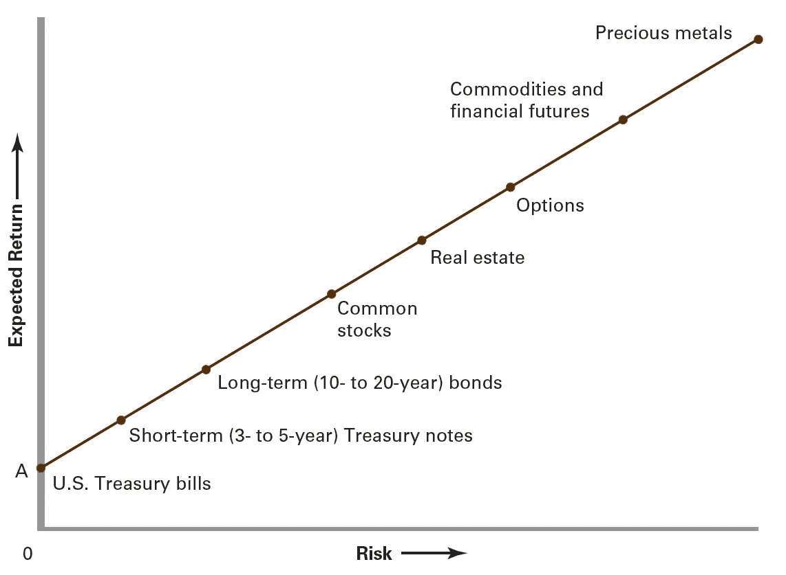
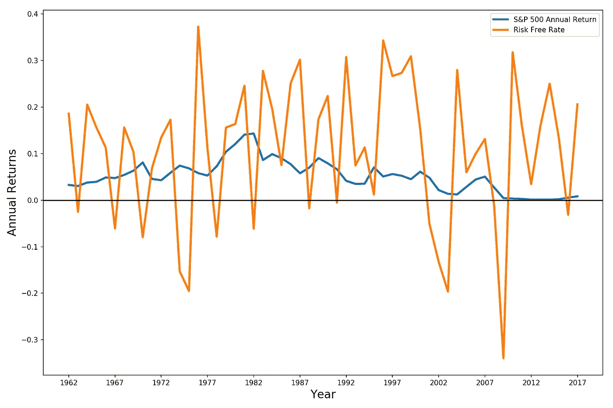
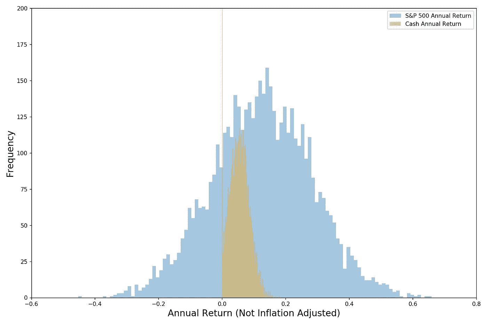
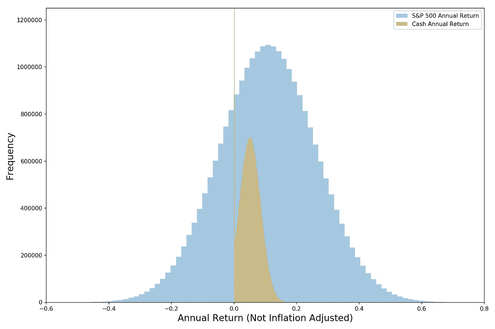
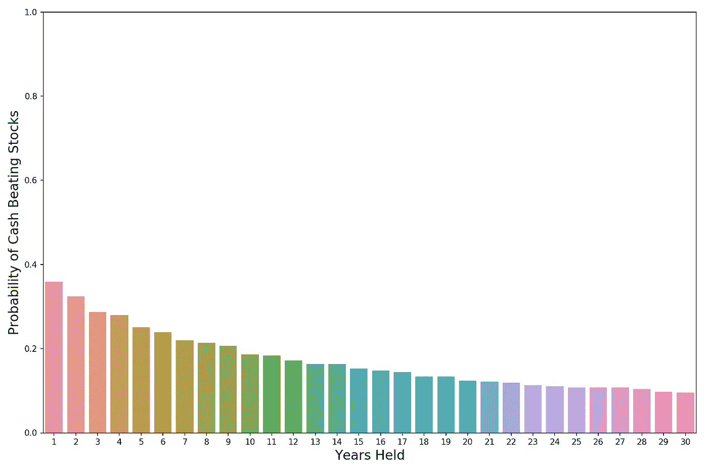
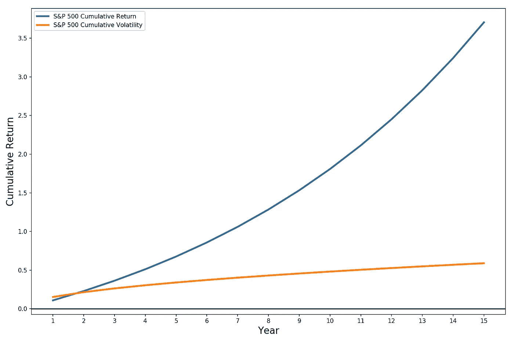
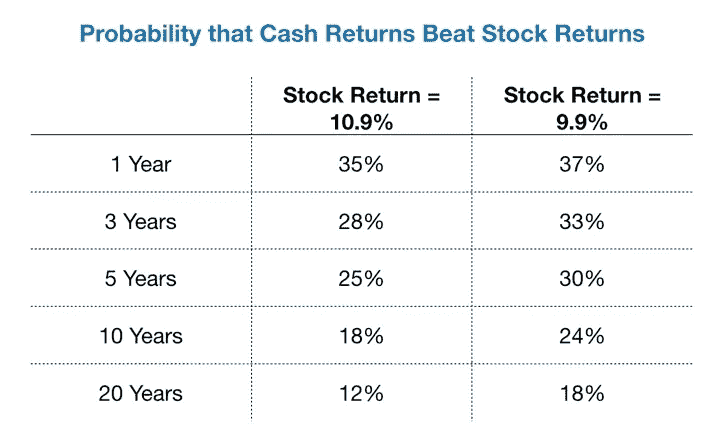

# 股票提供正的预期回报吗？

> 原文：<https://towardsdatascience.com/do-stocks-provide-a-positive-expected-return-d21571e78ea4?source=collection_archive---------11----------------------->

Photo by [Mark Finn](https://unsplash.com/photos/SgraLCyISWs?utm_source=unsplash&utm_medium=referral&utm_content=creditCopyText) on [Unsplash](https://unsplash.com/search/photos/stock-market?utm_source=unsplash&utm_medium=referral&utm_content=creditCopyText)

## 我们使用统计和模拟来量化我们对标准普尔 500 战胜现金(国库券)的信心

如果你想自己运行代码，你可以在我的 Github 这里找到它。

投资和退休理财的一个基本假设是，随着时间的推移，股票将比现金或国债等更安全的投资资产带来更高的回报。但是他们有吗？

在本帖中，我们将检查这些数字，运行一些模拟，并最终量化我们的信心水平，即标准普尔 500(美国大型公司的可投资指数)将为我们提供超过美国国库券(现金)的正预期回报。

> 一些定义:
> 
> **名义回报** =未经通货膨胀调整的投资回报
> 
> **实际回报** =经通货膨胀调整后的投资回报

# 我们为什么要关心？

尽管我们今天有很多投资选择，标准普尔 500 仍然是大多数投资组合的主力。例如，广受欢迎的 [SPY](https://finance.yahoo.com/quote/SPY?p=SPY) ，一只跟踪 S & P 500 的 ETF(交易所交易基金)，截至 2019 年 5 月 23 日，净资产超过 2780 亿美元。它只是众多跟踪标准普尔 500 指数的基金之一。

即使你没有直接买下标准普尔 500，你也可能拥有一些。假设你现在 30 岁，在你的 401k 计划(为计划在 2055 年退休的人设计)中投资了 Vanguard 2055 目标日期基金。该基金将其 54%的资产投资于总股票市场指数基金，该基金与标准普尔 500 指数大致相同。

所以基本上每个人都至少有一些钱在里面。

# 回报的另一面是风险

在金融界工作，你会经常听到这样一句话:“没有免费的午餐。”(除了在谷歌，抱歉，这是个蹩脚的笑话)金融人士这么说的意思是，没有伴随风险就没有超额回报。

让我们想想这意味着什么。

## 无风险基准利率

第一，我为什么说超额收益？我们能用钱投资的东西从来都不是只有一个。每一个决定都是一种权衡——如果我投资标准普尔 500，那么这笔钱就会被套牢，不能再投资于黄金、国债、日本股票、原油或其他任何东西(直到我们出售)。

> 我们做出的每一个财务决策都应该有适当的基准。金融中最基本的基准是无风险利率——我们可以不费吹灰之力、零风险获得的回报率。

我们通常使用的无风险利率是[国库券](https://en.wikipedia.org/wiki/United_States_Treasury_security#Treasury_bill)利率(我在本文中使用的是一年期国库券利率)。国库券是由美国政府发行的短期债务工具(一年内到期)，被认为是无违约的。展望未来，我将交替使用一年期国库券和现金，因为国库券被广泛认为是现金等价物。让我们来看看这个比率是什么样的:

One Year Treasury Bill Rate

正如你所看到的，现金利率变化很大，从高通胀的 20 世纪 70 年代的两位数到过去十年的接近零(为了应对金融危机)。需要注意的一点是，一年期国债利率实际上并不是真正无风险的——如果通胀率高于你的收益率，你最终将获得负的实际回报。TIPS(国债通胀保值证券)将是无风险资产的良好候选，但直到 20 世纪 90 年代才被广泛采用(因此数据较少)。

## 你应该因为承担更多风险而要求更多的回报

第二，你承担的风险越大，你期望的回报就应该越高。否则为什么要拿你的钱冒险呢？下图说明了这种风险与回报的关系。

Always demand more bang for your buck!

那么，我们为什么要相信像美国股票这样的高风险产品会给我们带来比现金更高的预期回报呢？经典的回答是**当我们购买公司的股份时，我们是在提供金融资本来帮助发展和经营业务——我们是在提供服务，应该期望得到报酬**。

就像向朋友发放个人贷款一样，你可能只能收回一部分钱，或者根本拿不回来。因此，本质上，股票的更高预期回报，就像贷款利率一样，是为了补偿你的风险。但是真的吗？

> 标准普尔 500 包括股息的平均年回报率(1962–2017):**10.9%**
> 
> 平均无风险利率(1962 年至 2017 年): **5.2%**

平均回报看起来不错，但是仅仅看平均回报会欺骗我们。下图比较了年度股票回报率和无风险利率。三样东西跳了出来:

1.  标准普尔 500 回报比现金回报表现出更高的波动性。
2.  现金的表现已经超过标准普尔 500 指数很多倍。
3.  1990 年以前，现金似乎比 1990 年以后更经常跑赢股票。
4.  2008 年后，股票轻松击败现金，因为无风险利率被美联储锁定为零。

Stocks returns vary much more than cash returns

# 用一些模拟来测试我们的假设

让我们通过运行一些模拟(精神上非常类似的分析)来可视化这个过程，而不是计算测试统计和运行正式的假设测试。

我用以下假设运行了 5000 个一年的模拟:

*   股票收益正态分布，预期收益 10.9%，标准差 15.2%。
*   无风险利率(现金回报)的预期值为 5.2%，标准差为 3.4%，但不能低于 0%。
*   上述数值是使用历史数据(1962 年至 2017 年)估算的。有人可能会说，上世纪 70 年代的高通胀(和高利率)是一种异常现象，但我们已经受到数据的限制，所以我决定在我的分析中尽可能多地使用数据。
*   股票和现金回报是独立的。
*   我没有对这些值进行通货膨胀调整(一切都是名义值)。

在我运行的 35%的模拟中，现金战胜了股票！这可不好。因此，在任何一年，标准普尔 500 指数跑赢现金的可能性只有三分之二。

对于可视化，请查看下面我的模拟结果的直方图。注意 x=0 处的垂直橙色线；发生这种情况是因为我不允许现金的名义回报率低于 0%(你也不应该这样，如果你的银行试图收取你持有资金的费用，是时候换银行了)。因此，现金回报率等于 0%的例子很多。

Stocks look pretty risky…

这还不是全部。回想一下，我们仅使用 56 年的历史来估计我们的预期回报和标准差——这并不是很多数据。**所以还有第二个层次的不确定性——围绕我们对总体参数估计的不确定性**(为了简单起见，我们将专注于解决围绕预期回报的不确定性，忽略围绕标准差的不确定性)。

我们可以通过将标准误差应用于我们对预期回报的估计来尝试捕捉这种不确定性。标准误差基本上是我们对真实平均值估计的标准偏差。也就是说，**“标准误差”试图回答这个问题——如果我们多次进行这个实验(假设我们可以),并计算每次的预期收益，我们会在这个预期收益估计值中观察到多少变化？**

我们可以将标准误差(SE)计算为:

> SE =样本标准偏差/ sqrt(样本大小)
> 
> SE _ S&P500 = 15.22%/sqrt(56)= 2.03%
> 
> SE_Cash = 3.36% / sqrt(56) = 0.45%

## 针对参数的不确定性修改我们的模拟

由于我们可以运行的模拟数量没有实际限制，所以让我们只表达我们对预期回报真实值的不确定性，作为随机性的一个额外来源。这是我们的设置:

*   进行 5000 次实验。
*   每个实验由 5000 个一年的模拟组成。除了现在标准普尔 500 和现金的预期收益不再是固定的；相反，它们本身是随机变量(根据学生的 t 分布分布)，其标准偏差等于各自的标准误差。

因此，我们只是重复我们之前所做的(之前的直方图)5000 次(像一个嵌套循环)，每次都允许我们不确定的变量(预期回报)发生变化。让我们来看看这是什么样子的(记住垂直的橙色线在那里，因为我不允许负的现金回报，因此有很多现金回报= 0%的例子)。形状看起来和以前差不多，只是更平滑了，因为我们运行了这么多模拟。

Looks about the same as before

看看统计数据，什么都没有改变(现金每年仍有 35%的机会获胜)。

那么，这一切都是徒劳的吗(对于我自己的直觉来说，检查估计值的不确定性是否会导致更多的差异实际上是有用的——似乎不会)？

或者也许我们没有问对问题…

# 当你扩大投资范围时，股票看起来会更好

买入并持有是一种流行的投资策略，这是有原因的。我们不应该用几天、几周甚至几个月来判断我们的投资。我们投资是为了积累长期财富，并为我们的退休生活提供资金。

回想一下，之前我们发现现金赢的概率为 35%(在我们的 5，000 次模拟中)。让我们来看看我们购买和持有的时间(持有期)如何影响现金赢率:

The longer your holding period, the more likely that stocks will beat cash

如果我们买入并持有股票 5 年，现金胜出的概率从 35%下降到 25%。如果我们买入并持有 10 年，则降至 18%。如果我们买入并持有 20 年，股票表现差于现金的概率会一直下降到 12%。仍然不理想，但已经明显好了。

因此，在一个足够长的时间范围内，说股票将比现金回报更好似乎是一个合理的赌注——在 20 年的投资范围内，股票在 8 次中有 7 次击败了现金。

让我们凭直觉理解为什么持有时间越长，股票相对于现金越有吸引力。主要原因是，随着你持有时间的增加，预期回报开始比波动性(标准差)更重要。让我们来看看五年持有期的预期回报等式:

> 5 _ yr _ return =(1+annual_return)⁵-1

如果你持有一项投资资产五年，这是你累积回报的标准差( *stdev* ):

> 5_yr_stdev = annual_stdev * sqrt(5)

注意到什么酷的东西了吗？如果你从这篇文章中只拿走一样东西，我希望是下面这一点。这可能是所有金融中最重要的概念:

> **预期回报随时间呈指数复合增长，但波动性(标准差)仅随时间的平方根增长。**

这意味着，随着时间的推移，**你投资的波动性会被回报淹没，前提是预期回报足够高(长期回报大于波动性)**。你会听到这被称为复利的力量。让我们来看看这个:

Return starts to take off relative to volatility

前面的图表让股票看起来像是一个不需要动脑筋的问题，但是请记住，我们不太关心股票的绝对回报，而更关心股票相对于现金的超额回报。使股票受益的复利也有助于现金。

# 负荷试验

只说“持有股票 20 年，你就可以走了”太容易了。让我们对我们的假设进行一点压力测试。

早些时候，我们计算出股票的标准误差(我们对预期回报估计的标准偏差)为 2.03%。因此，如果股票的实际实现回报率低 1.0%(9.9%，而不是我们估计的 10.9%)，一点也不奇怪。

如果股票回报低于我们的预期，那么在各种投资范围内，现金战胜股票的概率会怎样？不出所料，情况全面恶化，现在即使在 20 年的时间范围内，现金也有近五分之一的机会击败标准普尔 500。

Gets worse but longer holding periods still help

# 结论

那么，标准普尔 500 的表现是否会优于一年期美国国债？大体上是的。**但在任何一年，我们都应该预料到大相径庭的结果(股票的胜算大约只有三分之二)。即使持有超过 20 年，我们也不能非常自信地认为投资股票会更好(股票的胜算大约是 8 分之 7)。**

那么，为什么还要担心股票呢？正如我上面提到的，虽然现金在名义上是无风险的，但它却极易受到通货膨胀的影响**。**

**另一方面，股票由于其较高的预期回报和公司提高商品和服务价格的能力，相对较少受到通货膨胀的影响。**

**因此，股票仍然是我们长期积累真实(经通胀调整的)财富的较好赌注之一——但正如我们所见，它们绝不是一个稳赚不赔的赌注。**

***来源:***

***S&p500 收益的数据来源于* [*罗伯特席勒的网站*](http://www.econ.yale.edu/~shiller/data.htm) *。***

***国债利率数据取自***。****