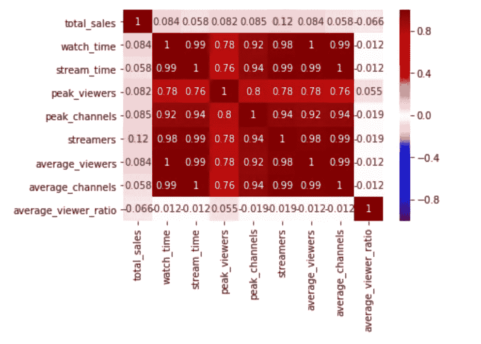
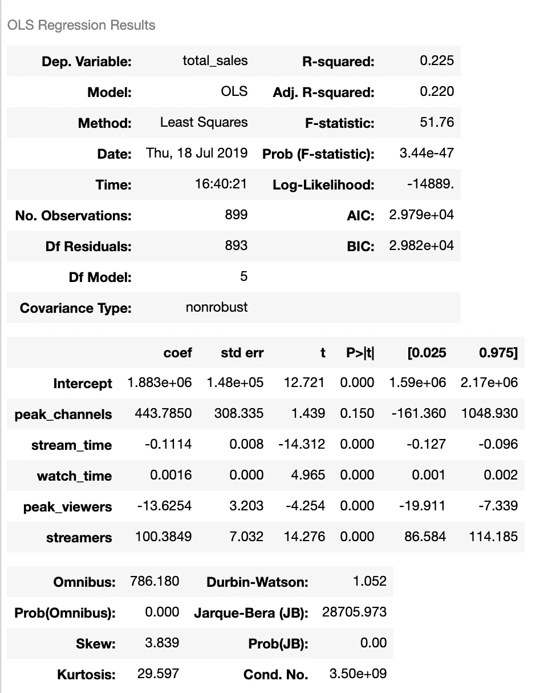
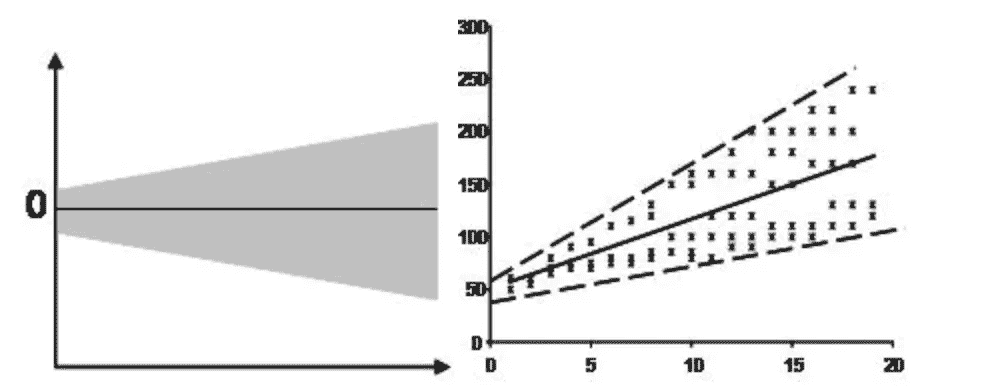
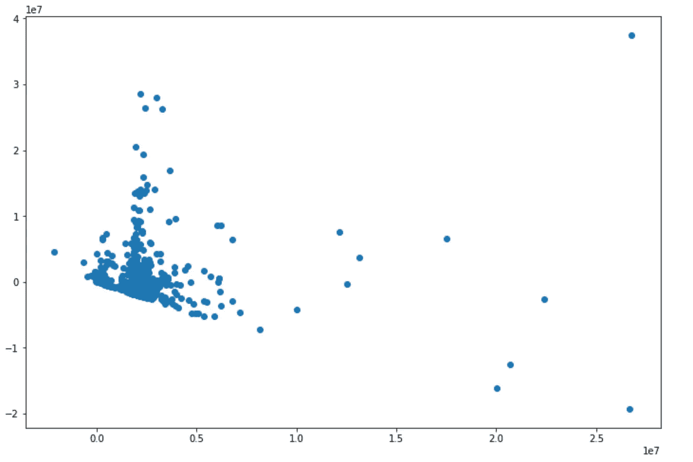
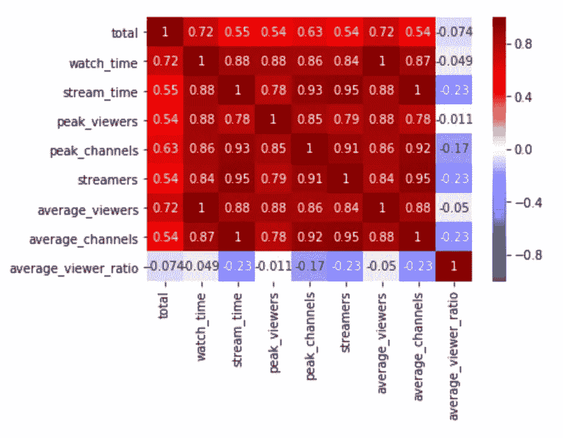
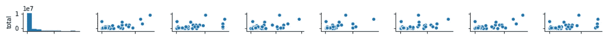
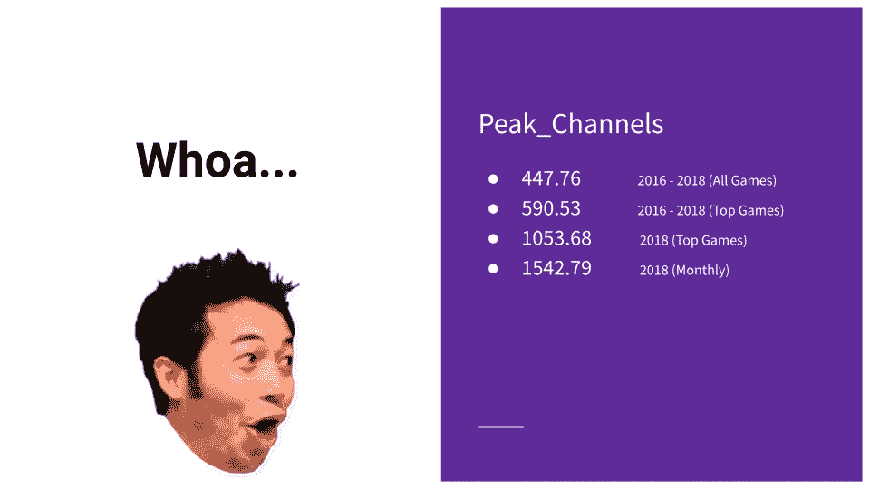

# Twitch 上的流媒体指标会影响游戏销量吗？

> 原文：<https://towardsdatascience.com/do-streaming-metrics-on-twitch-affect-game-sales-cbb4e0ee90e0?source=collection_archive---------26----------------------->

## 使用线性回归探索视频游戏销售与其在 Twitch 上的流量之间的关系

Photo by [Caspar Camille Rubin](https://unsplash.com/@casparrubin?utm_source=unsplash&utm_medium=referral&utm_content=creditCopyText) on [Unsplash](https://unsplash.com/s/photos/twitch?utm_source=unsplash&utm_medium=referral&utm_content=creditCopyText)

每天，大约有 1500 万游戏玩家和非游戏玩家访问 Twitch，与志同道合的社区进行交流、观看和聊天。平台上有如此多的人，我认为看看一个给定游戏的流媒体指标如何影响该游戏的单位销售会很有趣。虽然我特别感兴趣的只是理解流和销售之间的潜在关系，但我的假设是，具有非常健康的流指标的游戏也会有类似的健康销售数字。我也有预感，总观看分钟数和总播放分钟数的系数将是销售数字的主要驱动力。

然而，这只是一个假设，所以我决定求助于一些真实的数据和真实的建模来决定是否接受或拒绝它。

## 数据

对于这个项目，我从两个主要来源获取数据。第一个是使用 BeautifulSoup 获取视频游戏销售指标的对 VGChartz 的网络抓取。第二个(流媒体指标)是通过 [SullyGnome](https://sullygnome.com/) (第三方 Twitch 统计和分析网站)收集的。具体来说，我研究了:

*   值班时间
*   连续开工时间
*   峰值观众(特定标题的最高并发观众数量)
*   峰值频道(特定标题上的最高并发流媒体数量)
*   飘带
*   普通观众
*   平均频道

在继续之前，有必要重复一下直接从他们的网站上获取的关于 VGChartz 的附加说明:

*所有销售信息仅是估计值，并通过多种专有且不断发展的方法得出，包括:*

*   *被动地轮询终端用户，了解他们当前正在购买和玩什么游戏*
*   *调查零售合作伙伴，了解他们销售的游戏和硬件*
*   *使用相似游戏的统计趋势拟合和历史数据*
*   *研究转售价格以确定消费者需求和库存水平*
*   *咨询出版商和制造商，了解他们将多少台设备引入渠道*

因此，虽然 VGChartz 上的销售数字是公开可以找到的最可靠的数字，但它们可能并不准确。

## 范围

尽管 Twitch 在美国占据主导地位，因为 VGChartz 和 SullyGnome 都在全球范围内收集数据，但我没有(也不可能)将这项研究局限于一个国家。此外，SullyGnome 上的可用数据只能从 2016 年到现在访问，所以我不得不将该项目限制在 2016 年以后。最后，尽管 Twitch 占据了 PC 流媒体市场的最大份额，但由于数据的性质，我分析了所有平台的多平台产品。

现在，在我开始实际建模之前，先做一些简单的说明。首先，我选择排除这个项目的免费游戏(F2P)的标题。虽然像《堡垒之夜》、《英雄联盟》和《Dota 2》这样的游戏继续主导流媒体领域，但考虑到(顾名思义)它们不需要花费任何费用来玩/购买，它们并没有完全炸毁每周的销售图表。

同样，我决定将微交易排除在这项研究之外。虽然一项有趣的未来研究可能会将微交易视为流媒体指标的一个功能，但该项目严格关注任何给定标题的销售单位。

# 模特 V1:2016–2018(所有比赛)

Photo by [Sean Do](https://unsplash.com/@everywheresean?utm_source=unsplash&utm_medium=referral&utm_content=creditCopyText) on [Unsplash](https://unsplash.com/s/photos/video-games?utm_source=unsplash&utm_medium=referral&utm_content=creditCopyText)

在我第一次浏览数据时，我选择查看 SullyGnome 存在以来(2016 年至今)所有图书的销售情况。然而，因为 VGChartz 只有 2018 年的完整图表，我被迫只看 16-18 年的数字。

为了从 VGChartz 获取信息，我运行了一系列函数来抓取多个页面中的必要列:

上面给了我一个 56，322 款游戏的庞大数据框架，尽管其中只有大约 20，000 款游戏附有总销售额，所以我用这些数据进行工作。

在对这个数据框架做了一些清理之后(请随意查看我的[项目报告](https://github.com/nicholassherwin/Twitch-Linear-Regression)中的代码),我将所有平台上每个游戏的销售额汇总到每个独特游戏的一行中，因为 SullyGnome 显示了所有平台上每个游戏的所有流媒体指标。

接下来，我继续使用 SullyGnome 的 Twitch 指标，从 2016 年到 2018 年的前 1000 款游戏中抽取，因为这感觉上是一个足够大的批量，可以用来测试我的假设。两个数据框架都被合并到公共列“游戏”中，然后准备建模。

## 第一个模型

进入模型后，我强烈地感觉到将会有一些严重的多重共线性。毕竟，再次查看我选择用作我的模型的特征的流度量(观看时间、流时间、总流数等。)许多人本质上说的是同一件事，或者彼此之间有明显的强相关性。

将所有特征和目标放入相关矩阵中肯定证实了这一点:

Correlation matrix for 2016–2018 games

在整个项目中，我在构建和优化模型时牢记这一点，剔除具有近乎完美的多重共线性的要素。然而，更有趣的是，(也令人失望的是)我还在所有这些流式指标和目标(总销售额)之间看到了一个相当微弱的信号。

这是一个很好的地方来说，我将主要看着**调整的 R 平方**作为我的成功指标。我更感兴趣的是了解我的特征和目标之间的关系，而不是试图预测未来的目标变量(在这种情况下，我可能会选择查看 RMSE——均方根误差)。

无论如何，我知道我将需要做一些相当大的清理和提炼，但我很好奇在去掉一些非常相关的特性后，摘要会是什么样子。使用统计模型，很容易将模型与一些数据相匹配，并打印出汇总统计数据:

这打印出了以下内容:

不出所料，我看到了一些我上面预期的回声。在高条件数和相当低的调整后 R 平方中有强烈的多重共线性迹象。然而，通过查看系数，我还发现了一些非常有趣的事情…尽管大多数功能给我的信号很低，甚至没有信号，但 peak_channel 指标的值为 443。这意味着，对于一个给定的标题，每增加一个高峰频道，我就会看到多卖出 443 台！随着我的项目向前推进，这是我肯定会关注的事情。

这是提到线性回归的另一个假设的好时机:[同方差](http://www.statisticssolutions.com/academic-solutions/resources/directory-of-statistical-analyses/homoscedasticity/)。散点图是检查数据是否同质的好方法(意味着回归线上的残差相等)。以下散点图显示了非异方差(即异方差)数据的示例:

这是我的散点图…

在这个阶段，我基本上违反了线性回归的五个假设中的两个…也许我需要一个不同的方法…

# 模式 2 和模式 3:大同小异

在项目的这一点上，我决定最好的行动是逐步缩小我所关注的时间范围。我不会详细介绍这些模型，但可以说我观察了以下时间段:

*   2016 年至 2018 年，但只是销售额最高的游戏
*   2018 年总计

在每个阶段，我都看到了稍微好一点的结果(更高的 r 平方，残差图上稍微多一点的随机性)，但仍然大同小异:强烈的多重共线性，许多流度量之间的信号很弱，没有[同质性](http://www.statisticssolutions.com/academic-solutions/resources/directory-of-statistical-analyses/homoscedasticity/)。在这一点上，我觉得 LUL 表情本身应该被用来嘲笑我糟糕的成绩:

Is this even a linear regression?

# 模型 4:终于有所进展

对于我的建模的最后一次迭代，我选择查看每个游戏发布当月的销售和流媒体指标。根据我自己的经验、领域知识和 VGChartz 的一些环境扫描，很明显，游戏销售通常在发布时有一个强劲的峰值，并在第一个月之后急剧下降。因此，我希望这种方法会产生更好的结果。

同样，我从 VGChartz 网站上收集了每月的热门游戏，结合 SullyGnome 的指标，发现了一些更令人鼓舞的结果:

Starting to see some signal between sales and streams (row 1)

Starting to see a linear relationship

不仅这些结果更令人鼓舞，在这个尺度上峰道系数甚至更大。事实上，让我们看看这个系数是如何影响每个时间尺度的销售额的:

Whoa…

这表明，逐月查看数据，在发布的前 4 周内，我们看到 Twitch 上每个额外的高峰频道流媒体都额外售出了 1，542 台。这是相当有意义的！

# 结论

我进入了一些关于我的模型的附加细节(正则化，交叉验证，等等)。)但这篇文章已经够长了，关键在于 peak_channels 系数。

虽然我可以合理地说，在许多流媒体功能和目标之间没有巨大的信号，但我可以说 peak_channels 系数有一个非常戏剧性的信号，特别是在游戏发布的前 4 周。

关于这一发现，需要注意的是:一个标题的高并发流数量可能只是有多少人首先购买了该游戏的函数，而不是相反。因此，在未来，我很乐意探索预购销售数字与发布时的流数量的对比，以确定流是否确实是销售的原因。

Twitch 的业务是建立社区，支持创作者和游戏开发者，并塑造整个视频游戏行业。有了这些数据，我会建议 Twitch 联系潜在的游戏开发商和赞助商，并建议他们不要将赞助/广告资金集中在大型(和昂贵)的流媒体上，如忍者(哎呀，[他甚至已经不在那里了](https://www.nytimes.com/2019/08/01/arts/mixer-ninja-twitch-fortnite.html))，而是应该尽他们所能在游戏发布时让流媒体充斥市场。

他们可以通过吸引社区和提升横幅来做到这一点，这些横幅通常不会引起大赞助商的注意。

这与大多数成功的广告运作方式背道而驰。然而，Twitch 在许多方面都是一个反直觉的产品。Twitch 由小型利基社区组成，这些“中间层”横幅有一个更有效的互动平台，可以与观众建立友好和亲密的关系(即使他们没有大牌横幅的音量)。把它想象成类似于在一个巨大的舞台上观看你最喜欢的乐队与一个亲密的 500 人俱乐部的比赛。广告商和游戏开发商同样可以利用这种紧密联系的利基社区，在更个性化(和更高转化率)的层面上有效地瞄准和沟通。我甚至建议 Twitch 制作一个实时分析仪表板，看看游戏是如何在发布窗口参与和销售的，以利于广告商、开发者和整个游戏社区。

# 附录

[Github](https://github.com/nicholassherwin) 、 [LinkedIn](https://www.linkedin.com/in/nicksherwinjr/) 、[投资组合](https://www.nicholassherwin.com/)