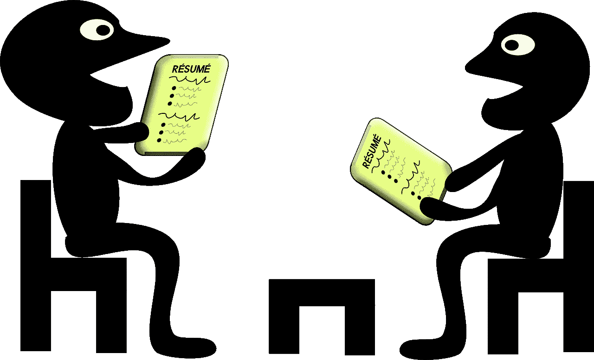
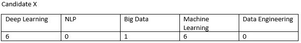
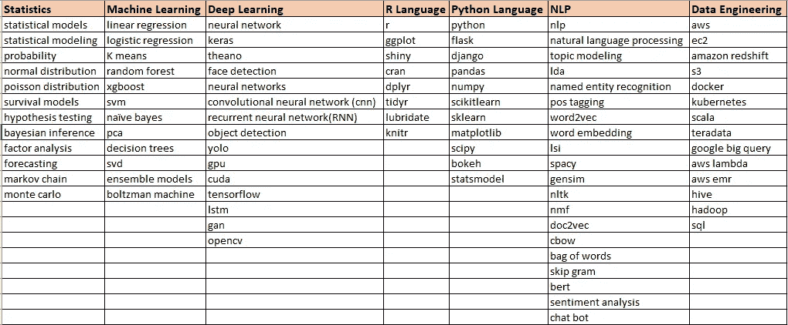
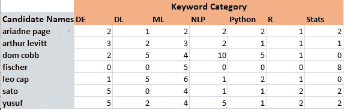
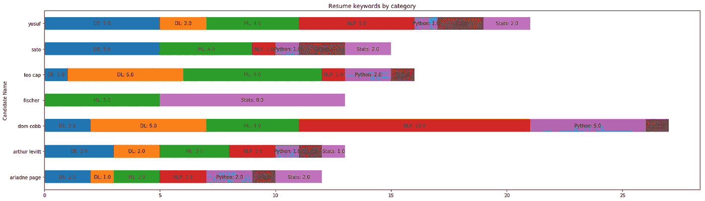

# 我如何使用 NLP (Spacy)筛选数据科学简历

> 原文：<https://towardsdatascience.com/do-the-keywords-in-your-resume-aptly-represent-what-type-of-data-scientist-you-are-59134105ba0d?source=collection_archive---------2----------------------->

## 通过 NLP 更好地定位您的数据科学简历

Image Source: pixabay

简历制作非常棘手。一个候选人有许多困境，

> 是详细陈述一个项目，还是只提及最低限度
> 
> 是提及多项技能还是只提及他/她的核心能力技能
> 
> 是要提到很多编程语言还是只举几个
> 
> 是将简历限制在 2 页还是 1 页

对于寻求改变的数据科学家来说，甚至对于有抱负的数据科学家来说，这些困境都同样艰难。

在你想知道这篇文章的方向之前，让我告诉你写这篇文章的原因。

## **上下文**

我的一个朋友有自己的数据科学咨询公司。他最近获得了一个好项目，需要他雇佣两名数据科学家。他在 LinkedIn 上发布了一份工作，令他惊讶的是，他收到了近 200 份简历。当我见到他本人时，他说，“*要是有一种方法能比手动逐一查看所有简历更快地从这些简历中选出最好的简历就好了*”。

在过去的两年里，我一直在从事几个 NLP 项目，这既是工作的一部分，也是我的爱好。我决定尝试解决我朋友的问题。我告诉我的朋友，也许我们可以解决这个问题，或者至少通过一些 NLP 技术来减少手动扫描的时间。

## **确切要求**

我的朋友想要一个拥有深度学习和其他机器学习算法知识的人作为他/她的核心竞争力。另一名候选人需要具备更多大数据或数据工程技能，如在 Scala、AWS、Dockers、Kubernetes 等方面的经验。

## **进场**

一旦我明白了我的朋友理想的候选人是什么样的，我就想出了一个方法来解决这个问题。以下是我列出的方法

> 准备一本字典或表格，将所有不同的技能进行分类，例如，如果有像 keras、tensorflow、CNN、RNN 这样的词，那么将它们放在一个名为“深度学习”的栏目下。
> 
> 有一个 NLP 算法来分析整个简历，基本上搜索字典或表格中提到的单词
> 
> 下一步是统计每个候选人在各种类别下出现的单词，如下所示

The above candidate would be a good match for the ‘Deep Learning Data Scientist’ that my friend is looking for.

> 将以上信息用视觉的方式表现出来，这样我们选择候选人就变得容易了

## **研究**

现在我已经最终确定了我的方法，下一个大的障碍是如何完成我刚才所说的。

**NLP 零件—空间**

我在寻找一个可以进行“短语/单词匹配”的图书馆。Spacy 满足了我的搜索需求。Spacy 有一个叫做“短语匹配器”的功能。你可以在这里阅读更多信息[。](https://spacy.io/api/phrasematcher)

**阅读简历**

有许多现成的软件包有助于阅读简历。幸运的是，我朋友收到的所有简历都是 PDF 格式的。所以，我决定探索像 PDFminer 或 PyPDF2 这样的 PDF 包。我选择了 PyPDF2。

**语言** : Python

**数据可视化** : Matplotlib

## **代码和说明**

**完整代码**

这里有一个要点[链接](https://gist.github.com/venkarafa/25a17956436b4cf9738ce722ea55aae6#file-resume-phrase-matcher-code)到完整的代码。

现在我们有了完整的代码，我想强调两点

**关键词 csv**

关键字 csv 在代码行 44 中被称为‘template _ new . CSV’

您可以用自己选择的 DB 来替换它(并在代码中进行必要的更改)，但为了简单起见，我选择了好的 ol excel 表(csv)。

每个类别下的单词都可以定制，下面是我用来匹配简历短语的单词列表。

**候选—关键词表**

在代码的第 114 行中，该行的执行产生了一个 csv 文件，该 csv 文件显示了候选人的关键字类别计数(候选人的真实姓名已被屏蔽),如下所示。

这可能不太直观，因此我通过 matplotlib 进行了数据可视化，如下图所示

Here DE stands for Data Engineering, the others are self explanatory

从图表上看，多姆·科布和费舍尔更像专家，而其他人则像多面手！！

## 整个锻炼有益吗？

我的朋友对取得的结果感到非常惊讶，这为他节省了很多时间。更不用说他仅仅通过运行代码就从近 200 份简历中筛选出了大约 15 份简历。

以下是整个练习的有用之处

**自动阅读简历**

代码自动打开简历并解析内容，而不是手动打开每一份简历。如果手动完成，将花费大量时间。

短语匹配和分类

如果我们手动阅读所有简历，很难判断一个人是否具有机器学习或数据工程方面的专业知识，因为我们在阅读时没有统计短语。另一方面，代码只是搜索关键词，记录出现的关键词，并对它们进行分类。

**数据可视化**

数据可视化在这里是一个非常重要的方面。它通过以下方式加快决策过程

> 我们可以知道哪个候选人在某个特定类别下有更多的关键词，从而让我们推断他/她可能在该类别中有丰富的经验，或者他/她可能是一个多面手。
> 
> 我们可以对候选人进行相对比较，从而帮助我们筛选出不符合要求的候选人。

## 你如何使用代码

**寻找工作变化的数据科学家/有抱负的数据科学家:**

很多公司可能已经在使用上述代码对候选人进行初步筛选。因此，建议根据特定的工作要求，用必要的关键词来定制你的简历。

一个典型的数据科学家有两种选择，要么把自己定位为多面手，要么表现为某个领域的专家，比如“NLP”。根据工作要求，数据科学家可以对照他/她的简历运行此代码，并了解哪些关键词出现得更多，以及他/她看起来是“多面手”还是“专家”。根据输出结果，你可以进一步调整你的简历，以相应地定位自己。

**招聘人员**

如果你和我的朋友一样是招聘人员，并且被简历淹没，那么你可以运行这个代码来筛选候选人。

希望你喜欢这篇文章。

你可以联系我

[领英](http://www.linkedin.com/in/venkat-raman-Analytics)

[推特](https://twitter.com/venksaiyan)