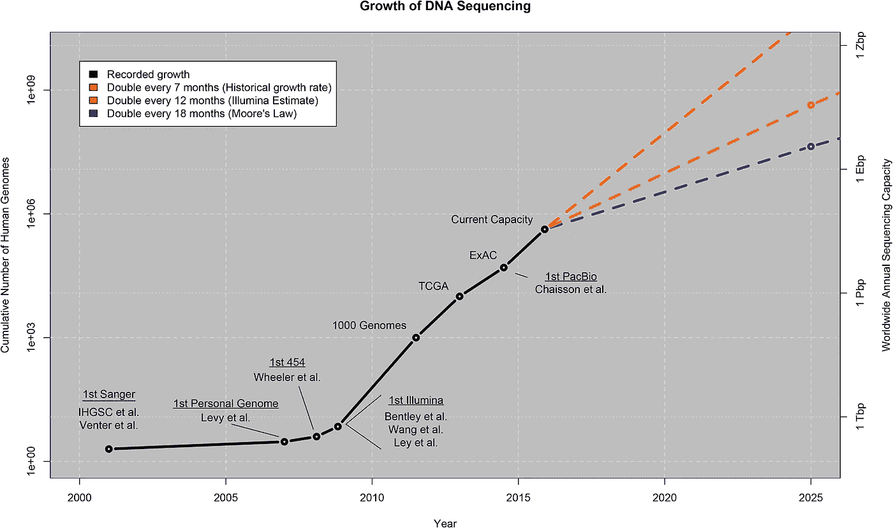
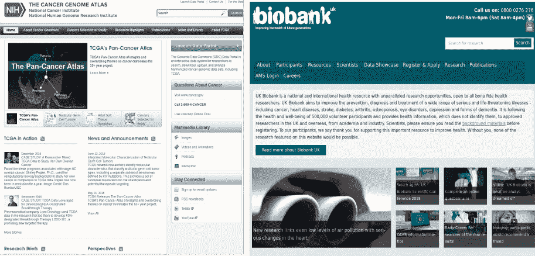
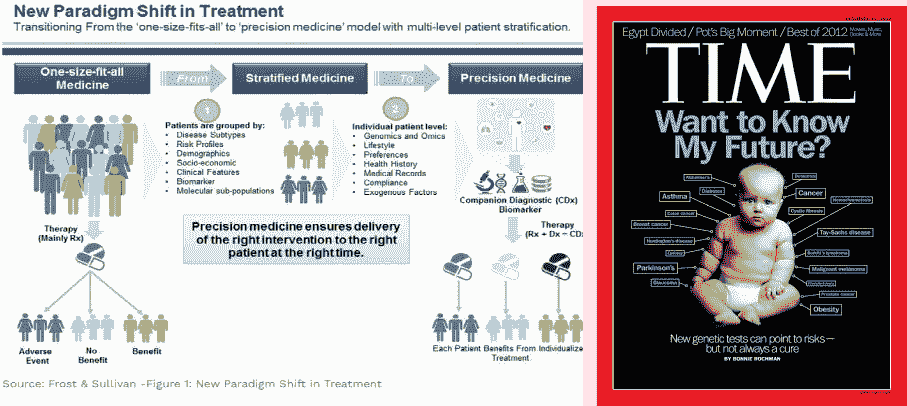
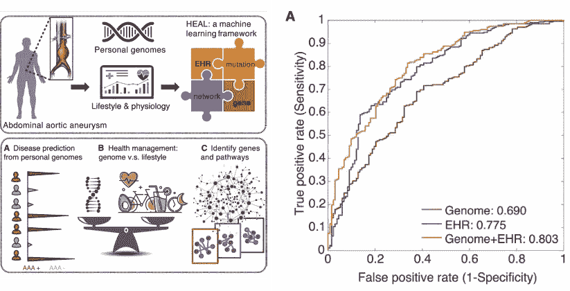
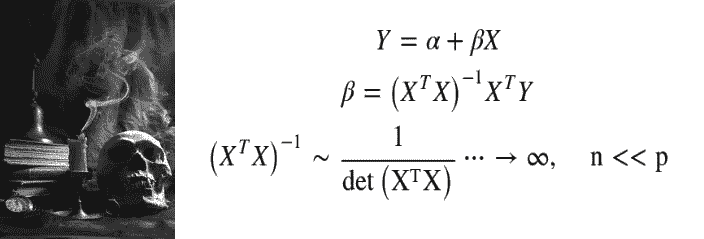

# 我们在生命科学领域有大数据吗？

> 原文：<https://towardsdatascience.com/do-we-have-big-data-in-life-sciences-c6c4e9f8645c?source=collection_archive---------10----------------------->

## [生命科学的数理统计和机器学习](https://towardsdatascience.com/tagged/stats-ml-life-sciences)

## 还是数据量仍然是瓶颈？

[Image source](https://venturebeat.com/2012/01/24/big-data-server-efficiency/)

在这篇文章中，我将开设一个新的专栏**生命科学的数理统计和机器学习**，在这里我将分享我与生命科学家一起工作时积累的关于计算分析的想法和观点，以及对生命科学中广泛使用的一些流行的统计和机器学习方法的深入解释，这些方法有时可能看起来难以理解。

# 大数据:天文数据还是基因数据？

由于我在[理论物理](https://en.wikipedia.org/wiki/Theoretical_physics)的背景，在过去的 8 年里，我很高兴也很幸运能和来自[生命科学](https://en.wikipedia.org/wiki/List_of_life_sciences)的人一起工作，比如生物医学、细胞生物学和进化科学。经常听同事说:**“我们有大数据，我们需要分析、整合它，并在其上运行机器学习”**。对于大数据，我的同事通常指的是各种组学数据[占据的**TB 和 Pb 的磁盘空间**:基因组学、转录组学、蛋白质组学、代谢组学等。](https://en.wikipedia.org/wiki/Omics)

From Stephens et al., Plos Biology 13, e1002195 (2015)

事实上，随着人类基因组测序变得相对便宜(每个基因组 1000 美元)，世界上越来越多的大学实验室有能力从成百上千的个人那里获取全基因组信息来回答他们的研究问题。诸如 [1000 基因组计划](https://en.wikipedia.org/wiki/1000_Genomes_Project) (~2 500 个人类基因组)、 [ExAC](http://exac.broadinstitute.org/about) (~60 000 个人类基因组)、 [UK10K](https://www.uk10k.org/data_access.html) (迄今为止~3 500 个人类基因组)以及最近的 [HGDP](https://www.biorxiv.org/content/10.1101/674986v1) (900+稀有人类基因组)等公共资源提供了海量的基因数据，这些数据目前已经远远超过了[摩尔定律](https://en.wikipedia.org/wiki/Moore%27s_law)。

# 它已经在诊所里了吗？

**精准医疗极大地受益于巨大的基因组学努力，如[癌症基因组图谱(TCGA)](https://www.cancer.gov/about-nci/organization/ccg/research/structural-genomics/tcga) (跨越 33 种不同癌症类型的 11 000 种人类肿瘤)和[英国生物库](https://www.ukbiobank.ac.uk/)(约 50 万人类个体)。**

****

**The Cancer Genome Atlas (TCGA) and UK Biobank are huge human genomics resources**

**“我们在生命科学领域有大数据吗？”这是一个什么样的问题。人们很容易说“是的，当然，看看基因组学的巨大努力。现在，我们应该能够使用从人类群体基因组数据中获得的知识，以随机提取人类 DNA 并**预测此人是否易患某些疾病**，因此我们应该能够预测此人的未来，并针对此特定个体开出调整后的治疗方案。这不就是精准医疗应该做的吗？”。**

****

**[Precision Medicine](https://www.forbes.com/sites/reenitadas/2017/03/08/drug-development-industry-bets-big-on-precision-medicine-5-top-trends-shaping-future-care-delivery/) is here to bring treatment adjusted to individual genetic signatures**

**然而，事实证明**将这些基因组学成果引入临床并不简单**。牛津大学的 Mark McCarthy 教授是二型糖尿病(T2D)的世界领先的遗传学专家之一，他去年做了几次演讲，题目是**

> **现在我们已经发现了超过 400 个影响二型糖尿病(T2D)的基因信号，我们到底要拿它们怎么办？**

**这听起来不太乐观吧？它基本上说，我们有很多数据，我们使用这些数据来识别与 T2D 等常见疾病相关的基因，但是我们还没有接近将这些基因用于临床诊断，以早期预测和预防这些疾病。**

# **基因组学预测很差**

**那么问题是什么，为什么我们不能在临床上使用这些巨大的基因组学成果呢？嗯，简单的回答是**它不像预期的那样工作。**更具体地说，遗传和基因组数据不能很好地预测常见疾病。斯坦福大学的迈克·斯奈德团队最近证明了基因组学数据对**腹主动脉瘤**的预测能力很差:**

****

**ROC curves for Genomics vs. EHR for AAA from Li et al., Cell **174**, 1361–1372 (2018)**

**上面的 ROC 曲线比较了**基因组学与电子健康记录(EHR)** 预测 AAA 的能力。EHR 代表了相当琐碎的临床信息，如身高、体重、体温、血压等。事实证明，这种琐碎的信息比 DNA 水平上的遗传变异更具预测性，这是非常令人沮丧的，考虑到 AAA 表型中的[大遗传成分](https://www.sciencedirect.com/science/article/pii/S1078588416001696)，这意味着 DNA 信息应该是可预测的，但它不是。这是常见疾病如 T2D、精神分裂症、心血管疾病等的典型情况。这有时被称为 [**缺失遗传力**](https://www.ncbi.nlm.nih.gov/pmc/articles/PMC2831613/pdf/nihms175346.pdf) 的问题，简单地说就是**基因组大数据无法预测常见疾病**。**

# **基因组学中的维数灾难**

**基因组学预测能力差肯定有多种解释。其中之一就是我在[上一篇](/deep-learning-for-data-integration-46d51601f781)中已经提到的 [**维度的诅咒**](https://en.wikipedia.org/wiki/Curse_of_dimensionality) 。当特征数量 **p** 远大于样本数量 **n** 时，即在极限**p>n**内，维数灾难是无法执行有意义的数学运算。人类基因组通常包含**p ~ 3000-9000 万个基因突变**(单核苷酸多态性)，而测序超过 **n~1000 - 10 000 个个体**对于大多数学术机构来说在经济上是不可行的。因此，基因组学研究在**超高维空间**，p > > n 中运行。为了证明数学确实在高维空间中爆炸，让我们考虑一个简单的线性模型 Y~X，其中 Y 是感兴趣的表型(疾病)，X 是基因型的矩阵(遗传变异)。线性模型的解可以通过基因型的逆[方差-协方差矩阵](https://en.wikipedia.org/wiki/Covariance_matrix)以封闭形式表示如下:**

****

**The Curse of Dimensionality in Genomics**

**接下来，基因型的方差-协方差矩阵的逆是矩阵的[行列式](https://en.wikipedia.org/wiki/Determinant)的倒数。如果我们现在将空间的维度增加到极限 p > > n，**特征(在我们的情况下是突变)变得相关(冗余)**，因为我们只有有限数量的观察值 n，并且不能再解决它们在高维度中的差异。从线性代数中我们知道，具有相关行或列的矩阵的行列式接近于**零**，这导致基因型的逆方差-协方差矩阵的**发散(奇异性)。令人沮丧的是，你永远不知道你的特征在高维空间中有多相关，因此你离奇点有多近。在最好的情况下，你的 R 或 Python 库将抛出一个“奇点”错误，在最坏的情况下，你将得到一个看起来真实的结果/答案，但实际上由于维数灾难而完全膨胀了。****

# **如果不是基因组学，那么大数据在哪里？**

**因此，当我的同事谈论基因组学中的大数据时，我想到的是**我们可以从这些数据中提取多少统计能力**而不是它占用多少磁盘空间。具有讽刺意味的是，我们可以产生数千兆字节的高斯噪声，对其进行分析是完全没有意义的。所以我通常认为，在当前的设置下，在基因组学中运行强大的机器学习并不简单，因为数据量仍然是一个瓶颈。**

**现在我们终于来到了帖子标题中的问题:“我们有生命科学的大数据吗？”。我的答案是肯定的，但在当前的设置中，基因组学并不专注于遗传变异，即以突变为特征，以基因组为统计观察(样本)。然而，我认为**在生命科学的三个领域，我们确实拥有大数据**，因此能够并且应该运行机器/深度学习，这些领域是:**

1.  **单细胞组学**
2.  **显微成像**
3.  **基因组学…但是用序列作为统计观察**

**在我之前的文章中，我解释了为什么单细胞生物学非常适合机器/深度学习。简而言之，这是因为该领域目前正在产生大规模数据集(数百万个细胞)。这里，情况与基因组学相反，我们有 **p~20 000 个基因**和 **n~1 000 000 个细胞**，因此 **n > > p** 。[显微镜成像](/deep-learning-on-microscopy-imaging-865b521ec47c)不需要证明是大数据，事实上，自动化显微镜淹没在图像数据的色调中。最后，基因组学仍然可以被视为大数据，但有一个非常重要的注意事项:**不是单个基因组，而是短序列(读取或**[**k-mers**](https://en.wikipedia.org/wiki/K-mer)**)必须被视为统计观察。**以这种方式，将核苷酸作为特征，将沿着基因组的短序列(也称为滑动窗口方法)作为统计观察，我们得到了极限 n > > p，这对于机器/深度学习来说是完美的。要了解它在实践中是如何工作的，请查看我的一个帖子，在那里我演示了如何在古代 DNA 上使用[深度学习](/deep-learning-on-ancient-dna-df042dc3c73d)，这也是基因组学数据，只是古代基因组学。**

# **摘要**

**在这篇文章中，我们了解到基因组数据为生命科学、精准医疗和医疗保健做出了很多承诺。然而，目前分析基因组的方法受到了维数灾难的困扰。这可以通过重新考虑我们在基因组学中定义的特征和样本来避免。**单细胞组学和显微成像**是生命科学中另外两个大数据方向，它们已经做好准备，应该由机器/深度学习进行分析。**

**在下面的评论中，让我知道生命科学中的哪些分析方法对你来说特别神秘，我将在这个专栏中尝试解决它们。在 Medium [关注我，在 Twitter @ NikolayOskolkov](https://medium.com/u/8570b484f56c?source=post_page-----c6c4e9f8645c--------------------------------)关注我，在 Linkedin 关注我。我计划写下一篇关于如何为你的 tSNE 选择最佳参数的文章，敬请关注。**