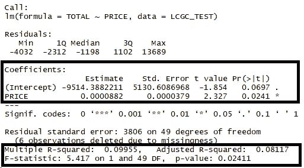

# 我们是否更喜欢廉价汽车的更昂贵的变种？

> 原文：<https://towardsdatascience.com/do-we-prefer-the-more-expensive-variants-of-cheap-cars-cf7c1abf271f?source=collection_archive---------30----------------------->

## 印度尼西亚低成本绿色汽车销售数据的线性回归实践


Nissan’s booth at GIIAS 2019

去年 2019 年 6 月，印尼刚刚举办了印尼最大的车展之一，[Gaikindo Indonesia International Auto Show](https://indonesiaautoshow.com/)(gi IAS)。有一些新车我近期不会买。尽管如此，我还是和爸爸一起去了。

很明显，那里有很多车。但我特别关注不太贵的汽车，如 LCGCs(低成本绿色汽车)、小型掀背车、中型 MPV(如丰田 Avanza)和 SUV(著名的五菱 Almaz)。这些车是普通工薪阶层一生都有机会拥有的车。

我只是看了看那里的车。我注意到每种车型通常都有许多变体。例如，如果我说我想要下图的大发 Ayla。


A Daihatsu that looks awfully similar with a Perodua. Source: [daihatsu.co.id](https://daihatsu.co.id/price-list/detail/ayla)

看看他们网站上的价格表，你可以看到他们出售的变体，提供不同的配件功能和…可选的安全气囊(我没有发现任何法规说安全气囊在印度尼西亚是强制性的)。名称中带有“AB”的变体意味着特定的变体有安全气囊，而没有的……可能没有，你必须检查规格细节。


Source: [daihatsu.co.id](https://daihatsu.co.id/price-list/detail/ayla)

经常听亲戚说最好买最高配的车型。列举理由说这是一次性的大采购，所以还不如多花些钱(同样的理由也适用于奢华的婚礼，但那是完全不同的讨论)。因此，这将意味着，当购买大发 Ayla 时，他们会更喜欢购买“1.2 R AT DLX”而不是“1.0 X AB AT”，价格约 1600 万印度卢比。

*然而，我认为，购买廉价汽车的人在购买时肯定会将价格作为最重要的因素之一，因为他们有预算意识。当我们打算买一辆便宜的车时，我认为买最便宜的是最好的选择。*

大家真的都是这样吗？需求的经济学法则表明，价格上涨会导致对商品的需求减少。也许买车是法律不适用的一个例子。

我要看看上面*斜体*的陈述是真是假。我会:

1.  形成假设，
2.  将杂乱的 pdf 数据准备成可读性更好的格式，
3.  使用线性回归来证明/否定我的假设，
4.  搞清楚结果！

## 1.从假设开始！

这一次，**我将尝试看看人们是否真的更愿意购买低价绿色汽车(LCGC)中最贵的一款。**

或者换句话说:**如果价格点真的影响购买低成本绿色汽车的决定。所以我的假设是:**

> h0:对于 LCGC，价格(P)不影响销售量(Qs)
> 
> h1:对 LCGC 来说，价格影响销售量。这就是我在这里要证明的！

对于外行来说，LCGC 是一类相对便宜的车，小发动机/排量不超过 1,200 cc。一个例子是我之前展示的大发 Ayla。

为什么我坚持去 LCGC？我假设每种类型的汽车有不同的目标市场，因此会有不同的表现。例如，购买廉价汽车(低于 2 亿印尼盾)的人可能会与购买昂贵 SUV(高于 3 亿印尼盾，如三菱帕杰罗 Sport)的人有所不同。我最初的假设是，购买廉价汽车的人会更注重成本，因此更有可能选择更便宜的车型。而购买更贵汽车的人会更富有，买得起最好的车型。稍后我会做其他部分。

***(如果你对 R 或数据相关的东西不感兴趣，你可以直接跳到第三部分。*分析数据)**

## 2.数据准备！

在这里，我有[从 Gaikindo 网站批发的 2019 年 1 月至 6 月期间的数据](https://www.gaikindo.or.id/indonesian-automobile-industry-data/)。批发数据指的是制造商对经销商的销售(不是经销商对最终客户的销售)，但这个数据总比没有好。

数据是 pdf 格式的，所以我把它转换成了 excel 文件，这是互联网上的一个免费工具，[ilovepdf.com](https://www.ilovepdf.com/pdf_to_excel)。如果你谷歌一下，网上有很多免费工具可以做到这一点。你把你要转换的 pdf 文件上传到网站，它会帮你转换成 excel 文件。**请注意不要使用免费网络工具处理任何机密数据。**

即使这样，数据仍然非常混乱，所以我只是用 Microsoft Excel 清理了一下(我知道，请不要评判)。我们需要清理数据，以便进行适当的分析。

这些数据也不包括汽车价格，所以我手动搜索网页把它们放在那里。我这样做是因为我试图证明价格对销售量的影响，所以很明显我需要价格数据(我们在原始数据中已经有了销售量)。所以数据应该是这样的。


The data, excluding the sales (got cropped, it’s still way further right)

你必须放大，但如果你只是下载原始文件，你可以看到它实际上很漂亮。它包括车型、排量(cc)、油箱容量、车辆总重、尺寸、座椅、车门、每月销量等等。

这个测试的目的是看价格点实际上是否影响销售量。因此，我将数据分解为:1)价格点，2)2019 年 6 月的总销售额(我现在不需要其他列)。


The test data-set

我得到了 57 行，每一行代表了每种型号的一个特定变体。其中 6 个没有价格，因为…我没有找到它们。不过没关系。

数据准备好之后，就该实际进行回归了。在“psych”(用于统计)、“tidyverse”(用于操作数据和可视化)和“ggthemes”(用于向可视化添加附加主题)包的帮助下，我正在使用 RStudio 进行回归。

使用 R ***进行回归非常简单(如果您不喜欢 R，可以直接跳到第 3 部分)*** :

```
lin.regress <- lm(TOTAL ~ PRICE, data = LCGC_TEST)
```

我使用 lm()函数，将 TOTAL(销售量)作为因变量，PRICE 作为自变量。你可以把“总额~价格”理解为“总额受价格影响”。我将结果存储在一个名为“Lin . regressive”的变量中，这样我就可以随时调用它。

下一步是在散点图和回归线中可视化回归。我使用散点图是因为我想在这里比较价格和销售量。两者都是数值(连续)数据。“回归线”只是一条可以将所有可用数据点近似为一条线的线，具有尽可能小的误差。

```
ggplot(LCGC_TEST, aes(PRICE, TOTAL)) +
 geom_point()+
 theme_economist_white(base_family = “sans”,gray_bg=T)+
 labs(x=”Vehicle Price”, y=”Sales Quantity”, title=”Vehicle Price to Sales Quantity”)+
 stat_smooth(method = “lm”,se=FALSE)
```

## **3。通过图形的可视化和解释来分析数据**


The regression result

一目了然，我们可以看到，至少在廉价汽车(LCGC)细分市场，回归线**表明价格的增加也会增加销售量**。尽管有些松散。您可以看到，大多数数据点都集中在原点(零)线附近，并且似乎被几个高销售额和价格的数据点向上拉。

那只是视觉上的解释。为了更好地理解，我们需要查看包含许多有用信息的回归表，例如:

1.  “价格”作为销售量的预测指标有多强？
2.  模型实际上有多好？

在 R 中，您只需要调用下面的代码加上存储回归模型的变量，我在前面将其命名为“Lin . regressive”。

```
summary(lin.regress)
```



Regression table result, focus on the ones in the boxes (I don’t understand the others)

## 4.理解回归表

## “价格”作为销售量的预测指标有多强？

请看名为“估计”的第一列。这里的两个值是系数。如果你还记得你的代数:

> y=ax+b

给定某个值 *x.* 你试图找出 *y* 的值，这和回归有点类似！我们试图找到给定某个**价格点(P)** 的**销售量(Qs)** :

> Qs=a(P) + b

估计栏中的两个值是系数，即 *a* 和 *b.* “截距”是给定预测值(价格)为 0 时的值。根据回归表，**对于 IDR 0 价位的汽车，将有…-9514 辆销售**。这完全说不通。但我们会继续。

“价格”中的估计值显示了价格上涨对销售量的影响。根据回归表，对于 IDR 1 的车辆价格的增加，我们将看到 0，0000882 销售的增加。为了获得更好的视角，将其乘以几倍。**每增加 1000 万印度卢比的价格，我们将获得额外的 882 笔销售额**。我也认为这说不通，为什么人们？

不管怎样，现在我们有了这个公式:

> Qs = 0，0000882(P) - 9514

现在我们到了有趣的部分。让我们假设显著性水平为 5%，这是一个常见的标准。当 h0 为真时，我们接受拒绝 h0 的 5%风险。在这种情况下，我们接受 5%的风险，认为价格影响销量，而实际上它并不影响任何东西。

看一下“价格”行的最右边一列。那就是 [P 值](/p-values-explained-by-data-scientist-f40a746cfc8)。

简单地说，在这种情况下，P 值回答了这个问题，**“在一个价格不影响销售量的世界里，如果我使用早期的回归方法来预测销售量，会有多奇怪？”**

在这种情况下，答案是 2.41%有点奇怪。

结合 5%的显著性水平和 2.41%的 P 值，我们可以在 5%的显著性水平上安全地拒绝 h0 或零假设。意味着我们拒绝价格不影响销售量的假设。

## **模型有多好？**

下一步将是检验模型实际上有多好。一看就知道不会那么好。看一下回归线。


The regression result, for reference again

我可以把问题换成“我的模型有多差？”

为此，我们来看看“调整后的 R 平方”。这个值显示了销售量的多少变化可以用价格来解释。

我的模型很差，大概 8.1%差。一般来说，社会学科公认的 R 平方约为 20%。

还有很多其他因素可以解释其余高达 91.9%的数字。

## 结论

至少现在我们知道，在 5%的显著性水平上，对于印度尼西亚 LCGC 市场，价格点确实对销售量有影响。这种关系是正的(高价格导致高销售量)，模型是…在 8.1%调整后的 R 平方不太好。

也就是说，我们更喜欢更贵的廉价汽车，这并没有错……但这不是唯一的决定因素。我想寻找便宜汽车的人不会那么吝啬。