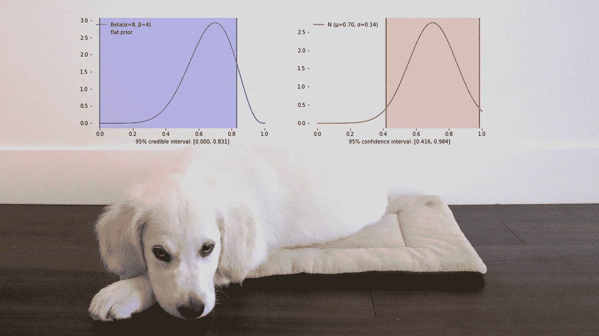
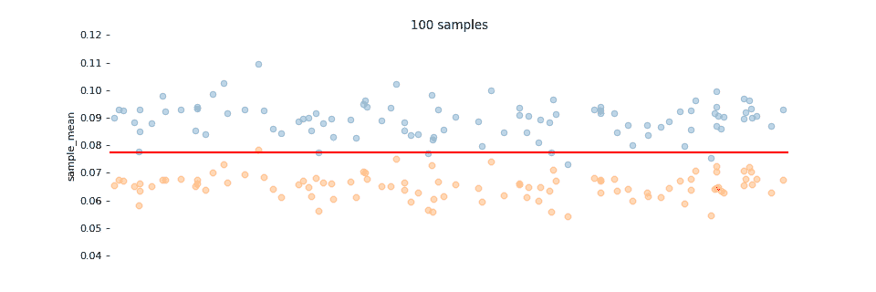
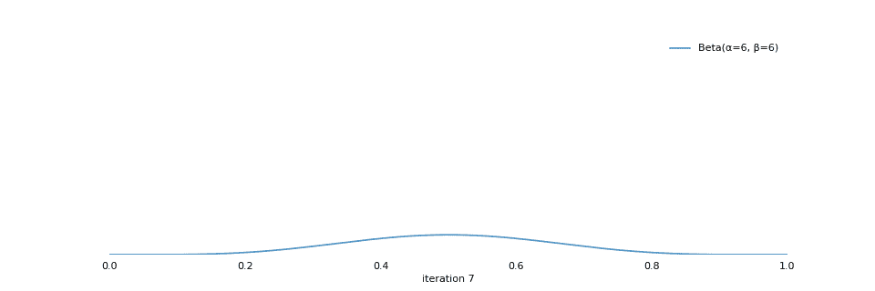
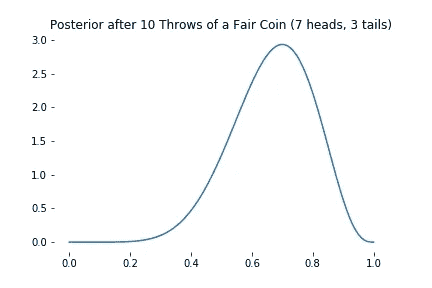
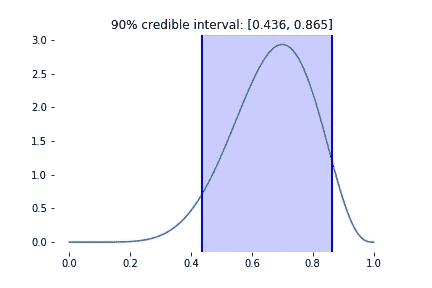
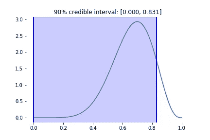
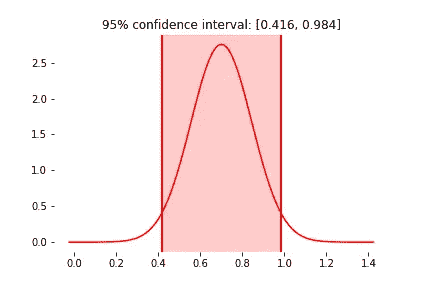
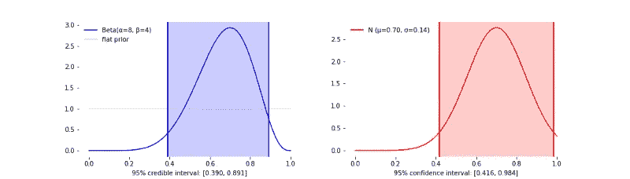
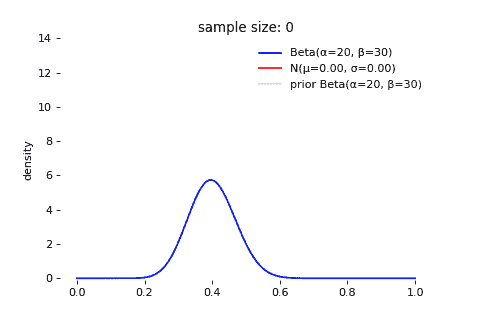
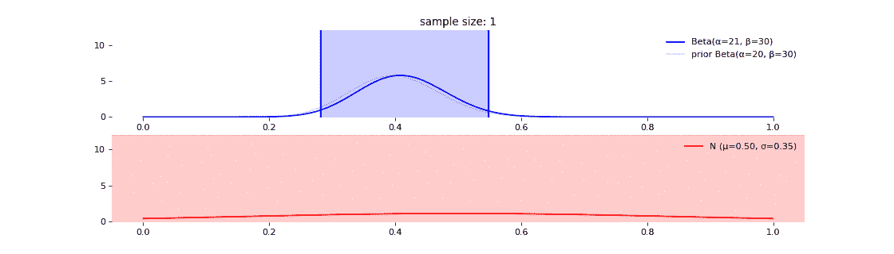

# 你知道可信区间吗

> 原文：<https://towardsdatascience.com/do-you-know-credible-interval-e5b833adf399?source=collection_archive---------4----------------------->

## 不要搞砸你的下一次数据科学/分析师/项目经理面试

如果你申请的职位涉及 AB 测试、SQL 或任何类型的用户体验研究，你的面试官最喜欢的问题可能是:“这是 XYZ 实验的置信区间。是什么意思？”有两种方法可以回答这些问题:

> "总体参数有 95%的可能性位于区间内."
> 
> “如果我们将实验重复无限多次，95%的实验将在它们的置信区间内捕获总体参数。”

不幸的是，如果你回答了第一种方式，你就相当于面试失败了。大多数人分不清这两种说法的区别，可以蒙混过关。但作为数据专家，你不能。第一种说法是解释贝叶斯**可信区间**。第二，频率主义者**的置信区间**。

## 为什么这么困惑

如果你从未上过统计推断课，你可能会认为第二种说法只是第一种说法的转述。其实区别是深刻的。这可以归结为两种对立的概率意识形态:频率主义者和贝叶斯主义者。

贝叶斯将概率定义为一种“信念”一个信念可能强也可能弱，并且会随着新证据的出现而不断修正。信念本身由概率分布来描述。例如，我对平均用户结账时间的看法可以是这样的:“平均结账时间在 44 ~ 46 秒之间的概率为 3.5%；平均结账时间在 11 ~ 24 秒之间的概率为 34%。”请注意，我不是在陈述平均结账时间的精确值，我是在陈述不同的范围，以及这些范围的概率。

频繁主义者用“频繁试验”来定义概率。一位常客认为，一个人群参数是**固定的**(比如糖尿病率、转化率、平均结账时间)，找到它的唯一方法是通过多次实验。因为真实世界的实验通常是昂贵的，我们使用中心极限定理从单个实验中推导出与我们通过进行多个实验得到的相同的抽样分布。

困惑的一个主要来源是频繁主义者不会在现实世界中频繁地做实验。他们做一个实验，产生一个置信区间，就像贝叶斯做的一样。这仅仅是因为中心极限定理给了他们一个便捷的捷径，从重复实验中节省了大量的金钱！

## 两个动画示例

置信区间就像掷环游戏。职位是固定的，就像人口参数一样。你把戒指扔到柱子上。有时候你错过了，有时候你抓住了。你选择一个足够大的戒指，这样你就可以在 95%的时间里抓住邮件。环的大小就像你 95%的置信区间大小。

Ring toss game is like confidence interval

类似地，frequentist 进行实验无数次，并为每个实验建立一个点估计(例如，样本均值、比例)，一个置信区间。点估计的分布称为**抽样分布**。在下面的动画中，总体平均值固定为 0.078，蓝色圆点表示置信区间的上限，橙色圆点表示置信区间的下限。大多数置信区间将捕获总体参数。有些音程不会(当蓝点降到红线以下，或橙点升到红线以上)。常客将选择一个足够大的间隔，该间隔在 95%的时间内捕获群体参数。

贝叶斯不关心抽样分布。他们将他们对总体参数的信念建模为**后验分布**。一个经典的例子是评估一枚硬币是否公平。随着你不断地抛硬币，你对它正面/反面落地的概率越来越有信心。

在下面的例子中，每次迭代都是抛硬币。⍺.清点了人数尾部按β计数。因为人数和人数几乎总是相等的。我们越来越有信心落地头的概率是 50%。这个关于概率的概率分布是用贝塔分布建模的(见教程[这里](/visualizing-beta-distribution-7391c18031f1))。

## 编码吧！

假设我们掷一枚硬币 10 次。不幸的是，我们有 7 个头和 3 条尾巴。这枚硬币是公平的证据不足。后验概率看起来是这样的:峰值出现在 70%，因为我们在 10 次试验中得到 7 个头。

为了建立可信区间，我们简单地从后验分布中截掉左尾或右尾，或者两者都截掉，使得剩余的概率质量(称为“似真性”)是所期望的。例如，我们可以从任意一个尾部截断 5%，得到 90%可信区间[0.436，0.865]:

此外，我们可以从右尾截断 10%，得到一个更宽的可信区间[0.000，0.831]:

任何一种情况都是有效的 90%可信区间，因为每种情况都包含 90%的概率质量(似真性)。你觉得哪个更有用？显然这是我们想要的窄一点的。最窄的可信区间称为**最高密度区间。**

另一方面，要构建置信区间，我们必须依靠中心极限定理来构建抽样分布，查找 t 得分/z 得分，然后从点估计值中加上/减去某个倍数的标准误差。

Sampling distribution

## 比较

可信区间的一个优点是我们可以在后验分布中建立规则。例如，beta 分布的范围在 0 ~ 1 之间，为概率提供了一个很好的界限。另一方面，抽样分布总是正态的，其范围是无限的。所以在这种情况下，它显然是有缺陷的，因为一枚硬币落地的概率不可能大于 1，或者小于 0。当样本量很小时，这是有问题的，并且大量的正态分布位于范围[0，1]之外。

Normal distribution does not truncate probability at 0 or 1, yielding poor results when sample size is small

可信区间的另一个优点是，我们可以在进行实验之前考虑一个**先验**。如果其他人已经扔了 50 次硬币，并记录了 20 次正面，那么我们已经知道了一些关于硬币的信息。所以贝塔后验的峰值(众数)上升得更快，变窄得比抽样分布更快。因此，可信区间比置信区间缩小得更快。

Effect of prior on posterior convergence speed

## 没什么可失去的？

“到目前为止还不错。为什么不总是使用可信区间？”你可能会问。问题是，并不是每个实验都有一个优雅的后验分布。尽管有贝塔分布来模拟转换率、糖尿病率或任何其他概率。对于检查时间、预计到达时间、体重、身高、血糖，没有精确的后验概率。事实上，贝塔分布是个例外，而不是常态。在杂乱的现实世界中，正态分布是常态。

幸运的是，我们生活在互联网的世界里。在交通便宜的地方，中心极限定理总是胜利的，两种方法之间的差别缩小了。相比之下，可信区间的优势在样本量很小时最有价值，因此成本很高，例如，让 10 名患者接受两种不同类型的医学治疗。

Credible interval (blue) and confidence interval (red) become similar as sample size increase

## 延伸阅读

下面的博客涵盖了与 AB 测试相关的主题，以及对本文中提到的关键概念的更深入的回顾。

*   可视化贝塔分布和贝叶斯更新[ [链接](/visualizing-beta-distribution-7391c18031f1)
*   理解置信区间[ [链接](/understanding-confidence-interval-d7b5aa68e3b)
*   A/B 测试的威力[ [环节](/the-power-of-a-b-testing-3387c04a14e3)
*   超越 A/B 测试:多臂强盗实验[ [链接](/beyond-a-b-testing-multi-armed-bandit-experiments-1493f709f804) ]
*   可信区间上的 Kaggle 笔记本[ [链接](https://www.kaggle.com/shawlu/understanding-credible-interval?scriptVersionId=12603331)