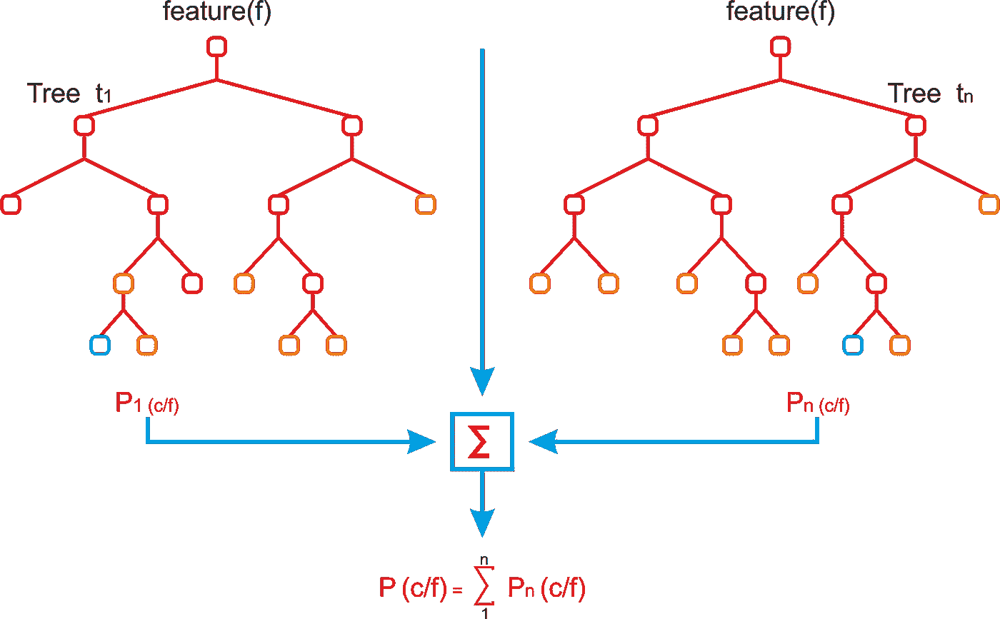

# 你知道如何在 7 种不同类型中选择正确的机器学习算法吗？

> 原文：<https://towardsdatascience.com/do-you-know-how-to-choose-the-right-machine-learning-algorithm-among-7-different-types-295d0b0c7f60?source=collection_archive---------0----------------------->

这是一种通用、实用的方法，可以应用于大多数机器学习问题:

这个故事由七篇文章组成，每篇文章都有一个算法，每篇文章都从头开始实现，请确保关注我们的时事通讯，这样当我们从头开始发布每个算法时，您就可以收到更新。

1-对问题进行分类
下一步是对问题进行分类。
**按输入分类:**如果是有标签的数据，那就是监督学习问题。如果是以寻找结构为目的的无标签数据，那就是无监督学习问题。如果解决方案意味着通过与环境交互来优化目标函数，这就是一个强化学习问题。
**按输出分类:**如果模型的输出是数字，那就是回归问题。如果模型的输出是一个类，那就是一个分类问题。如果模型的输出是一组输入组，这就是一个聚类问题。

**2-了解你的数据** 数据本身并不是最终游戏，而是整个分析过程中的原材料。成功的公司不仅能够捕获和访问数据，还能够获得推动更好决策的洞察力，从而带来更好的客户服务、竞争优势和更高的收入增长。理解数据的过程在为正确的问题选择正确的算法的过程中起着关键作用。一些算法可以处理较小的样本集，而其他算法需要大量的样本。某些算法处理分类数据，而其他算法则喜欢处理数字输入。

**分析数据** 在这一步中，有两个重要的任务，一是用描述性统计理解数据，二是用可视化和图表理解数据。

**处理数据** 

**转换数据** 将数据从原始状态转换成适合建模的状态的传统思想正是特征工程的用武之地。事实上，转换数据和特征工程可能是同义词。这是后一个概念的定义。*特征工程是将原始数据转换为特征的过程，这些特征可以更好地代表预测模型的潜在问题，从而提高未知数据的模型准确性。作者杰森·布朗利。*

**3-找到可用的算法** 在对问题进行分类并了解数据后，下一个里程碑是确定在合理的时间内实施的适用且实用的算法。影响模型选择的一些因素有:

*   模型的准确性。
*   模型的可解释性。
*   模型的复杂性。
*   模型的可扩展性。
*   构建、训练和测试模型需要多长时间？
*   使用模型进行预测需要多长时间？
*   模型符合商业目标吗？

**4-实现机器学习算法。** 建立一个机器学习管道，使用一组精心选择的评估标准来比较数据集上每个算法的性能。另一种方法是在数据集的不同子组上使用相同的算法。对此的最佳解决方案是执行一次，或者让服务在添加新数据时定期运行。

**5-优化超参数。**优化超参数有三个选项，网格搜索、随机搜索和贝叶斯优化。

**机器学习任务的类型**

*   **监督学习**
*   **无监督学习**
*   **强化学习**

**监督学习** 监督学习之所以如此命名，是因为人类充当了指导者的角色，教导算法应该得出什么结论。监督学习要求算法的可能输出是已知的，并且用于训练算法的数据已经标注了正确的答案。如果输出是一个实数，我们称之为任务回归。如果输出来自有限数量的值，其中这些值是无序的，那么它就是分类。

[Supervised Learning](https://www.researchgate.net/figure/Classification-vs-Regression_fig9_326175998)

**无监督学习** 无监督机器学习更接近一些人所说的真正的人工智能——即计算机可以学习识别复杂的过程和模式，而无需人类提供指导。关于对象的信息较少，特别是，训练集是未标记的。有可能观察到对象组之间的一些相似性，并将它们包含在适当的集群中。一些物体可能与所有的星团有很大的不同，这样这些物体就成了异常。

[Unsupervised Learning](/clustering-unsupervised-learning-788b215b074b)

**强化学习** 强化学习(Reinforcement learning)是指面向目标的算法，它学习如何通过许多步骤实现复杂的目标或沿着特定的维度最大化。例如，在一场游戏中，通过多次移动来最大化赢得的点数。它与监督学习的不同之处在于，在监督学习中，训练数据带有角色密钥，因此模型是用正确的答案本身来训练的，而在强化学习中，没有答案，而是由强化代理决定如何执行给定的任务。在没有训练数据集的情况下，它必然会从自己的经验中学习。

[Reinforcement Learning](https://www.eecs.tufts.edu/~jsinapov/teaching/comp150_RL/)

**常用的机器学习算法**

**1-线性回归** 线性回归是一种统计方法，允许总结和研究两个连续(定量)变量之间的关系:一个变量，表示为 X，被视为自变量。用 y 表示的另一个变量被认为是因变量。线性回归使用一个自变量 X 来解释或预测因变量 y 的结果，而多元回归根据均方误差(MSE)或平均绝对误差(MAE)等损失函数，使用两个或多个自变量来预测结果。*因此，每当你被告知要预测当前正在运行的某个流程的未来值时，你可以使用回归算法*。尽管这种算法很简单，但当有成千上万个特征时，例如，自然语言处理中的一袋单词或 n-grams，它仍然工作得很好。更复杂的算法会过度拟合许多特征，而不是庞大的数据集，而线性回归提供了不错的质量。然而，在特征是冗余的情况下是不稳定的。

[从头开始查看我们关于这个话题的最新报道。](https://dataakkadian.medium.com/linear-regression-from-scratch-58446b674bc7)

Linear Regression

**2-逻辑回归** 不要把这些分类算法和回归方法混淆，因为在标题中使用了回归。逻辑回归执行二元分类，因此标签输出是二元的。当输出变量是分类变量时，我们也可以将逻辑回归视为线性回归的一个特例，其中我们使用概率的对数作为因变量。逻辑回归有什么了不起的？它采用特征的线性组合，并对其应用非线性函数(sigmoid ),因此它是神经网络的一个微小实例！

[Logistic Regression vs Linear Regression](https://medium.com/greyatom/logistic-regression-89e496433063)

**3-K-means** 假设你有很多数据点(水果的测量值)，你想把它们分成苹果和梨两组。 **K-means** 聚类是一种聚类算法，用于自动将一个大组划分为更小的组。
该名称的由来是因为在我们的示例中，您选择了 K 个组，K=2。你取这些组的平均值来提高组的精度(平均值等于均值，你这样做几次)。集群只是组的另一个名称。
假设你有 13 个数据点，实际上是 7 个苹果和 6 个梨，(但你不知道)，你想把它们分成两组。对于这个例子，让我们假设所有的梨都比所有的苹果大。您选择两个随机数据点作为起始位置。然后，你将这些点与所有其他点进行比较，找出哪个起始位置最接近。这是你第一次通过聚类，这是最慢的部分。你有你的初始组，但是因为你随机选择，你可能是不准确的。假设一组有六个苹果和一个梨，另一组有两个苹果和四个梨。所以，你取一组中所有点的平均值作为该组的新起点，对另一组也这样做。然后再次进行聚类以获得新的组。
成功！因为平均值更接近每组的大多数，所以在第二次循环中，你会在一组中得到所有的苹果，在另一组中得到所有的梨。你怎么知道你完成了？计算平均值，然后再次进行分组，看看是否有分数改变了分组。没有，所以你完了。否则，你会再去一次。

[K-means](https://commons.wikimedia.org/wiki/File:KMeans-Gaussian-data.svg)

KNN
直截了当地，两人寻求完成不同的目标。 **K 近邻**是一种分类算法，是监督学习的子集。 **K-means** 是一种聚类算法，是无监督学习的子集。
如果我们有一个足球运动员、他们的位置和他们的尺寸的数据集，并且我们想要在一个新的数据集中给足球运动员分配位置，其中我们有尺寸但是没有位置，我们可以使用 K-最近邻。
另一方面，如果我们有一个需要根据相似性分成 K 个不同组的足球运动员数据集，我们可能会使用 K-means。相应地，每种情况下的 K 也意味着不同的东西！在 K-最近邻居中，K 代表在确定新玩家位置时有投票权的邻居的数量。检查 K=5 的例子。如果我们有一个新的足球运动员需要一个位置，我们在数据集中选择五个测量值最接近我们的新球员的足球运动员，让他们投票决定我们应该给新球员分配的位置。
在 K-means 中 K 表示我们最终想要拥有的集群数量。如果 K= 7，在我的数据集上运行该算法后，我将有七个足球运动员的聚类，或不同的组。最后，两个不同的算法有两个非常不同的目的，但它们都使用 K 的事实可能会非常混乱。

[K-nearest neighbors](https://stats.stackexchange.com/questions/165047/how-are-graphs-of-k-nearest-neighbors-built-for-clustering)

**5-支持向量机** SVM 使用超平面(直的东西)来分离两个不同标记的点(X 和 O)。有时候点是不能用直的东西分开的，所以它需要把点映射到一个更高维的空间(用内核！)在那里它们可以被直的东西分割(超平面！).这在原始空间上看起来像一条曲线，尽管在一个更高维度的空间中它实际上是一条直线！

[Support Vector Machines](https://openclipart.org/detail/182977/svm-support-vector-machines)

**6-随机森林** 假设我们想知道何时投资宝洁，那么我们有三个选择买入、卖出和持有，基于上个月的几个数据，如开盘价、收盘价、价格和交易量的变化
假设你有很多条目，900 点的数据。
我们要建立一个决策树来决定最佳策略，例如，如果股票价格的变化比前一天高百分之十以上，我们就以高成交量买入这只股票。但是我们不知道使用哪些功能，我们有很多。
因此，我们采取了一组随机的测量方法和一组随机的训练样本，并构建了一个决策树。然后，我们使用不同的随机测量组和每次随机数据样本进行多次相同的操作。最后，我们有许多决策树，我们使用它们中的每一个来预测价格，然后基于简单多数来决定最终的预测。

[Random Forest](https://www.oreilly.com/library/view/scala-machine-learning/9781788479042/e5456dbe-d0f4-47e8-b175-a5a7291ea420.xhtml)

**7-神经网络**
神经网络是人工智能的一种形式。神经网络背后的基本思想是模拟计算机内部大量密集互连的脑细胞，以便它能够以类似人类的方式学习事物、识别模式和做出决定。神经网络的神奇之处在于，它不必通过编程来明确学习:它完全是自己学习，就像大脑一样！
神经网络的一方面是输入。这可能是一张照片，来自无人机的数据，或者围棋棋盘的状态。另一方面，有神经网络想要做的输出。在这两者之间有节点和连接。连接的强度决定了基于输入需要什么样的输出。

[Artificial Neural Network](http://phdthesis-bioinformatics-maxplanckinstitute-molecularplantphys.matthias-scholz.de/)

或者，你可以[获得 5 美元/月的中等订阅。](https://medium.com/@dataakkadian/membership)如果你使用这个链接，它会支持我。