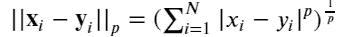

# 你知道 K_Nearest_Neighbors 也可以用于回归任务吗？

> 原文：<https://towardsdatascience.com/do-you-know-k-nearest-neighbors-can-also-be-used-for-regression-tasks-117da22bcac3?source=collection_archive---------18----------------------->

是的，它是！让我们来理解这个简单的算法

source: researchgate.net

你有什么好处？

本文将揭示最简单易懂的最大似然算法——K 近邻算法。它可用于分类和回归任务，但在分类中更常见，因此我们将重点放在分类上，并了解如何将其用作回归变量。不过，这些原则在这两种情况下都适用。

**我们来谈谈数据**

这一次，我不会像在我的其他文章中通常所做的那样挑选任何数据集。如果数据集能给我一个机会来解释一个概念、一个陷阱或一种方法，那么我会选择数据集。就像我承认的，这是最简单的 ML 算法。我将使用与 sklearn 捆绑在一起的乳腺癌数据集。

**就这么简单吗？**

基本上，算法如下:

1.  定义𝑘
2.  定义距离度量，通常是欧几里德距离(2 范数距离)
3.  对于新的数据点，找到𝑘最近的训练点，并以某种方式(通常是投票)组合它们的类，以获得预测的类

就是这样！

**KNN 的好处**

*   它实际上不需要任何传统意义上的训练。你只需要一个快速的方法来找到最近的邻居。
*   容易理解

**KNN 的弊端**

*   我们需要定义 k，这是一个超参数，因此它可以通过交叉验证进行调整。k 值越高，偏差越大，k 值越小，方差越大。偏差和方差总是在跷跷板上，所以从技术上来说，你不可能一箭双雕。必须有所取舍。

**专业提示:**在一个模型中，如果你必须减少方差，然后引入大的训练集，这不是在所有情况下都可行的选择。如果您必须减少偏差，那么添加特征(预测值)会有所帮助，但代价是引入额外的方差。我的[文章](https://medium.com/analytics-vidhya/linear-regression-bottoms-up-approach-intro-to-spark-a-bonus-b923ae594323/#822e)中有更多提示

*   必须选择一个距离度量，根据度量的不同，可能会得到非常不同的结果。同样，你可以使用交叉验证。
*   它并没有真正提供哪些特性可能是重要的见解。
*   由于维数灾难，它可能会受到高维数据的影响。

**基本假设:**

*   对于我们的目标来说，接近的数据点是相似的

**什么是维度的诅咒？**

这是一种忧郁的表达，但它意味着数据中更高的维度顺序。

为什么这是一个问题？我听到了。我们无法将数据可视化。可视化就像第一世界国家的问题，有更多的噪音，但实际上非常琐碎。

更大的问题是，当你增加维度时，代表你的数据的数据点也会增加，数据变得更加分散。很可能近点并不比平均距离近多少，也就是说近并没有多大意义。KNN 在数据点之间的距离上工作，因此它将使这个算法低效。

如果你很好奇，想直观的知道为什么会这样。[去这里](https://blog.galvanize.com/how-to-manage-dimensionality/)

## 欧几里得距离

对于被比较的向量 q 和 p(这些将是我们的特征向量):

Source: Wiki

这不是结局。还有许多其他距离度量。我将在本文后面讨论术语。该算法最优选的距离范数是曼哈顿(1 范数)或欧几里德(2 范数)。

# **型号**

你可以在这里跟随代码

你如何确定 K 值？

没有科学的方法来确定一个。我们只需要反复试验。网格搜索为了解决这个问题，我将 KNNClassifier 管道化到网格搜索中，以了解最佳超参数。

grid search report

看起来在这种情况下，K = 5 的均匀权重方法效果最好。

了解关于分类指标的更多信息。跟进我的[文章](https://medium.com/analytics-vidhya/logistic-regression-bottoms-up-approach-feature-engineering-ideology-a-bonus-81807fa881be/#805e)

# 投票方法的类型

*   多数投票:在你选择了𝑘最近的邻居后，你对这些邻居的班级进行了“投票”。新的数据点被分类为邻居的大多数类。如果您正在进行二元分类，建议您使用奇数个邻居，以避免票数相等。然而，在一个多类问题中，更难避免平局。对此的常见解决方案是降低𝑘，直到平局被打破。
*   距离加权:不是直接对最近的邻居进行投票，而是根据该实例与新数据点的距离对每一票进行加权。一种常见的加权方法是

或者是新数据点和训练点之间的距离。新的数据点被添加到具有最大增加权重的类别中。这不仅减少了平局的机会，而且还减少了数据失真的影响。

# 距离度量

欧几里德距离或 2 范数是一种非常常用的𝑘-nearest 邻居距离度量。任何𝑝-norm 都可以使用。

p-norm

然而，对于分类数据，这可能是一个问题。例如，如果我们将汽车颜色的特征从红色、蓝色和绿色编码为 0、1、2，如何测量绿色和红色之间的“距离”？您可以创建虚拟变量，但是如果一个特性有 15 个可能的类别，这意味着您的特性集要增加 14 个变量，我们会遇到维数灾难。但是要注意分类特征对最近邻分类器的影响。

# 搜索算法

假设数据集包含 2000 个点。对一个点的 3 个最近邻居的强力搜索不需要很长时间。但是如果数据集包含 2000000 个点，强力搜索可能会变得非常昂贵，尤其是在数据的维度很大的情况下。其他搜索算法为了更快的运行时间而牺牲了穷举搜索。像 [KDTrees](https://en.wikipedia.org/wiki/K-d_tree) 或 [Ball trees](https://en.wikipedia.org/wiki/Ball_tree) 这样的结构用于更快的运行时间。虽然我们不会深入研究这些结构的细节，但请注意它们以及它们如何优化您的运行时间(尽管训练时间确实会增加)。

# 另一种类型:半径邻居分类器

这与𝑘最近邻分类器的想法相同，但不是查找𝑘最近邻，而是查找给定半径内的所有邻居。设置半径需要一些领域知识；如果您的点紧密地聚集在一起，您可能希望使用较小的半径来避免几乎每个点都投票。

# KNN 回归量

要将我们的问题从分类转变为回归，我们所要做的就是找到𝑘最近邻的加权平均值。我们使用与上述相同的加权方法，计算这些最接近值的加权平均值，而不是取多数类。

让我们尝试使用 KNN 回归器根据其他特征来预测组织的面积。跟随代码[这里](https://github.com/hdev7/medium-KNN-follow-up-code)

Now you know why nobody uses it for regression tasks

# 一个应用:异常检测

在𝑘k-nearest 的邻居中，数据自然是聚集的。在这些聚类中，我们可以找到点之间的平均距离(或者穷尽地或者从聚类的质心开始)。如果我们发现几个点比到其他点或质心的平均距离远得多，那么有理由(但不总是正确的)认为它们可能是异常值。我们也可以在新的数据点上使用这个过程。