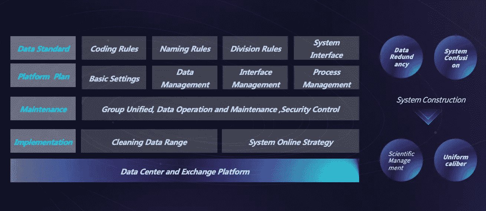

# 你知道数据有引力吗？

> 原文：<https://towardsdatascience.com/do-you-know-that-data-has-gravity-6ca55e192372?source=collection_archive---------22----------------------->

# 1.数据有引力

看到这个标题就忍不住要提问。两个物体之间产生引力，数据怎么会有引力？吸引了谁？数据引力是多了好还是少了好？

宇宙复杂多变，但仍有一个相对稳定的系统。比如我们所处的银河系和太阳系，这个系统的构建就是牛顿提出的万有引力。

同样，我们也可以认为数据本身也是复杂的，比如企业内部的各种业务系统，外部的政府，个人等等。在如此复杂的环境下，它是否也能产生一些稳定的系统？

这里不得不提出牛顿万有引力公式，也是**数据引力定律**。

# 2.如何用数据证明 IT 部门的业绩或价值？

首先是数据的质量，数据的粒度粗，造假的问题，脏数据的问题会严重影响数据的质量。

价值不会无缘无故的存在，它取决于我们的 [**决策**](http://www.finereport.com/en/features/decision-making-system?utm_source=medium&utm_medium=media&utm_campaign=blog&utm_term=Do%20You%20Know%20That%20Data%20Has%C2%A0Gravity%3F) **部门，业务部门和 it 部门**。如果这三个部门分开，数据和价值之间的距离变长，数据引力就会降低，那么价值就会降低。

关于数据和价值之间的距离，在企业中通常没有这个环节的保障。

# 3.如何打造重质量的数据？

一、**可靠性**，数据需要高度可信，不可证伪；

第二，**深度**，数据需要契合业务需求并易于分析；

三、**速度**，数据是有时效性的，只有通过高效的分析，才能发挥其最大的价值。

我们来看看企业数据目前存在的问题。

“2018 China Enterprise Data Research Report”, from FanRuan Data Institute

# 4.为了解决这些问题，我们应该怎么做？

*   **底层数据处理—建立数据可信度**

*   **建立中间模型—提高数据深度**

模型分为两类，一是数据模型，二是业务模型。数据模型其实是基于数据本身的特性，无论是我们的主要数据，还是我们的国际十大学科领域。第二是为我们的业务需求而开发。

*   **前端快速渲染—提高数据速度**

数据是有场景的，所以[不同的图表](http://www.finereport.com/en/data-visualization/top-16-types-of-chart-in-data-visualization?utm_source=medium&utm_medium=media&utm_campaign=blog&utm_term=Do%20You%20Know%20That%20Data%20Has%C2%A0Gravity%3F)，不同的表格，其在实际过程中的应用是不同的。在每种情况下，对于[不同的领导汇报](http://www.finereport.com/en/reporting-tools/3-types-of-reports-that-business-analysts-need-to-learn?utm_source=medium&utm_medium=media&utm_campaign=blog&utm_term=Do%20You%20Know%20That%20Data%20Has%C2%A0Gravity%3F)，针对业务的不同应用选择不同的处理方式，这样的[数据分析](http://www.finereport.com/en/data-analysis/data-analysis-practice-guide-how-to-begin?utm_source=medium&utm_medium=media&utm_campaign=blog&utm_term=Do%20You%20Know%20That%20Data%20Has%C2%A0Gravity%3F)就是快速分析。

# 5.如何为质量创造价值？

重质量的价值需要场景连接。

从这张图中我们可以看出，连接的价值需要由决策层、IT 层和服务层来决定。那么决策层一般面对的数据场景有哪些呢？

# 6.如何减少资料准备的时间？

解决的办法就是把数据自动化，把需要的数据固定下来，根据每月的变化自动更改，然后就不需要那么多人力每月重复工作了。

# 7.如何减少理解数据的时间？

我们可以根据决策层的个人习惯自动推送异常数据或关键数据，比如通过[数据仪表盘](http://www.finereport.com/en/data-visualization/a-beginners-guide-to-business-dashboards?utm_source=medium&utm_medium=media&utm_campaign=blog&utm_term=Do%20You%20Know%20That%20Data%20Has%C2%A0Gravity%3F)的移动端提示。

From [FineReport](http://www.finereport.com/en/?utm_source=medium&utm_medium=media&utm_campaign=blog&utm_term=Do%20You%20Know%20That%20Data%20Has%C2%A0Gravity%3F)

# 8.如何科学地衡量各部门创造的价值？

对于决策者来说，[阿米巴经营](https://global.kyocera.com/inamori/management/amoeba/)可以用来节省人力。

对于业务层来说，重点是人和事。

关于员工的成长，我们采取主动和被动的方法来授权我们的业务和促进个人发展。

对于事物，我们希望数据满足更多的业务场景，如下图所示。

我们来看看 IT 层面临的数据场景。

“2018 China Enterprise Data Research Report”, from FanRuan Data Institute

很多时候，决策层认为 IT 部门人员只需要不断优化升级现有业务，但实际上，更重要的是 IT 层能够解决业务层的燃眉之急。

总结一下，最终的目的是我们的决策者不是单纯的听报告或者看 PPT，而是用数据来支持他的决策，让他的决策能够提升他的管理。对于业务层，我们不仅要回应领导的诉求，还需要思考如何利用数据推动业务转型。对于 IT 层来说，他们需要与业务融合，从沟通到指导，而不是对抗，通过这种方式来提高数据质量。

而下一次我会和你谈谈如何缩短数据和价值之间的距离。有什么问题，可以放在这里。欢迎交流。

# **您可能也会对…** 感兴趣

[2019 年你不能错过的 9 款数据可视化工具](/9-data-visualization-tools-that-you-cannot-miss-in-2019-3ff23222a927)

[初学者财务报表分析指南](/guide-to-financial-statement-analysis-for-beginners-835d551b8e29)

[业务分析师需要学习的 3 种报表](/3-types-of-reports-that-business-analysts-need-to-learn-4e02f2f7e48e)