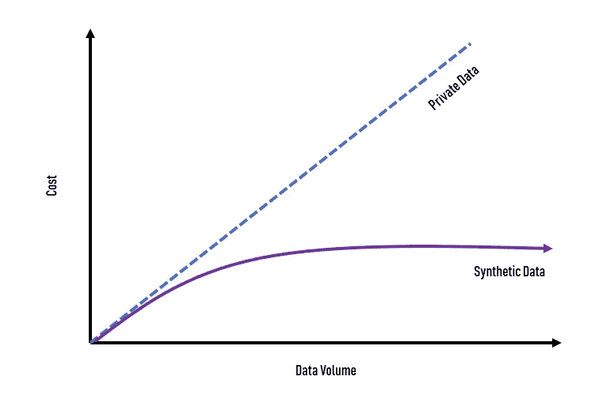
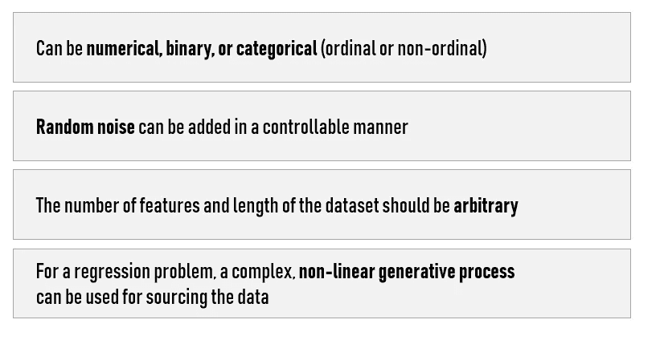
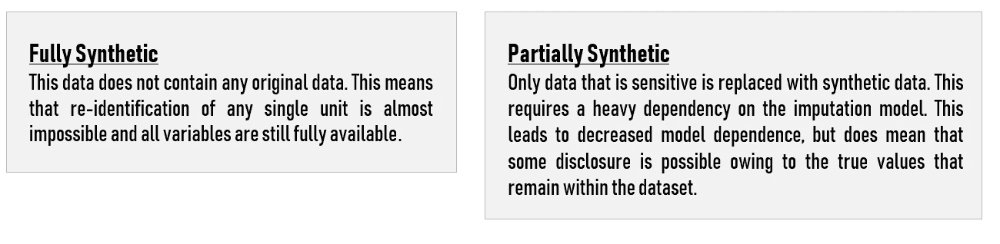
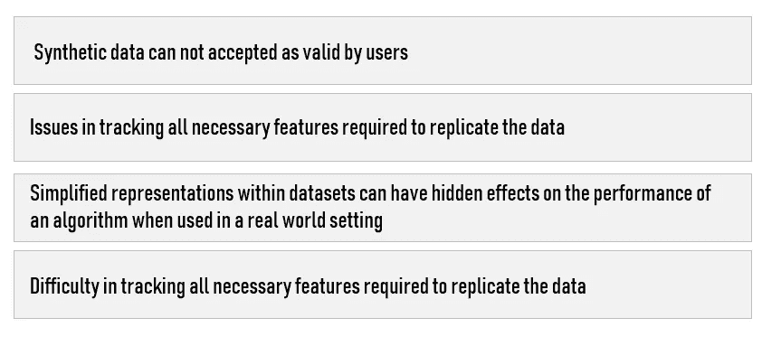

# 你的人工智能项目需要合成数据吗？

> 原文：<https://towardsdatascience.com/do-you-need-synthetic-data-for-your-ai-project-e7ecc2072d6b?source=collection_archive---------12----------------------->

在大多数人工智能项目中，数据是一个问题。由于缺乏好的数据，我已经失败了几个项目…从那以后，我更多地依赖于一种相对较新的叫做合成数据的方法。我希望这篇文章能帮助你更好地理解合成数据如何帮助你的人工智能项目。

对于像谷歌、苹果和亚马逊这样的大型科技公司来说，与其他公司相比，收集数据不是一个问题。事实上，通过他们的产品/服务，他们拥有几乎无限的各种数据流，为数据科学家训练他们的算法创造了完美的生态系统。对于较小的公司，对这些数据集的访问是有限的、昂贵的或不存在的。

> 除了解决 AI 的数据收集问题，企业还必须应对激烈的竞争。

现实情况是，获取数据的成本很高，这使得许多人甚至无从下手。然而，合成数据可以帮助改变这种情况。合成生成的数据可以帮助公司和研究人员建立训练甚至预训练机器学习模型所需的数据仓库。

**新产品、新市场**

通过帮助解决人工智能中的数据问题，合成数据技术有可能创造新的产品类别和打开新的市场，而不仅仅是优化现有的业务线。

这对许多行业的数据科学都有影响。**除了使工作能够开始，合成数据还将允许数据科学家继续正在进行的工作，而不涉及真实/敏感的数据。**

事实上，公司现在可以获得他们的数据仓库或数据库，并创建它们的合成版本，而不会侵犯用户的隐私。

**制造假数据**

合成数据是以编程方式生成的数据。例如，使用视频游戏引擎渲染的任意场景中的物体的逼真图像，或者由语音合成模型从已知文本生成的音频。**很重要的一点是，这与传统的数据扩充不同，传统的数据扩充使用裁剪、翻转、旋转和扭曲来增加模型必须学习的数据种类。**

**这些渲染引擎不仅可以生成任意数量的图像，还可以生成注释。边界框、分割遮罩、深度图和任何其他元数据都与图片一起输出，这使得构建产生它们自己的数据的管道变得简单。**

> **如今的大部分合成数据都是可视化的。**

通过我的项目，我意识到在计算机视觉中，完全基于合成数据来训练模型执行许多常见任务是可能的。对象检测、分割、光流、姿态估计和深度估计都可以用今天的工具实现。

在音频处理和自动语音识别任务中，也可以从生成的数据中受益。最后，强化学习极大地受益于在模拟环境中测试策略的能力，这使得为自动驾驶汽车和机器人训练模型成为可能。

通过实际创建强化学习算法可以在其中运行的模拟环境，合成数据的产生可以更进一步，并因此基于其动作生成数据流。关键问题是训练算法所需的模拟环境的复杂性。

关于合成数据的信息:

# 何时使用合成数据

合成数据有助于加快您的人工智能计划:

1.  用合成数据测试算法允许开发人员制作概念证明，以证明人工智能计划的时间和费用是合理的。它们可以表明，一个特定的算法组合在原则上可以被修改以达到预期的结果，保证与整个开发周期相关的成本不会被浪费，并给你前进所需的信心。
2.  公司可以根据您的测试需求，快速开发大规模完美标记的数据集。此外，可以通过迭代测试来修改和改进这些数据，从而为您后续的数据收集操作提供最大的成功可能性。
3.  当你的训练数据中有太多某种标签时，一个常见的问题就是**过度拟合**。当面对真实世界的使用时，它会产生不可靠的结果。偏见是另一个问题，来自收集的数据，这些数据不能充分代表现实中可能发生的所有差异。**合成生成的数据集提供了一种可靠且经济高效的方法来纠正这些问题，并保证数据集的良好平衡。**
4.  合成数据可用于可靠地生成具体案例。例如，罕见的天气事件、设备故障、交通事故或罕见的疾病症状。合成数据可以代表唯一的方法来确保你的人工智能系统为每一种可能发生的情况进行训练，并在你最需要的时候准确地表现良好。

# 合成数据的背景

在确定创建合成数据的最佳方法时，重要的是首先考虑**您想要什么类型的合成数据**。有两大类可供选择，各有利弊:

构建合成数据的两种一般策略包括:

**从分布中抽取数字:**通过观察真实的统计分布和复制虚假数据来工作。这也可以包括创成式模型的创建。

**基于代理的建模:**创建一个模型来解释观察到的行为，然后使用同一个模型再现随机数据。它强调理解代理之间的相互作用对系统整体的影响。

**在众多应用中，合成数据使用的潜力是显而易见的，但它不是一个通用的解决方案。**

# 当涉及到合成数据时要小心

合成数据并不总是完美的解决方案。事实上，合成数据通常不适合机器学习用例，因为大多数数据集太复杂，无法正确“伪造”。此外，使用合成数据还可能在开发阶段导致误解，即一旦投入生产，您的机器学习模型将如何处理预期数据。

此外，如果用合成数据训练的模型比用“原始”数据训练的模型表现更差，决策者可能会驳回您的工作，即使该模型可能会满足他们的需求。

> 如果用合成数据训练的模型比用预期数据训练的模型表现得更好，**你创造了不切实际的期望**。大多数时候，我们很少知道当我们的模型用不同的数据集训练时，它的性能会如何变化，直到我们用特定的数据集训练它。

根据项目的性质，我相信如果你对预期数据的理解足够好，可以生成一个本质上完美的合成数据集，那么使用机器学习就变得毫无意义，因为你已经可以预测轮廓了。**在我看来，你用来训练的数据应该是随机的，用来看看这些数据可能产生什么结果，而不是用来证实你已经知道的东西**。

**合成数据的挑战**

尽管在合成数据的帮助下可以获得各种各样的好处，但它也不是没有挑战。这些挑战包括:

## 合成数据的局限性

尽管我对 ML 项目合成数据的未来持乐观态度，但还是有一些限制。其中一些是技术性的，而另一些则与业务相关:

1.  像“识别这种特定包装”这样的简单任务很容易，但像“检测数百种稀有动物”这样更复杂的任务仍然很难。
2.  从商业角度来看，从长远来看，合成数据将许多模型转化为商品。

虽然在这一领域取得了很大进展，但一个持续存在的挑战是保证合成数据的准确性。我们必须确保合成数据的统计特性与原始数据的特性相匹配。

## 用于生成合成机器学习数据的工具

*   sklearn.datasets.make:这个流行的 [scikit-learn Python 包](https://scikit-learn.org/stable/index.html)包含生成具有特定属性的数据的方法。生成适用于回归、分类和聚类问题的数据的基本方法是可用的。这些方法在 [sklearn.datasets 模块](https://scikit-learn.org/stable/modules/classes.html#samples-generator)中。
*   [pydbgen](/introducing-pydbgen-a-random-dataframe-database-table-generator-b5c7bdc84be5) :一个 Python 包，用于生成合成的结构化数据库表，包括特定的数据字段，如电子邮件、电话号码、姓名或城市。
*   [Mockaroo](https://mockaroo.com/) : Mockaroo 是一个网站/API，用于生成具有真实单元格值(例如，姓名、邮政编码、日期)的结构化数据，并且可以选择使用自定义函数来转换生成的值。免费版一次生成 1000 行，并以通用表格格式导出这些行。