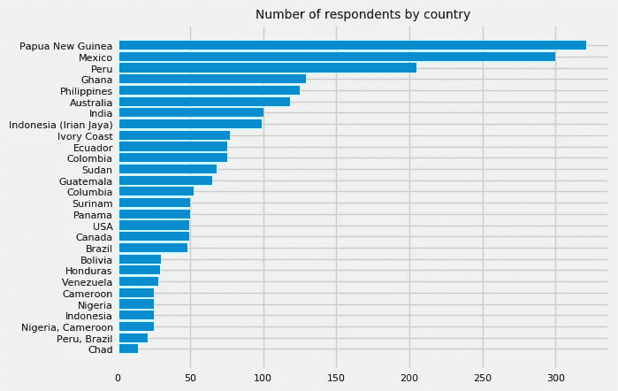
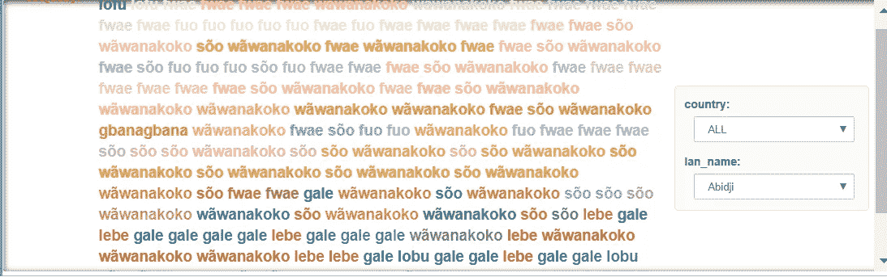

# 你看到我看到的了吗？

> 原文：<https://towardsdatascience.com/do-you-see-what-i-see-391151db87eb?source=collection_archive---------29----------------------->


“你不应该在你的仪表板上使用这些颜色，因为它们是自然的，”我一直对我的员工说，直到有一天我意识到仪表板的颜色类似于我在非洲看到的一种常见的服装图案，于是我想起了我的欧洲朋友在坦桑尼亚市场上为她的服装购买面料的故事。她的颜色选择被一位店主描述为“mzungu”色，一切都变得有意义了。一个“啊哈”的瞬间，接着意识到“我以为我知道的一切都是错的”。我不确定仪表板构建的最佳实践实际上是“最好的”还是“西方国家仪表板构建的常见实践”。

有没有知觉经验的一致性？如果不是，是否一个人说的语言和一个人属于一种特定的文化，等等。把他的注意力引向某些颜色，让他忽略其他颜色？如果是，不同文化中存在的基本颜色是什么？

在研究色彩理论时，我问自己。大多数研究论文都是关于一个人说的语言如何影响他的现实，而不是关于跨文化的颜色-情感关联的研究——事实上，跨文化研究的研究机构有限，以前的颜色-情感关联研究都是在一个国家进行的，或者专注于特定的情感或特定的颜色——我想知道 Hofstede 在这个问题上有什么看法。由于数据的可用性，我把重点放在了语言的相对性和语言的一致性上，这是一个想法，即那些使用相同基本颜色术语的语言的人对颜色变化的感知和记忆是相似的。这篇文章的目的是分享我的分析结果，并潜在地提高对这个主题的兴趣，因为该领域的语言学理论的潜在含义是，如果你使用的颜色在你的仪表板最终用户的语言中没有相应的名称，你就不会实现你的仪表板的预期效果。


Munsell chips

**背景:**对基本术语的研究始于柏林和凯(1978)的工作。“基本颜色词意义的语言学意义”]他发现 11 种颜色——白色、黑色、红色、绿色、黄色、蓝色、棕色、紫色、粉色、橙色和灰色——在世界上所有语言中充当所有基本颜色词的焦点，并被认为是一种语义共性。他们还提出了一种颜色的层次结构，见下文，其中如果颜色 a 出现在该层次结构中颜色 b 的左侧，那么每种有 b 的单词的语言也将有 a 的单词。例如，有四个颜色术语的语言总是有黑色、白色和红色的单词，而第四个单词可能表示黄色或绿色。


Hierarchy of colors according to Berlin and Kay (1969)

另一项成果是将所研究的语言分为进化序列的七个阶段，从只有白色和黑色词汇的原始语言到拥有所有颜色词汇的更高级语言。


Classification of languages according to Berlin and Kay

但当时这项工作因其研究方法而受到批评，因此，在 1970 年底，进行了一项额外的研究[‘世界颜色研究’(WCS)](http://www1.icsi.berkeley.edu/wcs/data.html)，以获得每种语言中基本颜色术语的名称、类别范围和最佳示例——基本颜色术语在说明中被描述为“说话者可以用来命名任何颜色的最小简单单词集”。这是通过国际语言夏季研究所的合作实现的，该研究所在世界各地维护着一个语言学家-传教士网络，在那里收集了代表 45 个不同语系和几个主要语言种群的 110 种非文字语言使用者的基本颜色术语系统的数据，迄今为止，它被认为是最大的语言学研究之一。现场工作人员得到了 Munshel 色卡——一种通过三个维度定义颜色的颜色空间:色调、亮度和色度。研究参与者“被要求(1)说出 330 个蒙塞尔芯片中的每一个，以恒定的随机顺序显示，以及(2)接触这些芯片的调色板，并被要求挑出在命名任务中引出的主要术语的最佳例子(“焦点”)。

**使用的方法:**采用标准的迭代数据分析生命周期，包括:制定研究问题>收集数据>组织数据>分析数据>交流结果。基于基本颜色比非基本颜色在所有受访者中出现频率更高的假设，基于使用频率和出现顺序对调查响应进行了分析。结果被可视化为单词云。包含代码的 Git 库在这里是。

*收集数据*:整个数据集可在 [WCS 的网站](http://www1.icsi.berkeley.edu/wcs/data.html)上获得。为了进行分析，我使用了数据集“focus-exp . txt ”,它包含 WCS 焦点任务响应(大小= 110，784)；“lang.txt ”,其中包含调查中每种语言的顾问所在国家和实地调查人员的姓名，以及 WCS 员工内部使用的某些其他信息(大小= 110)；“WCS _ SIL _ 代码”将国家映射到语言；以及“dict.txt ”,它给出了在其他文件中出现的每个术语(大小= 2，363)。

*组织数据:*所有文件的格式都是空格分隔的，这使得当一列中的文本由一个空格分隔时，例如由空格分隔的国家名称，很难解析。

然后，由于字符编码格式或潜在的数据收集错误，我无法将一些语言映射到一个国家，真的吗？这次谷歌不知道这些语言来自哪个国家。

```
array(['Abidji', 'Cavine{\\x96}a', 'Ch{\\x87}cobo', 'Cof{\\x87}n',
       'Eastern', 'Ng{\\x8A}bere', 'Sepik', 'Kokoni', 'Long-haired',
       'M{\\x9C}ra', 'N{\\x87}huatl', 'Sirion{\\x97}', 'Central', 'W.'],
      dtype=object)
```

最后，词典文件的自述文件中提到，“由于字体限制和其他原因，该文件中实际术语的印刷翻译在许多情况下并不完全符合现场工作人员的记录”。



*分析数据&交流结果*:结果，2619 名受访者中有 2277 人根据他们的语言被映射到一个特定的国家——是的，我同意这是非常简单的，因为几个国家可能说同一种语言。我发现这个图表相当有趣，即大多数受访者位于巴布亚新几内亚——我想知道这个图表是否是 70-80 年代基督教传教探险的例证。

平均而言，每个语言组有 25 名参与者。


*沟通结果:*

为了提醒 WCS 的方法论，在命名任务中，刺激调色板放在说话者的前面，对于每个颜色词 t，回答者被要求指出他或她能调用的所有芯片。然后，像以前一样展示芒塞尔芯片，并要求合作者为每个基本颜色项 t 指出 t 的最佳示例。为了可视化组合的数据集，我以单词标签的形式放置命名响应，并根据命名响应进行着色。编写了几个函数来将 RGB 转换为 HEX，并将文本绘制为单词云；Holoviews 是一个 Python 库，用于增加 viz 的交互性；Binder 习惯于共享 Jupyter 笔记本进行协作。你可以在 https://mybinder.org/v2/gh/eponkratova/articles/master?找到它 file path = language _ colors % 2f code _ 2 . ipynb。在它的上面，写了一个小的 VBA 来可视化 xls 中的结果。可以在[https://github . com/eponkratova/articles/blob/master/language _ colors/analysis . xlsm](https://github.com/eponkratova/articles/blob/master/language_colors/analysis.xlsm)访问。



Access the tool at [https://mybinder.org/v2/gh/eponkratova/articles/master?filepath=language_colors%2Fcode_2.ipynb](https://mybinder.org/v2/gh/eponkratova/articles/master?filepath=language_colors%2Fcode_2.ipynb)


Access the file at [https://github.com/eponkratova/articles/blob/master/language_colors/analysis.xlsm](https://github.com/eponkratova/articles/blob/master/language_colors/analysis.xlsm)

例如，“lebe”在 Abidji 中是“红色”的意思——谢谢@Ange 的真知灼见。当指出与术语“lebe”相关的颜色时，受访者指的是略有不同的薯片。


你可能会问，那又怎样？当我意识到作为肤色调查一部分的语言群体的使用者是少数群体时，我有点失望。所以这个分析很可能对你没有任何帮助，但是希望它能让你思考一下你在仪表盘上使用的颜色。“不要使用太暗或太激进的颜色——只有在你需要制造一种警示的情况下才使用激进的颜色”，我过去常常这么说。如果对于我们的非洲顾客来说，中性色可以突出物体并起到警示作用，那会怎么样？如果我使用的绿色阴影在仪表板查看器的母语中没有单词，会被忽略吗？会逃吗？截至目前，我还没有一个确定的答案。