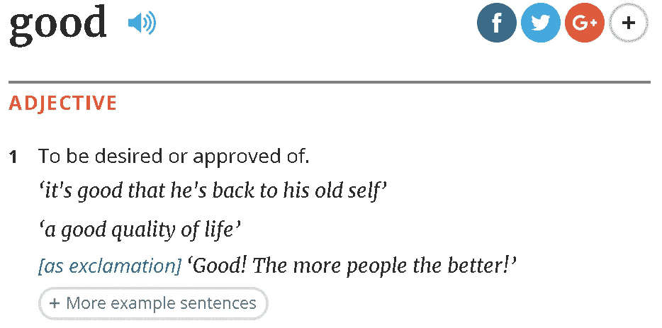
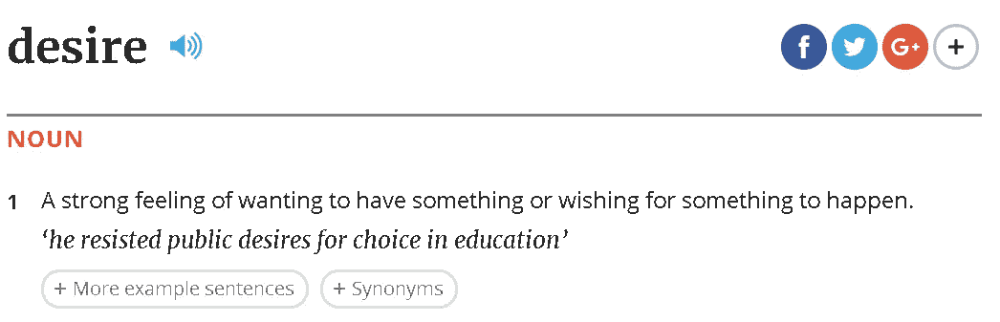
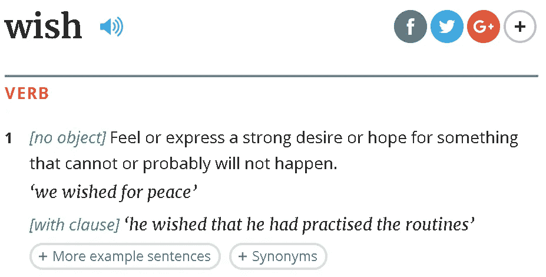
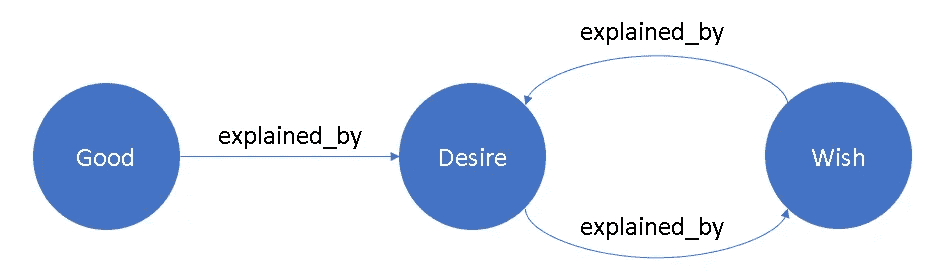

# 你明白了吗？

> 原文：<https://towardsdatascience.com/do-you-understand-it-b0b62657e836?source=collection_archive---------26----------------------->

自然语言处理导论

理解一门语言始于查字典

今天，我随意浏览了《牛津英语词典》，试图将语言归结为“第一原则”。

我首先检查了一个孩子在 3 岁时可能会学到的东西——“好”的含义——“被期望或认可”。

Screenshot from [https://en.oxforddictionaries.com](https://en.oxforddictionaries.com/)

假装不知道“欲望”是什么意思，我又检查了一遍——“强烈希望或想要某样东西”。

Screenshot from [https://en.oxforddictionaries.com](https://en.oxforddictionaries.com/)

还是那句话，什么是“愿”？“感觉或表达强烈的愿望”。

Screenshot from [https://en.oxforddictionaries.com](https://en.oxforddictionaries.com/)

哦，天哪，这是一个神奇的循环引用。我被卡住了，永远只能在“欲望”和“愿望”之间翻转。从字典上看，没有办法真正理解“欲”和“愿”的含义。

如果你检查较难的单词，你可能不会马上看到，因为它可以用较简单的单词来解释。学习外语也是如此。但如果你检查最简单的词，这个循环甚至自我引用出现了。再举一个例子，“意义”的含义读作“一个词、文本、概念或行为的含义是什么。”

Screenshot from [https://en.oxforddictionaries.com](https://en.oxforddictionaries.com/)

**意义是我们赋予的**

唯一的解释是，意义是我们赋予词语的。我们认为我们理解它们是因为每个人都知道它们，但实际上我们只是记住了它们的意思，而不是因为它是如何拼写的(嗯，偶尔这是真的，因为有一些你知道的单词成分)。拼写本身在大多数情况下没有意义。

一旦我们赋予一个词一个意思，我们就知道其他词的意思。这就像一个文字网络。比如我们理解了“欲”，就知道了“愿”和“善”。即使我们不知道“欲”的含义，我们仍然知道“愿”和“善”如果出现在同一个语境中，它们与“欲”有着相似的语境。

当一个词的意思被赋予时，我们可以通过观察上下文来猜测。这是人类理解语言的自然现象。这就联系到了一个重要的概念——****(出现在同一个语境中的词更有可能有相似的意思)，这个概念奠定了自然语言处理(NLP)的基础。****

****这是 NLP 中单词嵌入的大致思路。“单词嵌入”这个花哨的术语只是我们将意义烘焙到一系列计算机可以理解的数字(向量)中，并可用于下游任务，如情感分析。****

******机器可以学习我们如何分配意义******

****回到主题——我们理解了吗？我们都没有，电脑也没有。我们不理解它，我们赋予它意义，我们知道“好”与“欲望”和“希望”有联系。计算机也看不懂拼写“good”，但它可以学习我们的赋值分布——“good”类似于“desire”和“wish”。毕竟，意义分配仍然是人类的财产。****

****另外，中文可能有一点不同的故事，因为有些是从象形文字演变而来的。****