# 你想去米兰吗？使用 Airbnb 数据的邻里情感分析

> 原文：<https://towardsdatascience.com/do-you-want-to-move-to-milan-neighborhoods-sentiment-analysis-using-airbnb-data-72db72ebc070?source=collection_archive---------21----------------------->

## Udacity 数据科学家纳米学位计划项目

Photo by [Andrea Ferrario](https://unsplash.com/@andreaferrario?utm_source=unsplash&utm_medium=referral&utm_content=creditCopyText) on [Unsplash](https://unsplash.com/s/photos/milan?utm_source=unsplash&utm_medium=referral&utm_content=creditCopyText)

这个项目是数据科学家纳米学位项目 [**Udacity**](https://eu.udacity.com/) **的一部分:写一篇数据科学博文**，目标是选择一个数据集，应用 **CRISP-DM 流程**(数据挖掘的跨行业流程)并有效地交流分析结果。

CRISP-DM 流程:

1.  **业务理解**
2.  **数据理解**
3.  **准备数据**
4.  **数据建模**
5.  **评估结果**
6.  **展开**

看着推荐的数据集，我被太多的选项卡住了。然后，由于我和一些朋友正在考虑搬到米兰，以便离我们的工作场所更近，我决定使用 [**Airbnb**](http://insideairbnb.com/get-the-data.html) 的数据对其街区进行情感分析。

**业务理解**

该项目的目标是回答至少三个与如何使用数据的商业或现实应用相关的问题，所以我选择了:
**1 得分最高的 5 个邻域是哪 5 个？**
**2 得分最低的 5 个小区是哪几个？**
**3 主人给出的邻里概况与客人给出的有多大不同？**

**数据理解、准备数据和数据建模**

该数据集由 20626 个主机列表和 469653 个客户评论组成。列表和评论都是用不同的语言写的:意大利语，英语，法语，俄语。

在了解了哪些数据可能对我的目标有用之后，我必须将列表中的社区与真实的社区进行映射:米兰由 130 个社区组成，但在映射之后，只有 74 个被至少一个列表覆盖。

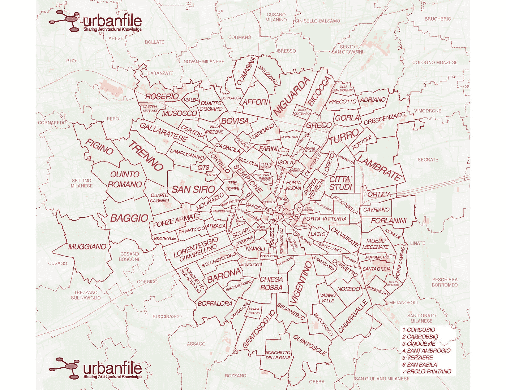

[http://www.museomilano.it/mediateca/media-pg-5/](http://www.museomilano.it/mediateca/media-pg-5/)

在无法自动绘制地图的情况下，也可以使用谷歌地图手动绘制地图。

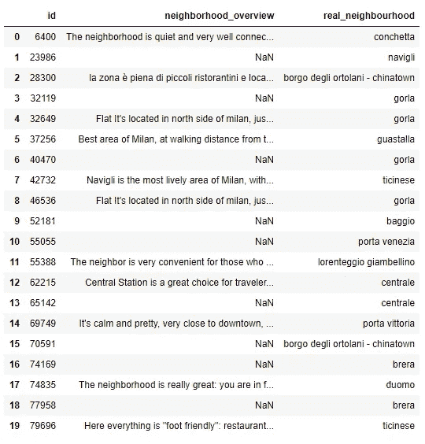

First 20 listing marked with **real_neighbourhood**

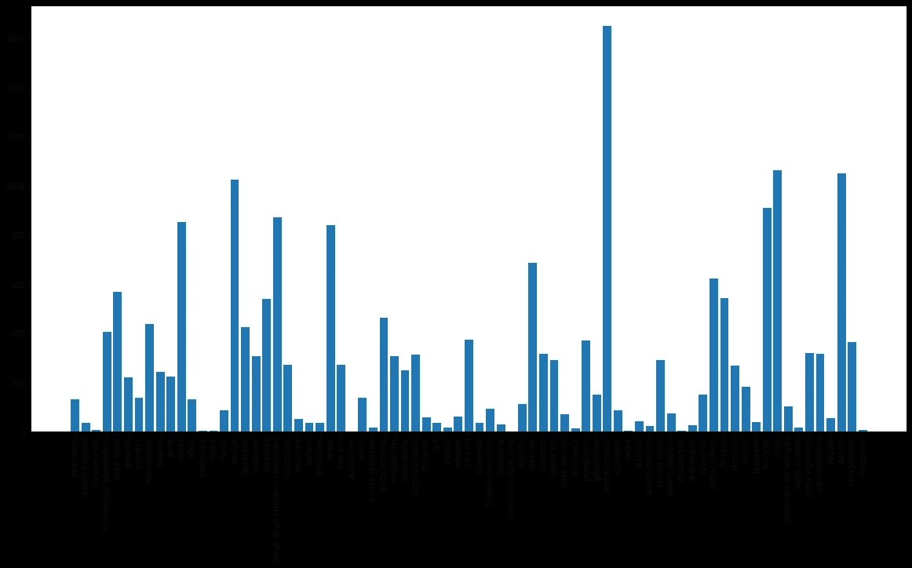

Number of listing related to a neighborhood

使用 **listing_id** 可以将每个评论连接到**real _ neighborhood**。

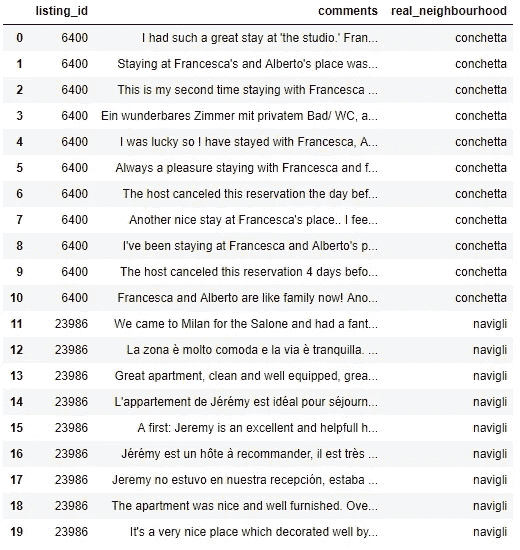

First 20 review marked with **real_neighbourhood**

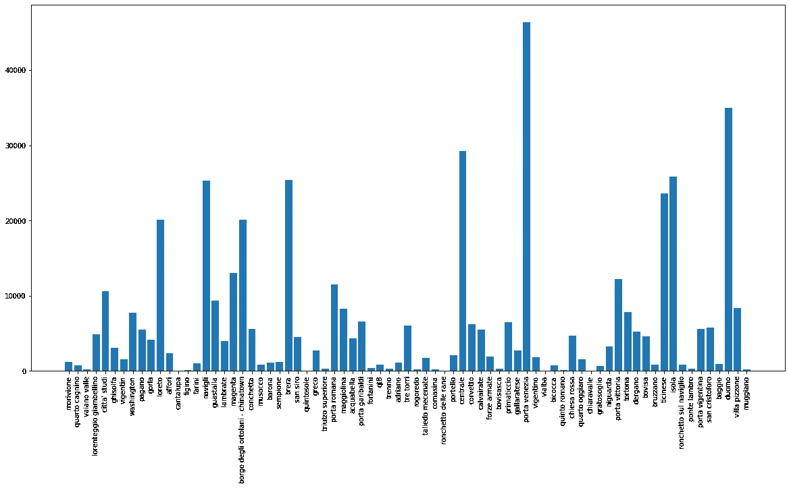

Number of review related to a neighborhood

对于列表和评论，我已经检测了使用的语言并标记了每条记录。

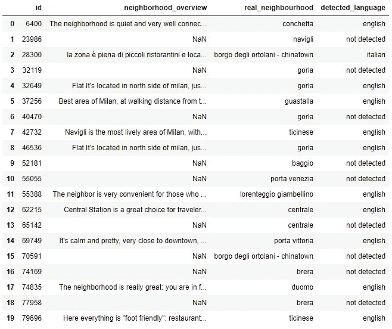

First 20 listing marked with **detected_language**

大约 34%的列表有一个无法检测语言的社区概览，37%是英语，26%是意大利语。

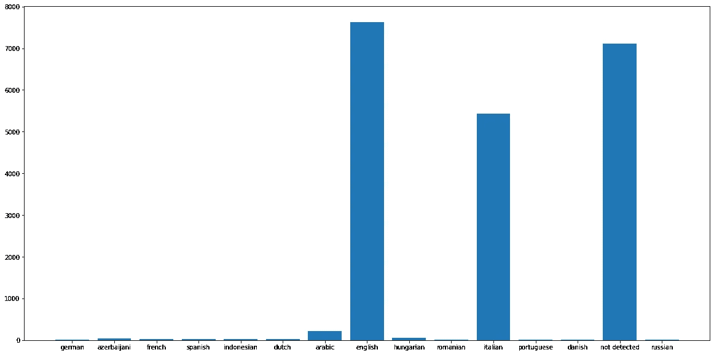

Listing **neighborhood_overview** detected languages

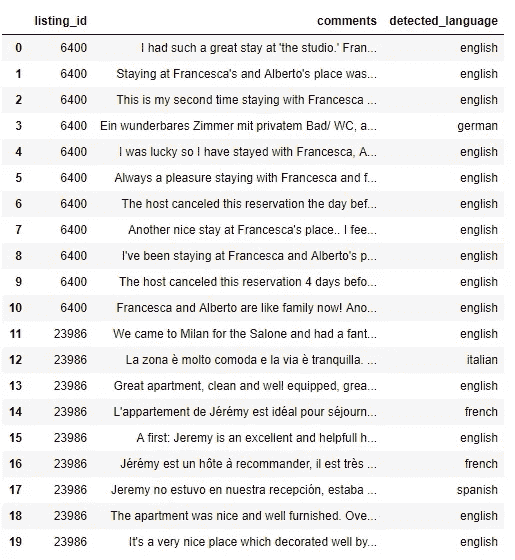

First 20 review marked with **detected_language**

大约 58%的评论是英文的，20 %是意大利文的。

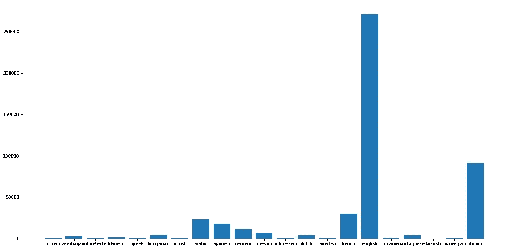

Review **comments** detected languages

然后我决定把重点放在英文列表和评论上，只使用这样标记的记录。在使用 **neighborhood_overview** 的列表中，我们可以直接获得邻居的情感，但是对于评论的评论，我们必须只提取与邻居相关的句子。

对于每个列表，我们现在都有一个**邻居情绪**

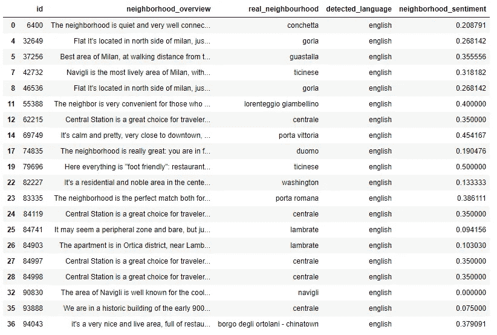

First 20 listing marked with **neighborhood_sentiment**

同样的做法也适用于评论，使用同义词列表提取与街区相关的句子:**街区**、**区域**、**街区**、**区**、**贫民区**、**教区**、**管区**、**区域**、**区**、**贫民窟**、**街**、

**例如，让我们考虑第一个评论:**

> **住在弗朗西丝卡和阿尔贝托家是一件乐事。正如所描述的那样，对于我的目的来说，这是一次去托托纳地区的愉快的步行。房间很好，每天打扫，有私人浴室。
> 
> 弗朗西丝卡超级友好，非常乐于助人；同时尊重隐私。
> 
> 总体来说很棒的体验！**

**出于我们的目的，我们只需考虑:**

> **正如所描述的那样，对于我的目的来说，这是一次去托托纳地区的愉快的步行**

**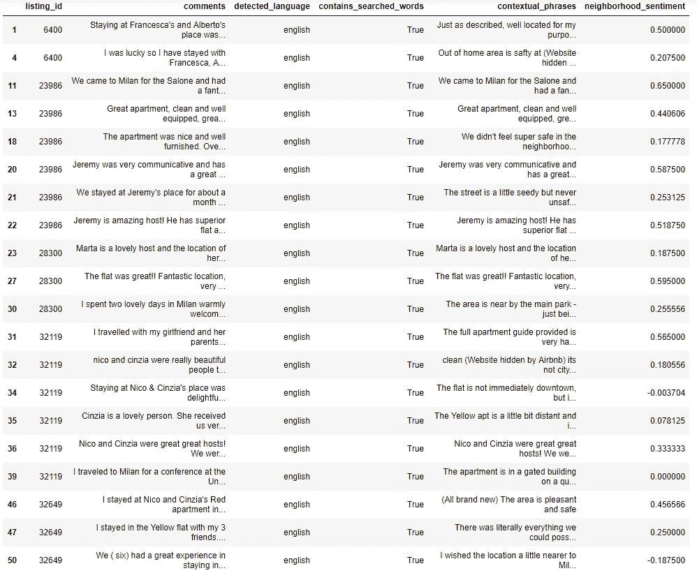**

**First 20 review marked with **neighborhood_sentiment****

**现在，通过按邻域分组，我们获得了我们正在寻找的情感:**

**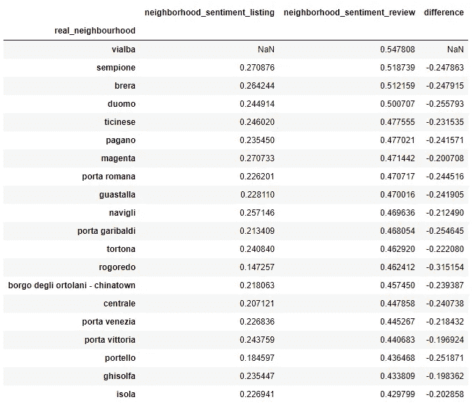**

**First 20 neighborhood sentiment comparison sort by **neighborhood_sentiment_review****

****评估结果****

**我们问题的答案是:**

**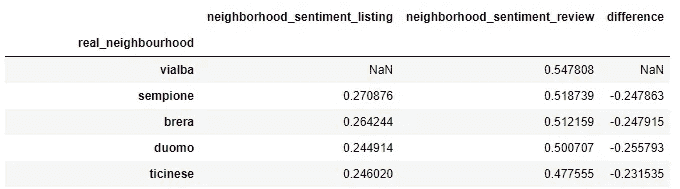**

**First 5 neighborhood by score**

**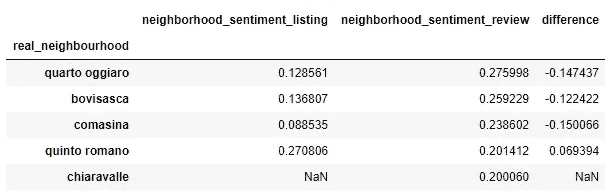**

**Last 5 neighborhood by score**

**平均而言，与主持人给出的**邻居 _ 概述**相比，由客人评论的上下文句子给出的邻居的情感要高得多。一个可能的解释是 **neighborhood_overview** 文本的过长会对情感分析分数产生负面影响。而只提取有用的句子允许清理用于分析的字符串，从而给出总体较高的分数。**

**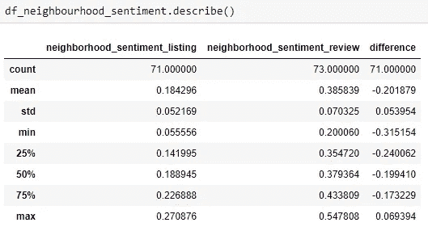**

**Reporting aggregated value**

****结论****

**总结步骤:
**1** 将数据集邻域映射到真实邻域
**2** 检测 **neighborhood_overview** 中用于列表和评论的语言
**3** 用于列表:计算**neighborhood _ overview**
**4**用于评论的情感分析:隔离与邻域相关的句子并计算情感分析
**5****

**这个项目的代码可以在这个 github [资源库](https://github.com/simonerigoni/write_a_data_science_blog_post_project)中找到，并且在我的博客上有一个意大利语的[帖子](https://simonerigoni01.blogspot.com/2022/12/do-you-want-to-move-to-milan.html)。**