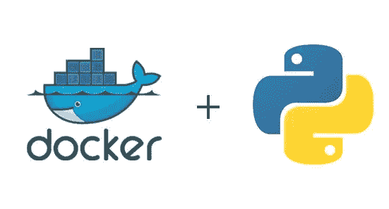
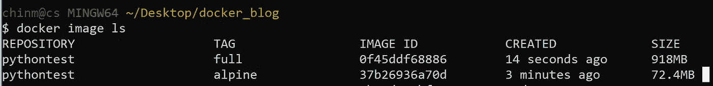
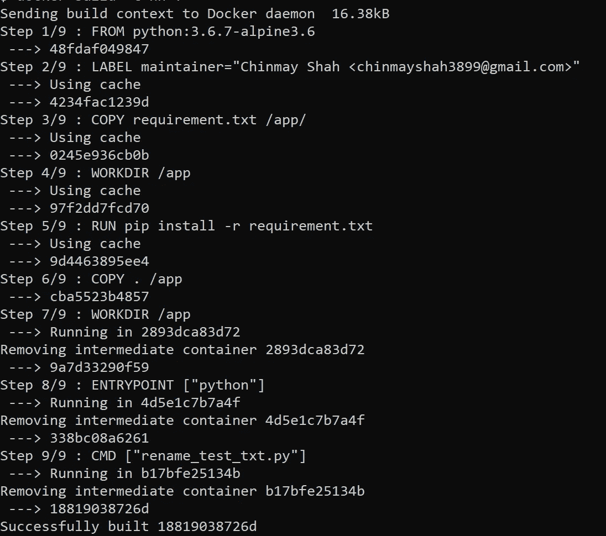

# Python 开发的 Docker？

> 原文：<https://towardsdatascience.com/docker-for-python-development-83ae714468ac?source=collection_archive---------5----------------------->

[*第 1 部分*](/why-you-should-care-about-docker-9622725a5cb8) *涵盖了什么是 docker。*

在本文中，我们将讨论如何开始使用 Docker 进行 python 开发。



一个标准的 python 安装包括设置环境变量，如果你在处理不同版本的 python，无论是 Windows 还是 Linux，都有大量的环境变量需要处理。

如果您正在处理对 python 版本非常挑剔的产品，您需要确保您的程序在该版本上经过测试，并且没有您可能在本地系统上认为理所当然的额外和缺失的依赖项。

同时处理 Python 2 和 3 仍然是可管理的，但是想想如果你必须处理已经安装的 python 3.6 并且需要试用 python 3.7。

# 码头工人来救援了！

改变 python 版本就像`FROM python:3.6.7`到`FROM python:3.7`一样简单。

Docker 不仅允许进行快速实验，而且有助于限制保持稳定性所需的特定包版本。

可以把它想象成 Anaconda 中的一个虚拟环境。

但是，当您配置了 Anaconda 之后，大多数包已经预安装在系统上，当您尝试部署它时，您可能会认为它们是理所当然的。

此外，python 3.7 版的 Anaconda 占用了超过 3GB 的磁盘空间。

另一方面，docker 图像几乎不占用千兆字节。



Sizes of Python Full and Alpine Images

# 准备文档

决定你需要的 python 版本，如果你只是在寻找最新版本，就写`python:latest`。

图像的方式通常被命名为`image_name:tag`，当您使用`docker build -t image_name:tag .`构建图像时需要提供这个名称。如果您在构建过程中没有提供任何标签，docker 会自动分配给它`latest`。

在 docker hub 上， [Python](https://hub.docker.com/_/python/) 提供了不同的图片供选择，从 Alpine 版本(这是一个非常小的图片)到完整版本。

```
# Python 3.6.7FROM python:3.6.7-alpine3.6# author of file
LABEL maintainer=”Chinmay Shah <[chinmayshah3899@gmail.com](mailto:chinmayshah3899@gmail.com)>”
```

`RUN` —该指令将在当前图像之上的新层中执行任何命令，并提交结果。生成的提交图像将用于`Dockerfile`中的下一步，通常以外壳形式，除非指定[或](https://docs.docker.com/engine/reference/builder/#run)。

```
# Packages that we need 
COPY requirement.txt /app/
WORKDIR /app# instruction to be run during image build
RUN pip install -r requirement.txt# Copy all the files from current source duirectory(from your system) to# Docker container in /app directory 
COPY . /app
```

你可能会注意到，在中我们复制了`requirement.txt`两次。这是为了构建优化。

Dockerfile 中的每一行都作为一个单独的步骤执行，并创建一个新的容器。

这是非常低效的，因为您并不总是希望在每个构建命令期间从头开始重新构建一切。

为了解决这个问题，Docker 使用了一种被称为**层缓存**的东西，这是一种奇特的说法，它不是每次都重新创建一个容器，而是重用在以前的构建中创建的容器并存储它。因此，除非您在前面的步骤中进行了更改，否则构建过程可以重用旧的容器。

这个想法是，需求几乎不会改变，但是代码经常会改变，因此使用缓存是一个更好的方法，而不是每次构建映像时都下载需求包。



The build process

请注意，dockerfile 中的每一行都是一个单独的步骤，而且每个步骤都有一个唯一的字母数字名称。

`ENTRYPOINT` —指定容器启动时将始终执行的命令。

`CMD` —指定将提供给`ENTRYPOINT`的参数。当您想将容器作为可执行文件运行时，可以使用它。

> 如果没有 entrypoint，默认参数是执行的命令。
> 
> 对于 entrypoint，`CMD`作为参数传递给 entrypoint。

更多关于它的[这里](https://aboullaite.me/dockerfile-run-vs-cmd-vs-entrypoint/)。

```
# Specifies a command that will always be executed when the  
# container starts.
# In this case we want to start the python interpreterENTRYPOINT [“python”]# We want to start app.py file. (change it with your file name) # Argument to python command
CMD [“app.py”]
```

# 运行 python 文件

构建文件:

```
docker build -t python:test .
```

使用 cmd 或 bash 启动容器:

```
docker run — rm -it -v /c/Users/chinm/Desktop/python_run:/teste pythontest:alpine
```

`-v`或`--volume`用于附加一个卷。

> 什么是体积？
> 
> 卷是保存 Docker 容器生成和使用的数据的首选机制。它们完全由 Docker 管理。

要将目录连接到 Docker 容器:

`-v source_on_local_machine:destination_on_docker_container`

如果您想要创建一个卷，以便可以跨不同的 docker 容器访问它，那么创建一个 docker 卷将是一个不错的选择。更多关于它的[在这里](https://docs.docker.com/storage/volumes/)。

如果您试图将 Python 用于数据科学，您可能会使用 volume，这样您就可以与容器共享原始数据，对其进行一些操作，并将清理后的数据写回主机。

注意:如果你使用 docker Toolbox 来使用 Docker，那么`-v`会将你的容器映射到 VM，VM 映射了你本地机器的 C 目录，因此很难将你的其他逻辑驱动器作为 Docker 上的卷来使用。

# 结论

我希望您已经具备了在 docker 上开始使用 Python 的基础知识。黑客快乐！

你可以随时联系 Twitter、T2、Linkedin 或 T4 的电子邮件。