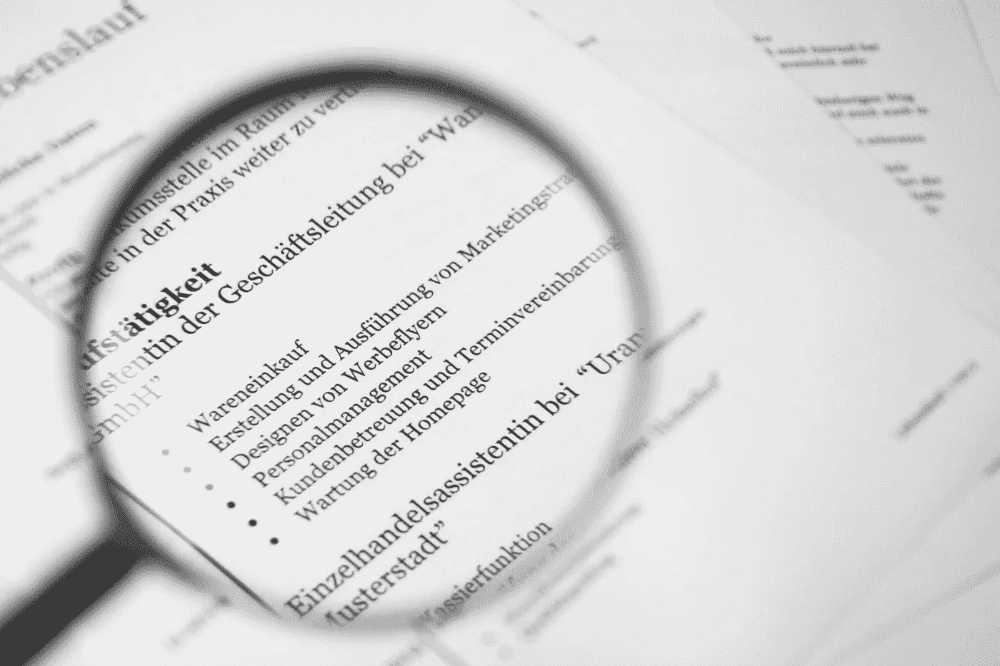
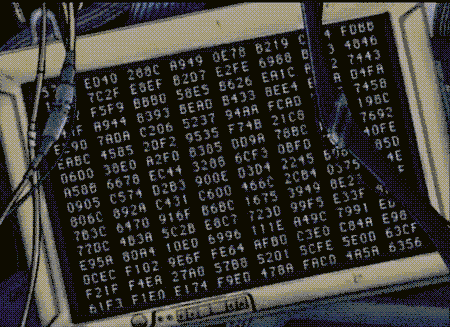

# NLP 的 Docker 图像

> 原文：<https://towardsdatascience.com/docker-image-for-nlp-5402c9a9069e?source=collection_archive---------18----------------------->

## *现成的解决方案*

自然语言处理是我们在[波特哈实验室](https://potehalabs.com)工作的主要方向之一。我们做文本分析，聊天机器人开发和信息检索。所以我们定期使用 Flair，Natasha，TensorFlow 和 Pytorch，NLTK，有时候会遇到英语以外的语言。现有的解决方案并不总是适合我们面临的每一个问题:有些很难启动，有些太复杂和沉重。

因此，我们已经用所有方便的 NLP 框架编译了我们自己的 Docker 映像，包括深度学习。它适合我们几乎 80%的任务，并且节省了安装框架的时间。

## **当前方法**

一般来说，现在大多数数据科学解决方案都是通过以下方式部署的:

One doesn’t simply deploy on bare metal

1.  在裸机上。一个人必须花大量的时间用 cudNN 设置 CUDA，为 Ubuntu 安装驱动程序，并且在成功之后，还要做大量的尝试来一起运行。肯定会出问题。
2.  或者使用 Docker(一种更简单的方法)。然而，常规 Docker 不会工作得很好。需要一个特定的:与 GPU 相关的一切都是预先配置好的。在 [Docker Hub](https://hub.docker.com/) 已经有几个现成的镜像可用，它们是用不同的 CUDA、cuDNN 和其他模块的版本准备的。

如何在 Docker 中部署 GPU？首先，一个人必须选择一个特别适合他的显卡的基本图像(为此，在[hub.docker.com/nvidia](http://hub.docker.com/nvidia)通过标签搜索)。当使用 GPU 时，无论如何一切都是从所需版本的 Nvidia 映像继承的(对于 CPU，相反，可以使用任何方便的映像)。然后，在继承了基本映像之后，一个人创建他自己的基本映像并运行它。整个图像将重约 3Gb，但是，一切都将正常工作。

## **解决方案**

经历了所有这些困难之后，我们又为 NLP ( [源代码](https://github.com/poteha/docker-nlp))创建了一个产品 Docker 映像，它是免费的。我们的[码头中心](https://hub.docker.com/r/iwitaly/nlp/)有现成的图像。它包含了一些现代的 NLP 框架，包括用于深度学习的框架。盒子里面是什么: *torch，flair，spacy，dateparser，pymorphy2，yargy，natasha，nltk，yake* ( [版本](https://github.com/poteha/docker-nlp/blob/master/README.md))。更详细:

*   [flair](https://github.com/zalandoresearch/flair) 是一个最先进的 nlp 模块，它提供了方便的 NER、词性、词义消歧和分类。
*   natasha 是俄语中 NER 的一个模块。
*   yargy 是一个俄罗斯语言解析器。
*   yake 是一个自动关键词提取器。其主要特征是:无监督方法、语料库、领域和语言独立性。

**安装镜像的四个简单步骤:**

1.  克隆[回购](https://github.com/poteha/docker-nlp)
2.  然后是`build docker build -t nlp-cpu -f ./Dockerfile.cpu .` (或`docker build -t nlp-cpu -f ./Dockerfile.gpu .`)
3.  并使用:`docker run -it — runtime=nvidia iwitaly/nlp:gpu nvidia-smi`
4.  还可以传递 CUDA_VISIBLE_DEVICES 环境变量。

在这个 Docker 映像的帮助下，您可以通过快速启动它并直接使用 NLP 来节省部署时间。我们希望它至少能简化一点流程。

如果您对安装有任何疑问，请在这里留下您的意见或直接联系我。还有，随意分叉回购，修改原始文件。

## **链接**

*   github:[https://github.com/poteha/docker-nlp](https://github.com/poteha/docker-nlp)
*   https://hub.docker.com/r/iwitaly/nlp/

**感谢您的阅读！请，提出你的问题，留下评论，敬请期待！**