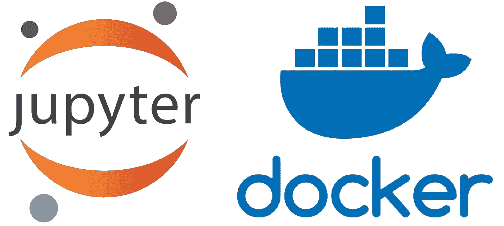

# docker+Jupyter 1 分钟机器学习

> 原文：<https://towardsdatascience.com/docker-jupyter-for-machine-learning-in-1-minute-30e1df969d09?source=collection_archive---------10----------------------->

## 许多数据科学应用程序需要与您的主机环境隔离的模型培训/开发环境。轻量级的解决方案是将 Jupyter 与 Docker 集成在一起。设置这样一个容器的最佳实践是使用 docker 文件，这是我按照最佳实践在不到 1 分钟的时间内编写的。我希望这能帮助任何使用 docker 从事数据科学应用的人。



该项目的结构如下。

```
├── Prject_folder           
│ ├── Dockerfile           #Primary imga building 
│ ├── docker-compose.yml   #Describing the files to mount etc     
│ ├── requirements.txt     #Required python packages for the image
```

## 第一步:

将以下 3 个脚本下载到您计算机上的项目目录中。 **GitHub 回购**可以在这里找到[。](https://github.com/gomesc166/medium/blob/master/JupyterWithDocker/README.md)

Dockerfile

docker-compose.yml

将其更新为{ absolute path _ to _ yourFile }/{ fileName ame }:/root/data science/{ fileName }以挂载您的首选文件。

requirements.txt

更新它以包含您需要的包**，即** matplotlib==1.0.0

## 第二步:

在你的电脑上安装 Docker[https://docs.docker.com/install/](https://docs.docker.com/install/)，

## 第三步:

```
docker build -t datascience .
```

## 第四步:

将 docker-compose.yml 文件更新为 **mount** 文件，按照我已经给出的 test.txt 文件的例子，将您需要的文件从主机装载到容器中。

## 第五步:

```
docker-compose up 
```

**搞定**现在访问 [http://localhost:8888](http://localhost:8888/) ，默认密码设置为“root”。随便改吧。

# **补遗**

如果遇到问题，运行以下命令将日志文件下载到当前目录。作为对这篇文章的回应，我会尽快给出解决方案。

```
docker cp <container-name>:/root/dockerLogs/install-logs.log .
```

如果您想在容器内部启动交互式会话，请键入以下命令

```
docker exec -it <container name> /bin/bash
```

如果您想从计算机中完全删除图像

**步骤 1:** 停止容器

```
docker container stop <container-id>
```

**步骤 2** :取下容器

```
docker container rm <container-id>
```

第三步:删除图像

```
docker image rm datascience
```

如果您对我的代码和实践有任何进一步的问题，请留下您的回复，我会尽快回复您。非常感谢 MLSA 团队一如既往的帮助。