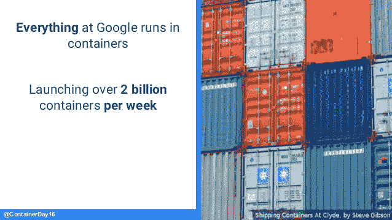
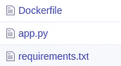

# Docker 让数据科学家变得简单

> 原文：<https://towardsdatascience.com/docker-made-easy-for-data-scientists-b32efbc23165?source=collection_archive---------4----------------------->

## 使用 Docker 的机器学习模型部署中的动手学习，并提供各种示例。

> "谷歌在容器中运行所有软件，他们每周运行大约 20 亿个容器."



[source](https://image.slidesharecdn.com/googlecloudplatform-kubernetesvotreassurance-viepourlecloudpariscontainerday2016-160706123026/95/paris-container-day-2016-kubernetes-votre-assurancevie-pour-le-cloud-google-cloud-platform-9-638.jpg?cb=1467808596)

在继续之前，你应该想到的第一个问题是为什么我需要 docker，更重要的是它是什么？

那么，Docker 是什么？Docker 是一组平台服务产品，使用操作系统级虚拟化来交付称为容器的软件包中的软件。Docker 的巨大优势在于它使您的部署变得简单，到时候您甚至可以毫不费力地在多台机器上部署它。

您还可以将 Docker 与 Kubernetes 一起使用，Kubernetes 可以通过在不同的 Docker 容器之间分配工作来自动处理工作负载。除此之外，它还负责处理任何 Docker 容器是否离线，并自动重启它以及其他许多事情。

在这里，我们将使用 Docker 构建各种 flask 应用程序。

1.  使用 Flask 的简单 Hello World 应用程序
2.  在 Docker 容器中传递参数
3.  Docker 容器中的简单 ML 应用程序
4.  在 Docker 容器中将图像作为参数传递

# **安装**

```
$ sudo apt update
$ sudo apt install docker.io
```

这将安装 docker。现在，要检查 docker 是否正在运行，请键入

```
$ sudo service docker status
```

如果在活动模式下没有看到 docker，请键入

```
$ sudo service docker start
```

# 基本术语

1.  **Docker 镜像**——简单来说，Docker 镜像就像一个用来安装任何操作系统的 ISO 镜像文件。您可以查看所有 docker 图片(在 [DockerHub](https://hub.docker.com/search?q=&type=image) 上公开)
2.  **Docker 容器** —当 Docker 映像运行时，它成为 Docker 容器。您可以再次运行相同的映像，将会创建一个不同的 docker 容器。
3.  **docker file**—docker file 包含设置 docker 容器的所有代码，从下载 docker 映像到设置环境。

我把 GitHub 的链接放在了底部，那里有所有的代码。Docker 在你理解了它的流程之后，是非常容易学习的。

# 示例 1:简单的烧瓶应用程序

这是一个非常简单的应用程序，可以在浏览器屏幕上显示“hello world”。

让我们构建 flask 应用程序

此外，通过以下方式创建 requirements.txt 文件

```
$ pip3 list > requirements.txt
```

制作 flask 应用程序时需要记住的几件事是，主机应该设置为“0.0.0.0 ”,因为我们是在 Docker 内部运行它。

让我们构建 docker 文件

1.  用下面的命令，我们正在拉 ubuntu 图像。它还包含一个标签，我们可以用它来指定版本。这里，我们正在拉“最新”的图像。

```
FROM ubuntu:latest
```

2.现在，假设您刚刚安装了 Linux 操作系统，您要做的第一件事就是更新包含软件包信息的本地数据库。还添加了一个'-y '标志，以确保它不需要任何用户输入。

```
RUN sudo apt update -y 
```

3.下一个任务是安装 python。因为我们只使用一个应用程序，所以不需要设置虚拟环境。

```
RUN apt install -y python3-pip
```

4.下一个任务是将目录中的所有文件复制到 docker 映像中。

```
COPY . /app
```

在哪里？是当前目录，而'/app '是我们希望复制文件的位置。你可以选择任何你喜欢的文件夹。

5.将工作目录设置为/app。

```
WORKDIR /app
```

6.我们已经调出了 ubuntu 映像，安装了 python，复制了所有数据。下一步是通过安装所有必需的包来设置 python 环境。我们已经创建了 requirements.txt 文件。现在，我们只需要安装它。

```
RUN pip3 install -r requirements.txt
```

7.现在，将入口点设置为“python3”。

```
ENTRYPOINT ['python3']
```

8.最后，运行 app.py 文件

```
CMD ['app.py']
```

最终的文件将如下所示。

该文件将被保存为不带扩展名的 Dockerfile。

最终的目录结构将如下所示



最后，通过以下方式构建 docker 文件

```
$ docker build -t simpleflask .
```

所有这一切听起来可能令人困惑，请原谅我。我们会看到更多的例子来更好地学习。让我们回顾一下到目前为止我们所学的内容。

1.  您需要创建一个 Docker 文件，其中包含 Docker 容器将安装的信息。它包括一个图像，python，python 环境，然后运行应用程序本身。
2.  然后，您需要构建 Dockerfile。

**现在，请注意这里**

您可以通过以下方式查看所有 docker 容器

```
$ docker ps -a
```

> 您将看不到任何 docker 容器，因为您刚刚构建了它。现在，我们将运行该图像。

类型

```
$ docker images
```

您可以使用此命令查看所有 docker 图像。下一个任务将是运行您刚刚构建 docker 映像。

```
$ docker run -d -p 5000:5000 <docker_image_id>
```

*   5000:5000 表示您已经将系统的端口 5000 连接到 docker。后一个端口是烧瓶。默认情况下，flask 在端口 5000 上运行。
*   -d 标志意味着您希望以守护模式(后台)运行它。

成功运行后，您会看到一个输出。检查您的容器是否正在运行。类型

```
$ docker ps -a
```

如果运行成功，那么在你的网络浏览器中输入 [localhost:5000](https://127.0.0.1:5000) 。你会看到“你好世界”。

# 示例 2:传递参数应用程序

这不是一个机器学习预测模型，而是我们要学习如何通过 POST 方法从 flask 获取输入并打印出来。

让我们首先创建 flask 应用程序

*   我们通过显式声明 POST 方法来使用它。
*   使用 [request.get_json](https://gist.github.com/gaganmanku96/ff8289917121fea6d75ad77655c3fc3e) 方法来接收输入。
*   然后简单地打印该值

让我们创建 requirements.txt 文件

```
$ pip3 list > requirements.txt
```

docker 文件将与之前的完全相同

要构建 docker 文件，请使用

```
$ docker build -t passingarguments .
```

我们将遵循上面的所有步骤。

```
$ docker images
$ docker run -d -p 5000:5000 <docker_image_id>
```

**现在，注意这里**

有多种方法可以调用我们刚刚创建的 API。

1.  在 python 中使用请求。

2.使用邮递员

3.使用卷曲

```
curl -X POST [http://127.0.0.1:5000/predict](http://127.0.0.1:5000/predict) -d 5
```

结果将是传递的数字的平方。

# 示例 3:简单的 ML 应用程序

在这个例子中，我们将看到如何同时传递多个例子。我们将以 JSON 的形式传递参数。

现在，你不用担心模特培训。训练模型的代码在 Docker 文件中，该模型将作为 Docker 构建过程的一部分进行训练。

> 理想情况下，模型应该在本地系统上进行训练，然后复制到 Docker 容器中。

让我们看一下 Flask 应用程序

这一次在 flask 应用程序中，我们从接收到的 JSON 中获取参数。JSON 的数据格式类似于 python 字典。

> 实际上，我们还应该在这里包含错误处理。如果参数不是数字或参数为空，则可能会出现错误。

另外，创建一个 requirements.txt 文件

```
$ pip3 list > requirements.txt
```

现在，让我们看看 Docker 文件

> 请注意，我们正在 Docker 容器中训练模型。您还可以在本地系统上训练模型，并将其复制到容器中。在这种情况下，您只需删除训练模型的行。

现在，有多种方法可以得到预测。

1.  在 python 中使用请求

2.使用卷曲

```
curl -X POST [http://127.0.0.1:5000/predict](http://127.0.0.1:5000/predict) -d '{"f1":4, "f2":5, "f3":10}'
```

注意我们是如何以 JSON 格式传递数据的。在 python 中使用请求时，您必须使用 json.dumps 来将数据转换成 json 格式。

# 4.图像分类应用

为简单起见，我使用 MNIST 数据集进行分类。

让我们看看 Flask 应用程序

*   我们正在进口所有必要的包装
*   我们在运行时加载模型，以加快推理速度
*   我们使用 convert('L ')将图像转换为灰度。
*   图像大小调整为 28x28 像素。
*   对于预测，Keras 需要图像的格式(批量大小、宽度、高度、颜色通道)。所以，我们把它转换成(1，28，28，1)。
*   接下来，我们将使用它的预测方法和 no.argmax 来查找概率最高的类。

让我们创建 requirements.txt 文件

```
$ pip3 list > requirements.txt
```

让我们看看它的 docker 文件

> 注意——这里我已经训练好了模型。您还可以在构建 docker 文件时添加培训功能。

我们将遵循上面的步骤

```
$ docker build -t imageclassification .
$ docker run -d -p 5000:5000 <docker_image_id>
```

> 在构建 Docker 映像之前，确保使用文件夹中包含的 train.py 文件训练模型

现在，有多种方法可以得到预测。

1.  使用卷曲

```
curl -F "file=[@](http://twitter.com/exp)pic_name.extension" [http://localhost:5000/predict](http://localhost:5000/predict)
```

2.使用请求

现在够了。

如果你已经理解了一些基本的程度，那么祝贺你到此为止。当你尝试新事物并毫不犹豫地去尝试时，你会学到更多。一个大师曾经是一个初学者。

所有代码都在这里。

快乐学习！