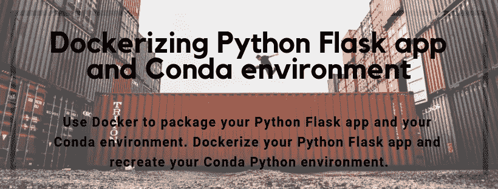

# Dockerizing Python Flask 应用程序和 Conda 环境

> 原文：<https://towardsdatascience.com/dockerizing-python-flask-app-and-conda-environment-154ab88b599?source=collection_archive---------14----------------------->

## 使用 Docker 打包您的 Python Flask 应用程序和 Conda 环境



*最初发表于*【www.easy-analysis.com】

*这篇文章将描述如何对接你的 Python Flask 应用程序并重新创建你的 Conda Python 环境。*

*因此，您正在开发一个 Python Flask 应用程序，并且您已经在本地机器上设置了一个 Conda 虚拟环境来运行您的应用程序。现在，您希望将 Python Flask 应用程序放在 Docker 映像中。*

*如果可以将当前的 Conda 环境导出为. yml 文件，描述应用程序使用的 Python 版本以及运行应用程序需要哪些 Python 库，这不是很好吗？此外，使用导出的。yml 文件在 Docker 映像中构建一个类似的环境，并在该环境中运行 Flask 应用程序。*

*下面将准确描述你如何能完成上述所有。*

# *要求*

*   *您已经安装并运行了 Docker*
*   *熟悉 Docker 命令。你可以在这里阅读更多关于 Docker [的内容](https://docs.docker.com/engine/reference/commandline/docker/)。*
*   *熟悉 Conda 命令。你可以在这里阅读更多关于康达[的内容。](https://conda.readthedocs.io/en/latest/)*

# *烧瓶应用示例*

*在这篇文章中，我将使用下面的迷你烧瓶应用程序。*

```
*# -*- coding: utf-8 -*-# 
# Imports 
# 
from flask import Flask, jsonify app = Flask(__name__)# 
# Routes 
# 
@app.route('/', methods=['GET']) 
def hello_world():
    return jsonify({'message': 'Hello World'}) @app.route('/test', methods=['GET']) 
def test():
    return jsonify({'test': 'test'}) if __name__ == "__main__":
    app.run(debug=True) # remember to set debug to False* 
```

*创建一个文件夹，用于存放项目文件。我在本地机器上创建了一个名为“docker_conda_template”的文件夹。在该文件夹中，我创建了一个名为“api.py”的文件，其中包含上述 Python 代码。*

# *导出 Conda Python 环境*

*为了在 docker 映像中重新创建一个 Conda python 环境，它对应于我们在本地机器上创建的 Conda python 环境，我们首先需要从本地 Conda Python 环境中导出一个 environment.yml 文件。*

*为此，您首先需要将 cd 放入要创建 environment.yml 文件的文件夹。*

```
*cd home/docker_conda_template*
```

*现在我们想激活一个 Conda 环境，它安装了必要的 Python 版本，并且安装了运行我们的应用程序所需的所有库。我假设你熟悉 Conda CLI，因此这篇文章不会解释如何使用 Conda。*

```
*conda source activate your-environment-name*
```

*为了将您的环境导出为. yml 文件，请运行以下命令。*

```
*conda env export > environment.yml*
```

*这将在您的当前文件夹中创建文件“environment.yml”。
文件看起来会像这样。*

```
*name: your-environment-name 
channels: 
- defaults dependencies: 
- python=3.6 
- flask 
- gunicorn*
```

*该文件包含三条信息。环境创建时的名称、库将从什么渠道下载以及最后要安装什么 Python 版本和库。*

# *用于建立您的 Docker 形象的 Docker 文件*

*Docker 文件是我们将它们放在一起的地方，这也是 Docker 将使用您的 Python 应用程序及其运行所需的所有要求来创建映像的文件，例如在我们的 environment.yml 文件中定义的 Conda 环境。*

*以下是最终的 Dockerfile 文件:*

```
*FROM continuumio/miniconda:latest WORKDIR /home/docker_conda_template COPY environment.yml ./ 
COPY api.py ./ 
COPY boot.sh ./ RUN chmod +x boot.sh RUN Conda env create -f environment.yml 
RUN echo "source activate your-environment-name" > ~/.bashrc ENV PATH /opt/conda/envs/your-environment-name/bin:$PATH EXPOSE 5000 ENTRYPOINT ["./boot.sh"]*
```

*我们不打算定义如何在映像上安装 Conda，为此，我们将下载并使用一个已经安装并设置了 Conda 的现有映像。此图片由 continuum 提供，它安装并设置了 Miniconda。我们将用他们的形象作为建立我们形象的基础。为了使用他们的图像作为基础图像，我们必须在 order 文件中声明。这是在第一行“来自 continuumio/miniconda:latest”中完成的。*

*为了在您的映像中定义一个工作目录，我们声明“WORKDIR/home/docker _ conda _ template”。*

*我们还想将代码和 environment.yml 文件复制到映像中。下面几行将文件复制到 Docker 映像中。*

```
*COPY environment.yml environment.yml 
COPY api.py ./ 
COPY boot.sh ./*
```

*我们还没有创建和讨论文件“boot.sh”。我们稍后将创建并讨论这个问题。*

*docker 文件中的以下行运行两个命令，然后设置 Conda 环境的环境路径，该环境将基于我们的 environment.yml 文件进行设置，最后公开端口 5000，这意味着我们将能够通过该端口与我们的 Flask 路由进行交互。*

```
*RUN conda env create -f environment.yml 
RUN echo "source activate your-environment-name" > ~/.bashrc 
ENV PATH /opt/conda/envs/your-environment-name/bin:$PATH EXPOSE 5000*
```

*第一个 run 命令创建一个在 environment.yml 文件中指定的 Conda 环境。第二个运行命令激活创建的 Conda 环境。*

*然而，有几行我们到目前为止忽略了。Dockerfile 中的最后一行是入口点。这意味着这将在创建映像后运行，而且，这将由非特权用户执行。*

# *boot.sh 文件*

*在入口点语句中，我们引用了一个名为 booth.sh 的文件。*

```
*#!/bin/sh 
exec gunicorn -b :5000 --access-logfile - --error-logfile - api:app*
```

*这个文件是一个执行一个命令的脚本。该命令启动 Gunicorn 服务器，将端口 5000 绑定到 80，并指定要运行的 Flask 应用程序位于文件 api 中。*

*或者，我们可以完全删除这一部分，只通过执行 api.py 文件来运行 Flask web 服务器。然而，正如 Flask 文档所述，他们不建议在生产中使用 Flask 内置的 web 服务器。因此，我们希望运行一个生产就绪的 web 服务器，Gunicorn 就是这样的服务器。*

*为了使这个工作，您需要创建一个名为 boot.sh 的文件，复制上面的代码行，并将文件保存在根文件夹中，在我的例子中，这将是在文件夹“docker_conda_template”中。*

*最后，Dockerfile 文件中还有两行需要解释:*

```
*COPY boot.sh ./ RUN chmod +x boot.sh*
```

*第一行只是将 boot.sh 文件复制到根文件夹中的 docker 映像中，根文件夹是 docker 文件中指定的工作目录。第二行运行一个命令，该命令修改 boot.sh 文件，以便它可以被识别为可执行文件。*

# *建立并运行您的 Docker 映像*

*总而言之，现在你应该有下面的文件夹/文件结构。*

```
*docker_conda_template 
--api.py 
--boot.sh 
--environment.yml 
--Dockerfile*
```

*为了构建 docker 映像，您需要执行以下命令。*

```
*docker build -t your-image-name:latest .*
```

*通过运行以下命令启动 Docker 映像。*

```
*docker run –name your-image-name -p 80:5000 –rm your-container-name:latest*
```

*打开浏览器并访问 localhost 或 localhost/test，您应该会得到 api.py 文件中定义的响应。*

*如果你有兴趣了解我更多。请访问我在 LinkedIn 上的个人简介[https://www.linkedin.com/in/vedranmarkulj/](https://www.linkedin.com/in/vedranmarkulj/)*

*感谢阅读。如果你对我将来写的关于机器学习和类似主题的帖子感兴趣，请在[媒体](https://medium.com/@vedranmarkulj)和 [LinkedIn](https://www.linkedin.com/in/vedranmarkulj/) 上关注我。更多文章即将发表。*