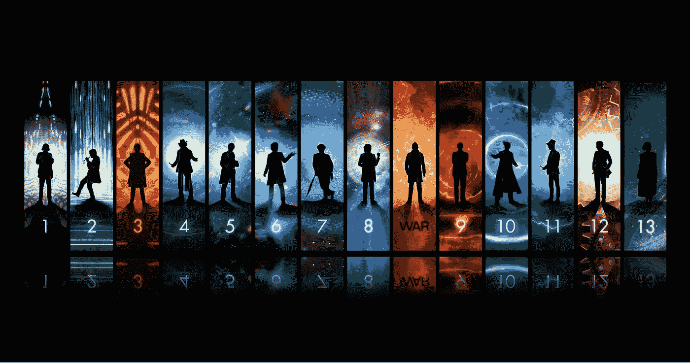
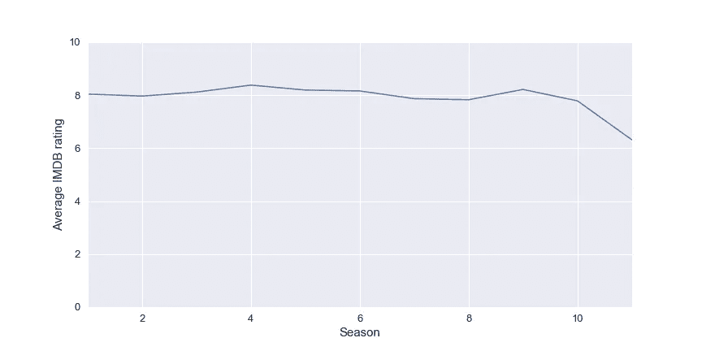
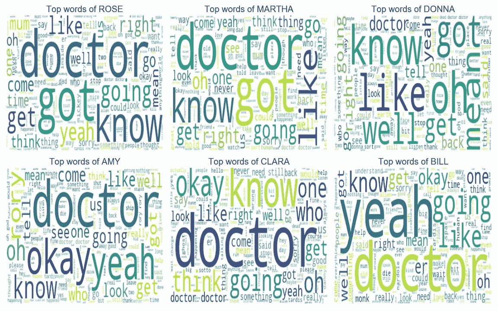
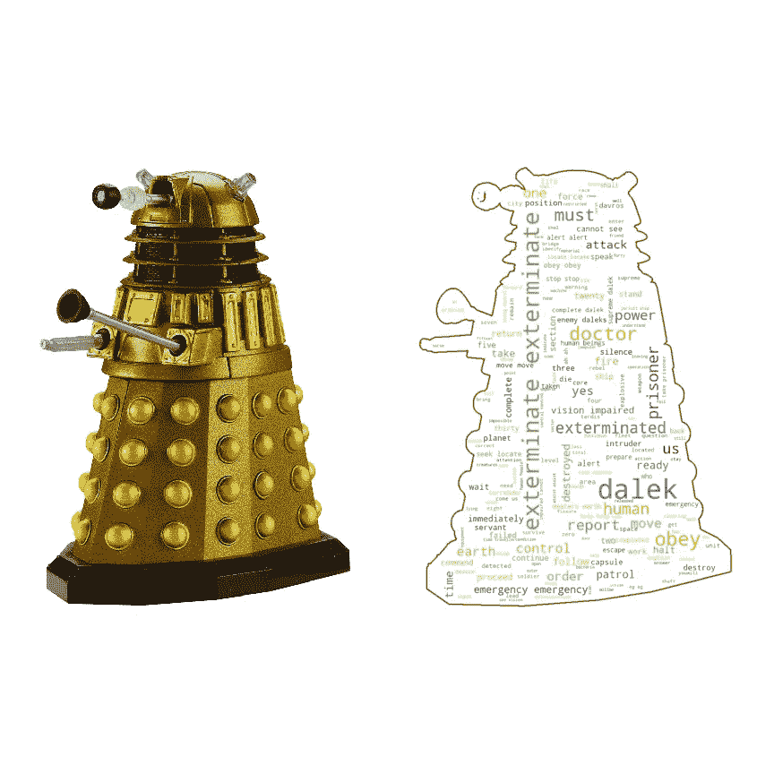
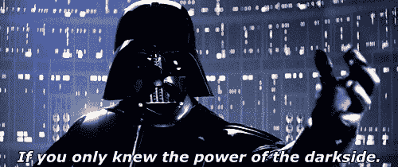
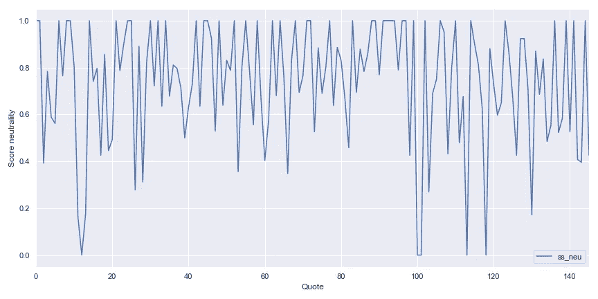
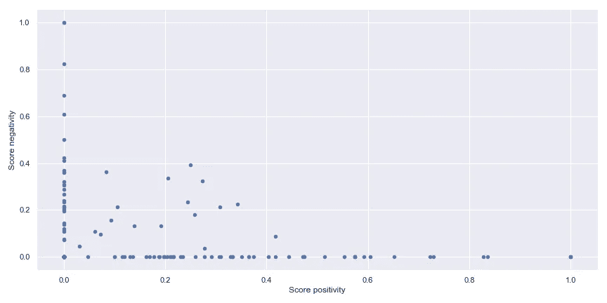
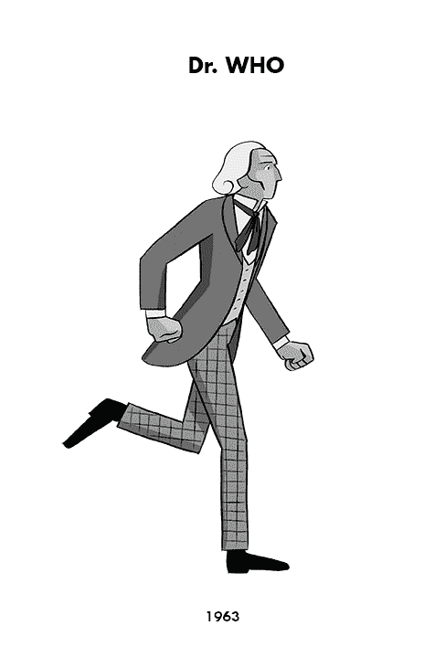

# 神秘博士 Kaggle 数据集和 NLTK 概述

> 原文：<https://towardsdatascience.com/doctor-who-overview-of-the-kaggle-dataset-and-nltk-555f37323eda?source=collection_archive---------24----------------------->

你好，我写这篇短文的目的是:

*   展示一个我在过去几周构建的数据集
*   获得 nltk 的一些特性的概述

《神秘博士》是一部英国电视节目，是一部科幻片，由 BBC 制作于 1963 年，节目讲述了一个外星人(人形)博士的故事，他乘坐他的时间机器/宇宙飞船 Tardis(警察岗亭)在宇宙中旅行。

在这次时空旅行中，博士被来自地球的同伴跟随，因为他对地球有一些偏好(那很方便不是吗)。医生非常聪明、有趣，但角色的两个主要特征(来自他的外星种族时间领主)是:

*   他是不朽的
*   当他死的时候，他会以一种新的人类形式复活(对契约的结束非常有用)。每一次再生都保留着先前形态的记忆，但他有了新的面貌和新的举止。但是这种再生过程在迭代次数上受到限制

就表演而言，可以定义两个阶段(这是我的术语，所以请神秘博士的粉丝不要消灭我):

*   从 1963 年到 1989 年的经典区域
*   从 2005 年到现在的现代区域

就我而言，我在 2010 年左右发现了神秘博士，所以我更喜欢现代区域，我不太熟悉经典区域，但我喜欢现代区域，因为他们重新导入了经典区域的知识，并进行了更新(例如重新设计了博士的敌人)。

不管怎么说，这部剧从参照物到演员都是英国流行文化的一颗钻石，如果你喜欢科幻，绝对值得一看。

所以现在让我们深入研究一下这个项目的数据。

所以说实话，这个[数据集](https://www.kaggle.com/jeanmidev/doctor-who)受到了[的启发，这个数据集](https://www.kaggle.com/wcukierski/the-simpsons-by-the-data/kernels)聚焦于电视剧《辛普森一家》。

我从不同的网站搜集数据:

*   这几集的剧本来自网站 [chakoteya](http://www.chakoteya.net/DoctorWho/) ，在那里可以找到每一集的所有对话等等
*   《摩登地区》每集的收视率来自 [IMDB](https://www.imdb.com/title/tt0436992/)
*   关于这一集的信息来自[指导](https://guide.doctorwhonews.net/)的《神秘博士》,包含关于这一集的细节、演员或工作人员的分布。

这些数据集给出了节目的不同细节，可用于确定节目中可能影响 IMDB 评分的某些特定事件的影响。

例如，下图显示了现代地区不同季节的等级。

似乎所有赛季的收视率都接近 8，但最后一季似乎不太受公众欢迎，我认为这可能是两个原因:

*   2005 年重新推出 sho 的历史节目主持人史蒂文·莫法特离开了制作，所以新的基调不适合观众
*   这位新医生是一位女性，这是第一次在节目中出现，在宣布之后，这位女演员在互联网上引起了轩然大波/负面评论，因为 IMDB 上的评级是基于用户的，负面评论会影响评级(被仇恨者所偏见)

现在让我们看看这部剧的演员阵容，我想看看是否有一些名字出现在这部剧的两个时代之间，而且是一个相当大的数字，在 3146 名演员中，有 1362 名演员似乎出现在两个时代，医生似乎有更多的回归演员，但这很容易与周年纪念集(角色可以在时间中旅行，哈哈)

如果我们将这种分析集中在两个时代的演员身上，我们可以看到这些演员中有很大一部分是一些非人类角色的配音演员，例如尼古拉斯·布里格斯(Nicholas Briggs)扮演的 Dalek 的配音。

让我们深入剧集的脚本，开始用 NLTK 做一些文本分析。

为了对脚本进行分析，我将使用包 [NLTK](https://www.nltk.org/) ，它被定义为

“构建 Python 程序以处理人类语言数据的领先平台。它为超过 50 个语料库和词汇资源(如 WordNet)提供了易于使用的接口[，以及一套用于分类、标记化、词干化、标记、解析和语义推理的文本处理库，以及工业级 NLP 库的包装器”](http://nltk.org/nltk_data/)

对于这一部分，我将遵循 datacamp 制作的 NLTK 上的[教程](https://www.datacamp.com/community/tutorials/text-analytics-beginners-nltk)，在开始对文本进行分析之前，对脚本进行一些处理(标记化、停用词的清理和词汇规范化)。

我的分析将分为 3 个部分:

*   获取最常用的单词和单词的索引
*   为一些特定的字符画一些文字云
*   做一些情绪分析

# 最常用的单词和索引

首先，在对不同的句子和单词进行标记化并对元素进行停用词过滤后，我们可以看到 10 个最流行的单词是:

猜猜哪个医生是最受欢迎的词，现在让我们调查一下医生这个词与之前和之后的词的一致性，并统计出现的次数。这是与“医生”这个词最相关的前 20 个词。

有趣的是,“the”是与医生更相关的单词的一个很好的候选词，但令人难过的是,“who”没有排在前 20 位(它排在第 34 位)。现在让我们来看看一些特定角色使用的单词。

# Wordcloud

在这一部分，我将确定一系列字符中使用最多的单词(受这篇文章[的启发，使用了一个单词云)](https://www.datacamp.com/community/tutorials/wordcloud-python)

我们可以看到，医生是一个在医生的同伴口中反复出现的词。现在让我们看看这些疯狂的 Dalek 罐子说的话。

灭绝是剧中 daleks 使用最多的词之一，他们基本上想摧毁一切。

现在让我们对脚本进行一点情感分析

# 情绪分析器的使用

我将使用可以在 NLTK 上找到的情绪分析器，称为 Vader 情绪分析器

Vader 分析器来自 2014 年的[出版物](https://github.com/cjhutto/vaderSentiment)，它参考了**化合价感知词典和情感推理器**，你可以找到关于这个主题的一篇有趣的[文章](http://t-redactyl.io/blog/2017/04/using-vader-to-handle-sentiment-analysis-with-social-media-text.html)。这个开箱即用的分析器非常有用，下图是医生在第一季的一集里说的话的演变。

正如我们所看到的，在一集的不同阶段，医生会引用不同的话，但大多数时候，医生对他的讲话是中立的。在下图中，有另一个引用医生的话的情绪的图示，有一个引用的积极和消极的图。

# 结论

这篇文章是对我的 kaggle [数据集](https://www.kaggle.com/jeanmidev/doctor-who)的介绍。通过对 NLTK 的简单了解，我对这个数据集有了一些想法，将来我一定会用它来做一些关于 NLP 的实验。如果您对数据集、应用程序等有任何意见，请随时联系我。

*原载于*[*http://the-odd-dataguy.com*](http://the-odd-dataguy.com)*。*