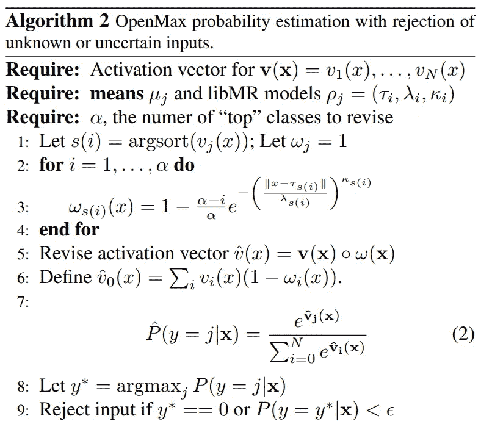

# 神经网络在不知道的时候知道吗？

> 原文：<https://towardsdatascience.com/does-a-neural-network-know-what-it-doesnt-know-c2b4517896d7?source=collection_archive---------6----------------------->

## 简要介绍神经网络跳出框框思考的技术

如果你一直在关注数据科学和机器学习，你可能知道，近年来，深度神经网络彻底改变了人工智能和计算机视觉。自从 AlexNet 在 2012 年以较大优势赢得 ImageNet 挑战赛以来，深度神经网络已经征服了许多以前无法解决的任务。神经网络令人惊叹。他们可以[学习如何将冬天的风景变成夏天的风景，给马穿上斑马条纹](https://github.com/junyanz/pytorch-CycleGAN-and-pix2pix)，[在基本没有监督的情况下学习单词之间的语义表示](http://colah.github.io/posts/2014-07-NLP-RNNs-Representations/)，从草图中生成逼真的图像，以及许多令人惊叹的技能。这项技术已经发展到如此程度，以至于基本上每个拥有笔记本电脑的人都可以使用和构建神经网络架构，实现以前无法实现的壮举。许多开源深度学习框架——如 TensorFlow 和 py torch——都可用，将这一令人惊叹的技术带到您触手可及的地方。

每天早上都有几十份新的预印本发布在 arXiv 上，通过不断的技术创新击败最先进的技术。然而，除了提高性能，深度学习研究还有一个同样重要的领域，涉及一系列与理解*神经网络如何感知世界*和*一个模型如何概括已知之外的事物*相关的问题。在实际应用中，最后一个问题至关重要。考虑以下情况。您正在构建一个根据制造商和型号对汽车进行分类的应用程序。但是，如果发布了一款全新设计的新车型，该怎么办呢？在这种情况下，神经网络在训练期间没有看到这个实例。在这种情况下，正确的答案是什么？

识别未知并不是神经网络的默认功能。这个问题叫做*开集识别*，有几种方法可以解决这个问题。在这篇文章中，我将对它们做一个简单的概述。

# 自信错了

在深入细节之前，让我们考虑一个玩具例子。假设我们有一个非常简单的二进制分类问题，为此我们训练一个分类器。决策边界被学习，模型很好地概括了我们的测试数据，所以我们很高兴。

模型部署后，我们开始看到类似这样的情况。

我们还幸福吗？嗯，可能没那么多。从右边的点群来看，我们——人类专家——可能会认为这是一个新的类。也许它不是我们感兴趣的课程，也许它很重要。但是神经网络是如何感知这一点的呢？因为它落在相对远离决策边界的地方，所以新实例被非常有把握地归类为橙色。然而，在这种情况下，我们的分类器是错误的。

为了有效地检测这些情况，需要采用额外的方法。本质上，网络只有有限的工具来识别新的类:它有一个特征变换，一个 Softmax 函数和一个只有两个类的承诺。我们如何利用这些来解决我们的问题？一种简单的方法是设定 Softmax 概率的阈值:如果预测类别的概率低于一个给定的阈值，比如 0.5，我们就拒绝这个未知的项目。正如我们之前看到的，这在许多情况下可能不起作用，因为神经网络可能会给出高置信度的错误预测。

# 查看上下文:OpenMax 方法

我们的网络提供的预测概率可能是错误的，但看看这些点的分布，很明显可能存在一个新的类别。让我们来看看激活向量！例如，这是上面模型中激活分数的分布情况。

蓝色是我们在培训中看到的数据，红色是来自部署的奇怪的新实例。通过激活向量值的*分布*，我们可以判断一个新的数据点在知识方面是否新颖。这是 OpenMax 方法的基本原理，由 Abhijit Bendale 和 Terrance E. Boult 在他们的 CVPR16 论文[中开发，致力于开放集深度网络](https://www.cv-foundation.org/openaccess/content_cvpr_2016/html/Bendale_Towards_Open_Set_CVPR_2016_paper.html)。在他们的实验中，他们使用了一个 ImageNet 预训练模型，给它输入真实的、愚弄的和开放的图像(即来自训练中看不到的班级的图像)；然后检查了激活向量模式。他们的基本发现是，这些模式可以用来检测神经网络不知道的*。*

**

*Activation patterns of the Softmax layer. **Source:** Abhijit Bendale and Terrance E. Boult, [Towards Open Set Deep Networks](https://www.cv-foundation.org/openaccess/content_cvpr_2016/html/Bendale_Towards_Open_Set_CVPR_2016_paper.html)*

*在左侧，您可以看到使用不同图像的已训练模型的激活向量的热图。他们发现异常值的方法如下。*

*1)对于每个类别，使用该类别的正确分类的训练示例，将[威布尔分布](https://en.wikipedia.org/wiki/Weibull_distribution)拟合到激活分数。
2)给激活向量添加一个新的“未知”类。
3)使用威布尔分布的参数转换激活分数。这些被称为 OpenMax 分数。
4)对于新图像，基于 OpenMax 分数，拒绝为未知或接受为已知。*

**

*The OpenMax algorithm. **Source:** Abhijit Bendale and Terrance E. Boult, [Towards Open Set Deep Networks](https://www.cv-foundation.org/openaccess/content_cvpr_2016/html/Bendale_Towards_Open_Set_CVPR_2016_paper.html)*

*与基于阈值 Softmax 概率的朴素方法相比，使用这种方法，他们能够提高开集检测的准确性。*

**

*OpenMax performance. **Source:** Abhijit Bendale and Terrance E. Boult, [Towards Open Set Deep Networks](https://www.cv-foundation.org/openaccess/content_cvpr_2016/html/Bendale_Towards_Open_Set_CVPR_2016_paper.html)*

*因此，OpenMax 基本上是神经网络的替代最终层，取代了优秀的旧 Softmax。但是，这一层是不可训练的！因此，它不会让你的神经网络在开集识别方面更聪明，它只是以更聪明的方式使用它的预测。这似乎是一个错失的机会。有没有办法*训练*一个网络来识别未知？*

# *着眼于已学习的表示:嵌入空间中的开集识别*

*让我们深入了解神经网络是如何看待数据的！为了简单起见，让我们看看 LeNet-5，这是字符识别的经典架构，由 Yann LeCun 及其同事在改变游戏的论文[基于梯度的学习应用于文档识别](http://yann.lecun.com/exdb/publis/pdf/lecun-98.pdf)中提出。*

**

*The LeNet architecture. **Source:** Yann LeCun et al., [Gradient-Based Learning Applied to Document Recognition](http://yann.lecun.com/exdb/publis/pdf/lecun-98.pdf)*

*如您所见，网络的输入是原始数据本身。这可以被认为是一个真正高维空间中的向量，在我们的例子中是 32 x 32。如果你能在这个高维空间中看到与我们的训练数据集相对应的所有向量，你可能会认为与每个类相对应的子集是相当混乱的。基于这种表示，没有简单的方法来区分类。这正是神经网络最初看到的。然而，对于每一层，它都连续地将数据转换为越来越有形的表示，最终输出一个非常简单的表示:低维单纯形(三角形在多维中的推广)，每个顶点对应一个类。*

*就我们的目的而言，最有趣的表示是上一个之前的表示。最后一种表示——输出——有点不自然，因为它被限制在一个维度等于类数量的空间中。正如我们之前看到的，在这个表述中没有未知的空间。但是，这对于倒数第二层的输出来说就大不一样了！这通常称为嵌入，嵌入向量代表数据的高级特征表示。在这个嵌入空间中，理想情况下，每个类都应该是一个独立的集群，与其他类分开。在这个空间里，你会把未知数放在哪里？好吧，如果每个类确实由一个簇表示，那么一个开集例子应该远离任何已知的簇。*

*沿着这个思路，Hassen 和 Chan 在他们的论文[(学习基于神经网络的开集识别表示](https://arxiv.org/pdf/1802.04365.pdf))中开发了一种方法，旨在训练网络来实现这一点。它们引入了一种新的损耗，将集群彼此推得更远，并将集群本身挤压在一起:*

**

*ii-loss.*

*ii-loss 可以附加到嵌入层，产生以下设置。*

**

*ii-loss setups. **Source:** Mehadi Hassen and Philip K. Chan, [Learning a Neural-network-based Representation for Open Set Recognition](https://arxiv.org/pdf/1802.04365.pdf)*

*嵌入空间中的开集识别原则上很简单:只需将落在聚类之外的点分类为未知。这种方法是对 OpenMax 的改进，但是它仍然错过了非常重要的一点:它没有明确地教会网络识别未知。这样我们会获得更好的开集识别性能吗？*

# *教神经网络知道它不知道的东西(真的)*

*我们在第一个例子中已经看到，不确定性不是识别开集例子的好方法:网络可以以非常高的置信度将未知的例子分类为已知类的成员。然而，在这个例子中，我们在训练期间没有向网络显示任何未知实例。按照公开的术语，套用美国前国防部长唐纳德·拉姆斯菲尔德的话:有*已知的未知*和*未知的未知*。前一个类由培训期间可用的实例组成，尽管不是我们感兴趣的。如果我们用这些来训练未知的网络，并显示这些是你应该不确定的例子，会怎么样？*

*这是 Dhamija 等人在他们最近的论文[中提出的想法，他们引入了两个新的损失函数来将未知的例子从已知的例子中分离出来:熵开集损失和物圈损失。它们是如何工作的？](https://arxiv.org/pdf/1811.04110v2.pdf)*

*作者的第一个观察结果是，通过为专门在 MNIST 训练的网络可视化 MNIST 数字和[梵文手写字符](https://archive.ics.uci.edu/ml/datasets/Devanagari+Handwritten+Character+Dataset)的特征表示，未知的例子往往在某种程度上围绕原点聚集。*

**

*Softmax activations of MNIST digits and Devanagari handwritten characters of a network trained exclusively on MNIST. Colored dots are MNIST classes, black dots are unknowns. Below are histograms of Softmax activation values for both classes. **Source:** Akshay Raj Dhamija et al, [Reducing Network Agnostophobia](https://arxiv.org/pdf/1811.04110v2.pdf)*

*为了利用这一点，他们引入了一个新的损失，称为*熵开集损失*，它将未知实例的 Softmax 分数驱动到均匀的概率分布。*

**

*Entropic Open Set loss. On the top: loss when instance known. On the bottom: loss when instance is unknown. **Source:** Akshay Raj Dhamija et al, [Reducing Network Agnostophobia](https://arxiv.org/pdf/1811.04110v2.pdf)*

*让我们停下来研究一下这个问题。对于具有已知类别(定义的顶部)的样本，这只是好的旧的交叉熵损失。当 Softmax 分数将概率 1 赋予真实类别时，交叉熵被最小化。然而，在定义的底部，我们看到了一些有趣的东西。这是负对数似然向量的平均值，当 Softmax 向量中的所有概率相等时，该值最小！实际上，这个损失告诉网络*“这个实例是未知的，你现在应该是不确定的”*。*

*所以，让我们假设我们已经用熵开集损失代替了我们通常的交叉熵损失。我们的要素制图表达会发生什么情况？事实证明，这种损失有一种特殊的影响:它使未知样本的范数下降！*

**

*Feature magnitudes for networks trained with and without Entropic Open Set loss. **Source:** Akshay Raj Dhamija et al, [Reducing Network Agnostophobia](https://arxiv.org/pdf/1811.04110v2.pdf)*

*我们能增强这种效果吗？熵开集损失并不直接影响特征量级:未知样本接近最优的分数仍然可以有很大的量级，只要它们的激活分数对于每个类都是相似的。为了实现这一点，作者为这个损失函数引入了一个新术语。他们把这种新的损失统称为大气层损失。*

**

*Objectosphere loss. **Source:** Akshay Raj Dhamija et al, [Reducing Network Agnostophobia](https://arxiv.org/pdf/1811.04110v2.pdf)*

*如我们所见，第二项迫使已知类中的样本具有较大幅度(顶行)，而迫使未知样本具有较小幅度(底行)。这些术语共同实现了开集识别任务的相当大的改进。*

**

*Correct Classification Rates at different False Positive Ratios. **Source:** Akshay Raj Dhamija et al, [Reducing Network Agnostophobia](https://arxiv.org/pdf/1811.04110v2.pdf)*

# *开集识别的状态*

*正如我们之前看到的，开集识别在过去的几年里取得了很大的进步。然而，我们离一个强大的通用解决方案还很远。尽管它在实际应用中很重要，但却是一个被忽视的话题。然而，对于任何给定的问题，甚至不可能集合一个训练集来覆盖所有可能的情况并包括所有相关的知识。在许多情况下，领域专家甚至不知道这一点。想想细胞生物学家，他们使用显微图像来分析细胞表型，或许还能发现新的表型。如果一个表现型真的未知，你怎么能提前推理出来呢？*

*在我个人看来，关于深度学习的真正有趣的问题始于我们研究神经网络如何超越已知进行概括。对人类来说，这是智力的本质。想一想:随着你不断积累知识和个人成长，最能推动你前进的一句话是什么？*

*“我不知道。”*

# *参考文献。*

*[1] A. Bendale 和 T. E. Boult，[迈向开集深度网络](https://www.cv-foundation.org/openaccess/content_cvpr_2016/html/Bendale_Towards_Open_Set_CVPR_2016_paper.html) (2016)，IEEE 计算机视觉和模式识别会议(CVPR)，2016，第 1563-1572 页
[2] M. Hassen 和 P. K. Chan，[学习基于神经网络的开集识别表示法](https://arxiv.org/pdf/1802.04365.pdf)，(2018) arXiv 预印本
[3] A. R. Dhamija 等人，【T8*

*[***如果你喜欢把机器学习概念拆开，理解是什么让它们运转，我们有很多共同点。看看我的博客，我经常在那里发表这样的技术文章！***](https://www.tivadardanka.com/blog)*