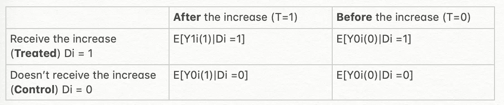
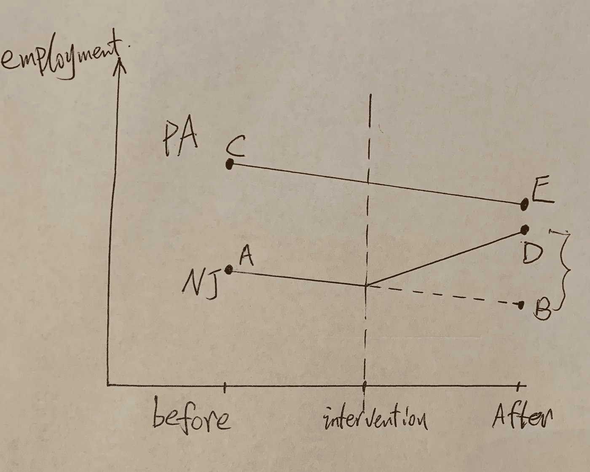
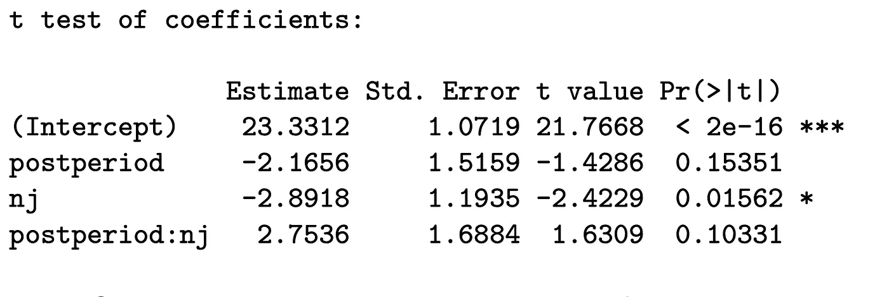
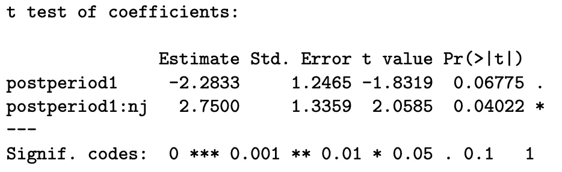
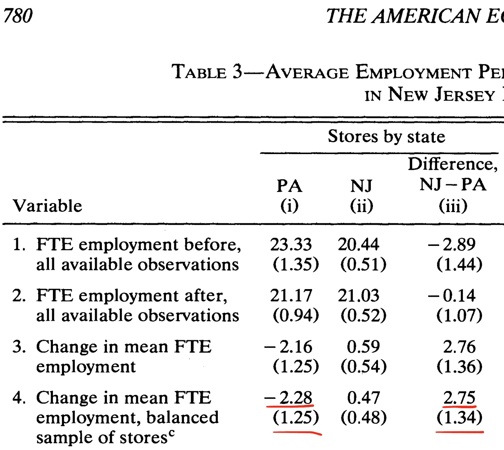

# 差异中的差异方法实践指南

> 原文：<https://towardsdatascience.com/does-minimum-wage-decrease-employment-a-difference-in-differences-approach-cb208ed07327?source=collection_archive---------11----------------------->

## 实验和因果推理

## 卡德和克鲁格论文的翻版:“工资上升，就业率下降？”


Photo by [Dean Nahum](https://unsplash.com/@deannahum?utm_source=unsplash&utm_medium=referral&utm_content=creditCopyText) on [Unsplash](https://unsplash.com/s/photos/animal?utm_source=unsplash&utm_medium=referral&utm_content=creditCopyText)

**执行摘要**

*   在完全竞争的市场中，传统经济理论预测最低工资的增加会导致失业率上升。
*   横断面研究提供了相互矛盾的证据，但不是因果关系。
*   卡德和克鲁格采用了一种 DID 方法，发现工资增长会带来更高的就业率。


Photo by [Alexander Mils](https://unsplash.com/@alexandermils?utm_source=unsplash&utm_medium=referral&utm_content=creditCopyText) on [Unsplash](https://unsplash.com/s/photos/money?utm_source=unsplash&utm_medium=referral&utm_content=creditCopyText)

**前言**

在这篇文章中，我将复制 Card 和 Krueger 的论文，一步一步地解释，并补充关于准实验设计的定义、假设、R 代码和潜在结果框架解释的附加信息。

**什么是准实验？**

准实验设计是一种没有真正随机化过程的实验设计。由于缺乏随机分配，治疗组和对照组在干预前是不相等的。因此，这两组之间的任何差异都可能是由先前存在的差异造成的。

这种准设计受到了政策分析师、医疗保健提供商和直接面向消费者的公司(特别是网飞和 Airbnb)的欢迎。

**为什么是准实验设计？**

在其他帖子中，我解释了实验研究的好处，以及如果可能的话，为什么它们应该是因果推断的首选。那么，我们为什么不一直进行实验呢？

很棒的问题！一个简单的答案是，实验设计对某些类型的问题并不适用。例如，将人们随机分配到可能损害他们健康的危险环境(如吸烟)是不道德的。

在政策领域，我们不能随意指定加州而不是纽约获得新的税收优惠。

此外，在实验设计中，实验组和对照组之间存在溢出效应。网飞没有对某些类型的问题进行 A/B 测试，而是依靠准实验性的解决方案(在本文中，网飞解释了为什么 A/B 测试并不总是可行)。

在这种情况下，当完全成熟的实验研究不可行时，准设计就派上了用场。

> “准实验的结果不会像 A/B 那样精确，但我们渴望对因果关系进行定向解读。”
> 
> — — [科林·麦克法兰](https://medium.com/u/e0e17553ea9f?source=post_page-----cb208ed07327--------------------------------) *，迈克尔·波，朱莉娅·格里克@* [*网飞*](https://medium.com/netflix-techblog/quasi-experimentation-at-netflix-566b57d2e362)


Photo by [Christian Regg](https://unsplash.com/@chris_regg?utm_source=unsplash&utm_medium=referral&utm_content=creditCopyText) on [Unsplash](https://unsplash.com/s/photos/valley?utm_source=unsplash&utm_medium=referral&utm_content=creditCopyText)

**背景**

1989 年 11 月签署成为法律的一项法案将联邦最低工资从每小时 3.35 美元提高到 3.8 美元，于 1990 年 4 月 1 日生效，并于 1992 年 4 月 1 日从每小时 4.25 美元进一步提高到 5.05 美元。新泽西州经历了工资上涨，但宾夕法尼亚州没有。戴维和克鲁格在涨价前后进行了两轮调查。

一个简短的时间表可能有所帮助:

1.  1992 年 2 月和 3 月:第一轮调查
2.  1992 年 4 月:新泽西州最低工资从 4.25 加元提高到 5.05 加元
3.  1992 年 11 月和 12 月:后续调查

以下是我们运行准设计的原因。#1 新泽西和宾夕法尼亚在很多方面没有可比性。#2 立法过程不是随机的。

然而，我们可以根据 DID 方法确定工资增长对失业率的因果影响。

> 准实验设计不需要同等组。

**[**潜在成果框架**](https://en.wikipedia.org/wiki/Rubin_causal_model) **分析研究****

**这是注释。设 D 代表是否接受治疗，T 代表时间，I 代表研究对象数量。**

**Di = 1:新泽西接受待遇(最低工资增加)**

**Di = 0:宾夕法尼亚州不接受治疗**

**T=1:工资增长后(1992 年 11 月和 12 月)**

**T=0:工资增长前(1992 年 2 月和 3 月)**

**y:结果变量(失业率)**

****

**I made this**

****

**Based on the poor handwriting, it’s my credits.**

**有一个潜在的问题。我们不知道对照组(宾夕法尼亚州)如果接受治疗会有什么表现(**missing E[Y0i(1)| D = 1】**)。**

**我们可以用 DID 的方法解决这个问题:**

****ATT**E[Y1(1)—Y(0(1)| D = 1]=**

**{ E[Y(1)| D = 1]—E[Y(1)| D = 0]}—{ E[Y(0)| D = 1]—E[Y(0)| D = 0]，假设平行趋势。**

**平行趋势假设意味着如果没有治疗，治疗组和对照组之间的差异将保持不变。在这种情况下，如果没有工资增长法，新泽西州和宾夕法尼亚州的就业率之间的差异将是相同的。**

*****R 分析:*****

```
**# Credits to Jonathan Mummolo**d <- read.csv(“wage_data.csv”,convert.factors = FALSE)
head(d[, c(“ID”, “nj”, “postperiod”, “emptot”)])with(d, 
 (
 mean(emptot[nj == 1 & postperiod == 1], na.rm = TRUE) — mean(emptot[nj == 1 & postperiod == 0], na.rm = TRUE) 
 )-
 (mean(emptot[nj == 0 & postperiod == 1], na.rm = TRUE) — mean(emptot[nj == 0 & postperiod == 0], na.rm = TRUE)
 )
)ols <- lm(emptot ~ postperiod * nj, data = d)
coeftest(ols)
```

****

**为了控制地区和时间差异，我们可以建立一个固定效应回归模型，该模型具有单位和期间[固定效应](https://en.wikipedia.org/wiki/Fixed_effects_model)。**

```
#A set of estimators and tests for panel data econometrics
library(plm)
library(lmtest)
d$Dit <- d$nj * d$postperiod
d <- plm.data(d, indexes = c("ID", "postperiod"))
did.reg <- plm(emptot ~ postperiod + Dit, data = d,model = "within")
coeftest(did.reg, vcov=function(x)
#Heteroskedasticity-Consistent Covariance Matrix Estimation
vcovHC(x, cluster="group", type="HC1"))
```

********

**The original paper, **Table 3****

**在将其与原始表进行比较后，我们成功地复制了结果！**

**原文是[这里的](https://www.aeaweb.org/articles?id=10.1257/aer.90.5.1397)。**

**复制数据集在这里是。警告:这是原始数据，我们需要处理它进行分析。**

***Medium 最近进化出了自己的* [*作家伙伴计划*](https://blog.medium.com/evolving-the-partner-program-2613708f9f3c) *，支持像我这样的普通作家。如果你还不是订户，通过下面的链接注册，我会收到一部分会员费。***

**[](https://leihua-ye.medium.com/membership) [## 阅读叶雷华博士研究员(以及其他成千上万的媒体作家)的每一个故事

### 作为一个媒体会员，你的会员费的一部分会给你阅读的作家，你可以完全接触到每一个故事…

leihua-ye.medium.com](https://leihua-ye.medium.com/membership)** 

# **喜欢读这本书吗？**

> **请在 [LinkedIn](https://www.linkedin.com/in/leihuaye/) 和 [Youtube](https://www.youtube.com/channel/UCBBu2nqs6iZPyNSgMjXUGPg) 上找到我。**
> 
> **还有，看看我其他关于人工智能和机器学习的帖子。**