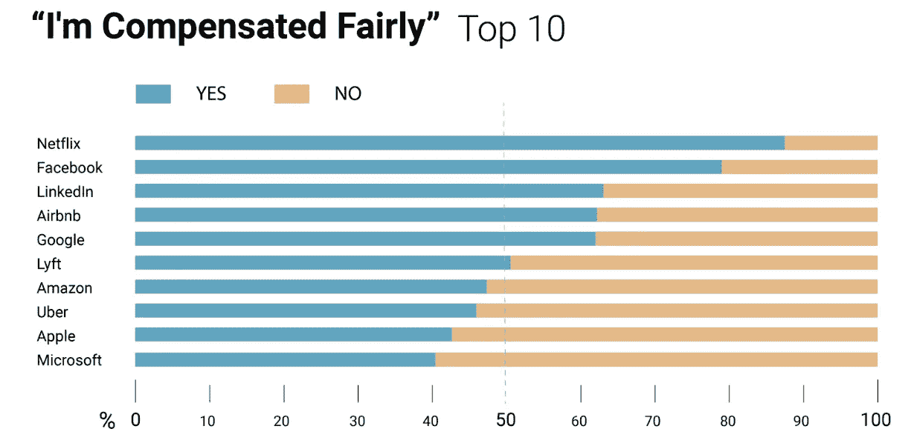
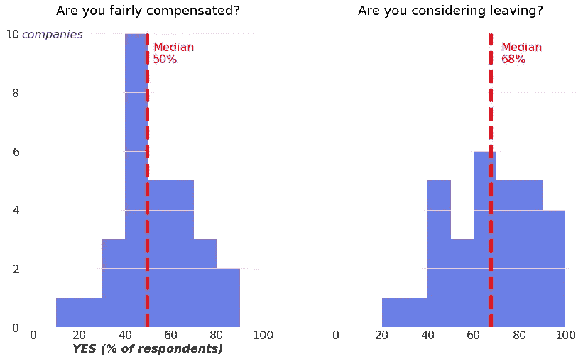

# 薪酬会影响科技行业的忠诚度吗？简单数据可视化研究。

> 原文：<https://towardsdatascience.com/does-pay-impact-loyalty-in-tech-a-study-in-simple-data-visualization-f15e93659a6d?source=collection_archive---------28----------------------->

旧金山的技术领域以敏捷著称:公司转向，产品更新，员工跳槽。为一家公司工作，当员工达到一年或两年的纪念日时，该公司会庆祝他们，这种情况并不少见。这种情况不仅发生在初创公司(通常只有几年历史)，也发生在大型企业。由于劳动力市场的泡沫化，员工们已经习惯了每周(如果不是每天的话)来自脸书招聘公司、合同招聘公司和代表他们投资的风投公司的连珠炮。

看来招聘人员才是这个行业的真正赢家:因为挖人而获得奖励，但很少因为留住员工而获得奖励。但是肯定有一些公司已经想出了如何留住员工，从而停止无休止的 LinkedIn 挖掘、电话筛选、杠杆审查循环，这些循环会消耗团队的时间。

带着这样的想法，我很兴奋地偶然发现了[去年围绕这个问题发布的](https://medium.com/@BlindApp/techs-anonymous-voice-blind-survey-e67bde1ceb05)调查数据。Blind 是一款应用程序，时尚、大型科技公司的员工可以匿名参与讨论话题。在本次调查中，Blind 要求用户二对两项陈述做出回应:

1.  我得到了公平的补偿
2.  我对换工作/换公司感兴趣

然后，他们获取这些用户的雇主，并提供汇总结果。请记住，这是对非代表性员工样本的自愿调查数据，发现公司之间的差异仍然很有意思。Blind 将此描绘成一个堆积条形图。

虽然这张图有它的优势，你可以很快找到一家公司，并看到它在哪里，但我发现它(以及后来的出版物: [BI](https://www.businessinsider.com/employees-anonymously-share-which-tech-companies-dont-pay-fairly-2017-10) 、 [Inc](https://www.inc.com/business-insider/tech-employees-anonymously-rate-companies-work-facebook-google-netflix-twitter.html) 、 [Dice](https://insights.dice.com/2018/07/30/tech-pros-unhappy-salary/) 、 [SFGate](https://www.sfgate.com/realestate/article/Google-facebook-can-t-afford-Silicon-Valley-13132157.php) )在传达任何真正的洞察力方面令人失望。充其量，这是一张记分卡，告诉我们一家公司最终在哪里，但没有告诉我们*为什么*他们可能会在那里。

所以我深入研究了一下数据。首先，公司回应的分布讲述了一个有趣的故事。

在左侧，我绘制了一个直方图，显示了公司数量以及员工/受访者对“薪酬合理”这一说法的认同程度。大多数公司位于 40-70%的范围内，中间值正好是 50%。这意味着，大多数公司的“典型”感觉大致相当:员工(作为一个群体)没有被利用的感觉，也没有沉浸在薪资满足感中。

右边是“换公司”的柱状图。在这里，图表严重向右移动，中间值接近 70%。很少有公司的价值低于 50%。这意味着几乎所有 T2 主要科技公司的大多数员工都在考虑离开 T3！

但是这些有联系吗？换句话说，**付更多的钱会让人呆得更久吗？**虽然这里真正的黄金标准是进行一项受控实验(随机挑选一半的员工，提高他们的工资，监控留用情况)，但我们仍然可以从盲目的数据中梳理出一些要点。

盲目地试图用一个双条形图来解决这个问题，该图筛选出了 30 多家公司中的 10 家，但我发现它太忙了，没有时间吸取任何教训。

通过将数据转换成散点图，每个公司用“公平补偿”协议(*x*-轴)与“考虑改变”(*y*-轴)来绘制，一些趋势开始出现。您可以将鼠标悬停在各个点上来查看公司。

很快你就能看到一个强烈的下降趋势，员工感觉收入高的公司很少有员工考虑离职。相关性在-0.59 处相当强。

因此，薪酬有着强烈的影响，这可能对我们大多数人来说并不奇怪。在网飞，几乎每个人的工资都很高(88%的人同意)，很少有人有兴趣离开(27%)，而在另一端，惠普企业(HPE)有工资问题(13%)和挽留问题(91%)。

但我会走得更远:你必须支付高薪来留住你的团队。这些调查数据显示，没有一家公司找到了留住人才的廉价良方；尽管所有的工作都是关于使命宣言，健康计划和战利品。一般来说，**每个有薪酬差距的公司都有很高的变化考虑**。

该图还显示，感觉收入丰厚的员工(图的右侧)仍然有很高的辞职率。在极端情况下，NerdWallet 受访者是对薪酬最满意的人之一(78%的人同意“我得到了合理的补偿”)，但也是最不想留下来的人之一(90%的人同意“我想换工作/公司”)。Intuit 和 LinkedIn 的薪酬协议相似(分别为 61%和 63%)，但 Intuit 的员工对离职的兴趣是 LinkedIn 的两倍(80%，LinkedIn 的 40%！).**光靠高薪是不够的！**

让你的公司在**稳固的薪酬满意度上似乎是一个必要的，但不是充分的，解决员工保留的策略**。在 SF tech 的旋转门文化中，它应该被认为是桌面上的标杆。我会从检查你的员工的脉搏开始:如果大多数人觉得他们早就该加薪了，那就等着看他们定期离开吧。

*一些必须的脚注*:

感谢盲人做调查。这是一个伟大的公关举措，我从来没有听说过这家公司，直到我听的一个播客选择了这个调查作为一个故事。

但是没有一个内容营销驱动的调查是完美的。数据现在已经有一年多了(所以我猜脸书已经看到了“对改变感兴趣”的增加……)，并且对盲人用户有反应偏差和选择偏差。我可以想象一个系统性的问题，即正在考虑换工作的员工与盲人接触，以更多地了解其他公司。最重要的是，我使用的数字是我对盲人图表的手动解释。这将是很酷的，看看如何比较，比如说，玻璃门审查和工资数据。

最后，我将我的数据和 python 分析笔记本存储在 [github](https://github.com/scottishbee/blind_salary_survey/blob/master/Blind%20survey%20graphing.ipynb) 中，如果有人有兴趣的话。